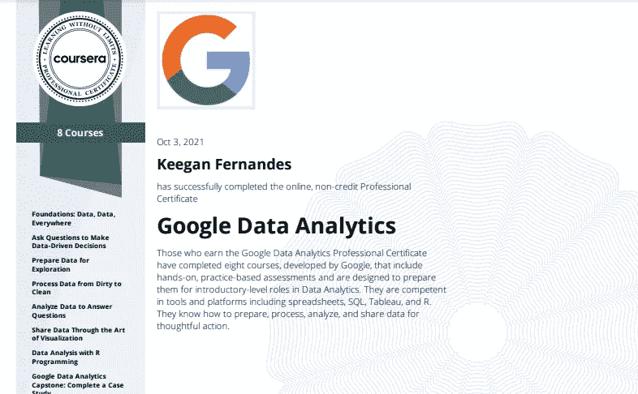

# 谷歌数据分析专业证书审核

> 原文：<https://medium.com/mlearning-ai/google-data-analytics-professional-certificate-review-4b6117824dc?source=collection_archive---------0----------------------->

[***谷歌职业证书***](https://www.coursera.org/professional-certificates/google-data-analytics#instructors) ***已经提供了*** [***6 个月数据分析证书***](https://www.coursera.org/professional-certificates/google-data-analytics) ***。这是一门针对进入数据分析领域的初学者的课程，旨在为学生提供成为初级数据分析师所需的技能。值这个钱吗？我选修了这门课程来了解情况。***

# 介绍

该证书是一份专业证书，涵盖了从初级到自己项目的 8 门课程。该课程由在不同领域工作的谷歌员工以及在该领域露面并给出反馈的人教授。除了必要的课程外，它还包括工作场所礼仪和交流。它为您的数据分析之旅提供了坚实的基础。

# 课程

## 基础:数据，数据，无处不在

本课程向您介绍了数据分析师需要执行的各种任务。它概述了数据的生命周期以及您可能需要执行的各种任务。如果您已经有了数据科学的背景，那么您可能仍然会发现本课程很有用，因为它提供了您在工作场所可能需要的提示和技巧。

## 提问以做出数据驱动的决策

本课程教您如何利用科学思维过程，利用数据做出决策。它显示了在做出数据驱动的决策时可能会遇到的陷阱，以及收集好数据的重要性。它还介绍了作为数据分析工具的电子表格。

## 从脏到干净的过程数据

这将教会学生数据清理和验证数据完整性或来源的过程。它显示了像电子表格和 SQL 这样的用户数据清理工具(我发现这非常有帮助)。这是本系列中实践性较强的课程之一，也是所学实践技能中最有价值的课程之一，因为大多数数据科学和分析都涉及数据清理。

## 分析数据以回答问题

本课程教你使用电子表格函数、格式和公式的分析技巧。以及 SQL 函数、计算和查询。

## 通过可视化艺术共享数据

这一部分着重于为数据故事制作视觉效果。它教您使用仪表盘创建可视化效果。除了形象化之外，我很欣赏这门课程花时间教授演示方法和与观众互动的方式。它还向您展示了如何处理与观众的问答。

## 用 R 编程进行数据分析

编程是分析数据的一种更加灵活和可重复的方法。本课程将教你编程语言 R 和使用 R studio，向你展示如何使用日常工作中可能需要的基本库。您还将了解如何记录您的工作，以便与您的同事分享，从而复制或审查您的工作。

## 谷歌数据分析顶点:完成案例研究

最后一门课也是我认为最重要的一门课是顶点工程。在本课程中，您将学习如何制作专题，并通过制作专题来结束课程。您还将学习各种案例研究、工作准备和制作作品集。重复是一切学习之母，通过做项目，你会一次又一次地使用你所学的一切。这也会向你潜在的雇主展示你的技能。

# 结论

该系列是对数据分析世界的一个很好的介绍。我在注册后一个月完成了课程，这是因为我已经有了数据科学的背景。对我来说，最耗时的课程是顶点工程，我花了一周半的时间。本课程非常适合那些能够自我管理并具有一些数据分析或数据科学背景的人。我不喜欢这门课的一点是，教的是 R 而不是 python。我知道 R 是为数据分析而设计的，在这个领域也很流行。然而，Python 也可以做这些事情，并且还被用于各种其他领域，例如数据工程和云计算。从长远来看，教授 R 可能会限制一个学生。

这门课程能让你在数据分析领域找到工作吗？不会。这门课程不会让你找到工作，甚至不会对你的简历产生很大影响。然而，你的项目可能会向你的雇主展示你有能力胜任这份工作。项目也是通过大多数工作的最低年限要求的一种方式。这是一门非常适合初学者的课程。这门课程对你是否有用取决于个人。

 [## Mlearning.ai 提交建议

### 如何成为 Mlearning.ai 上的作家

medium.com](/mlearning-ai/mlearning-ai-submission-suggestions-b51e2b130bfb)