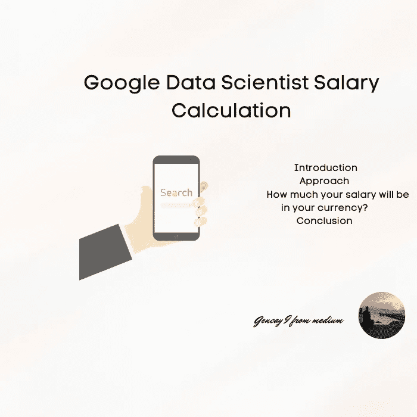

# 用 Python 计算谷歌数据科学家的工资

> 原文：<https://medium.com/mlearning-ai/google-data-scientist-salary-calculation-with-python-2a4406506498?source=collection_archive---------4----------------------->

## 在 Python 中通过将工资值添加到字典中并编写 for 循环来计算。

Image by Author

# 介绍

这个会很快。

今天，当我在研究数据科学家的薪水时，我看到了一篇文章，是关于谷歌数据的…