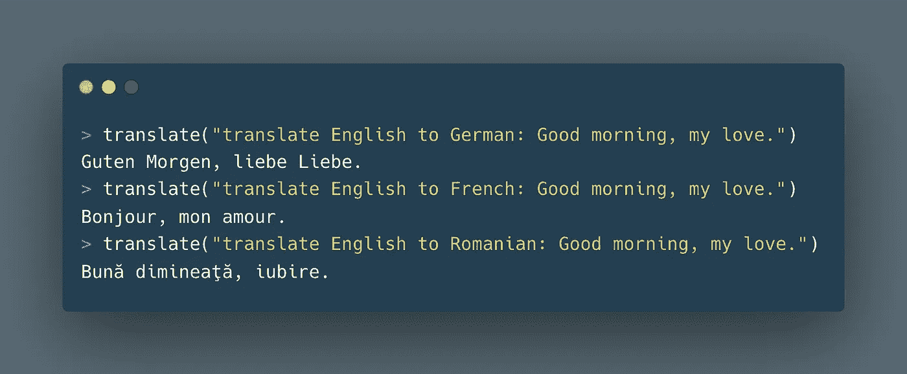
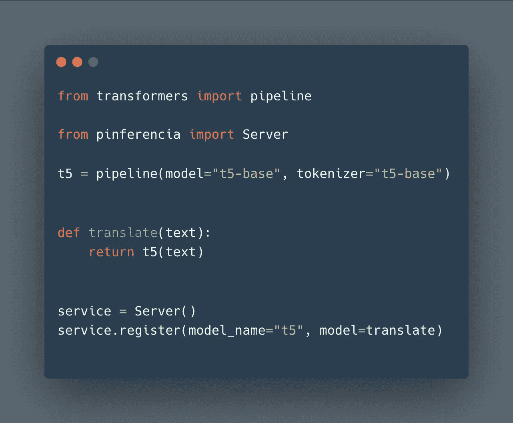
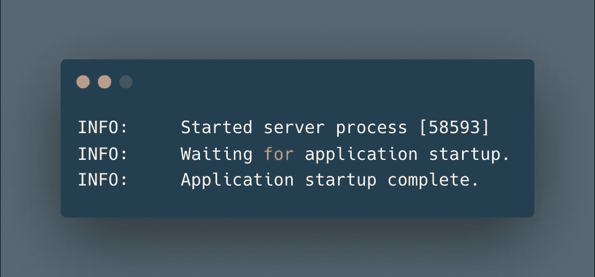
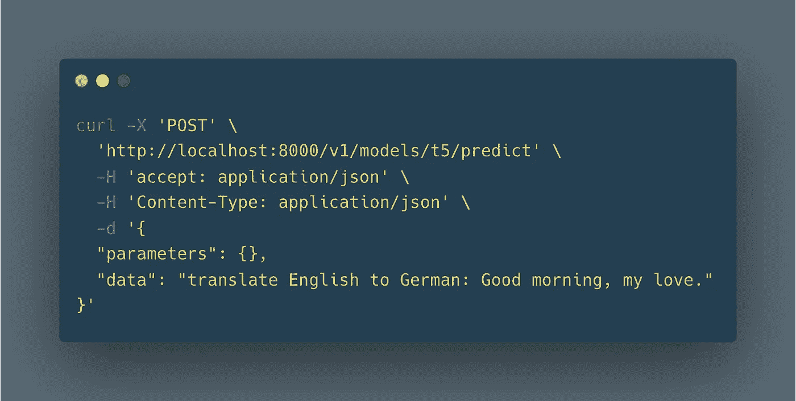
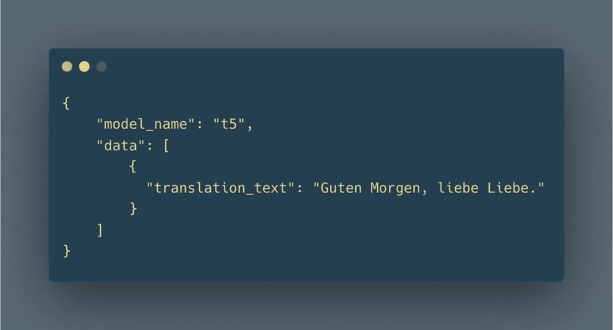
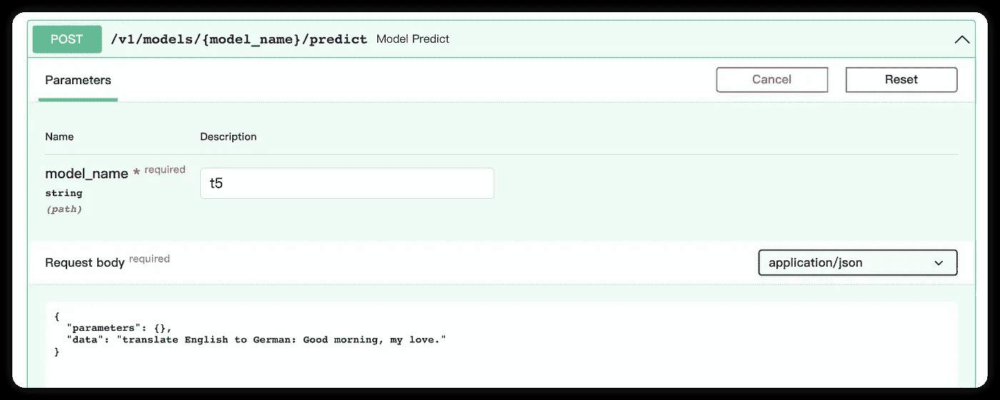
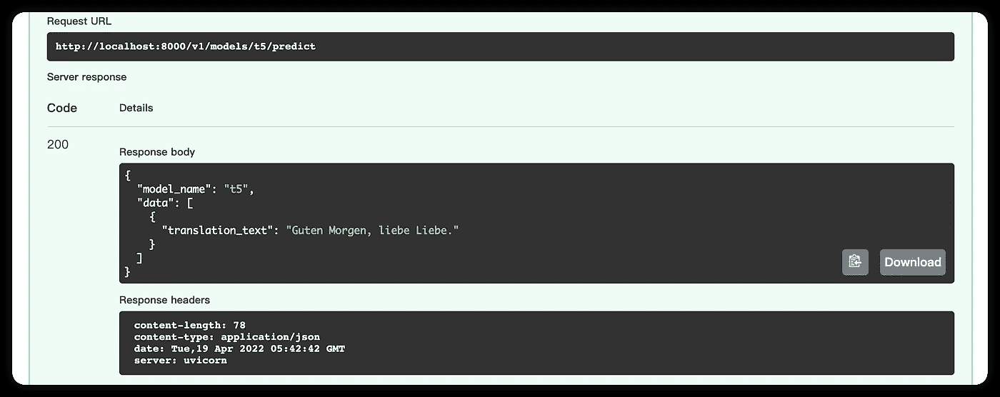

# 谷歌 T5 翻译即服务只有 7 行代码

> 原文：<https://medium.com/mlearning-ai/google-t5-translation-as-a-service-in-just-7-lines-of-codes-44491cd7777f?source=collection_archive---------4----------------------->

T5 是什么？谷歌的文本到文本转换转换器(T5)提供了翻译的能力。



在本文中，我们将部署 Google T5 模型作为 REST API 服务。难？不如我告诉你:你只需要写 7 行代码？



[**HuggingFace**](https://huggingface.co/) 只需几行就能轻松使用预训练模型。

[**Pinferencia**](https://github.com/underneathall/pinferencia) 只需三根额外的线，就能超级轻松地为任何模特服务。


# 安装依赖项

## 拥抱脸

`pip install "transformers[pytorch]"`

如果不起作用，请访问[安装(huggingface.co)](https://huggingface.co/docs/transformers/installation)并检查他们的官方文件。

## 平费伦西亚

`pip install "pinferencia[uvicorn]"`

如果不起作用，请访问[Install—Pinferencia(under neat hall . app)](https://pinferencia.underneathall.app/install/)查看他们的官方文档。

# 定义服务

首先让我们创建`app.py`来定义服务:

# 启动服务

```
uvicorn app:service --reload
```

等待模型被下载。完成后，您会看到:



# 呼叫服务

你可以使用比利时的`curl`或`interactive api page`。

## 卷曲



结果是:



## 交互式 API 页面位于 http://127.0.0.1:8000



结果:



如果你喜欢 [Pinferencia](https://github.com/underneathall/pinferencia) 别忘了去 [GitHub](https://github.com/underneathall/pinferencia) 保存到你的收藏夹。

[](/mlearning-ai/mlearning-ai-submission-suggestions-b51e2b130bfb) [## Mlearning.ai 提交建议

### 如何成为 Mlearning.ai 上的作家

medium.com](/mlearning-ai/mlearning-ai-submission-suggestions-b51e2b130bfb)