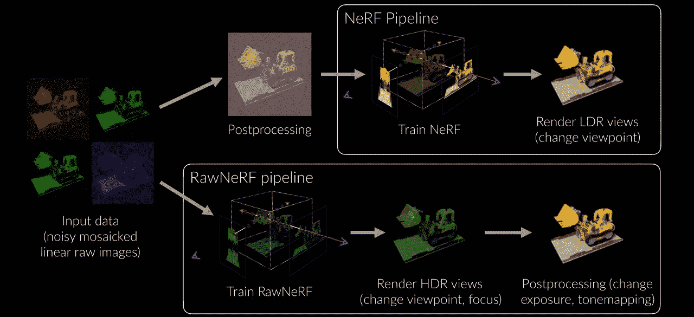

# 谷歌的新人工智能在神经辐射场(NeRF)中学会了在黑暗中看东西[RawNeRF]

> 原文：<https://medium.com/mlearning-ai/googles-new-ai-learned-to-see-in-the-dark-rawnerf-in-neural-radiance-field-nerf-6803973e579f?source=collection_archive---------6----------------------->

我看到了谷歌研究团队在神经辐射场(NeRF)领域发布的一篇新论文，这是一个了不起的进步😱在 NeRF 领域。让我们看看是什么。

# 📕**什么是神经辐射场(NeRF)？**

一个神经辐射场(NeRF)是一个全连接的神经网络，它可以基于 2D 图像的部分集合生成复杂 3D 场景的新视图。它被训练使用渲染损失来再现场景的输入视图。它的工作原理是获取代表一个场景的输入图像，并在它们之间进行插值，以呈现一个完整的场景。NeRF 是一种为合成数据生成图像的高效方法。

你可以观看上面的视频，以了解神经辐射场(NeRF)论文的概述。也可以参考以下链接了解更多关于 NeRF 的信息。

🔗【https://www.matthewtancik.com/nerf】网址:

🔗**论文:** *NeRF:将场景表示为用于视图合成的神经辐射场*—[https://arxiv.org/abs/2003.08934](https://arxiv.org/abs/2003.08934)

🔗**Github:**[https://github.com/bmild/nerf](https://github.com/bmild/nerf)

# 📕谷歌的新论文[RawNeRF]

这是谷歌研究团队对 NeRF 的改进方法。现在 RawNeRF 可以清楚地看到黑暗的图像，并可以渲染它们。论文摘要可以在下面看到。

**摘要:**

> 神经辐射场(NeRF)是一种从设定的输入图像集合进行高质量新视图合成的技术。像大多数视图合成方法一样，NeRF 使用色调映射的低动态范围(LDR)作为输入；这些图像已经由有损相机流水线处理，该流水线平滑细节、剪辑高光并扭曲原始传感器数据的简单噪声分布。我们修改了 NeRF，直接在线性原始图像上训练，保留了场景的全动态范围。通过从最终的 NeRF 渲染原始输出图像，我们可以执行新颖的高动态范围(HDR)视图合成任务。除了改变相机的视角，我们还可以在事后控制焦点、曝光和色调映射。虽然一个单一的原始图像似乎明显比一个后处理的噪声，我们表明，NeRF 是非常稳健的零均值分布的原始噪声。当在许多噪声原始输入(25–200)上优化时，NeRF 产生的场景表示如此精确，以至于其渲染的新视图优于在相同的宽基线输入图像上运行的专用单幅和多幅图像深度原始降噪器。因此，我们的方法，我们称之为 RawNeRF，可以从近乎黑暗中捕捉到的极度嘈杂的图像中重建场景。

NeRF pipeline vs RawNeRF pipeline

下面的视频显示了新 RawNeRF 文件的概述。

🔗**网址:**【https://bmild.github.io/rawnerf/ 

🔗论文: *黑暗中的 NeRF:从嘈杂的原始图像合成高动态范围视图*s—[https://arxiv.org/abs/2111.13679](https://arxiv.org/abs/2111.13679)

🔗**Github:**[https://github.com/google-research/multinerf](https://github.com/google-research/multinerf)

你可以观看下面的视频，很好地解释了两分钟论文 youtube 频道上的新 RawNeRF 论文。

✅👉如何看待 NeRF 的**新改进？💭下面评论。**

✅👉如果你喜欢这篇文章，👏对这篇文章鼓掌。

✅👉如果你喜欢我的文章或者需要阅读新的文章，请➕关注我。

✌️What，你下一步需要什么？为…建议标题📃新文章。

🙏谢谢你看我的文章。

 [## Mlearning.ai 提交建议

### 如何成为 Mlearning.ai 上的作家

medium.com](/mlearning-ai/mlearning-ai-submission-suggestions-b51e2b130bfb)