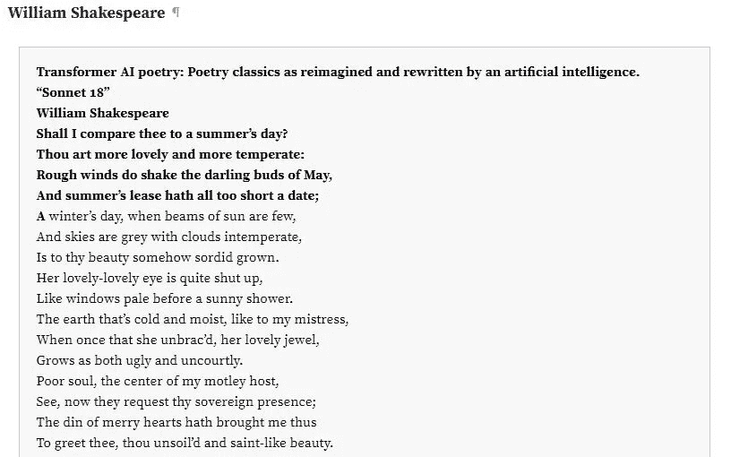
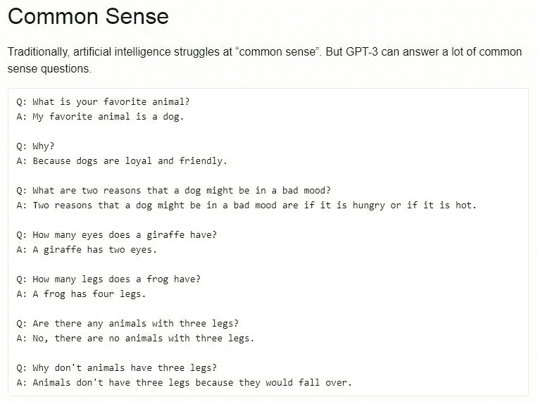
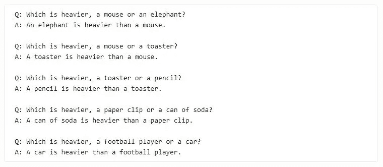

# GPT 3 号和未来

> 原文：<https://medium.com/mlearning-ai/gpt-3-and-the-future-b18976de2b82?source=collection_archive---------0----------------------->

Photo by [Franki Chamaki](https://unsplash.com/@franki?utm_source=medium&utm_medium=referral)

> “很有可能，一旦机器思维方法启动，用不了多久就能超越我们微弱的力量……它们将能够彼此交谈以提高智慧。因此，在某个阶段，我们应该预料到机器会取得控制权。”—艾伦·图灵

尼古拉·特斯拉在 1898 年做了一个当时难以理解的演示。他能够使用一个无线电控制盒在一片水域上驾驶一艘小船，它甚至可以根据聚集人群的要求闪烁灯光，并且在船和控制器之间仍然没有可见的连接。对于出席展览会的许多人来说，找不到对船如何移动的合理解释。他们想知道这是魔法还是某种心灵感应，甚至有人猜测这艘船是由藏在里面的一只受过训练的猴子驾驶的。泰斯拉的天才再一次用他的遥控船开启了科学的新领域。

当我第一次阅读《卫报》发表的[文章](https://www.theguardian.com/commentisfree/2020/sep/08/robot-wrote-this-article-gpt-3)时，这种体验是可比的，提到是由一个 AI 写的。显然，这是我第一次接触人工智能进化奇迹 GPT-3 的能力。特斯拉在 1898 年发明的无线电控制船是现代机器人技术的开端。他的发明远远领先于当时。在展览会上观看它的人群无法想象它的实际应用。另一方面，我们似乎对 GPT-3 的引入意味着什么和它的可能性有了更好的理解，正如下面的例子和许多其他例子所展示的那样。

那么，真的是时候让我们靠边站，让机器像图灵预言的那样掌控一切了吗？但是在深入研究它之前，我想对于该主题的新手读者来说，了解该程序背后的历史会更好。

# GPT 北部

生成性预训练(GP)的概念是由旧金山的人工智能实验室 OpenAI 在 2018 年首次引入的，它带来了许多改进，以减轻对自然语言处理(NLP)中监督学习的依赖，因为这是有效地从原始未标记文本语料库中学习的关键。这包括两个阶段——对不同的原始文本数据进行*无监督预训练*，然后是针对特定任务的*监督微调*。模型架构使用*转换器、*用于 NLP 的初级深度学习模型，并因此得名 GPT( *生成性预训练转换器*)。GPT-1 使用了大约 7000 本独特的未出版书籍进行训练，并在 12 个数据集的 9 个数据集上超过了其他专门监督的 NLP 模型。

GPT-2 号对初始模型进行了改进，增加了更多参数，并使用了更大的数据集，15 亿个参数，而 GPT-1 号有 1.17 亿个参数，文本数据来自 800 多万份文件。GPT-2 在阅读理解等领域表现突出，但在文本摘要等其他领域表现不佳。

2020 年 5 月推出的 GPT-3 使用了 1750 亿个参数，这是世界上最大的参数，是目前存在的第二大模型微软图灵 NLG 的 10 倍。目标是消除对*微调*的需求，并使用模型理解和执行任务所需的最少演示。GPT-3 已经能够在一系列任务中实现最先进的水平，例如翻译、问答、即时推理、解读单词和执行 3 位数算术等等。它还能够使用任务的自然语言描述编写 SQL 查询和代码。

# 人工智能时代

从 beta 测试人员提供的例子来看，很明显 GPT-3 非常有能力破坏软件开发社区，并可能在不久的将来要求很多工作，特别是在 web 开发行业和无代码或低代码以及 AutoML 等领域。

无代码平台使用 GUI 组件，允许外行用户通过拖放等方法创建应用程序，添加应用程序功能以创建完整的应用程序。该领域的 GPT-3 用例显示了巨大的前景，可能会彻底改变整个细分市场。

自动化机器学习是 GPT-3 似乎擅长的另一个领域。AutoML 是将机器学习模型开发的耗时、迭代任务自动化的过程。它允许数据科学家和开发人员缩短训练和将人工智能投入生产的时间。GPT-3 可用于直接创建这些模型或进一步增强现有模型。

GPT-3 的能力不仅限于编程能力，远非如此。如前所述，用于训练 GPT 3 号的数据集是天文数字级的。据说，包含大约 600 万篇文章的整个英文维基百科仅占其训练数据的 0.6%。编码手册只是输入其庞大神经网络的另一组此类数据，其中包括从 Reddit 上关于猫的帖子到量子物理中最复杂的理论。简而言之，GPT-3 是统治所有这些的 NLP 模型。

下面是几个我们可以看到 GPT-3 展示其实力的例子，事实上，与其他语言模型不同，GPT-3 没有针对这些特定任务中的任何一个进行过*微调*，这是它令人兴奋的地方:

AI 成为作者 — 早期的自然语言处理程序确实能够产生这样的文学作品，但它很快就会变成胡言乱语。GTP-3，另一方面，似乎产生更连贯的文本相同的各种作者和历史人物。

**图灵测试**——从人工智能的早期开始，图灵测试就被认为是一种测试机器展示智能行为能力的方法。

**将英语转换成 Linux 命令** —在下面的例子中，用户使用 GTP-3 将普通英语转换成 Unix 命令。

# 我们正在见证 AGI 的诞生吗？

人工通用智能或 AGI 是拥有人类思维所有复杂性的程序或模型。像人类一样思考、学习和行为。尽管 GPT 3 号有着令人印象深刻的能力，但大多数观察者认为它还远远不够。然而，这很可能是迈向这种智能的第一步。

我们也应该对这些例子有所保留，因为这些例子很有可能是精心挑选出来的。在很多情况下，模型似乎会犯一些愚蠢的错误。就像下面的例子，当被问到“烤面包机和铅笔哪个更重？”它回答说，“一支铅笔比一个烤面包机重。”

应该注意的是，如果早期的提示在烤面包机和铅笔之间建立了更好的关联，GPT 3 号可能会给出正确的答案。

已经注意到的另一个主要问题是，由于模型所消费的真实内容中存在的偏见，模型中似乎出现了偏见。在处理性别问题时，该模型将立法者或银行家等受教育程度较高的职业视为严重的男性倾向。女性更可能从事的职业是护士、接待员或管家。在种族方面，虽然对“亚洲人”或“白人”的情绪一直是积极的，但“黑人”大多与消极情绪有关。

GPT-3 的创造者正在继续他们对模型的缺点和偏差的研究，并同意有更多的研究和干预的空间。

# 结论

尽管有令人困惑的能力和愚蠢的缺陷，GPT 3 号确实是人工智能世界的一次范式转变，并将迫使我们重新思考我们的生活方式。以其目前的形象，它可能不会完全偷走我们所有的工作，但那一天并不遥远。同时，它也为我们提供了无数的可能性，我们如何塑造它将决定我们的未来。