# 从零开始回归的梯度推进

> 原文：<https://medium.com/mlearning-ai/gradient-boosting-for-regression-from-scratch-bba968c16c57?source=collection_archive---------0----------------------->

## Python 中梯度增强的解释和实现


Photo by [Jeremy Bezanger](https://unsplash.com/@unarchive?utm_source=unsplash&utm_medium=referral&utm_content=creditCopyText) on [Unsplash](https://unsplash.com/s/photos/booster?utm_source=unsplash&utm_medium=referral&utm_content=creditCopyText)

梯度推进是集成机器学习技术之一。它使用像序列中其他学习者一样的弱学习者来产生健壮的模型。

这是一种灵活而强大的技术，可用于回归和分类问题。即使进行很小的调整，也可以获得良好的结果。它可以处理大量的功能，并且不偏向于任何特定的功能类型。

另一方面，它比其他机器学习方法对过拟合更敏感，并且训练可能很慢，特别是在大型数据集上。

尽管有缺点，梯度推进是许多机器学习任务的流行方法，因为它灵活、强大和相对较好的性能。

在这篇博文中，我将研究梯度推进技术在回归问题中的应用。在另一篇文章中，我将讨论分类问题。

[](/@okanyenigun/gradient-boosting-for-classification-f9a93381e37c) [## 用于分类的梯度推进

### Python 中梯度增强的解释和实现

medium.com](/@okanyenigun/gradient-boosting-for-classification-f9a93381e37c) 

在继续之前，您可能需要复习决策树或另一种集成技术 AdaBoost:

[](/mlearning-ai/adaboost-from-scratch-f8979d961948) [## 从头开始

### AdaBoost 算法的解释和实现

medium.com](/mlearning-ai/adaboost-from-scratch-f8979d961948) [](https://python.plainenglish.io/decision-tree-parameters-explanations-tuning-a2b0749976e5) [## 决策树参数解释

### Sklearn 的决策树参数解释

python .平原英语. io](https://python.plainenglish.io/decision-tree-parameters-explanations-tuning-a2b0749976e5) 

您可能还记得，AdaBoost 使用深度为 1 的决策树，称为 stump。每个新的树桩根据前一个树桩的误差减少或增加观测值的权重。

另一方面，梯度推进从单叶开始，这是一个初步的猜测。后来，它建造树木。然而，与 AdaBoost 不同，这些树通常比树桩大。在这种技术中，人们通常使用 8 到 32 个叶子的决策树。同样，与 AdaBoost 不同，梯度增强技术以相同的速率缩放树。

## 伪代码

**从**开始，我们有一个数据集，x 为观察值，y 为目标特征。此外，我们有一个可微的损失函数。我们使用损失函数来评估我们的估计。

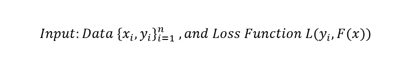

损失函数就是残差的平方和，你可能还记得逻辑回归。

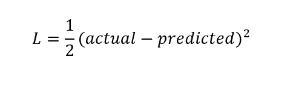

One residual

**第一步:**我们从一片叶子开始，这意味着我们将用一个常数来初始化模型。

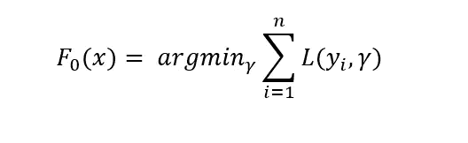

上面的等式意味着我们将所有的残差(每次观察的损失)相加。然而，arg min/gamma 意味着我们必须做出这样的预测，使得这个和最小化。作为数学计算的结果，最佳预测值是第一轮中所有 y 值的平均值。

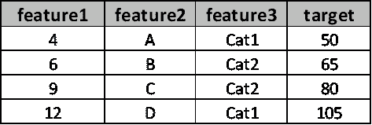

Dummy data

假设我们有一个虚拟数据集和目标特征，如上所示。在这种情况下，我们最初的预测将是平均值= 75。

**第二步:**对于 m=1 到 M；我们将把 M 棵树做成一个循环。

**步骤 2-A:** 计算残差:

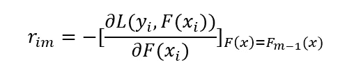

取损失函数的导数(这个导数就是梯度)；

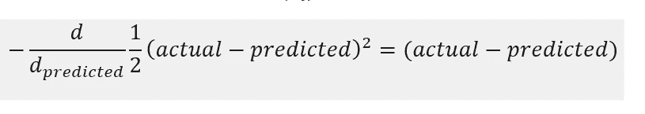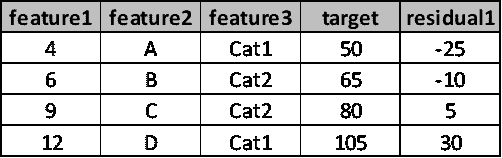

步骤 2-B: 在这一步，我们将**构建一个基础学习器(在我们的例子中是决策树)。**我们的目标特征**将不是目标**列，而是**残差**。

**步骤 2-C:** 对于每片叶子，计算使下面总和最小化的伽马值；它将先前的预测考虑在内，并考虑树叶中的样本。我在这里的意思是，我们将分别计算每片叶子的伽马值，并且在所讨论的叶子上的任何观察都将包括在计算中。

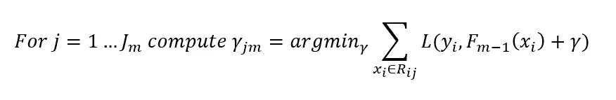

**步骤 2-D** :更新预测:

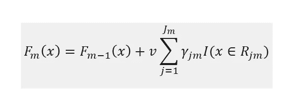

下面我们来解释一下这个公式:对于每个样本，我们把之前的预测值和上一步中找到的 gamma 值相加。伽玛值乘以学习率(以避免过拟合)。

比如我们把上一步找到的值补上(学习率= 0.1)；

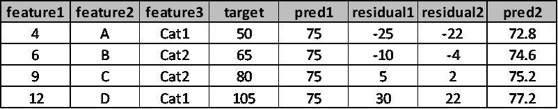

pred2，1 = 75 * 0.1 (-22) = 72.8

这样，我们向更好的结果迈进了一小步。我们重复这些步骤 M 次。

## Python 代码

```
import pandas as pd
import numpy as np
from sklearn.preprocessing import StandardScaler
from sklearn.model_selection import train_test_split
from sklearn.tree import DecisionTreeRegressor
import matplotlib.pyplot as pt
import seaborn as sns
from sklearn.metrics import mean_squared_error
from sklearn.metrics import accuracy_score
from sklearn.metrics import roc_auc_score#READ DATA
data = pd.read_csv("housing.csv")
data.fillna(0,inplace=True)#X,y
X = data.iloc[:,:-2]
y = data['median_house_value']
X_train, X_test, y_train, y_test = train_test_split(X, y, test_size=0.30, random_state=100)#scaling
scaler = StandardScaler()
X_train = scaler.fit_transform(X_train)
X_test = scaler.fit_transform(X_test)y_train = np.array(y_train).reshape(X_train.shape[0],1)
y_test = np.array(y_test).reshape(X_test.shape[0],1)#TRAIN
G = GradientBooster()
models, losses, pred_0 = G.train(X_train,y_train)
```

让我们绘制损失图；

```
sns.set_style('darkgrid')
ax = sns.lineplot(x=range(1000),y=losses)
ax.set(xlabel='Epoch',ylabel='Loss',title='Loss vs Epoch')
```

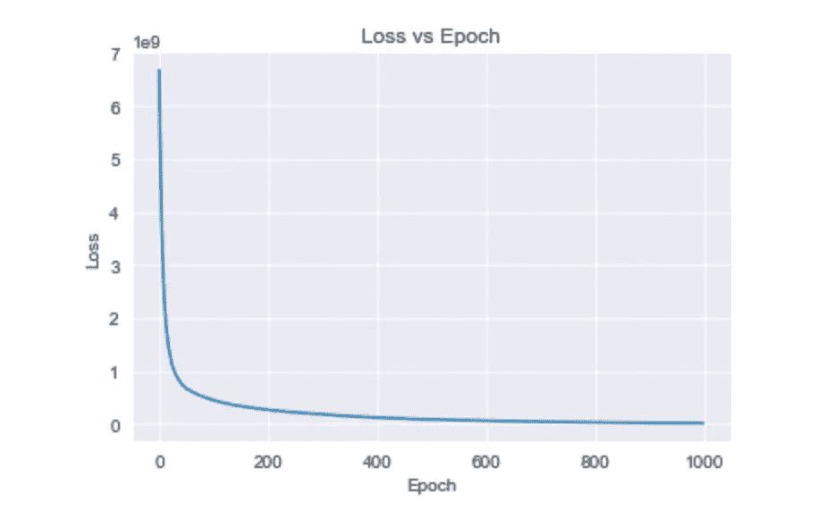

现在我们来预测一下测试数据；

```
y_pred = G.predict(models, y_train, X_test)
print('RMSE:',np.sqrt(mean_squared_error(y_test,y_pred)))#RMSE: 49396.079511786884
```

## Sklearn

```
from sklearn.ensemble import GradientBoostingRegressormodel = GradientBoostingRegressor(n_estimators=1000,criterion='mse',
                                    max_depth=8,min_samples_split=5,
                                    min_samples_leaf=5,max_features=3)model.fit(X_train,y_train)
y_pred = model.predict(X_test)print('RMSE:',np.sqrt(mean_squared_error(y_test,y_pred)))#RMSE: 48744.67210701868
```

RMSE 结果与手动实施一致。

感谢阅读。如果您有任何问题或意见，请随时写信给我！

## 阅读更多内容…

[](/@okanyenigun/gradient-boosting-for-classification-f9a93381e37c) [## 用于分类的梯度推进

### Python 中梯度增强的解释和实现

medium.com](/@okanyenigun/gradient-boosting-for-classification-f9a93381e37c) [](https://python.plainenglish.io/random-forest-implementation-980b2d2c3c84) [## 随机森林实现

### Sklearn 实现和参数解释

python .平原英语. io](https://python.plainenglish.io/random-forest-implementation-980b2d2c3c84) [](/mlearning-ai/a-detailed-catalog-of-dimensionality-reduction-ca33d6f2744) [## 降维的详细目录

### 用 Python 语言解释的多种降维方法

medium.com](/mlearning-ai/a-detailed-catalog-of-dimensionality-reduction-ca33d6f2744) [](https://towardsdev.com/scatter-charts-matplotlib-seaborn-plotly-39268cdbae41) [## 散点图(Matplotlib、Seaborn、Plotly)

### 如何使用 3 个最流行的库创建散点图？

towardsdev.com](https://towardsdev.com/scatter-charts-matplotlib-seaborn-plotly-39268cdbae41) [](https://python.plainenglish.io/ridge-lasso-elasticnet-regressions-from-scratch-32bf9f1a03be) [## 山脊，套索和弹性网从零开始回归

### Python 代码从头开始和 Sklearn 实现

python .平原英语. io](https://python.plainenglish.io/ridge-lasso-elasticnet-regressions-from-scratch-32bf9f1a03be) 

## 参考

[https://en.wikipedia.org/wiki/Gradient_boosting](https://en.wikipedia.org/wiki/Gradient_boosting)

[https://machine learning mastery . com/gentle-introduction-gradient-boosting-algorithm-machine-learning/](https://machinelearningmastery.com/gentle-introduction-gradient-boosting-algorithm-machine-learning/)

[https://www.youtube.com/watch?v=3CC4N4z3GJc&t = 311s](https://www.youtube.com/watch?v=3CC4N4z3GJc&t=311s)

[](/mlearning-ai/mlearning-ai-submission-suggestions-b51e2b130bfb) [## Mlearning.ai 提交建议

### 如何成为 Mlearning.ai 上的作家

medium.com](/mlearning-ai/mlearning-ai-submission-suggestions-b51e2b130bfb)