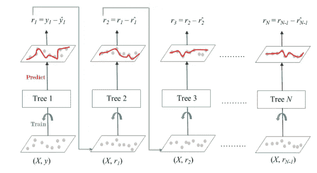
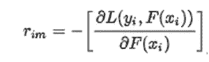
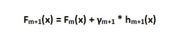

# 梯度推进机器

> 原文：<https://medium.com/mlearning-ai/gradient-boosting-machines-f13e06e60efb?source=collection_archive---------5----------------------->

在机器学习应用中，我们会遇到许多不同的算法。这些算法中的每一种都在某些特定领域实现了一定程度的准确性。但是可能存在这些精度值不够的情况。在这一点上，我们可能会寻找一些“**算法独立的方法**，以提高我们单一模型的性能。

其中一种方法叫做**助推**。Boosting 是将弱学习者组合成性能更好的集成模型的方法。boosting 的主要思想是使用“**最具信息量的数据**”来训练每一个弱学习者。尽管有很多方法与“增强”相关，我们将在这篇文章中研究“梯度增强”的概念。

梯度提升机器大多使用决策树作为弱学习器。因此，它们也被称为梯度推进决策树。让我们检查下图，以更好地展示梯度推进的概念。



Gradient Boosting Decision Trees [1]

在图中，我们看到了 **N** 个决策树。在这种情况下，每棵树都可以被认为是“弱学习者”。如果我们仔细观察每棵树的输入/输出对，我们会看到输入 X 对于每一个弱学习者都是常数。然而，训练的期望输出在每次迭代时都是变化的，从“y”开始，到 r(N-1)结束。我们称这些“r”值为先前弱学习者的“残差”或“梯度”。在这里，它被表示为从期望输出中减去实际输出。但是，事情可能比这更复杂。下面，我们可以看到残差计算的一个稍微复杂一点的表达式。



Residual Calculation

这里， **x(i)** 是具有索引 I 的输入样本，并且 **y(i)** 是相同索引值的相应期望输出。**“L”**是可微的(这很重要)损失函数，而 **F(xi)** 是迭代“ **m** ”时的当前“集合”模型输出。所以，如果我们总结这个表达式；

*   在迭代“ **m** ”中训练一个新的弱学习者。
*   计算输入 **x(i)** ，的集合输出，记为 F(xi)。
*   计算在迭代 **m** 时 **F(xi)** 和期望输出之间的损失。
*   并且简单地取这个损失相对于当前集合模型输出的梯度， **F(xi)** 。
*   结果值的负数就是**的余数**！现在，我们准备在迭代 **(m+1)** 中将这些新的残差馈送给新的弱学习者。
*   在每次迭代结束时，集合模型输出更新如下:



Update the Ensemble Model Output

*   **h(x)** 是迭代 **(m+1)** 时新的弱学习器。 **γ** 是这个新的弱学习者的学习率。如果我们将该乘法与当前集合输出 **F(x)** 相加，我们获得迭代 **(m+1)** 的新集合输出！
*   重复这个过程，直到每一个弱学习者都被训练出来！

下面，我插入一段伪代码，以便更好地解释梯度增强概念:

```
% X: Feature set (nxd)
% Y: Label set   (nx1)residual = Y; % Initialize the residual with the desired outputs Y
% Use the gradient of the MSE function for residual calculation
% 2(Y-residual) is the gradient of MSEfor m = 1:Number_of_Weak_Learners Weak_Learners{m} = Train_Decision_Tree(X,residual);        
     gamma(m) = 0.1; % Use this as a learning rate. Can be    
     %adaptively chosen for each iteration as well! % Find new residual for the next iteration residual = 2*(residual — gamma(m) * ...   
     predict(Weak_Learners{m},X));
end
```

我希望你喜欢这篇文章。下次再见！:)

## 参考

*   [1][https://www.geeksforgeeks.org/ml-gradient-boosting/](https://www.geeksforgeeks.org/ml-gradient-boosting/)
*   Freund，Schapire，1997，“*在线学习的决策理论概括和促进的应用*”
*   Mason，Baxter，Bartlett，Frean，1999，“函数空间中梯度下降的 *Boosting 算法*

[](/mlearning-ai/mlearning-ai-submission-suggestions-b51e2b130bfb) [## Mlearning.ai 提交建议

### 如何成为 Mlearning.ai 上的作家

medium.com](/mlearning-ai/mlearning-ai-submission-suggestions-b51e2b130bfb) 

🔵 [**成为作家**](/mlearning-ai/mlearning-ai-submission-suggestions-b51e2b130bfb)