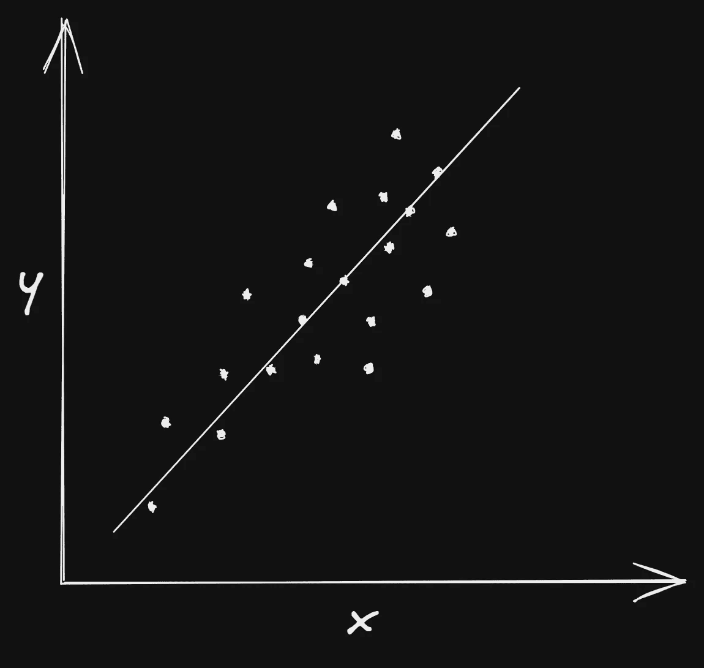
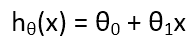
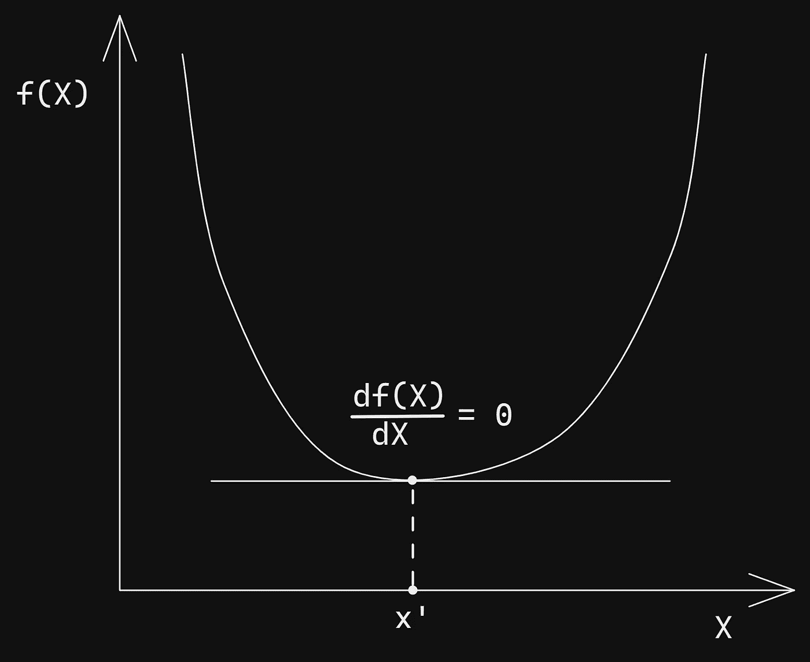
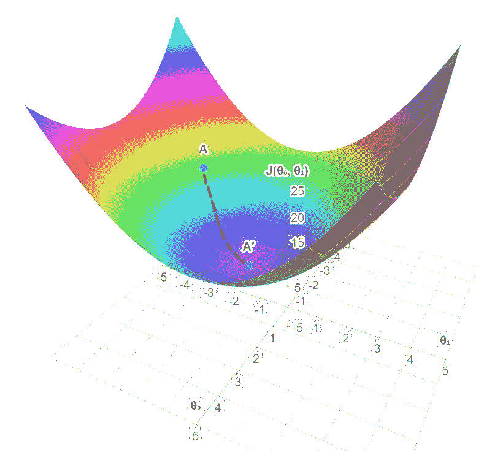
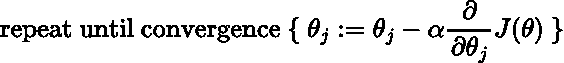
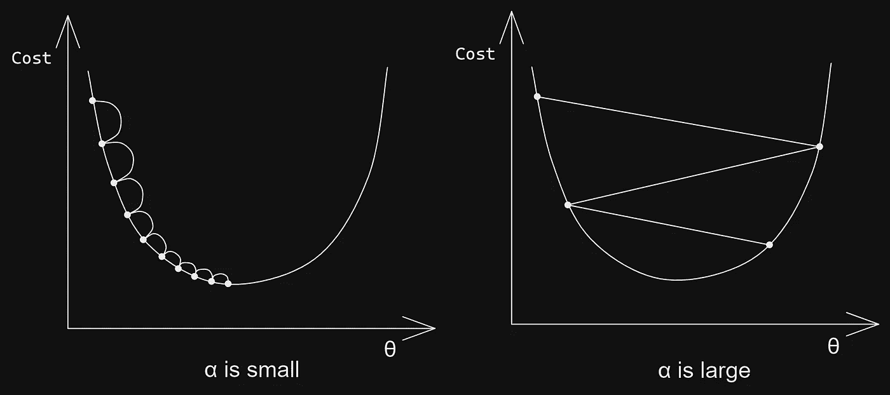
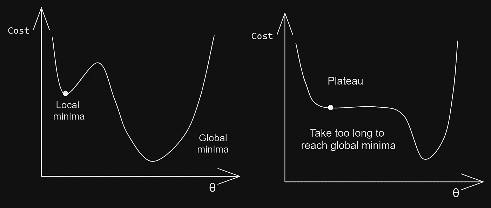

# 梯度下降，你需要知道的！！

> 原文：<https://medium.com/mlearning-ai/gradient-descent-all-you-need-to-know-ba358c838e82?source=collection_archive---------5----------------------->

## 用线性回归的例子解释梯度下降。

Image from [Unsplash](https://unsplash.com/photos/hkhCV41gOpA)

## 这是什么？

G 梯度下降是一种优化算法，能够找到各种问题的最优解。

梯度下降的主要功能是最小化成本函数。

这个定义很难理解，对吧？！好吧，那就简单点，用一个例子来理解。

假设我们有两个变量的数据，`x`和`y`，其中`x`是自变量，`y`是`x`的因变量。所以我们的目标是预测给定`x`的`y`。假设数据如下所示。这里，我们考虑的是**线性回归**问题。所以我们得到了那条线，这样我们就可以预测任何`x`的`y`。

Linear data

如果你不知道什么是线性回归，请点击这里查看:

 [## 从零开始学习机器学习中的线性回归

### 机器学习中线性回归的初学者教程。

python .平原英语. io](https://python.plainenglish.io/linear-regression-machine-learning-from-scratch-c9143bb44995) 

众所周知，直线方程是`y = mx + c`。这里，`m`是直线的斜率，`c`是与`Y`的交点。因此对于线性回归，**假设函数**与此等式相同，如下所示。

Hypothesis function for Linear Regression

这里θ₀和θ₁称之为重量。我们必须找到这些权重，以获得数据的最佳拟合线。

但问题是，如何得到这条线，使它能适应数据？为此，首先我们必须找出误差，即实际输出`y`和预测输出`h(x)`之间的差异，预测输出是通过我们的假设函数和一些随机权重计算出来的。为此，我们需要一个成本函数来计算这个误差。对于线性回归，**成本函数**定义如下:

Cost function for Linear Regression

如果你看清楚了，然后你发现这个成本函数什么都不是，但它首先取实际值和预测值的差然后取它的平方然后取所有数据的平均值。所以基本上它是在计算我们的线与数据的吻合程度。如果成本函数的值接近 0，那么它是好的，但是如果它是一个大值，那么我们必须改变假设函数的权重，然后再试一次。

那么，我们是否必须随机尝试不同的权重来获得数据的最佳拟合线？？🤔🤔

不不放松。这时**梯度下降**就来帮忙了。

基本上，我们的目标是尽可能降低成本函数。

这里，成本函数是θ₀和θ₁.的函数如果你知道一些微分，那么你可以很容易地解读它。我们先了解一下那部分。

例如，我们有`X`和它的功能。现在我们想知道`X`的值，此时`f(X)`具有最小值。

众所周知，在某点对函数进行**求导，意味着在该点的斜率值**。所以我们可以说，在这一点上，微分变为 0，意味着在这一点上，斜率的值为 0，意味着我们得到了斜率的水平线。

请看下图:

这里你可以看到在值`x'`处，slop 变成了水平。这意味着在那个点上`f(X)`的值最小。你可以在图像中清楚地看到。此时，`f(X)`的微分为 0。所以我们现在要做的是找到图的最小值。(*可以是* ***局部极小值*** *或* ***全局极小值*** *)。*)

现在让我们回到梯度下降。

我们有θ₀和θ₁作为参数和成本函数，它是θ₀和θ₁.的函数因此，这里我们希望最小化成本函数，以便我们可以获得模型的最佳拟合线。如上例所述，我们必须找到成本函数的微分，在该点上它变成 0，我们将获得最佳拟合线的θ₀和θ₁的值。所以我们想找到**极小值**。

所以我们有两个参数和一个成本函数。如果我们将它绘制在图表中，它将是 3D 的，如下所示。看图片，你会有更好的理解。

Gradient Descent for 2 parameters

这里我们有θ₁的θ₀和θ₁的 J(θ₀。现在取θ₁θ₀的一个随机值，并计算其成本函数。在图表中设置该值，假设图表中显示的点是`A`。我们希望那个点在最小值，在点`A'`。您可以看到，在点`A'`处，斜率变为 0，对于θ₀，θ₁成本函数具有最低值，这意味着我们的数据具有最佳拟合线。

现在的问题是，如何到达那个点？

程序是在一点上第一个计算斜率。之后，朝那个方向走下去。重复这个步骤，直到我们得到 slop 0 的值。

> F 或者举例，假设你在浓雾中迷失在群山之中，你只能感觉到脚下地面的坡度。快速到达底部的一个好策略是朝着最陡的斜坡方向下山。

让我们看看梯度下降方程，这样你就容易理解了。

Equation for Gradient Descent

我认为除了α(阿尔法)；你知道所有其他参数。这个α称为**学习率。**

学习率(也称为步长或 alpha)是达到最小值所需的步长。这通常是一个很小的值，根据成本函数的行为对其进行评估和更新。

所以现在，如果你看到这个等式，你就能理解它是如何工作的。对于任何θ，它将首先计算斜率，然后将该斜率乘以学习率，使其成为小值，然后从原始θ中减去该值，并用我们得到的值替换θ。这个过程不断重复，直到找到最小值或收敛。基本上，它将θ移动到局部或全局最小值。

如果α很小，那么算法会经历多次迭代，耗费大量时间。
如果α很高，你可能会跳过山谷，这可能会使算法发散，无法找到最佳解决方案。

Learning rate

## 梯度下降的类型

有 3 种类型的梯度下降:

1.  **批量梯度下降**
    它计算训练集中每个例子的误差。在对所有进行评估后，它会更新模型参数。它的计算效率很高，可以产生稳定的误差梯度和收敛性，但是它需要在内存中有一个完整的训练集。
2.  **随机梯度下降**
    根据单个训练样本的误差梯度更新参数。
    比批量梯度下降快。频繁的更新提供了详细的改进率，但是这些更新更昂贵。
3.  **小批量梯度下降**
    它将训练集分成小批量，并对这些批量中的每一个执行更新。
    它平衡批次&随机梯度下降，因为它使用两者的组合。

## **梯度下降挑战**

*   不是所有的成本函数看起来都不像一个规则的碗。在左侧，可能是它卡在了局部最小值。在右侧，需要很长时间才能达到全局最小值。

Local Minima and Plateau problem

*   **消失渐变** 当渐变过小时会出现这种情况。当我们在反向传播过程中向后移动时，梯度继续变小，导致网络中的早期层比后期层学习得更慢。发生这种情况时，权重参数会更新，直到它们变得不重要。
*   **爆炸梯度** 当梯度过大时会发生这种情况，产生不稳定的模型。在这种情况下，模型权重将变得过大，并且它们最终将被表示为 NaN。这个问题的一个解决方案是利用降维技术，这有助于最小化模型中的复杂性。

梯度下降就是这样！

感谢阅读！如果你喜欢，那就给它鼓掌，分享一下。

关注更多关于 [**中**](https://kishanmodasiya.medium.com/) 的内容，我会很快分享更多机器学习的东西。这里是我的 [**Twitter**](https://twitter.com/kishumds) ，关注，在那里和我联系，随时 DM。

 [## Mlearning.ai 提交建议

### 如何成为 Mlearning.ai 上的作家

medium.com](/mlearning-ai/mlearning-ai-submission-suggestions-b51e2b130bfb)