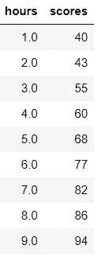
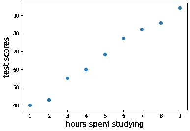
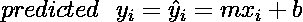
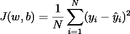
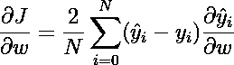
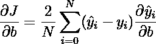
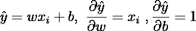
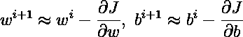
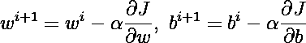

# 机器学习介绍—简单线性回归和梯度下降

> 原文：<https://medium.com/mlearning-ai/gradient-descent-in-machine-learning-linear-regression-e94570f505e6?source=collection_archive---------6----------------------->

线性回归是每个想学习机器学习的人的第一步。或者任何想成为有科学品味的算命先生的人。


## 简单线性回归

也许你会问自己:为什么回归在机器学习中如此重要？你会经常发现自己处于这样一种情况，你不得不根据一组过去的信息来预测一些事情。这就是回归算法试图填补的地方，帮助你预测一些事情。嗯，这听起来很统计，但机器学习的主要任务是创建一个模型，从过去的输入预测未来的输出。你可以借用不同领域的任何概念来建立一个机器学习模型。好吧，我们开始吧。

简单线性回归是一种线性模型，它假设输入和输出之间存在线性关系。为了澄清上面的陈述，让我们看看这些等式


Simple Linear Regression

上面的方程叫做简单线性方程。之所以称之为简单，是因为因变量 y 的输出只是一个自变量 x 的函数，而 **m** 和 **b** 是常数，俗称斜率和截距。在机器学习术语中，y 称为标签，x 称为特征。当您将一个值作为特征 x 传递时，标签 y 将产生一个与 x 成线性比例的值，它将由 x 的斜率 **m** 倍加上截距 **b** 来加权。如果函数中没有输入任何特征 x(x 等于零)，可以将截距 b 视为 y 的默认值。如果你提高 x，y 会线性提高，反之，如果你降低 x，y 会线性降低。

假设你有这样一个数据集



image by Author

这是一个测试分数数据集。从这个数据集中，你可以假设花在学习上的时间和考试成绩之间存在线性关系，这表明花在学习上的时间越多，考试成绩越高。这里有一个散点图，让你的假设有效。



你可能想知道，如果一个学生花了 3.5 个小时学习，或者 10 个小时学习，考试分数是多少？这些都是问题的类型，简单的线性回归已经准备好回答…或预测。简单来说，简单的线性回归任务是:

> **简单线性回归**试图通过从**已知特征 x 的和已知标签 y 的**中找到最优**斜率 m 和截距 b** 来使数据集符合**简单线性方程**。

在确定斜率 m 和截距 b 的最佳值之后，作为特征 xi 的函数的所有数据集 yi 的预测标签为



然后，将回答学生在学习 ***x*** 的任意小时数的考试分数 ***y*** 是多少的问题。

## 梯度下降

要找到斜率 m 和截距 b 的最佳值，您需要了解梯度下降。梯度下降是从**成本函数**中衍生出来的一种优化技术。成本函数有多种类型，您将使用的是这个函数:



哪里；

j =成本函数

w =重量

b =偏差

y =实际值(已知标签)

y(hat)=预测值(预测标签)

这是已知标签(y)和预测标签(y hat)之差的平方的平均值，通常称为**均方误差— MSE。**

梯度下降的整个思想是最小化成本函数，使已知标签和预测标签之间的总差的平方尽可能小。


Image by [Sebastian Raschka](http://rasbt.github.io/mlxtend/user_guide/general_concepts/gradient-optimization/)

什么时候成本函数处于最小值？从上图来看，代价函数的最小值是谷底的一个点。在这一点上，赋予成本函数最小值的权重是最佳值。你怎么能确定在那个成本函数中只有一个谷，就是当前值是最最小值？你选择的成本函数是二次函数，每个二次函数只有一个谷。

在微积分中，函数的最小值是其梯度等于零的地方，或者在几何意义上，是曲线中斜率线最平坦的梯度(见上图)。因此，要计算最佳权重和偏差，您需要一个与权重和偏差相关的成本函数梯度:



对于简单线性方程



现在您已经找到了成本函数的梯度，要达到成本函数的最小值，您必须从初始值开始调整权重和偏差，直到达到产生成本函数最小值的最佳值。这意味着你需要反复改变权重和偏差的值。但是体重和偏倚的变化有多大呢？你有梯度，但是梯度是如何与体重和偏见联系起来的？

梯度也称为变化率。因此，成本函数相对于权重的梯度是成本函数变化多少的度量。如果权重改变，相同的原理也适用于偏差。因此，通过使用成本函数梯度作为更新步骤来近似权重和偏差更新值:



现在你可能会想，这些近似会收敛吗？换句话说，在一定的迭代次数之前，权重和偏差会被发现吗？

成本函数的梯度在接近最小值时趋于平缓，这意味着梯度的方向总是朝向曲线的谷，因此我们逐步迭代 w 和 b 到梯度的方向。如果步长太大，您将错过最佳权重，但如果太小，您将需要很长时间来迭代。为此，您需要将学习率添加到近似值中。学习率是一个超参数，它决定梯度的步长将在多大程度上改变下一个权重和偏差。



其中α是学习率。

## 履行

现在，让我们实现简单线性回归的梯度下降，首先创建类模板，然后您将逐步完成这个模板

```
import numpy as npclass LinearRegression: def __init__(self):
        pass def fit(self,X,y):
        pass def predict(self,X):
        pass
```

对于构造器部分，您需要将学习率和迭代次数作为类的属性来传递。

```
## Set the learning rate and number of iterations
def __init__(self,learning_rate=0.01,iter=1000):
    self.learning_rate=learning_rate
    self.iter=iter
```

接下来是拟合方法，这是使用这些步骤实现梯度下降的地方(参见下面代码的注释):

```
def fit(self,X,y):
    #set the initial value for weights and bias
    self.weights=0
    self.bias=0
    #get number of samples features X
    n_samples=length(X)
    #start the iteration
    for i in range(self.iter):
        #predict the known label y
        y_predict=self.weights*X + self.bias
        #calculate the gradients of weights and bias
        grad_w=(2/n_samples)*np.sum(X*(y_predict-y))
        grad_b=(2/n_samples)*np.sum(y_predict-y)
        #update the weights and bias
        self.weight-=grad_w*self.learning_rate
        self.bias-=grad_b*self.learning_rate
```

现在对于预测方法，只需使用简单的线性方程计算新的标签

```
def predict(self,X):
    return self.weights*X + self.bias
```

现在，让我们试着预测一些事情，你将使用考试分数数据。您可以从文件中加载数据或直接写下数据，因为它的要素和标注数量很少

```
X=np.array([1.,2.,3.,4.,5.,6.,7.,8.,9.])
y=np.array([40,43,55,60,68,77,82,86,94])
```

实例化并拟合数据集

```
linreg=LinearRegression()
linreg.fit(X,y)
```

设置新功能并预测

```
new_hours=np.array([1.5,2.3,3.2,4.3,5.1,6.4,7.5,8.2])
predict=linreg.predict(new_hours)
```

让我们看看你的模型有多好，定义函数来计算成本函数(MSE)

```
def mean_squared_error(y_true, y_pred): return np.mean((y_true - y_pred) ** 2)existing=c.predict(X)
mse=mean_squared_error(y,existing)
print(mse)
```

结果是 3.30 左右。那很好。为了看看你的预测有多接近，让我们把它画出来

```
import matplotlib.pyplot as plt
plt.scatter(X,y)
plt.scatter(new_hours,predict)
plt.plot(X,existing)
```


蓝色点是从数据集绘制的数据，橙色点是新要素的标注，线是回归线。这是完整的代码

## 结论

在本文中，您已经了解了

1.  线性回归在机器学习中的重要性
2.  梯度下降的基本概念
3.  用 Python 实现

请分享这个帖子，如果你喜欢就给它一个掌声。对于多元线性回归你可以查看这个帖子:

[](/@gilsatpray/multiple-linear-regression-and-gradient-descent-using-python-b931a2d8fb24) [## 使用 Python 进行多元线性回归和梯度下降

### 这篇文章将解释多元线性回归及其在 Python 中的实现。

medium.com](/@gilsatpray/multiple-linear-regression-and-gradient-descent-using-python-b931a2d8fb24) [](/mlearning-ai/mlearning-ai-submission-suggestions-b51e2b130bfb) [## Mlearning.ai 提交建议

### 如何成为 Mlearning.ai 上的作家

medium.com](/mlearning-ai/mlearning-ai-submission-suggestions-b51e2b130bfb)