# 梯度下降，飞镖方式

> 原文：<https://medium.com/mlearning-ai/gradient-descent-the-dart-way-2d6c39416a8a?source=collection_archive---------8----------------------->

*本帖是 Dart 中关于机器学习系列文章的一部分:*

*   [*飞镖编程语言中的机器学习*](/mlearning-ai/machine-learning-in-dart-programming-language-fbfffd7deb18?source=friends_link&sk=12ba21f2c7a01f1aa18954ba2a82fae9)
*   [*线性回归简介*](/mlearning-ai/a-gentle-introduction-to-linear-regression-the-dart-way-9750214e6fa2?source=friends_link&sk=e199d8f5b0bb71c97525be2ee7f5819b)
*   [*线性回归:简单地说就是普通最小二乘法*](/mlearning-ai/linear-regression-ordinary-least-squares-in-a-nutshell-c2e0d7ed260f?source=friends_link&sk=5c8bc0228d29bc67ebe524a91d687619)
*   [*线性回归:闭式解，飞镖方式*](/mlearning-ai/ordinary-least-squares-closed-form-solution-the-dart-way-d7c0ee0e0d02?source=friends_link&sk=9ba5a9da7fd3160b28c450ff6dc446a4)


Photo by [Eric Muhr](https://unsplash.com/@ericmuhr?utm_source=medium&utm_medium=referral) on [Unsplash](https://unsplash.com?utm_source=medium&utm_medium=referral)

在我上一篇[文章](/mlearning-ai/ordinary-least-squares-closed-form-solution-the-dart-way-d7c0ee0e0d02?source=friends_link&sk=9ba5a9da7fd3160b28c450ff6dc446a4)中，我们熟悉了普通最小二乘问题的一个简洁优雅的解决方案——封闭形式的解决方案。

本文将深入探讨另一种优化算法—梯度下降。最后，我们将使用 Dart 编程语言对算法进行编码。

**目录:**

1.  梯度下降背后的直觉
2.  算法的数学基础
3.  Dart 编程语言中梯度下降的实现

## **梯度下降背后的直觉**

让我们记住我们的目标是什么:我们必须找到成本函数的最小值，在我们的情况下是平方误差。该函数的典型图形:

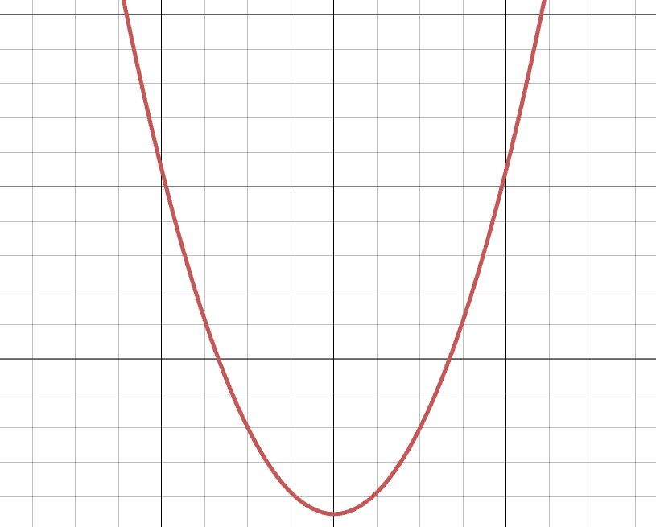

图表看起来像一个坑。所以让我们想象我们正处在它的边缘。天完全黑了，我们得找到坑底。

让我们后退一步。很明显，我们正在上升；我们能感觉到，上升总是比下降难。我们错了，落后的方向不会把我们引向谷底。所以让我们改变方向，向前迈一步。现在我们能感觉到我们在下降。走了很多步后，坑变得不那么陡了。最后，我们到达了底部，但我们还不知道它。我们向前迈一步，我们觉得我们开始提升，所以我们需要后退。现在我们完全知道我们已经到了谷底。

我们刚刚描述了梯度下降算法。为了让计算机理解它，我们应该首先将直观的描述翻译成数学，然后翻译成编程语言的代码。

## **算法的数学基础**

数学意义上的一步是指在某一点找到函数的导数。导数反过来意味着函数在该点的陡度:

*   导数的绝对值很大意味着函数在这一点上很陡；
*   值小意味着函数在该点比较平坦；
*   等于零的值意味着该点是函数的局部最优值；
*   导数的正号意味着函数是上升的；
*   导数的负号意味着函数在下降。

形式上，最小值是最低点的坐标。对于梯度下降过程的每次迭代，坐标被更新。

这里我们应该提出一个更新规则。

我们需要把坐标往最小值的方向改，但是怎么确定方向呢？这很简单——如果新点的导数是负的，这意味着函数在下降，我们可以将坐标向右移动:

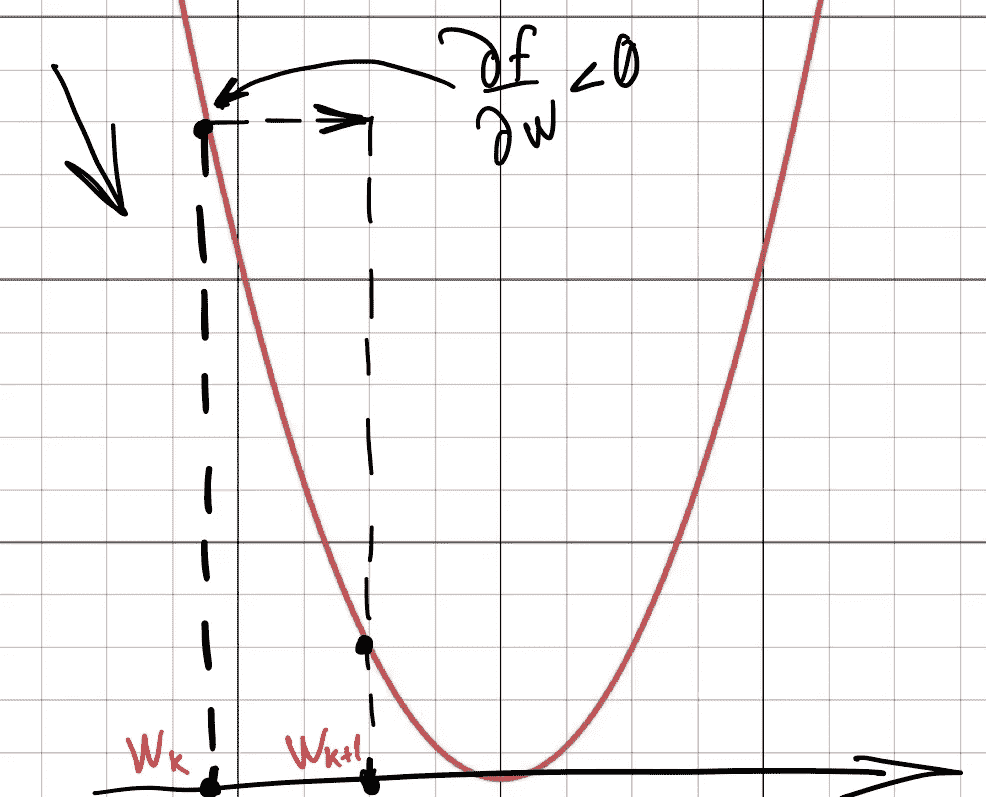

如果该点的导数为正，则函数是上升的，我们需要改变方向，将坐标向左移动:

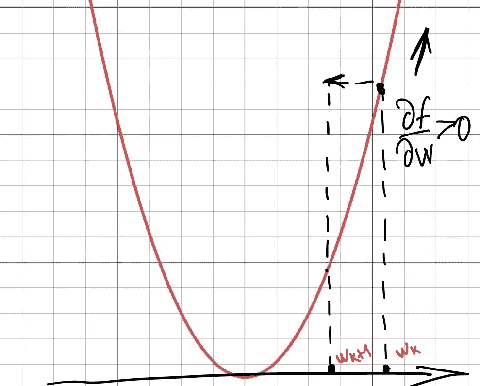

如果导数为零，我们处于最小值:

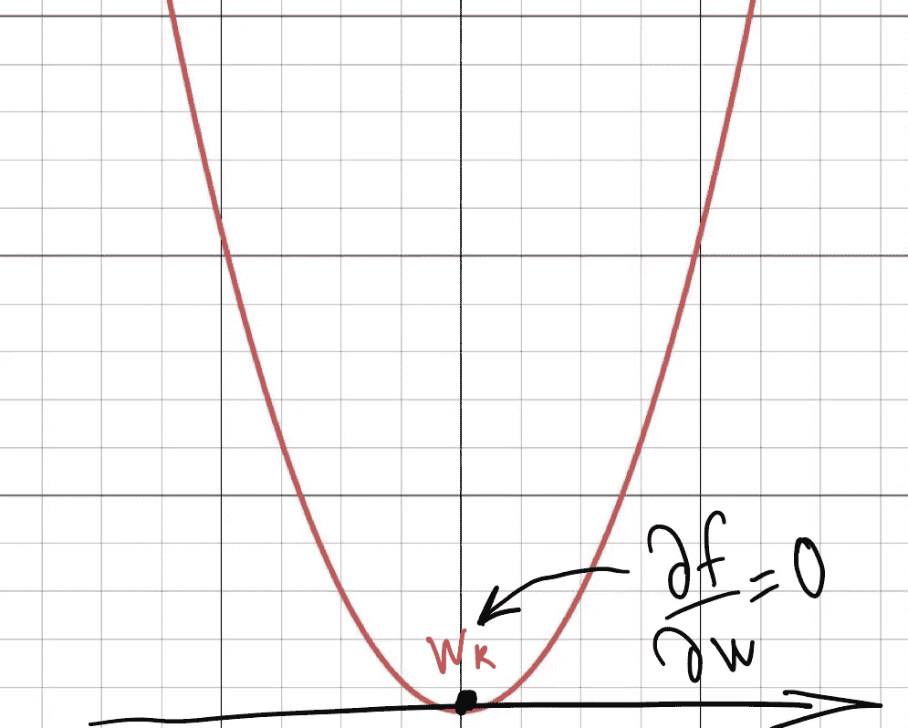

以下规则最恰当地描述了这一过程:

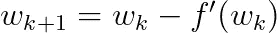

在负导数的情况下，我们将坐标向右移动:

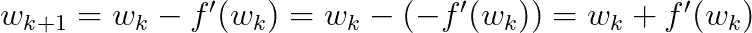

在正导数的情况下，我们将坐标向左移动:

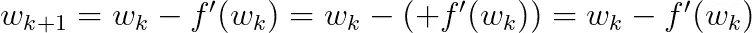

为了更精确地收敛，最好为导数添加一个系数参数:

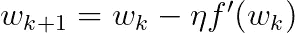

叫做*学习率*。

何时停止该过程？让我们把新坐标和当前坐标相减:

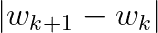

如果结果值太大，我们应该重复这个过程。

我们的下一个挑战是找出如何处理许多论点的成本函数。回想一下，功能是什么:

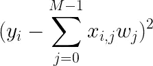

其中`M`是特征的数量，`i`是特征矩阵中行的索引，`j`是列索引。

让我们找到一个关于每个自变量的导数值的表达式。因为我们的函数是“复杂的”，这意味着它由几个部分组成，所以我们必须应用链式法则。首先，让我们找出平方的导数:

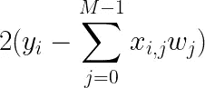

然后让我们找出函数内部的导数:

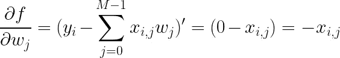

最后，让我们将两个表达式相乘:

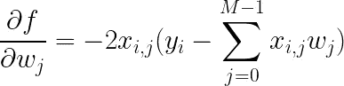

很好，现在我们有一堆偏导数了。所以我们需要以某种方式组织它们。这里我们来看一下梯度矢量的定义:

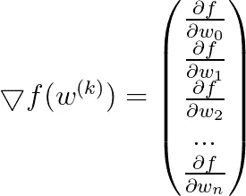

梯度是由偏导数组成的向量。

更新规则保持不变。我们只需要用向量符号重写它:

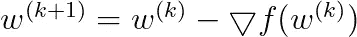

详细的渐变看起来像这样:

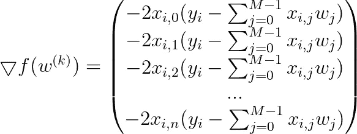

但是矩阵中有很多行；如果每一行都有自己的梯度，我们如何计算梯度呢？似乎我们可以只对所有行的梯度求和:

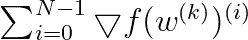

因此，规则现在看起来如下:

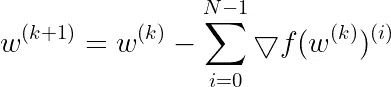

## Dart 编程语言中梯度下降的实现

我们试着用 Dart 编写梯度下降程序吧！

我准备用 [ml_linalg](https://github.com/gyrdym/ml_linalg) 包。该库简化了向量和矩阵的工作。此外，由于图书馆的 SIMD 性质，它有助于我们有效地做数学。

该程序将按功能组织。让我们想出它的签名:

为了执行梯度下降，我们需要一个特征矩阵`X`，一个带有标签的列矩阵`Y`和一个列矩阵`initialCoefficients`。该函数的输出是系数的列矩阵，其对应于成本函数的最小值点。

梯度下降是一个迭代过程，这意味着我们必须定义停止标准。最明显的标准是迭代次数约束。第二标准可以是两次连续迭代之间的差；如果它小于或等于某个极限，我们应该停止程序:

让我们来分解一下:

*   我们选择一个值`50`作为迭代计数约束。希望，这将足以收敛。
*   如果新系数和当前系数之差小于`minCoefficientDiff`，则算法收敛，我们应该停止该过程。从数学上讲，我们处于成本函数的最佳状态，因为系数发生了一点变化；这一点的导数几乎为零。
*   差应该是一个数，但是新的和当前的系数相减就给了我们一个列矩阵；这就是我们使用矩阵方法`norm`的原因。这是完全正确的，因为新旧系数之间的差异越小，差异的范数就越小。通过将`newCoefficients`赋值给`coefficients`,我们链接了循环以开始新的迭代。新的系数不再是新的，而是当前的系数。

让我们对系数更新规则进行编码。根据我们上面推导的梯度公式:


我们应该一个接一个地从矩阵`X`的第 I 行中取出每个元素，并将其乘以括号中的表达式。该表达式又将整个第 I 行乘以当前系数。似乎我们可以用矩阵符号来缩短表达式。为什么要从`X`的第 I 行取每个元素，然后乘以表达式？我们可能会使用整个矩阵`X`！这同样适用于括号中的表达式:我们可以将整个矩阵`X`乘以当前系数:

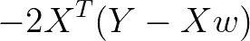

代码:

为了符合维度，我们必须转置`X`。最后一行是更新规则。

现在让我们一起收集所有的碎片:

很好，让我们用一个简单的例子来测试一下:

不用梯度下降很容易推断出系数:

*   `2 * w1 + 2 * w2 = 12; w1=w2=3`
*   `3 * w1 + 3 * w2 = 18; w1=w2=3`
*   `4 * w1 + 4 * w2 = 24; w1=w2=3`
*   `5 * w1 + 5 * w2 = 30; w1=w2=3`

第一个特征系数是`3`，第二个特征系数也是`3`。让我们运行上面的代码，看看输出。输出是:

```
Coefficients: Matrix 2 x 1:
(2.9999842643737793)
(2.9999842643737793)
```

由梯度下降推断的两个系数几乎与预期的一样`3`(有一些舍入误差)。似乎代码运行良好。

**总结:**

*   梯度下降法的计算成本比封闭解低得多，它不需要昂贵的矩阵求逆运算。可以对大量数据使用该算法。
*   梯度下降不如闭合解精确，因为闭合解是“理想”解。
*   与封闭解不同，梯度下降法可以应用于非线性问题。

差不多就是这样！

感谢您的阅读:)

[](/mlearning-ai/mlearning-ai-submission-suggestions-b51e2b130bfb) [## Mlearning.ai 提交建议

### 如何成为 Mlearning.ai 上的作家

medium.com](/mlearning-ai/mlearning-ai-submission-suggestions-b51e2b130bfb)