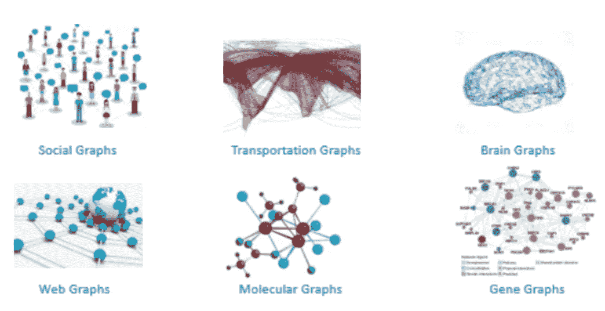

# 图形基础和应用

> 原文：<https://medium.com/mlearning-ai/graph-basics-and-application-4de971ce0a0e?source=collection_archive---------1----------------------->

## 了解什么是图，图的类型，图的应用，以及表示图数据的简单方法。

你将如何可视化你的社交网络、交通路线、基因图谱、分子键、脑图或网络图？

source:[http://cse.msu.edu/~mayao4/tutorials/aaai2020/](http://cse.msu.edu/~mayao4/tutorials/aaai2020/)

> **图是无处不在的数据结构，用于描述复杂的** …