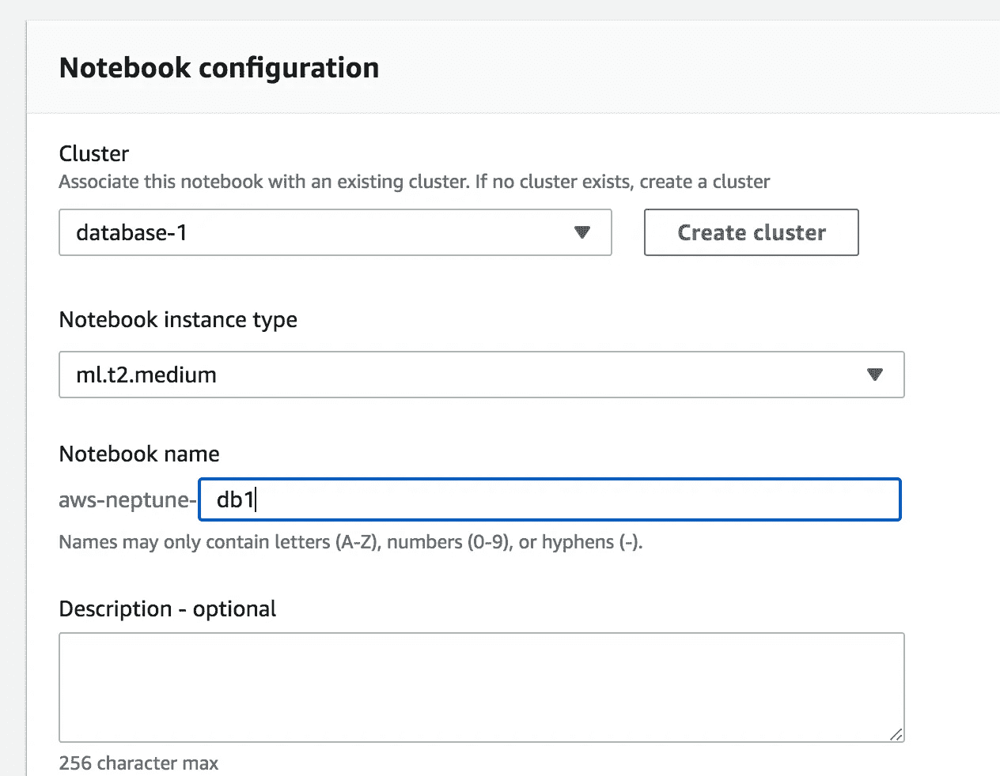
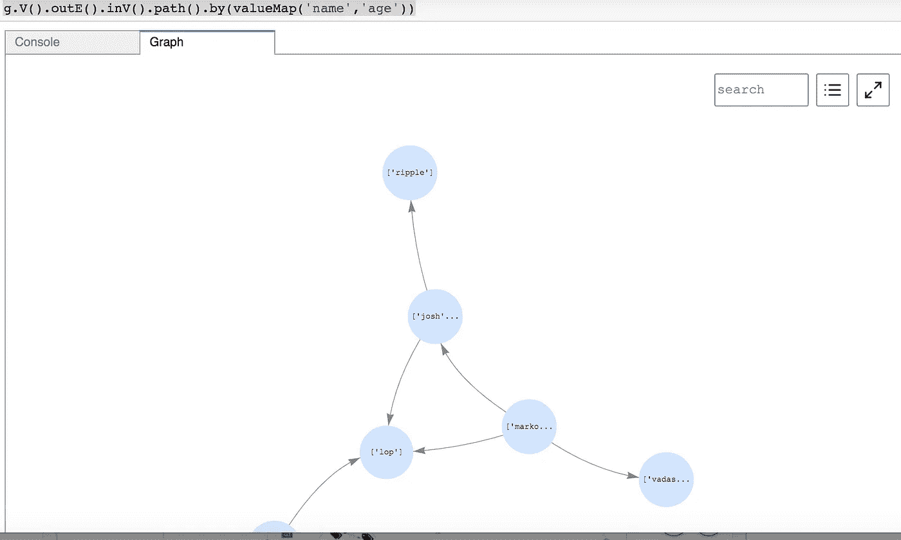
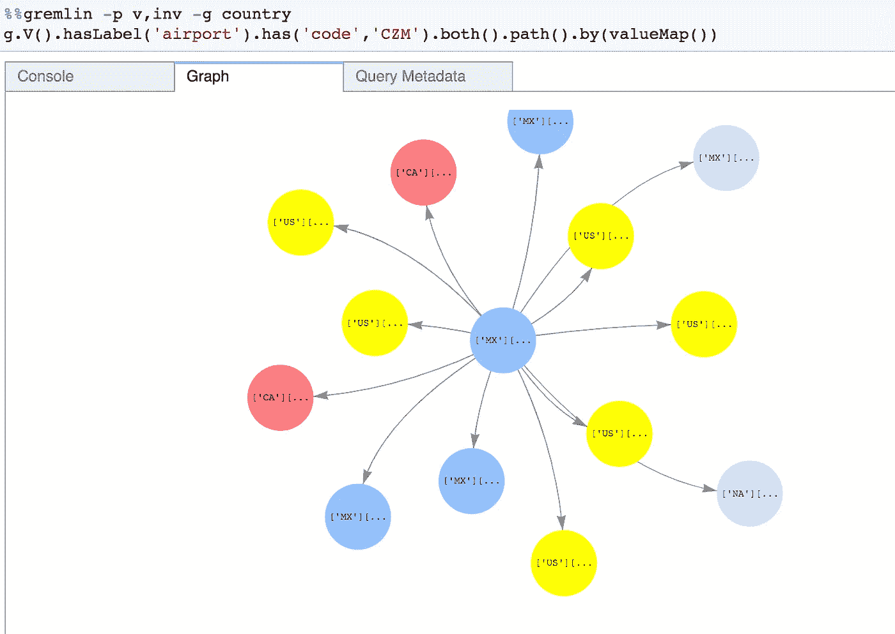
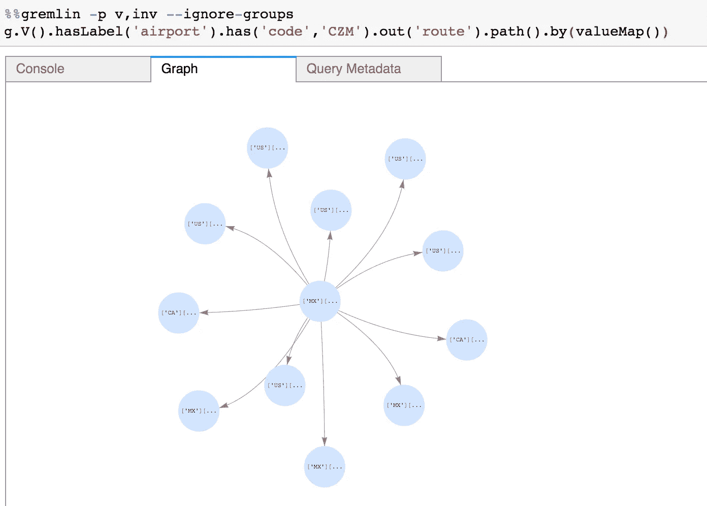
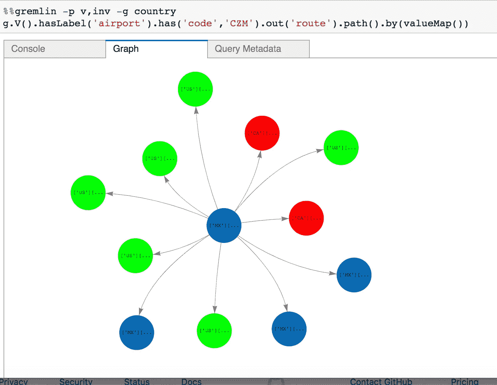
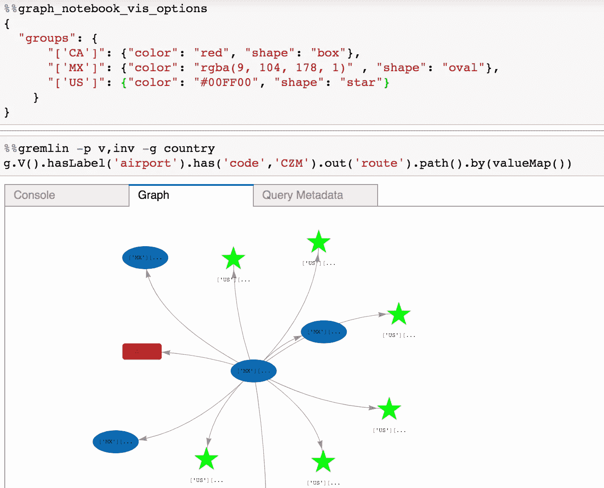
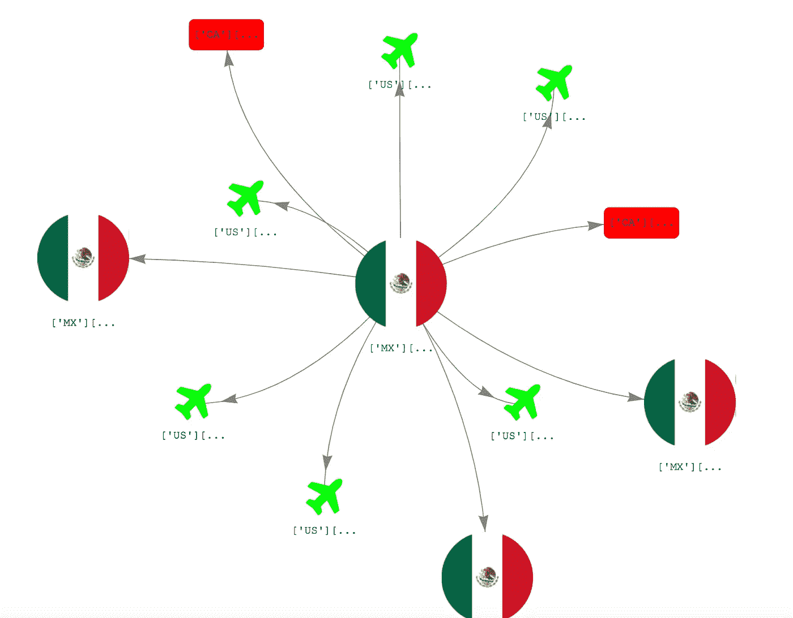

# 图形数据库、GraphQL 和 Amazon Neptune 以及 AWS AppSync

> 原文：<https://medium.com/mlearning-ai/graph-databases-amazon-neptune-bb89582abcf7?source=collection_archive---------1----------------------->

# 图表基础

[](/terminusdb/graph-fundamentals-part-2-labelled-property-graphs-ba9a8edb5dfe) [## 图形基础第 2 部分:标记属性图

### 这是关于图形数据库基础技术的四篇系列文章的第二篇——第一篇…

medium.com](/terminusdb/graph-fundamentals-part-2-labelled-property-graphs-ba9a8edb5dfe) [](/@maxy_ermayank/graph-databases-amazon-neptune-overview-fa8444e288e7) [## 图形数据库和 Amazon Neptune 概述

### TL；DR 在这篇文章中介绍了什么是图形数据库？图形数据库用例，术语，选项。专注于…

medium.com](/@maxy_ermayank/graph-databases-amazon-neptune-overview-fa8444e288e7) 

# 使用图形数据库的主要优势

当您的查询涉及定义不明确的连接、未知的遍历步数时，图数据库和图建模真正发挥了作用。例如，在下面的文章中，如果您想找到在 3 跳内直接或间接投资给定公司的所有投资者(公司或个人)，很难编写一个简洁的关系查询，增加跳数会使已经很难看的查询更难看。

[](https://www.tigergraph.com/blog/what-are-the-major-advantages-of-using-a-graph-database/) [## 图形数据库的优势:使用图形查询语言

### 图相对于关系数据库的优势包括用查询语言更好地解决问题、性能和效率

www.tigergraph.com](https://www.tigergraph.com/blog/what-are-the-major-advantages-of-using-a-graph-database/) [](https://dgraph.io/blog/post/graphdb-for-your-next-app/) [## 为什么你应该用 GraphQL 数据库构建你的下一个应用

### 经常有人问我这样的问题。人们倾向于从关系数据库开始他们的技术之旅，并陷入困境…

dgraph.io](https://dgraph.io/blog/post/graphdb-for-your-next-app/) [](https://neo4j.com/blog/sql-vs-cypher-query-languages/) [## RDBMS & Graphs: SQL 与 Cypher 查询语言

### 说到数据库查询语言，语言效率很重要。使用……查询关系数据库很容易

neo4j.com](https://neo4j.com/blog/sql-vs-cypher-query-languages/) 

另一个例子是实体解析，例如，如果您想检查两个用户是否是同一用户(每个用户可能有姓名、电话号码、电子邮件地址、地址、年龄或更多字段)。你可能想说，如果任何三个场是相同的，那么我们认为它们是相同的。但是，对于每个用户，你不知道 N 个字段中哪三个匹配。根据字段的数量，关系查询很长，添加更多的字段会导致关系查询发生变化。Neo4j 的查询更加简洁。

[](https://www.tigergraph.com/blog/using-a-graph-database-for-big-data-entity-resolution/) [## 使用图形进行数据实体解析| TigerGraph

### 我们正在被数据淹没根据市场情报公司 IDC 的数据，2018 年的“全球数据圈”达到了 18…

www.tigergraph.com](https://www.tigergraph.com/blog/using-a-graph-database-for-big-data-entity-resolution/) [](https://community.neo4j.com/t/how-to-find-all-combinations-of-two-nodes-that-both-have-a-relation-to-more-than-a-certain-amount-of-nodes/6109) [## 如何找到两个节点的所有组合，这两个节点都与一个以上的特定数量有关…

### 大家好，我现在开始学习 Cypher 是如何工作的，我陷入了试图找出一个(对初学者来说)…

community.neo4j.com](https://community.neo4j.com/t/how-to-find-all-combinations-of-two-nodes-that-both-have-a-relation-to-more-than-a-certain-amount-of-nodes/6109) 

# 设置 Neptune 数据库集群

[云形成方法](https://docs.aws.amazon.com/neptune/latest/userguide/get-started-create-cluster.html)对我来说失败了，所以我去海王星控制台创建。

 [## 开始使用 Neptune Jupyter 笔记本

### graph notebook 项目中的笔记本都是开源的，位于…的/src/graph_notebook/notebooks 文件夹中

docs.aws.amazon.com](https://docs.aws.amazon.com/neptune/latest/userguide/graph-notebooks.html) [](https://aws.amazon.com/sagemaker/pricing/) [## 亚马逊 SageMaker 定价-亚马逊网络服务(AWS)

### 有了亚马逊 SageMaker，你只需为你使用的东西付费。构建、培训和部署 ML 模型的费用由…

aws.amazon.com](https://aws.amazon.com/sagemaker/pricing/) 

虽然根据上面的页面，t3 是可用的，但我最终选择了 ml.t2.medium，因为 t3 总是报告“us-east-1e”中不可用的实例类型。



亚马逊为 Neptune 上的轻松入门提供了笔记本。

[](https://github.com/aws/graph-notebook) [## AWS/图表-笔记本

### 图形笔记本提供了一种使用 Jupyter 笔记本与图形数据库进行交互的简单方法。使用这个…

github.com](https://github.com/aws/graph-notebook) 

快速验证笔记本

[](https://github.com/aws/graph-notebook/blob/main/src/graph_notebook/notebooks/01-Getting-Started/01-About-the-Neptune-Notebook.ipynb) [## AWS/图表-笔记本

### 扩展 Jupyter 笔记本以集成 Apache TinkerPop 和 RDF SPARQL 的库。-自动气象站/图表-笔记本

github.com](https://github.com/aws/graph-notebook/blob/main/src/graph_notebook/notebooks/01-Getting-Started/01-About-the-Neptune-Notebook.ipynb) 

```
%statusOut[1]:{'status': 'healthy',
 'startTime': 'Sun Apr 18 23:10:52 UTC 2021',
 'dbEngineVersion': '1.0.4.1.R4',
 'role': 'writer',
 'gremlin': {'version': 'tinkerpop-3.4.8'},
 'sparql': {'version': 'sparql-1.1'},
 'labMode': {'NeptuneML': 'disabled',
  'ObjectIndex': 'disabled',
  'DFEQueryEngine': 'disabled',
  'ReadWriteConflictDetection': 'enabled'}}
```

Neptune workbench 有一个加载样本数据的命令。

```
%seed
```

[](https://aws.amazon.com/blogs/database/visualize-query-results-using-the-amazon-neptune-workbench/) [## 使用 Amazon Neptune work bench | Amazon Web Services 可视化查询结果

### 在这篇文章中，我们来看看最近添加到 Amazon Neptune workbench 中的新的可视化特性，并发布在…

aws.amazon.com](https://aws.amazon.com/blogs/database/visualize-query-results-using-the-amazon-neptune-workbench/) 

# 上传数据到海王星

将下面文章中的 nodes.csv，edges.csv 上传到 S3。使用笔记本%load 魔法加载。

[](https://julsimon.medium.com/a-primer-on-graph-neural-networks-with-amazon-neptune-and-the-deep-graph-library-5ce64984a276) [## 带有 Amazon Neptune 和深度图形库的图形神经网络入门

### 在这篇文章中，我想向你介绍图形神经网络(GNN)，这是……

julsimon.medium.com](https://julsimon.medium.com/a-primer-on-graph-neural-networks-with-amazon-neptune-and-the-deep-graph-library-5ce64984a276)  [## 示例:将数据加载到 Neptune DB 实例中

### 这个例子展示了如何将数据加载到 Amazon Neptune 中。除非另有说明，否则您必须按照以下步骤从…

docs.aws.amazon.com](https://docs.aws.amazon.com/neptune/latest/userguide/bulk-load-data.html#bulk-load-prereqs-s3)  [## 先决条件:IAM 角色和亚马逊 S3 访问权限

### 如果使用亚马逊 S3 SSE-S3 模式加密，您可以从亚马逊 S3 加载加密数据。那样的话，海王星…

docs.aws.amazon.com](https://docs.aws.amazon.com/neptune/latest/userguide/bulk-load-tutorial-IAM.html) 

1.  在海王星 VPC 创建 VPC 端点(选择网关)
2.  创建 IAM 角色并分配给 Neptune DB 集群
3.  在笔记本中，使用%load 命令加载数据

验证节点

```
%%gremling.V().limit(10).valueMap("name")
```

验证边缘

```
%%gremling.E().limit(10)
```

其他笔记本魔术

 [## 在笔记本中使用 Neptune workbench magics

### Neptune 工作台在笔记本中提供了许多所谓的神奇命令，可以节省大量的时间和…

docs.aws.amazon.com](https://docs.aws.amazon.com/neptune/latest/userguide/notebooks-magics.html) 

可视化图表

```
%%gremlin -p v,oute,invg.V().outE().inV().path().by(valueMap('name','age'))
```



注意:图形是用 [vis.js](https://github.com/visjs/vis-network) 创建的。

此外，在下面的代码中使用 wss 来使用 SSL

```
from gremlin_python import statics
from gremlin_python.structure.graph import Graph
from gremlin_python.process.graph_traversal import __
from gremlin_python.process.strategies import *
from gremlin_python.driver.driver_remote_connection import DriverRemoteConnection
graph = Graph()
remoteConn = DriverRemoteConnection('wss://ENDPOINT:PORT/gremlin','g')
g = graph.traversal().withRemote(remoteConn)print(g.V().toList())
```

# 有用的命令

删除所有顶点

```
%%gremling.V().drop().iterate()
```

或者

```
%%gremling.V().drop()
```

删除所有标签为“人”的顶点

```
%%gremling.V().hasLabel('person').drop().iterate()
```

删除名称属性设置为 justin 的顶点

```
%%gremling.V().has('name', 'justin').drop()
```

获取一个顶点的 id 和所有属性

```
%%gremling.V('1').valueMap(true)
```

 [## 小精灵备忘单 101

### 获取具有指定标签和匹配所提供值的属性键的所有顶点

dkuppitz.github.io](https://dkuppitz.github.io/gremlin-cheat-sheet/101.html)  [## 小精灵备忘单 102

### 保持简单的、非循环的路径(任何元素都不能在当前路径中出现两次以上)

dkuppitz.github.io](https://dkuppitz.github.io/gremlin-cheat-sheet/102.html) 

# GraphQL

GraphQL 是一种用于 API 的开源数据查询和操作语言。

[](https://graphql.org) [## API 的查询语言

### GraphQL 是一种 API 查询语言，也是一种用现有数据完成这些查询的运行时语言。图表 QL…

graphql.org](https://graphql.org) 

这里有一篇关于 GraphQL 和 REST 的文章

[](https://www.apollographql.com/blog/graphql-vs-rest-5d425123e34b/) [## GraphQL 与 REST

### 通常，GraphQL 被认为是思考 API 的一种革命性的新方法。而不是与僵化的…

www.apollographql.com](https://www.apollographql.com/blog/graphql-vs-rest-5d425123e34b/) 

用 GraphQL 做 API，用图形数据库做后端是很自然的。

[](https://datalanguage.com/blog/graphql-and-graph-databases) [## GraphQL 和图形数据库之间的协同作用

### 直到最近，我的理解是，除了 5 个拉丁字符之外，GraphQL 与……

datalanguage.com](https://datalanguage.com/blog/graphql-and-graph-databases) 

AWS AppSync 是一个完全托管的服务，可以轻松开发 GraphQL APIs。

[](https://aws.amazon.com/appsync/) [## AWS AppSync |托管 GraphQL APIs | Amazon Web Services

### 使用可伸缩的 GraphQL APIs 加速应用程序开发组织选择使用 GraphQL 构建 API 是因为…

aws.amazon.com](https://aws.amazon.com/appsync/) 

CDK 是定义云基础设施的开源框架

[](https://aws.amazon.com/cdk/) [## AWS 云开发工具包-亚马逊网络服务

### 使用熟悉的编程语言定义云基础设施 AWS 云开发工具包(AWS CDK)是一个开放的…

aws.amazon.com](https://aws.amazon.com/cdk/) 

感谢 Nader Dabit 用 Amazon Neptune、AWS AppSync 和 AWS Lambda 构建的样本 GraphQL API 项目。

 [## dabit3/cdk-appsync-neptune

### 这个项目部署了一个用 Neptune 图形数据库、AWS AppSync 和 AWS Lambda 构建的基本 GraphQL API。

github.com](https://github.com/dabit3/cdk-appsync-neptune) 

## 配置 AWS CLI

```
sudo apt-get update
sudo apt-get install awscli
aws --version
aws configure
```

## 安装节点

```
curl -fsSL https://deb.nodesource.com/setup_14.x | sudo -E bash -
sudo apt-get install -y nodejs
node -v
npm -v
```

## 安装 CDK

```
sudo npm install -g aws-cdk
sudo npm install -g typescript
cdk —version
```

## 部署应用程序

```
git clone [https://github.com/dabit3/cdk-appsync-neptune.git](https://github.com/dabit3/cdk-appsync-neptune.git)
cd cdk-appsync-neptune/
sudo npm installcd lambda-fns
sudo npm installcd ..
cdk bootstrap
sudo npm run build && cdk deploy
```

现在转到 AppSync，创建 2 个帖子:

```
# create posts
mutation createPost {
createPost(post: {
content:"Hello world"
title: "My first pos!!"
}) {
id
title
content
}
}mutation createPost {
createPost(post: {
content:"Hello world1"
title: "My second pos!!"
}) {
id
title
content
}
}
```

查询帖子

```
query listPosts {
listPosts {
id
title
content
}
}
```

清除

```
sudo cdk list
sudo cdk destroy NewAppsyncNeptuneStack
```

# Neptune 可视化定制

如前所述，该图由开源软件 [vis.js](https://github.com/visjs/vis-network) 提供支持。定制相当不错。

来自下面的笔记本

 [## AWS/图表-笔记本

### 扩展 Jupyter 笔记本以集成 Apache TinkerPop 和 RDF SPARQL 的库。—AWS/图表-笔记本

github.com](https://github.com/aws/graph-notebook/blob/main/src/graph_notebook/notebooks/02-Visualization/Visualization-Grouping-Coloring-Gremlin.ipynb) 

以下是一些自定义内容:

## 分组和着色



## 忽略分组



## 颜色、形状定制



## 图标定制(带有 https://fontawesome.com 图标



# 更多阅读

[](https://aws.amazon.com/neptune/knowledge-graphs-on-aws/) [## 知识图表-亚马逊海王星-亚马逊网络服务

### 知识图使用一组概念的定义、它们的语法和语义来捕获特定领域的语义

aws.amazon.com](https://aws.amazon.com/neptune/knowledge-graphs-on-aws/) [](https://github.com/aws-samples/aws-neptune-sagemaker-knowledge-graph-bert) [## AWS-samples/AWS-Neptune-sage maker-knowledge-graph-Bert

### 知识图是用属性表示和连接项目的一种强有力的方法。例如连接产品…

github.com](https://github.com/aws-samples/aws-neptune-sagemaker-knowledge-graph-bert)