# Python 中流行病学的图形网络

> 原文：<https://medium.com/mlearning-ai/graph-networks-for-epidemiology-b33f7d93a675?source=collection_archive---------2----------------------->

作为一名心理学家，我一直对事物如何“移动”或相互作用感兴趣。尽管我们中的许多人知道如何对交互项进行建模，并结合各种因素来获得基于多个变量同时变化的估计值，但模仿人群的交互方式并不那么容易。

我觉得另一个非常有趣的话题是因果关系。尽管本质上变得高度哲学化，但是因果关系可以用**有向无环图**或 DAGs 来显示和估计。DAG 的吸引力在于它的视觉吸引力，可以很容易地显示几个因素是如何相互关联的。那些熟悉系统建模的人会看到相似之处，尽管是简化的。因此，DAGs 为我们进入**图网络**的世界提供了一块不错的垫脚石。

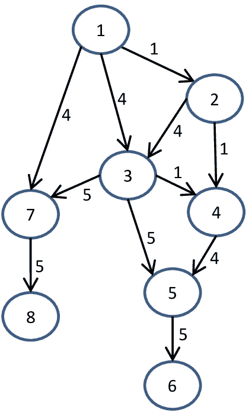

Directed Acyclic Graph (DAG) highlighting connections and pathways in a network of variables

对于这个例子，我使用了 NetworkX 库来展示如何创建图形网络。NetworkX 是一个 Python 包，用于创建、操作和研究复杂网络的结构、动态和功能。其中，它提供了图、有向图和多重图的数据结构，以及经典图、随机图和综合网络的生成器。我个人发现可能性实际上是无限的，能够相对容易地模拟因素之间复杂的相互作用。

 [## NetworkX - NetworkX 文档

### NetworkX 是一个 Python 包，用于创建、操作和研究…的结构、动力学和功能

networkx.org](https://networkx.org/) 

引入网络图的最佳方式是从**节点**开始。节点本身实际上是没有意义的，除非你赋予它们意义。可以是任何东西，从数值到图像或文本文件。这里，您可以看到一个简单的代码片段来创建网络图，分别包含一个、三个和五个节点。

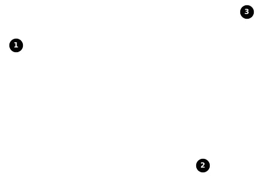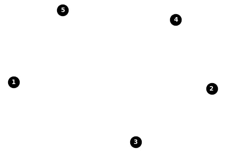

One node, three nodes, five nodes.

一旦你开始添加**边**，节点和节点开始的位置将变得更加有趣，这些边是节点之间的连接点。

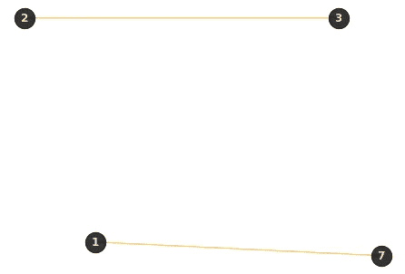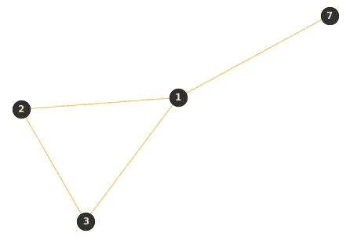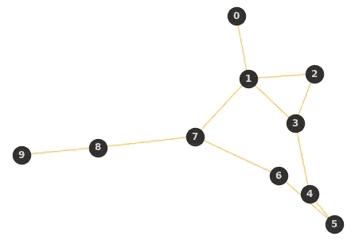

Creation of edges for various nodes. Without the edges, there is no connection between the nodes. In this graph, the positioning of the nodes themselves is not that important, but can certainly made important.

对于那些没有花时间从零开始构建网络图的人来说，这在某些时候似乎是不可能的，有大量已知的网络图可以用来模拟您想要研究的情况。

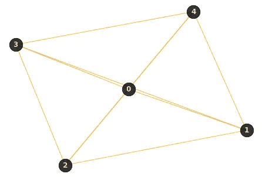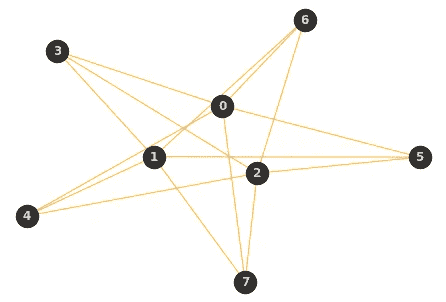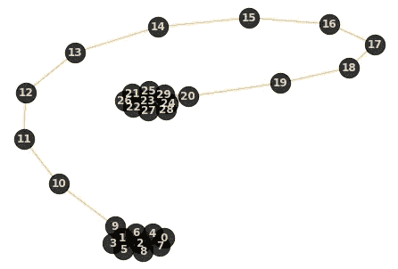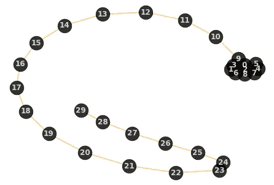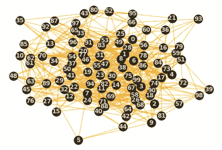

Various types of graphs made possible via the build- in Network Graphs generator.

现在你已经学习了如何创建网络图的速成课程，是时候将这些奇妙的工具与流行病学和病毒的世界联系起来了。为这些模型提供信息的引擎是**接触矩阵**，它描述了不同类别人群的感染概率。最重要的是经历各种感染周期的速度。最著名的模拟病毒进程的流行病学工具是分室模型**SIR-模型**——“易感的”、“感染的”、“被移除的”。这个模型可以扩充成一个 **SEIR 模型**——“易受感染的”、“暴露的”、“受感染的”、“移除的”。在这里，“移除”是“恢复”或“死亡”的同义词。当然，该型号也可以改变为具有相同车厢的 **SI** 或 **SIS** 型号。SIS 模型是病毒流行状态的同义词——那些被感染的人再次变得易感。

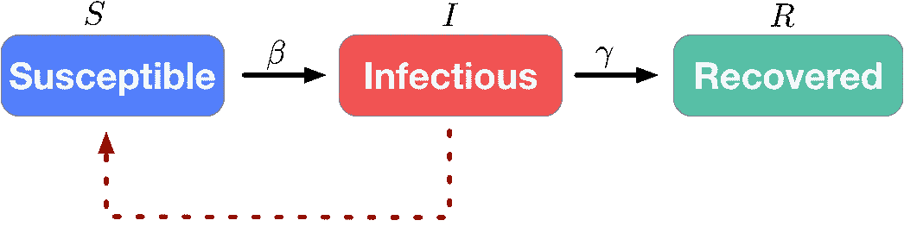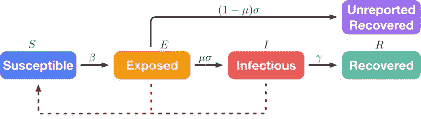

A SIR and SEIR model explained in mechanistic terms. The parameters between the compartments mimic the rate or probability of going through each stage.

我希望网络图和分室模型之间的联系越来越清晰。如果不是，想象每个节点(或人类)可以有三个(先生)或四个(SEIR)不同的阶段，他们必须通过。网络图可以模拟接触矩阵。在这里，您可以看到一张包含 1000 个节点的随机几何网络图，其中节点通过一条边连接，如果它们的距离最多为 0.1。

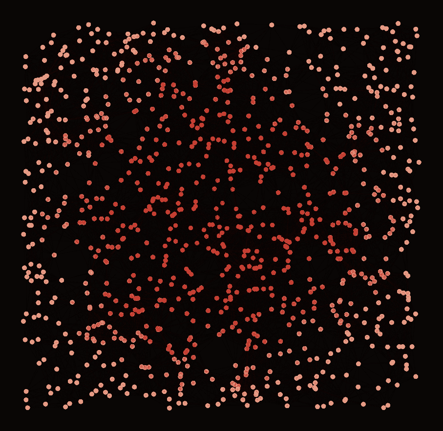

A random geometric graph on 1000 nodes where nodes are joined by an edge if their distance is at most 0.1 The colors are strongest near the center point. This is for graphical purposes only. Several ‘center points’ can be created. In essence, this graph follows the structure through which an epidemiological model can flow.

现在我们有了网络图，我们需要将它与我们希望整合的流行病学模型的时间/概率性质结合起来。边的确定是网络图的一个非常重要的驱动因素，因为它决定了有多少节点被连接。结合图形的几何性质，这将确定在模拟人类交互的图形中创建的聚类的数量。这里使用的示例图在设置上非常简单，可以进行大量定制。

为了添加 SIR-或 SEIR-模型，我们必须导入 **NDlib** 或**网络扩散库**来描述、模拟和研究复杂网络上的扩散过程。在这里，扩散清楚地暗示了流行病学模型的时间性质——每个人都必须经过每个区间。为了模拟这种情况，模型在后台使用离散时间步长-在每个时间步长，根据进入间隔的概率计算每个间隔中节点的比例。

 [## 概述- NDlib 5.1.0 文档

### 编辑描述

ndlib.readthedocs.io](https://ndlib.readthedocs.io/en/latest/overview.html) 

下面，你将找到一段简单的代码，使用 NetworkX 和 NDlib 库在鄂尔多斯 Renyi 网络图上模拟 SEIR 模型。模型的行为取决于三个主要部分:

1.  网络图。
2.  选择的流行病学模型。
3.  这些参数类似于穿过模型的每个隔室的概率。

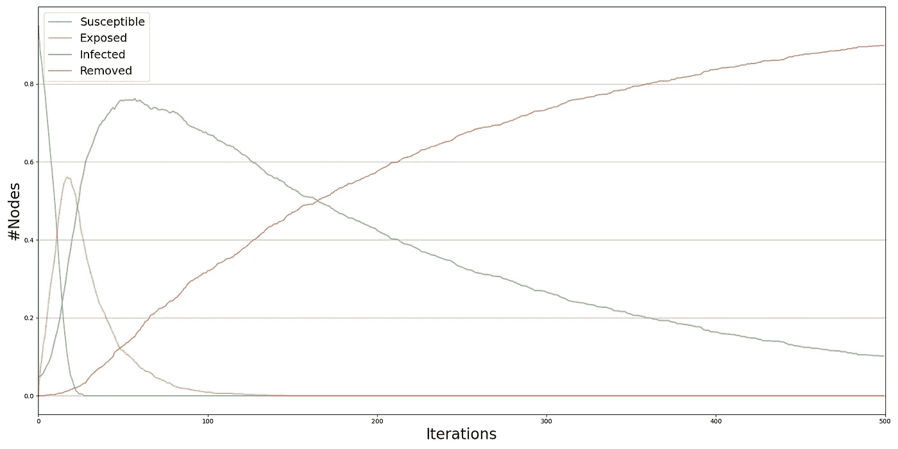

SEIR model showing the proportion of nodes in each compartment over time. Considering this model has an end-stage — removed— the number of infected nodes eventually goes to almost zero. In the SEIR model, the rate of exposure determines the relationship between the ‘susceptible’ and ‘infected’ compartment.

最终，选择似乎是无穷无尽的。下面你会发现一段代码将几个流行病学模型附加到随机几何图形上。使用图表、模型和参数，我试图模拟一个有疫苗可用(即高清除率)且病毒达到流行状态(即持续感染概率)的人群。

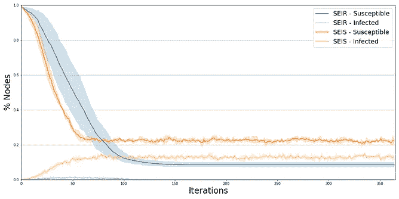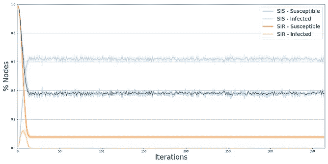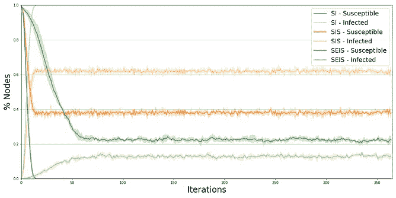

SI, SIS, SEIS, and SEIR models simulating a population in which a virus has reached an endemic state and vaccines are available. As with any model, the parameters used here do not mimic reality as they are far too simple and far too general. Still, I believe they do highlight the power of the libraries.

简而言之，这篇文章提供了流行病学网络图的简短介绍。正如我所说的，这里使用的例子仅仅触及了结合 NetworkX 和 NDlib 库所能做的事情的表面。例如，人们可以构建动态网络(T1)，其中节点和边会随着时间推移而移动，或者部署阈值模型(T3)，其中图中的连接或模型中的变化取决于节点的特征。

可能性是无限的。玩得开心！

 [## Mlearning.ai 提交建议

### 如何成为 Mlearning.ai 上的作家

medium.com](/mlearning-ai/mlearning-ai-submission-suggestions-b51e2b130bfb)