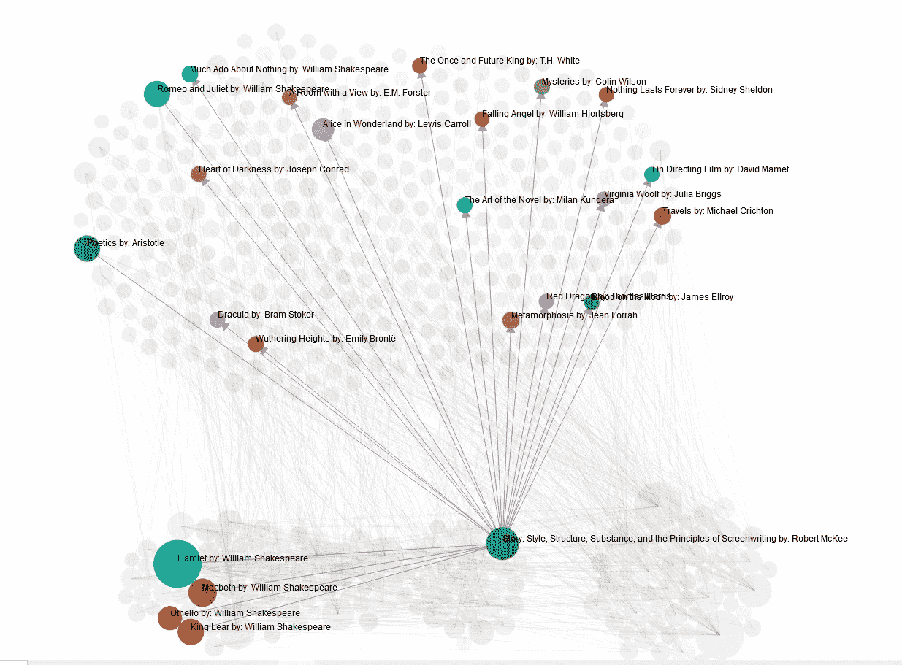
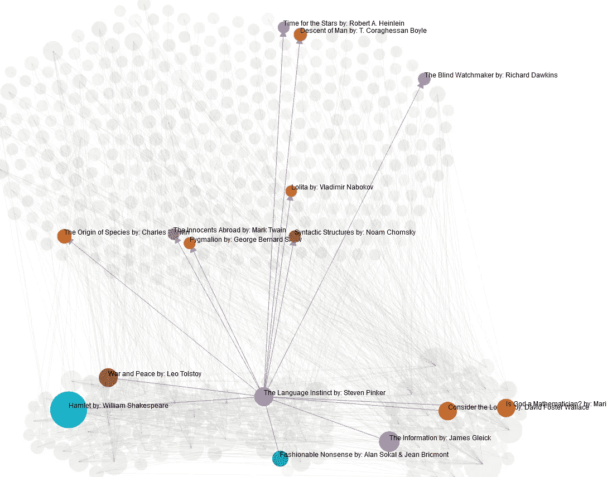
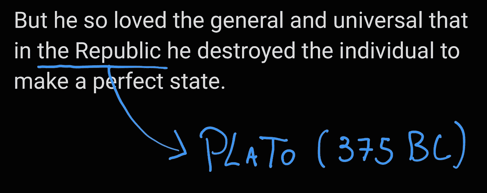

# 使用 RoBERTa 和 D3.js 绘制图书之间的引用

> 原文：<https://medium.com/mlearning-ai/graphing-citations-between-books-using-roberta-and-d3-js-1747360805ca?source=collection_archive---------3----------------------->



> 你有没有开始思考你读过的所有书籍之间的所有关系？如果你最喜欢的书的作者互相阅读过，或者甚至他们在他们的时代之前阅读过相同的人？基本上每个人都读过哪些书？

**在这篇文章中，我将分享我的宠物项目——训练一个微调版的 RoBERTa 来检测我的书籍之间自由形式的引用(即不仅仅是学术引用),并生成一个包含数百本书及其关系的漂亮的大有向图。我所有的 Kindle 图书馆和更多！**

# 你可以查看我的 Kindle 图书馆制作的引用图表，并从 Goodreads [这里](https://thiagolira.blot.im/_projects/book_graph/main.html)增加了数百本书！(如果可能的话，在桌面上玩这个图，因为它在手机上很烂)。

我将在这篇文章中讲述的大部分代码都可以在这里找到！



D3.js force graph very elegantly displays the relations between my books.

# 自由形式的引用？

那么，我把“自由形式”的引用称为什么呢？每当作者提到另一本书时。例如，来自尼尔·盖曼的*来自廉价座位的观点*:

> *“孩子们听着它们，享受着它们，但是孩子们不是主要的观众，就像他们不是《贝奥武夫》或《奥德赛》的预定观众一样。”*

为什么引用“自由形式”？因为旧书甚至一些新书都没有书目/学术引文。根据书的类型，作者不需要在书的末尾用精确的书目信息构建一个庞大的引用列表。有了深度学习和足够的数据，我们很可能会建立一个对两种引用都有效的模型，并完成它(最终都是文本/数据)。



Quote by Will Durant — **Story of Western Philosophy**

# 我为什么要这么做？

我喜欢阅读关于书籍的书籍，例如威尔·杜兰特的《西方哲学史》和伊塔洛·卡尔维诺的《为什么要读经典》,我总是很好奇，想知道那些对我最喜欢的作家的生活产生影响的书籍(在更大的范围内，甚至是整个社会)。

然后，我的想法是让**成为**的某种东西，它可以接收一些非小说类书籍的文本作为输入，并向我输出里面引用的所有书籍。理想情况下,*为什么要读经典作品*的输出应该是[《奥德赛》、【老实人】、【100 年孤独】，…]以及*西方哲学史* [“基本上是希腊、法国或德国人(或女孩)写的所有东西，他们有太多的时间”]。

该过程将是:

1.  从我所有的书中获取文本。
2.  从我的所有书籍、作者、原始出版日期等中获取元数据。(*)
3.  搜索我所有的每本书的引用。
4.  建立一个 rad looking 图表，用按出版日期分类的书籍说明所有这些引用。
5.  额外:从我的书中搜索不属于我的书的引用！(**)(***)

(*)这是一个有点复杂的过程。很难获得最初的出版日期，因为这有时是历史性的/不确定的，并且有几十个(甚至几百个！)的版本。所以我决定将我所有的书导入 Calibre，然后使用一个 [Goodreads 插件](https://www.mobileread.com/forums/showthread.php?t=130638)来获取每本书的原始出版日期！有趣的事实:用代码支持非常非常遥远的日期(比如公元前日期)纯粹是痛苦和折磨。

(**)我是通过使用从 Goodreads 收集的数据集来做到这一点的，该数据集包含来自成千上万本新旧书籍的元数据。出于我的目的，我只是过滤了数据集，删除了没有评级/评论的书籍以及会污染分析并且可能不会被引用多次的现代奇幻/小说书籍(这并不意味着我不喜欢奇幻书籍，我喜欢奇幻)。

(***) **不幸的是，这些额外的引用只是单向的。我没有这些书中的文本来依次检查他们引用了哪些书。所以…这部分图表只能是我所拥有的书中引用的*目标*！**

# 天真的解决方案(以及为什么这比看起来更复杂)

一个简单的解决办法是用一堆书名建立一个列表，然后在你拥有的每本书的正文中搜索每个标题。这实际上对大多数书来说都很有效(关于如何有效地做到这一点的技术考虑)。我们开始在较小的书名上遇到问题，比如《君主论》或《理想国》，因为这串文字很可能出现在一本与马基雅维利的作品完全没有关系的书上。请参见以下示例:

```
"The Prince reads Marcus Aurelius' Meditations to relax." "Marcus Aurelius reads The Prince to relax."
```

我们不能总是期望这种形式的引用会，嗯，**引用**或者用斜体或者其他什么。那么，如何检测字符串“The Prince”是后一个句子的引用，而不是前一个句子的引用呢？有很多方法可以做到这一点，经过一段时间的迭代，我决定采用一种叫做 NER 的 NLP 技术，或者叫做命名实体识别。

# 为任务创建 NER 数据集

NER 模型应该消耗一些文本，然后返回每个单词的标签的位置。

该模型必须在一些特定的标签集上训练，使用一些预先做了注释的文本。对我来说，我们只有一个标签，*【BOOK】*。相关信息是该标记文本开始和结束的字符串的索引。NER 模型的工作原理是每个单词都有一个标签(‘无标签’也是一个标签！)并且顺序地为文本上的每个单词分配由训练数据上的每个标签表示的概率，例如[“王子”:(0.8，“书”，0.2，“无标签”)，“马库斯·奥勒留”:(0.1，“书”，0.9，“无标签”)]。

当然，我必须手工注释整个数据集(一千个例子！)的标签，这样模型可以通过上下文了解什么是*什么是*，什么是*不是*一本书。当你看到它工作的时候，真的很神奇。这是我的数据集中的一些例子。

为了创建我的数据集，我在所有的书上搜索了一些模糊的书名，如《尤利西斯》(奥德赛中的人物或詹姆斯·乔伊斯的书？)、《君主论》(这本书是出自马基雅维利还是只是随便引用了一些君主论？)和《理想国》(柏拉图的书或者……你懂的意思)。然后，我用 [Doccano](https://github.com/doccano/doccano) 手动注释我书中的每一段，以判断它们是否是引文。

# 关于扩充数据集

在一些让我的模型与新的验证数据很好地工作的失败尝试之后，我开始通过交换书名和创建新的训练示例来扩充我的训练数据集。对于每个训练示例，代码可能会将某个示例上的引用与我的数据集中的另一个随机书名进行交换，并将其存储为新的训练示例(同时仍保留数据集中的旧示例)。

这样做极大地提高了我的模型在验证数据上的性能。在这次扩充之前，如果在我的数据集中有很多关于这本书的例子，我的模型只对标签书过度拟合。这可能是因为(对于深度学习标准)我的大约 1000 个注释数据集非常小。

# 微调罗伯塔

Huggingface 的变形金刚库让下载一个 SOTA 模型变得轻而易举，然后在特定任务上对其进行微调。你甚至可以加载一个带有新层的模型，这些新层是专门为新任务进行微调的，对于这个项目，对于一个 NER 任务，transformers 库提供了一个简单的**RobertaForTokenClassification**类。

最困难的部分是将我的注释从 Doccano 的格式转换成 Pytorch 能够理解的格式，为此我彻底复制了这里的代码。当然，也要尝试超参数，直到训练产生好的结果。这一部分有很多事情要做，所以我将把我的笔记本链接起来，对罗伯塔[进行微调。](https://github.com/ThiagoLira/BookGraph/blob/main/FineTuneRobertaNER.ipynb)

最后，这里有一些测试字符串和微调后我的模型的输出！看看这个漂亮的引文被自动检测到了。

# 把这些粘在一起

到目前为止，我已经写了关于收集数据集，注释和预处理它，最后，微调 RoBERTa。

现在，如何处理我所有书中的文本。我写的“算法”是这样的:

1.  将所有书籍作为字符串列表加载到内存中。
2.  对于每一行，使用正则表达式(+)来检测任何书名。
3.  如果检测到的标题太短(例如少于 3 个单词)(*)，则通过 RoBERTa 运行整个行，并查看 NER 模型是否将标题“验证”为书名。
4.  对于每个匹配，提取它的元数据，在图上创建一个新的节点(如果需要),并在我们当前正在阅读的书和被引用的书之间添加一个链接。
5.  将此图转换为 D3.js 格式，为每本书添加一些元数据并保存。

(+)我最终使用了一个巨大的预编译正则表达式 r“Book1 | Book2…”来寻找匹配，因为这是我找到的最快的方法。更多关于这个的 [StackOverflow 回答](https://stackoverflow.com/questions/42742810/speed-up-millions-of-regex-replacements-in-python-3)。

(*)我选择这种启发式方法，因为我假设如果像“巴斯克维尔的猎犬”或“阅读监狱的歌谣”这样的较长标题出现在某本书的文本中，它被引用的概率非常高，所以我不需要浪费 CPU 时钟来确认 RoBERTa。

# 如何使用 RoBERTa 用不到 8 个小时的时间处理所有书籍

通过使用多重处理！我的图书处理函数接收一本书的行列表作为参数，它是元数据，是我解析文本的模型和标记器。通过创建一个工人池，我们可以一次给每个工人一本书来异步处理，当一个工人完成一本书时，它开始处理列表中的另一本书。只是不要做得太多，因为每个 RoBERTa 需要大约 1GB 的内存！

# 把一切都画出来！

该图是在代码的 python 端用 [networkx](https://networkx.org/) 构建的，这样我就可以绘制它并运行 PageRank 算法，以查看哪些书籍在我的数据上是最“链接”的。原来是王子！

```
[(‘The Prince’, 0.01081877301303925),
 (‘Hamlet’, 0.01061937268317937),
 (‘The Divine Comedy’, 0.007740738803800382),
 (‘The Art of War’, 0.006072207782683749),
 (‘Romeo and Juliet’, 0.0051880591489493295),
 (‘Phaedrus’, 0.004890520471208026),
 (‘Poetics’, 0.003865239838704173),
 (‘Alice in Wonderland’, 0.0037039373900383415)]
```

我们只需要一些简单的代码来创建一个包含所有这些链接和节点的 JSON，并将其加载到 D3.js 上。需要注意的一点是，我们可以在每个节点上保存元数据，以便稍后在代码的 javascript 端使用。

# 同样，你可以在这里看到最终结果！

# 一些结束语

只是一些可能对处理类似问题的人有用的注释:

1.  我从来没有通过玩弄 RoBERTa 的微调超参数来大幅提高我的性能。**在你选择了收敛**的东西后，仍然不满意，我敢打赌，通过获得更多/更好的数据，或者像我一样增加数据，你将在性能上获得更多实质性的收益。
2.  对我来说不明显的是，当你使用多处理时，如果你想让你的代码尽可能快地运行，你*应该*接近 100%的 CPU 使用率(现在回想起来，这听起来有点明显)。如果不是接近 100%,这可能意味着您的代码正在进行 I/O 或者一些进程被阻塞(或者死锁！)并且不能继续计算，或者你可以产生更多的进程来加速一切。