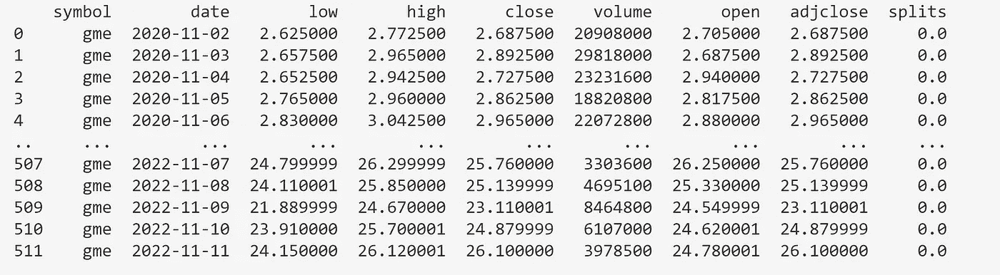

# 用蜡烛图在 Python 中绘制股票价格

> 原文：<https://medium.com/mlearning-ai/graphing-stock-price-data-5f0b4d62f833?source=collection_archive---------6----------------------->


这是一篇关于使用 Python 和 Plotly 创建带有金融股票数据的蜡烛图的快速文章。

我们将使用几个可以和 pip 一起安装的包。

Yahooquery 是一个非官方雅虎财经 API 端点的 python 接口。

plotly.graph_objects 包含 plotly 图形的构建块。

我们如下导入它们。

```
from yahooquery                   import Ticker
from datetime                     import date
import plotly.graph_objects       as go
```

股票数据可以通过下面的查询得到。

```
Tick_nm = 'gme'
df = Ticker(Tick_nm).history(interval="1d", start=("2020-11-01"), end=(date.today().strftime("%Y-%m-%d"))).reset_index()
df
```

在这个例子中,“meme”股票 Gamestop 的数据被放入一个数据帧中。

要查看其他股票，可以将 Tick_nm 变量更改为适当的股票代号。

股票代号或股票代码是一种缩写，用于唯一标识特定股票市场上特定股票的公开交易股票。

这创建了一个从 2020 年 11 月到今天的 GameStop(gme)股票价格的数据框架。



我们将使用 Plotly 来创建一个烛台股票价格图与以下数据点。

开盘价——指开盘价，这是在交易日交易所开盘时证券首次交易的价格。

高——指股票在交易日中的最高交易价格。

低——指股票在交易日中的最低交易价格

收盘——指股票在常规交易时段的最后交易价格。

```
CandleStick = [go.Candlestick(x=df['date'],
    open=df['open'],
    high=df['high'],
    low=df['low'],
    close=df['close'],
    name='Stock Price')]

Layout = go.Layout(title =Tick_nm.upper() + " Share Price",
                    title_x=0.5,
                    template='plotly_dark',
                    yaxis2=dict(title='Share Price'.title(), side='right', overlaying='y'))

Share_Figure = go.Figure(data = CandleStick, layout = Layout)
Share_Figure.update_layout( plot_bgcolor='#32383E', paper_bgcolor ='#32383E',
                            yaxis_tickprefix = '$',yaxis_tickformat = ',')

Share_Figure.show()
```

生成下图。我们可以想象华尔街 Bets reddit 论坛推动的股价飙升。

这将提供一个快速简单的方法来显示任何股票的价格。

[](/mlearning-ai/mlearning-ai-submission-suggestions-b51e2b130bfb) [## Mlearning.ai 提交建议

### 如何成为 Mlearning.ai 上的作家

medium.com](/mlearning-ai/mlearning-ai-submission-suggestions-b51e2b130bfb)