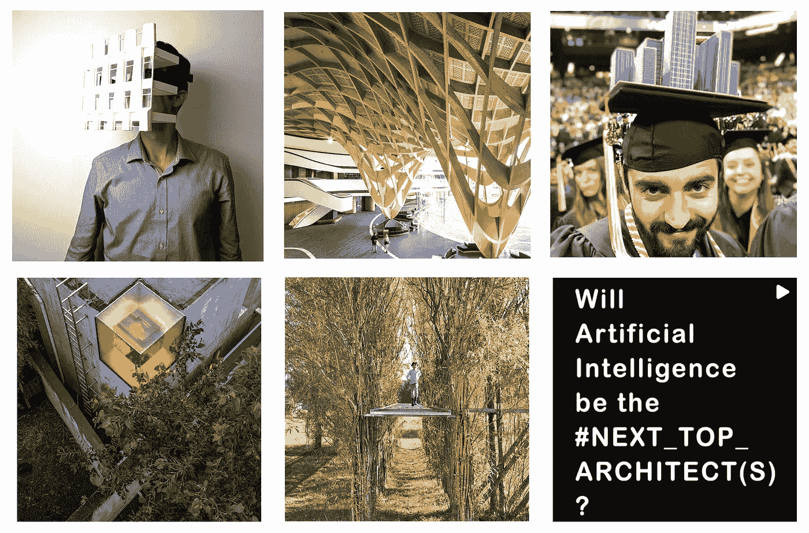

# 建筑中的绿色洗涤

> 原文：<https://medium.com/mlearning-ai/greenwashing-in-architecture-4a18055cf5ba?source=collection_archive---------1----------------------->

## [机器学习](/mlearning-ai/what-is-machine-learning-2ec9cacb986c)解决方案

## 建筑师要对 38%的二氧化碳排放负责

[https://www.instagram.com/next_top_architects/](https://www.instagram.com/next_top_architects/)

好了，该忏悔了。我并不完美。我知道，如果你正在阅读这篇文章，你要么是一名建筑师，要么正在上[建筑课](/mlearning-ai/machine-learning-change-the-architecture-ee37e12287f0)，在这种情况下，你的教授可能会给你的可持续发展论文打分。所以请原谅我，同时…