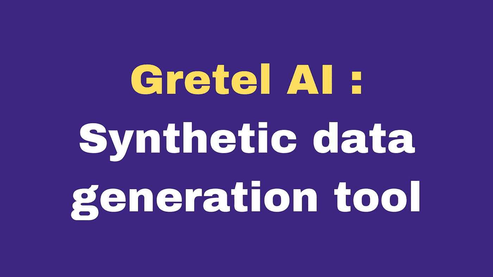

# Gretel AI:合成数据生成工具

> 原文：<https://medium.com/mlearning-ai/gretel-ai-synthetic-data-generation-tool-2c91446ece87?source=collection_archive---------9----------------------->

Gretel 的 API 使匿名化和安全的合成数据生成变得简单，因此您可以更快地开发并保护隐私。

 [## Gretel.ai -合成数据的开发者栈

### 创建与现有数据一样好，甚至更好的合成数据。或者没有。在…上创建和共享数据

gretel.ai](https://gretel.ai/) 

**格莱特·艾能做什么:**

1.  **合成**:生成无限合成数据集
2.  **转换**:对敏感数据进行隐私保护转换。
3.  **分类**:通过 NLP 检测识别个人身份信息(PII)。

**(个人身份信息(PII)是指可用于识别用户或客户身份的任何数据。)**

使用合成数据生成的示例

 [## 演练:从任何数据帧或 CSV 创建合成数据

### 今天，我们将使用 Gretel 的 API 从 CSV 或 Pandas 数据帧创建合成数据。让我们…

gretel.ai](https://gretel.ai/blog/walkthrough-create-synthetic-data-from-a-dataframe-or-csv) 

**合成数据的好处**

1.  降低成本
2.  维护隐私

3.数据以去除重复数据和错误记录的形式存在。

4.节省时间

然而，有人提出了一些关切。根据在医疗保健中使用合成数据的监督机器学习的可靠性:为数据共享研究保护隐私的模型，它显示，总共 92%的在合成数据上训练的模型的准确性低于在真实数据上训练的模型。

参考资料:

 [## CCPA、PII 和 NLP

### CCPA 和隐私的 NLP

towardsdatascience.com](https://towardsdatascience.com/ccpa-pii-and-nlp-b4165a92dc6d)  [## 医疗保健中使用合成数据的监督机器学习的可靠性

### 在医疗保健中利用合成数据还处于早期阶段。合成数据可以释放潜在的…

www.ncbi.nlm.nih.gov](https://www.ncbi.nlm.nih.gov/pmc/articles/PMC7400044/#:~:text=A%20total%20of%2092%25%20of,%25%29%20to%200.072%20%287%25%29.)  [## Mlearning.ai 提交建议

### 如何成为 Mlearning.ai 上的作家

medium.com](/mlearning-ai/mlearning-ai-submission-suggestions-b51e2b130bfb)