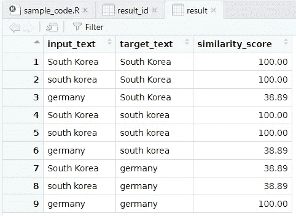
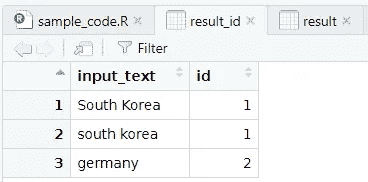

# 在 R 中使用 DBSCAN 对相似的短文本进行分组并分配 ID

> 原文：<https://medium.com/mlearning-ai/group-similar-short-text-and-assign-id-using-dbscan-f0c6e9856b73?source=collection_archive---------2----------------------->

Picture by [Sebastian Herrmann](https://unsplash.com/@officestock) from [Unsplash](https://unsplash.com/photos/jzTQVxCyKYs)

“我们有超过 20 年的交易数据”我听到他这样说。“它有数百万条交易记录”

“嗯，这是个好消息。”我兴高采烈。这是我开发数据科学项目的头几周，该项目旨在整合各种数据、客户的数字行为及其交易数据。

“我们将对此进行调查，并在完成数据审核后向您报告最新情况”。

几天后，我们带着发现回来了。“我们已经检查了数据。然而，它似乎缺少了一个关于客户的基本列。它没有客户 ID，只有客户姓名和他们购买的产品”。

"你能检查一下他们是否有国籍证明吗？"他们问

“专栏中没有任何我们可以用来识别客户是否是同一个人的信息。“没有电子邮件、电话号码或身份证，”我们解释说，“如果我们无法识别一个客户是同一个人，我们就无法模拟他们的行为，如购买频率、他们下次购买的时间以及其他交易行为。”

“我们知道，当人们填写姓名时，可能会出现一些拼写错误或不同的拼写。我认为我们现在可以开发的是测量姓名之间的相似性，并为具有一定相似度的每个姓名分配 ID”。

“嗯。那我们开始吧”。

# 测量和标准化文本相似性

作为数据科学家，我们会遇到各种各样与数据相关的问题。在上面的例子中，我们得到了非常脏的数据，其中企业所有者拥有没有客户 ID 的遗留数据。问题是，名字可能会拼错。

幸运的是，有算法可以测量两个文本之间的相似性。我们这里用的是 Levenshtein 距离。

Levenshtein 距离度量将一个单词转换为另一个单词所需的最小单字符编辑次数。更多关于 Levenshtein distance 的信息可以通过这个[链接](https://www.cuelogic.com/blog/the-levenshtein-algorithm)找到。

在 R 中，我们可以使用包 *stringr* 和函数 *adist。*参见下面的示例代码:

如果我们想比较文本“韩国”和“德国”，我们可以看到上面的结果。我们可以得出两个结论。

**第一个**。该算法区分大小写，如“韩国”和“韩国”之间的距离所示

**第二个**。结果取决于文本的数量。由于“韩国”和“德国”差别很大，所以距离是 11。文本数量越多，距离越高。没有办法将结果标准化，例如在 0-100 之间，以方便用户做出决定(**显然，我们更容易说相似度是 80%，而不是相似度是 2** )。

我们将在代码中添加两种处理来缓解这两种约束。首先，将文本改为小写，并删除不必要的字符。第二步，将距离转换为 0-100 之间的数字。我们使用这个公式来测量它:(1 —距离/最大可能距离)* 100

请参见下面的示例:

我们现在能够测量文本之间的距离和标准化的分数。事实是，当我们收到非常糟糕的数据，比如第一个故事中的问题，这些数据会以数百、数千甚至数十万行的形式出现。

我们首先要做的是如何让解决方案规模化，随时可用。我们需要把数据转换成表格。缩放溶液的顺序如下:

1.  使用 *expand.grid* 将文本扩展到表格中
2.  小写并删除不必要的字符
3.  测量距离并归一化分数

下面的代码就是这么做的！

R function to measure and normalise distance

对上述功能使用相同输入的结果

Result from R

# 使用 DBSCAN 分配 ID

最后一步是为相似的文本分配 ID。在上面的例子中，我们希望“韩国”和“韩国”有相同的 ID，而“德国”将有自己的 ID。为此，我们将使用名为 DBSCAN 的聚类算法。更多关于 DBSCAN 的信息可以在这里找到[。](https://towardsdatascience.com/dbscan-clustering-explained-97556a2ad556)

总体代码可以在下面的函数中找到。代码采用一些默认参数。例如，被认为是相似文本的最低分数。在这种情况下，最低分是 80。其他默认参数是将用于 DBSCAN 算法的距离 0.15。我们还有一个选项来考虑是否包括“空格”字符，以及如果我们想在文本相似性计算中忽略大小写(小写或大写)的选项。

好消息是，我们可以在调用函数时改变这些参数值。

R function to measure distance and assign D

让我们看看当我们使用相同的输入“韩国”、“韩国”和“德国”时的结果。

Result from R Studio

瞧。它工作了。

# 结论

在这篇文章中，我向你展示了如何测量文本之间的距离，归一化分数，然后分配 ID。如果我们有没有 ID 的脏文本数据，这些数据有许多行，并且我们想确定哪些文本属于同一个组，那么这个解决方案将非常方便。

幸运的是，我已经为此创建了一个包。请检查我的 GitHub [包 similaRText](https://github.com/dessyamirudin/similaRText)

# 来源

[https://www.cuelogic.com/blog/the-levenshtein-algorithm](https://www.cuelogic.com/blog/the-levenshtein-algorithm)

 [## DBSCAN 集群—解释

### 详细的理论解释和 scikit-learn 实现

towardsdatascience.com](https://towardsdatascience.com/dbscan-clustering-explained-97556a2ad556)  [## Mlearning.ai 提交建议

### 如何成为 Mlearning.ai 上的作家

medium.com](/mlearning-ai/mlearning-ai-submission-suggestions-b51e2b130bfb)