# 反刍动物的生长模型

> 原文：<https://medium.com/mlearning-ai/growth-modeling-in-ruminants-fbeb08fa58ab?source=collection_archive---------7----------------------->

## 在 R 中使用协方差矩阵

在这篇文章中，我将向你展示我是如何使用商业数据集上的统计模型来模拟反刍动物的生长的。因此，我不能分享数据集和数据已经有点增加，但我会尽量使我的工作流程尽可能透明。如果你了解我，你就会知道我喜欢混合模型，所以要利用我在这里使用的代码，你只需要有一个纵向数据集。

让我们开始吧。

```
rm(list = ls())
#### LIBRARIES ####
library(foreign)
library(lme4)
library(ggplot2)
library(rms)
library(plyr)
library(Hmisc)
library(reshape2)
library(boot)
library(sjPlot)
library(sjstats)
library(sjmisc)
library(AICcmodavg)
require(parallel) 
library(gridExtra)
library(coefplot) 
library(coda)     
library(aods3)     
library(plotMCMC) 
library(bbmle)     
library(nlme)
library(merTools)
library(RLRsim) 
library(pbkrtest)
library(multcomp)
library(lsmeans)
library(multcompView)
library(lattice)
library(splines)
library(lmtest)
library(car)
library(corrplot)
library(PerformanceAnalytics)
library(eqs2lavaan)Growth_all <- read.csv("Growth_all.csv")
str(Growth_all)
Growth_all$Treat<-as.factor(Growth_all$Treat)
Growth_wide<-reshape(Growth_all, 
                     idvar = c("Pen", "Treat","Block"), 
                     timevar = "Week", 
                     direction = "wide")
#### Exploratory summaries ####
# Not the same baseline growth
Growth_melt<-ddply(Growth_all, c("Week", "Treat"), summarise,
      N = sum(!is.na(BW)),
      Mis = sum(is.na(BW)),
      Mean = round(mean(BW, na.rm=T),3),
      Median = round(median(BW, na.rm=T),3),
      SD = round(sd(BW, na.rm=T),3),
      SE = round(sd(BW, na.rm=T) / sqrt(N),5),
      LCI = round(Mean - (2*SE),3), 
      HCI = round(Mean + (2*SE),3))
```

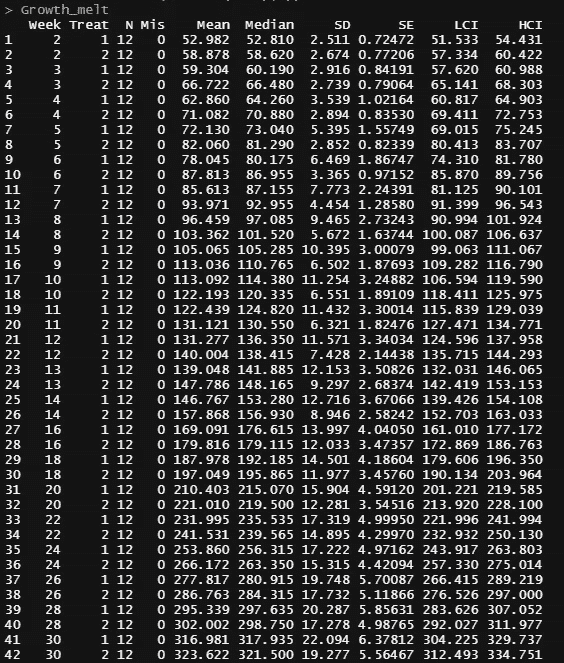

当您在纵向数据集中寻找治疗差异时，这也意味着您正在寻找一种方法来处理该数据集中的协方差矩阵。纵向数据是嵌套数据，嵌套数据具有互相关性。这些互相关减少了研究的有效样本量，因此需要建模。不考虑它们意味着你会低估数据中的标准误差，发现不正确的 p 值([，这与对 p 值的严厉批评是分开的](/mlearning-ai/inference-estimates-p-values-and-confidence-limits-a-frequentist-approach-acdd45d94bd5)

让我们来看看可以从原始数据本身推导出的相关和协方差矩阵。

```
cormatrix<-as.data.frame(cor(Growth_wide[,4:25])) # lot of autocorrelation
covmatrix<-as.data.frame(cov(Growth_wide[,4:25])) # Covariance not homogenous --> heterogeneity of variance 
cor<- rcorr(as.matrix(Growth_wide[,4:25]))
corrplot(cor$r)
chart.Correlation(Growth_wide[,4:25], histogram=TRUE, pch=19)
plotCov(cov(Growth_wide[,4:25]))
```

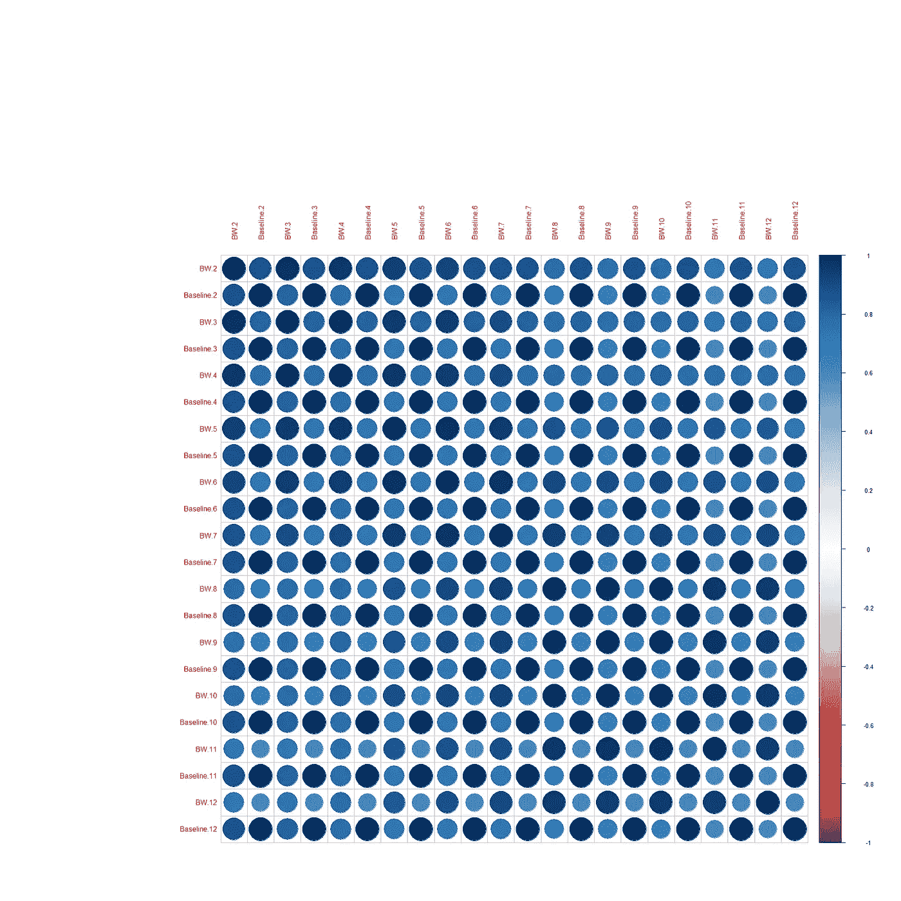

All positive correlations.

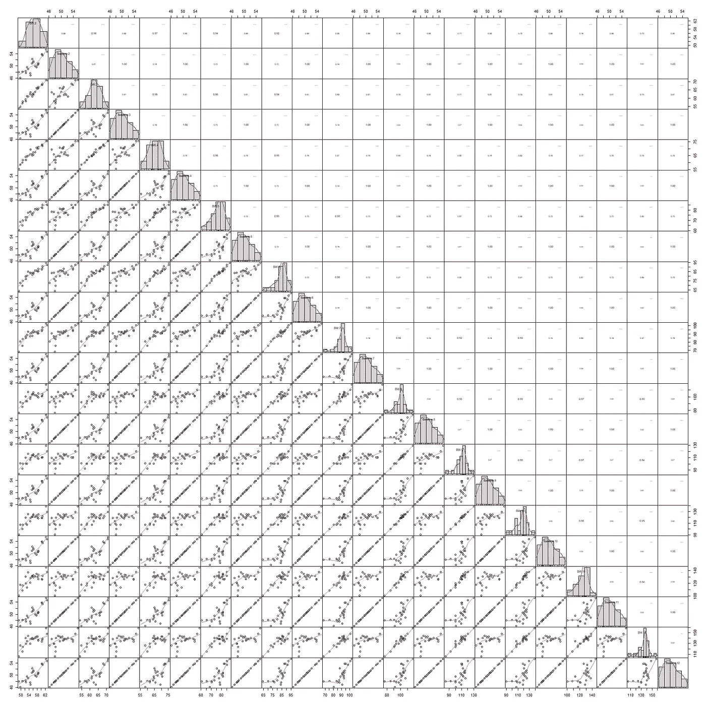

A lot of positive correlations.

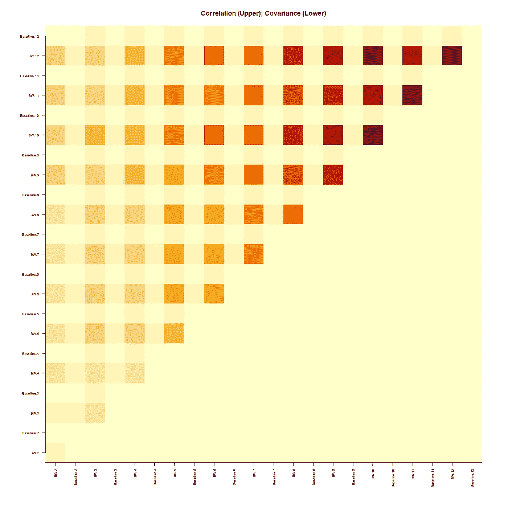

And the same here.

现在，当你有一个包含纵向数据的数据集时，你可以期待一个巨大的协方差/相关矩阵。重量取决于所选择的测量时间，因此也取决于观测时间之间的距离。

让我们用图表表示这些数据。

```
theme_set(theme_bw())
myx<-scale_x_continuous(breaks=c(1,2,3,4,5,6,7,8,9,10,11,12,13,14,16,18,20,22,24,26,28,30))
myy<-scale_y_continuous(breaks = seq(0, 400, by = 50))
ggplot(Growth_all, aes(x=Week, y=BW, group=Pen, colour=Treat))+
  myx+
  myy+
  geom_line() +
  stat_summary(aes(group=Treat), fun.y=mean, geom="point", size=3.5)+
  stat_summary(aes(group=Treat), fun.y=mean, geom="line", lwd=1.5)
## Growth boxplot
theme_set(theme_bw())
myx<-scale_x_continuous(breaks=c(1,2,3,4,5,6,7,8,9,10,11,12,13,14,16,18,20,22,24,26,28,30))
myy<-scale_y_continuous(breaks = seq(0, 400, by = 50))
ggplot(Growth_all, aes(x=Week, y=BW, group=Week, colour=Treat))+
  myx+
  myy+
  geom_boxplot()
## Growth boxplot - Treatment
theme_set(theme_bw())
myx<-scale_x_continuous(breaks=c(1,2,3,4,5,6,7,8,9,10,11,12,13,14,16,18,20,22,24,26,28,30))
myy<-scale_y_continuous(breaks = seq(0, 400, by = 50))
ggplot(Growth_melt, aes(x=Week, y=Mean, colour=Treat))+
  myx+
  myy+
  geom_line(lwd=1)+
  geom_ribbon(aes(ymin=LCI, ymax=HCI, fill=Treat), alpha=0.1)
## Growth lineplot
sjp.poly(Growth_all$BW, Growth_all$Week, 1)
sjp.poly(Growth_all$BW, Growth_all$Week, 2)
sjp.poly(Growth_all$BW, Growth_all$Week, 3)
```

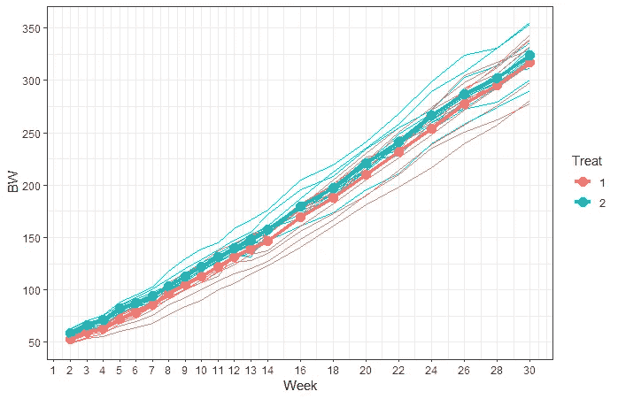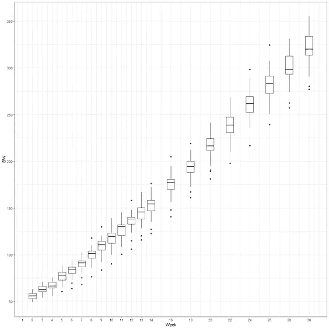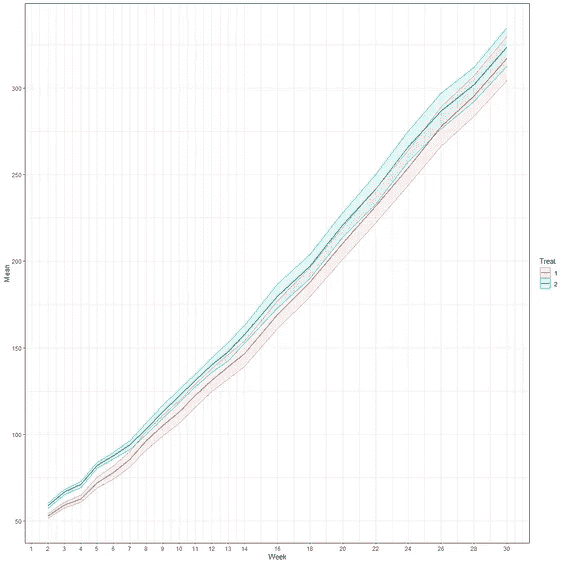

As time passes on the variance increases which is a function of the weight increase.

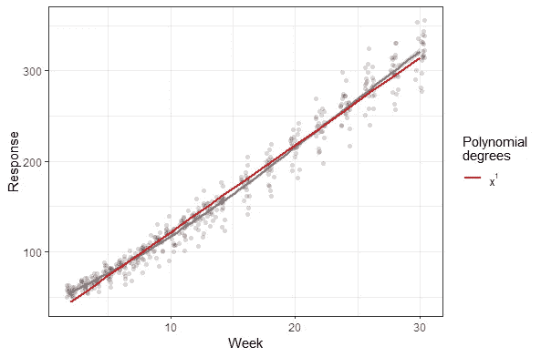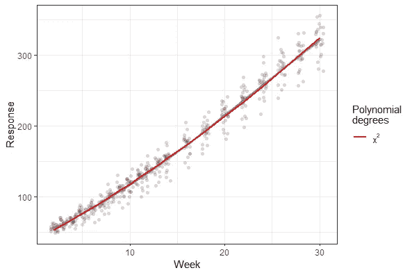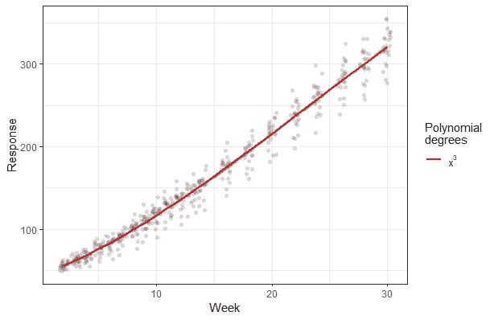

Can be fitted with a straight line, although a quadratic is better. Cubic is overkill.

现在我们可以开始制作我们的第一套模型，单独评估它们并进行比较，以了解重要的预测因素。

```
mix1<-lmer(BW~ns(Week,2)+Treat+(ns(Week,2)|Block), data=Growth_all) # perfect correlation intercept + Week 
summary(mix1)
plot(mix1)
mix0<-lmer(BW~Week+Treat+(Week|Block), data=Growth_all, REML=FALSE)
mix1<-lmer(BW~ns(Week,2)+Treat+(ns(Week,2)|Block), data=Growth_all, REML=FALSE)
mix2<-lmer(BW~ns(Week,2)*Treat+(ns(Week,2)|Block), data=Growth_all, REML=FALSE)
anova(mix1, mix2) # no treatment interaction
mix3<-lmer(BW~ns(Week,3)+Treat+(ns(Week,3)|Block), data=Growth_all, REML=FALSE)
anova(mix1,mix3) # not significant change in loglik and devianc
anova(mix0, mix1)
mix4<-lmer(BW~ns(Week,2)+Treat+(ns(Week,2)|Block/Pen), data=Growth_all, REML=FALSE)
summary(mix4) # huge variance for Week
anova(mix1, mix4) # does show a way better fit but not sure if okay 
mix5<-lmer(BW~ns(Week,2)+Treat+(ns(Week,2)|Block:Pen), data=Growth_all, REML=FALSE)
anova(mix4, mix5) # huge variance for Week
summary(mix5)anova(mix1,mix2,mix3,mix4,mix5)
ICtab(mix1,mix2,mix3,mix4,mix5)
```

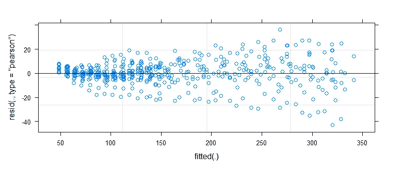

First mixed model shows the fan of the residuals hinting at less predictability as the animal grows.

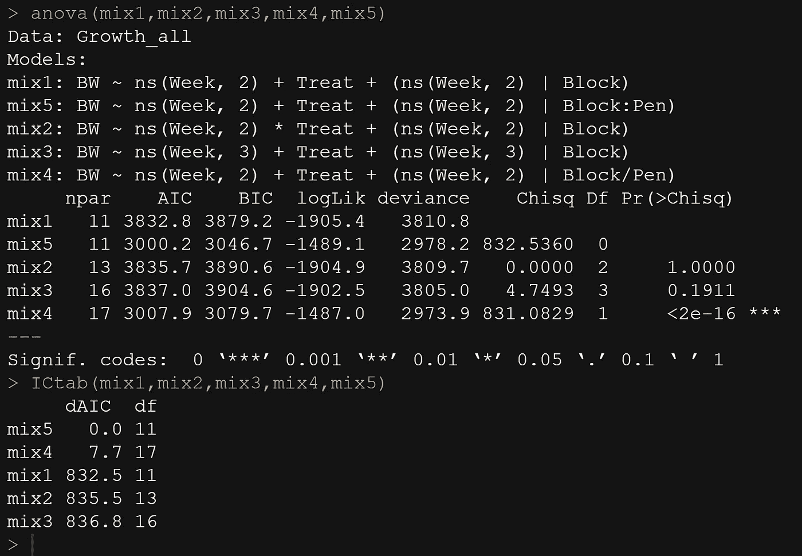

Mix5 is the best model according to the AIC

让我们也应用一下 **lme** 软件包，我发现它非常适合于 **lme4** 软件包。

```
Growth_group_pen<-groupedData(BW~Week|Pen,
                      data=Growth_all,
                      FUN=mean)
Growth_group_blockpen<-groupedData(BW~Week|Block/Pen,
                              data=Growth_all,
                              FUN=mean)
Growth_group_block<-groupedData(BW~Week|Block,
                                   data=Growth_all,
                                   FUN=mean)
mix1_nlme_pen<-lme(BW~ns(Week,2)+Treat, 
               data=Growth_group_pen,
               random=~ns(Week,2),
               method="ML", 
               control=lmeControl(opt="optim", maxIter=10000, msMaxIter = 1000))
summary(mix1_nlme_pen)
plot(mix1_nlme_pen); plot(mix1)
plot(augPred(mix1_nlme_pen, level = 0:1))
```

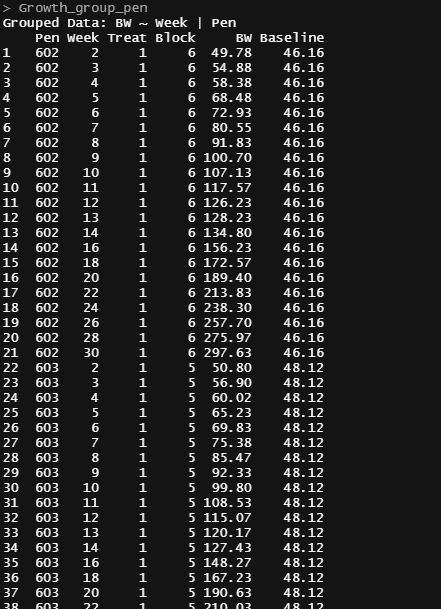

Grouped data to be inserted in the lme model

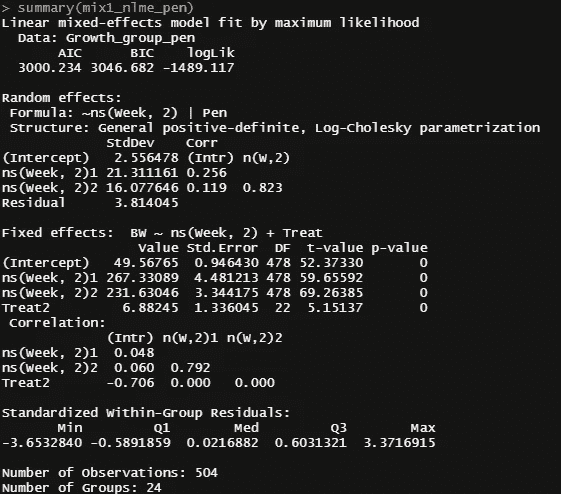

Model summary

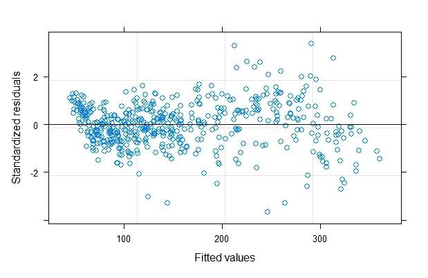

Looking better, but the curves are not modeled correctly yet. Could be due to incomplete fixed effects modelling or the error term which I did not model here.

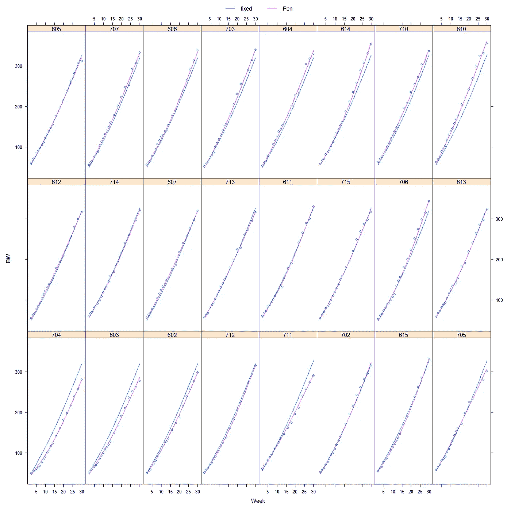

Predictions look good!

```
mix1_nlme_blockpen<-lme(BW~ns(Week,2)+Treat, 
                   data=Growth_group_blockpen,
                   random=~ns(Week,2),
                   method="ML", 
                   control=lmeControl(opt="optim", maxIter=10000, msMaxIter = 1000))
anova(mix1_nlme_pen,mix1_nlme_blockpen) 
intervals(mix1_nlme_pen)
```

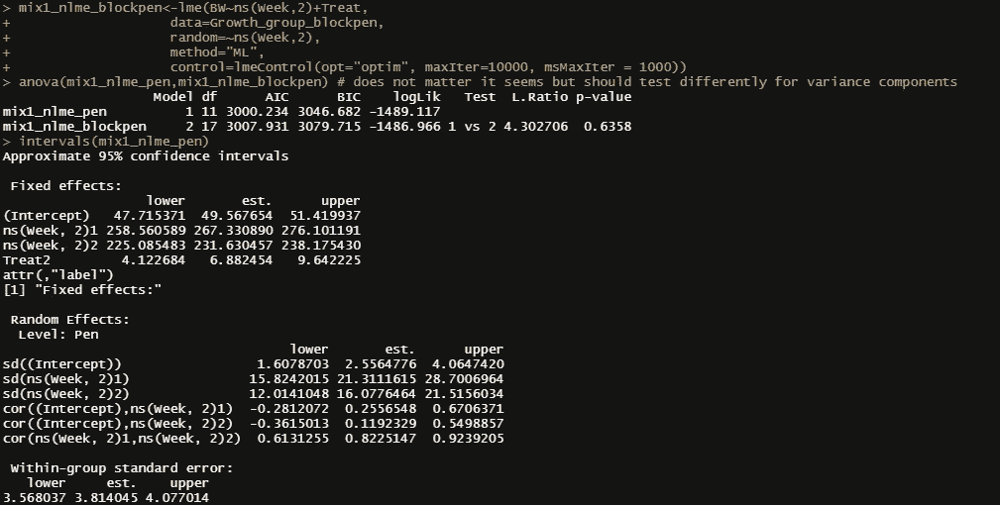

First model is best.

```
plot(acf(resid(mix1_nlme_pen)))
plot(pacf(resid(mix1_nlme_pen))) 
```

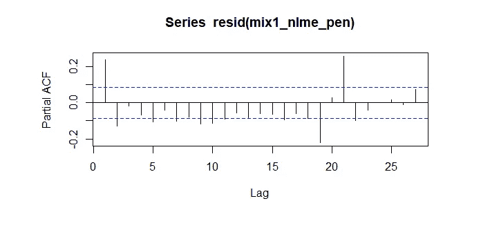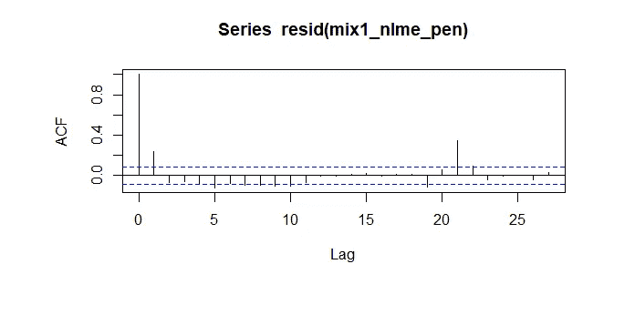

Autocorrelation seems to be at the boundary. It is there, but not blatantly clear.

对自相关进行统计测试的一种方法是在标准线性回归中使用 [Durbin Watson 测试](https://en.wikipedia.org/wiki/Durbin%E2%80%93Watson_statistic)，我将在下面做这个测试。该测试所做的是寻找一个值与其滞后值之间的显著相关性。这就是自相关。检验的零假设是没有自相关。

```
fit<-lm(BW~Week, data=Growth_all)
summary(fit)
dbtest<-durbinWatsonTest(fit, max.lag=10, simulate=TRUE, method="resample")
dbtest
```

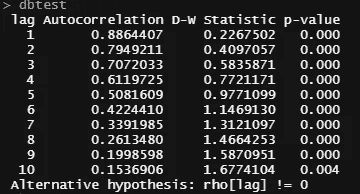

Significant values indicate the presence of autocorrelation.

AR(rho)矩阵是最简单但通常非常适合在您的模型中实现来处理自相关的协方差矩阵。它是一个相关矩阵，假设两个相邻时间点之间的相关性为ρ值。在这里，我指定 0.9。这意味着相关矩阵看起来像这样:

1.  时间 1 —时间 2 = 0.9
2.  时间 1 —时间 3 = 0.9*09
3.  时间 1 —时间 4 = 0.9*0.9*0.9
4.  时间 2 —时间 3 = 0.9

等等。

```
ARmatrix <- corAR1(0.9,form=~Week|Pen) 
ARmatrix <- Initialize(ARmatrix, data=Growth_all) 
cor_ARmatrix<-as.data.frcorMatrix(ARmatrix)
str(cor_ARmatrix)
par(mfrow = c(2, 2))
heatmap(cor_ARmatrix$`602`, main="Correlation Matrix for cow 602")
```

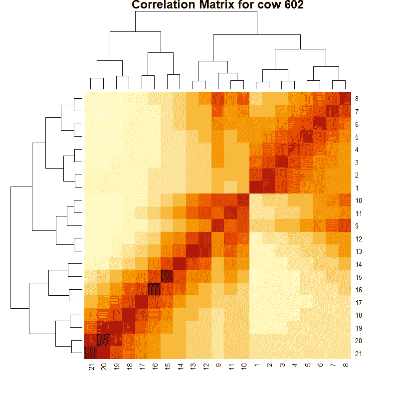

AR(rho)n correlation matrix as applied to all Cows. If you want to have a different correlation matrix, you can chose for a heterogenous variant which releases the assumption of distance = correlation.

让我们在混合模型中应用，找到不同的结构，允许或不允许异质性。

```
mix2_nlme_pen<-lme(BW~ns(Week,2)+Treat, 
               data=Growth_group_pen,
               random=~ns(Week,2),
               correlation=corAR1(0.8,form=~1),
               method="ML", 
               control=lmeControl(opt="optim", maxIter=10000, msMaxIter = 1000))
mix2_nlme_blockpen<-lme(BW~ns(Week,2)+Treat, 
                   data=Growth_group_blockpen,
                   random=~ns(Week,2),
                   correlation=corAR1(0.8,form=~Week),
                   method="ML", 
                   control=lmeControl(opt="optim", maxIter=10000, msMaxIter = 1000))
mix2.1_nlme_blockpen<-lme(BW~ns(Week,2)+Treat, 
                        data=Growth_group_blockpen,
                        random=~0+Week,
                        correlation=corAR1(0.8,form=~Week),
                        method="ML", 
                        control=lmeControl(opt="optim", maxIter=10000, msMaxIter = 1000))
mix2.2_nlme_pen<-lme(BW~ns(Week,2)+Treat+Block, 
                        data=Growth_all,
                        random=~0+Week|Pen,
                        correlation=corAR1(0.8,form=~Week|Pen),
                        method="ML", 
                        control=lmeControl(opt="optim", maxIter=10000, msMaxIter = 1000))
mix2.3_nlme_pen<-lme(BW~ns(Week,2)+Treat+Baseline+Block, 
                        data=Growth_group_blockpen,
                        random=~0+Week,
                        correlation=corAR1(0.95, form=~Week),
                        method="ML", 
                        control=lmeControl(opt="optim", maxIter=10000, msMaxIter = 1000))
mix2.4_nlme_pen<-lme(BW~ns(Week,2)+Treat+Baseline+as.factor(Block), 
                        data=Growth_group_pen,
                        random=~0+Week,
                        correlation=corAR1(0.95, form=~Week),
                        method="ML", 
                        control=lmeControl(opt="optim", maxIter=10000, msMaxIter = 1000))
mix2.5_nlme_pen<-lme(BW~ns(Week,2)+Treat+Baseline+as.factor(Block), 
                     data=Growth_group_pen,
                     random=~0+Week,
                     correlation=corAR1(0.95, form=~Week),
                     method="ML", 
                     control=lmeControl(maxIter=10000, msMaxIter = 1000))
mix2.6_nlme_pen<-lme(BW~ns(Week,3)+Treat+Baseline+as.factor(Block), 
                     data=Growth_group_pen,
                     random=~0+Week,
                     correlation=corAR1(0.95, form=~Week),
                     method="ML", 
                     control=lmeControl(maxIter=10000, msMaxIter = 1000))
mix2.7_nlme_pen<-lme(BW~ns(Week,3)+Treat+Baseline, 
                     data=Growth_group_pen,
                     random=~0+Week,
                     correlation=corAR1(0.95, form=~Week),
                     method="ML", 
                     control=lmeControl(maxIter=10000, msMaxIter = 1000))
anova(mix2.3_nlme_pen,mix2.5_nlme_pen, mix2.6_nlme_pen, mix2.7_nlme_pen) 
plot(mix2.4_nlme_pen)
```

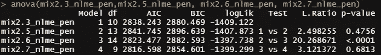

The **mix2.6** model seems to be the best, but the **mix2.7** has the lowest AIC. Choises need to be made. I chose the last model but it is debatable.

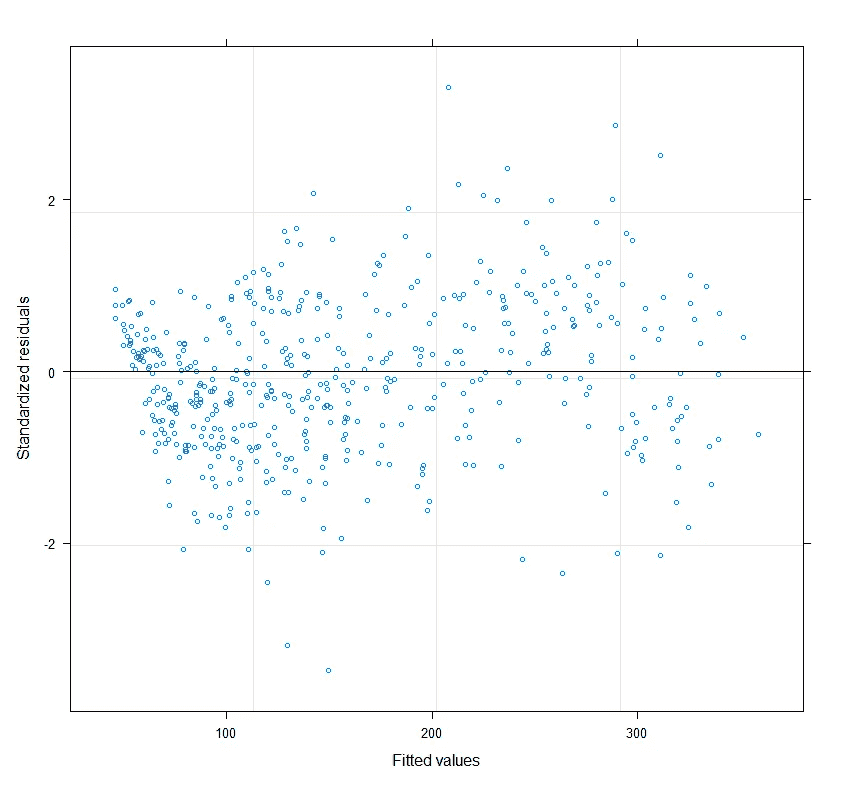

However, the plot is still not how I want it to be.

```
plot(augPred(mix2.7_nlme_pen, level=0:1), grid=T)
plot(augPred(mix2.4_nlme_pen),aspect="xy",grid=T) 
```

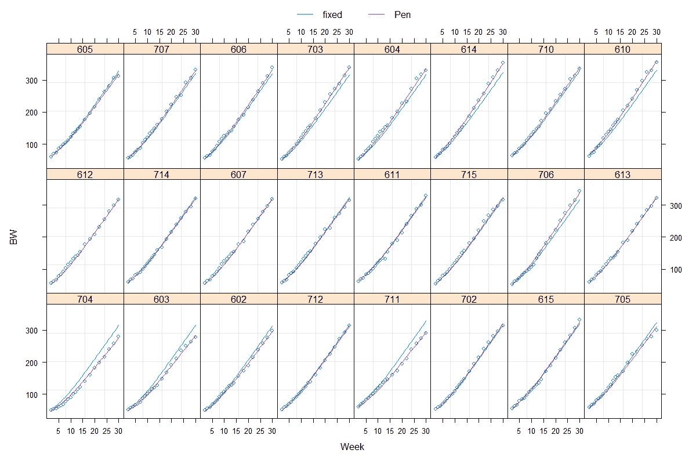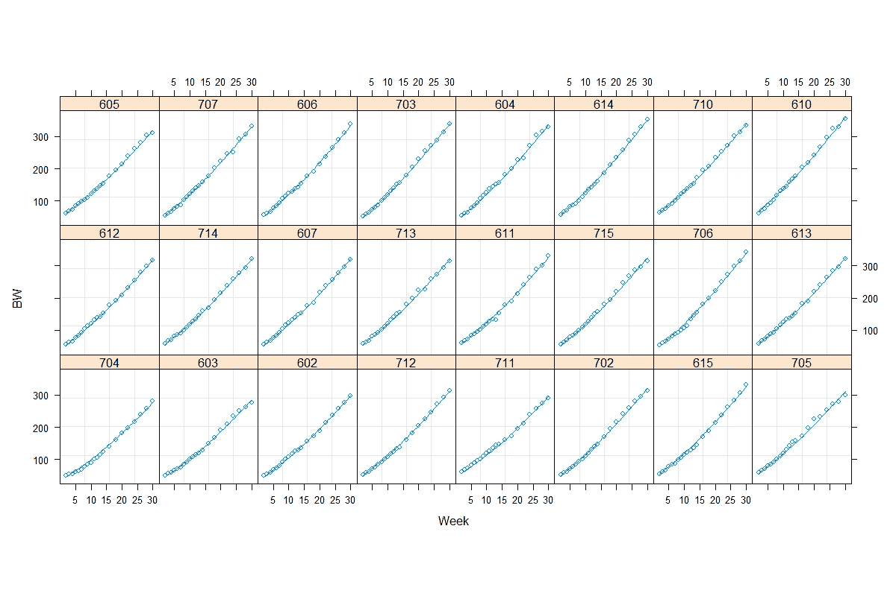

```
pred<-augPred(mix2.4_nlme_pen, level=0:1)
anova(mix2.2_nlme_pen,mix2.4_nlme_pen) # even worse fit specyifying block
summary(mix2.4_nlme_pen)
plot(acf(resid(mix2.7_nlme_pen)))
plot(pacf(resid(mix2.7_nlme_pen)))
intervals(mix2.7_nlme_pen)
```

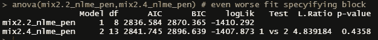

**Mix2.2** is best.

自相关图对模型的误差部分建模非常有帮助。[有两种类型的图](https://towardsdatascience.com/significance-of-acf-and-pacf-plots-in-time-series-analysis-2fa11a5d10a8):

1.  ACF:ACF 测量并绘制一个时间序列中的数据点与为不同滞后长度测量的该序列的先前值之间的平均相关性。例如，第一个滞后时的相关性测量为时间 t 时测量的时间序列值与时间 t1 时测量的所有序列值之间的相关性。第二个滞后的相关性测量时间 t 测量的时间序列值与时间 T2 测量的所有序列值之间的相关性。
2.  pACF:PACF 类似于 ACF，除了每个相关控制一个较短滞后长度的观测值之间的任何相关。因此，第一个滞后时的 ACF 和 PACF 值是相同的，因为两者都测量时间 t 的数据点与时间 t1 的数据点之间的相关性。然而，在第二个滞后时，在控制了时间 t 的数据点与时间 t1 的数据点之间的相关性之后，PACF 测量时间 t 的数据点与时间 T2 的数据点之间的相关性。

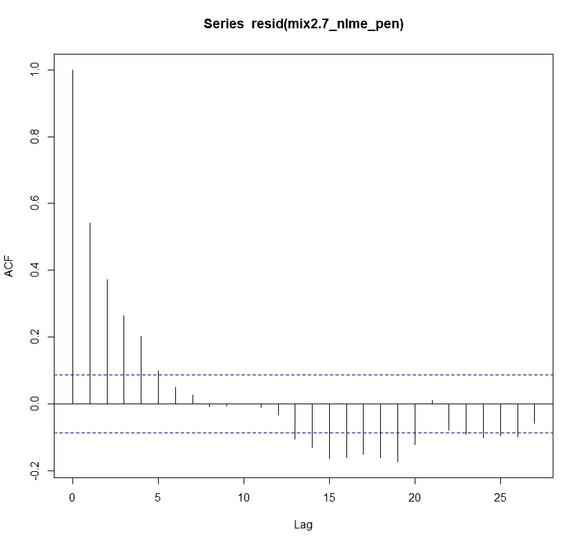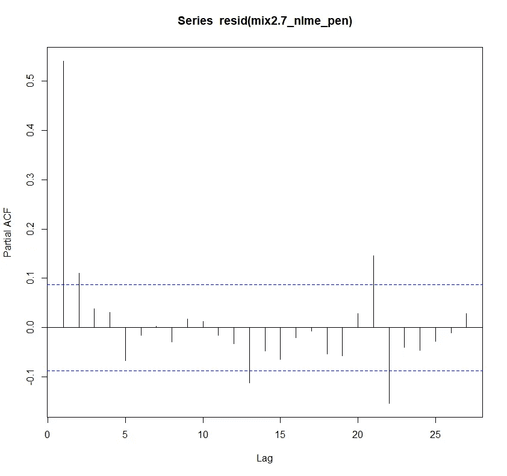

ACF does not look well, pACF looks good. So, what to do here?

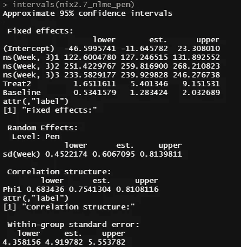

Estimates seem to be O.K.

让我们更深入地研究这个模型，对它进行诊断。

```
plot(ranef(mix2.4_nlme_pen))
qqnorm(residuals(mix2.7_nlme_pen))
qqline(residuals(mix2.7_nlme_pen))
plot(augPred(mix2.4_nlme_pen))
pairs(mix2.3_nlme_pen)
vario<-Variogram(mix2_nlme_blockpen)
plot(vario)
plot(fitted(mix2.7_nlme_pen), residuals(mix2.7_nlme_pen)); abline(h=0)
```

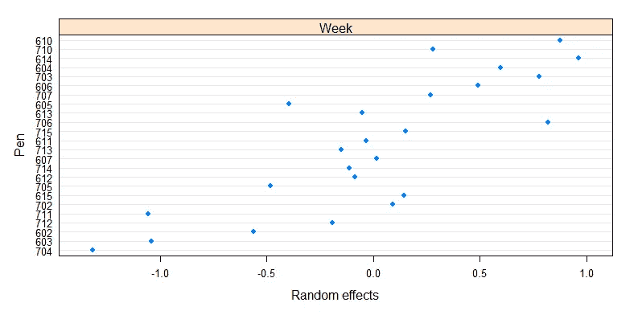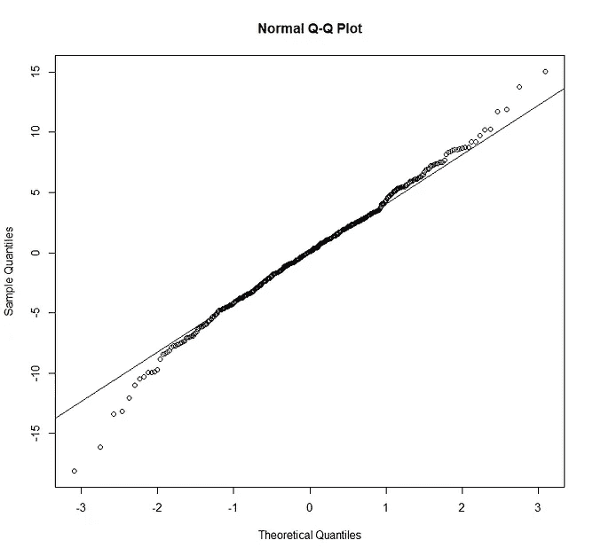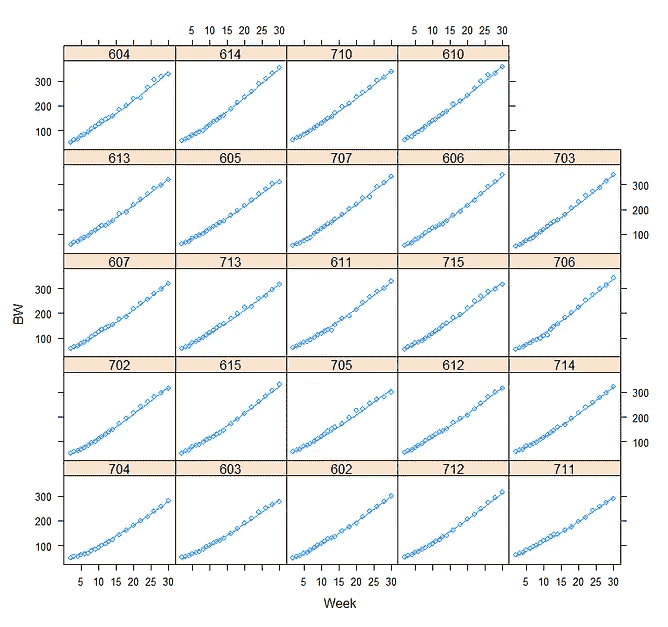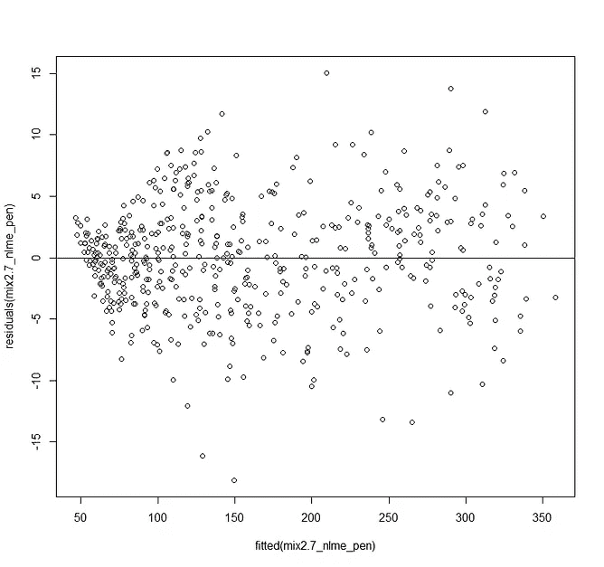

Looks goed, except the beginning. In fact, the spread in the middle and the end of the last plot is not worrying byut the beginning is, which is most likely due to me using a baseline value. Using a baseline value fixes all other values at the first point which often causes more harm than good when you want to model mixed-level data.

```
plot(compareFits(coef(mix2.4_nlme_pen), coef(mix2.5_nlme_pen)))
```

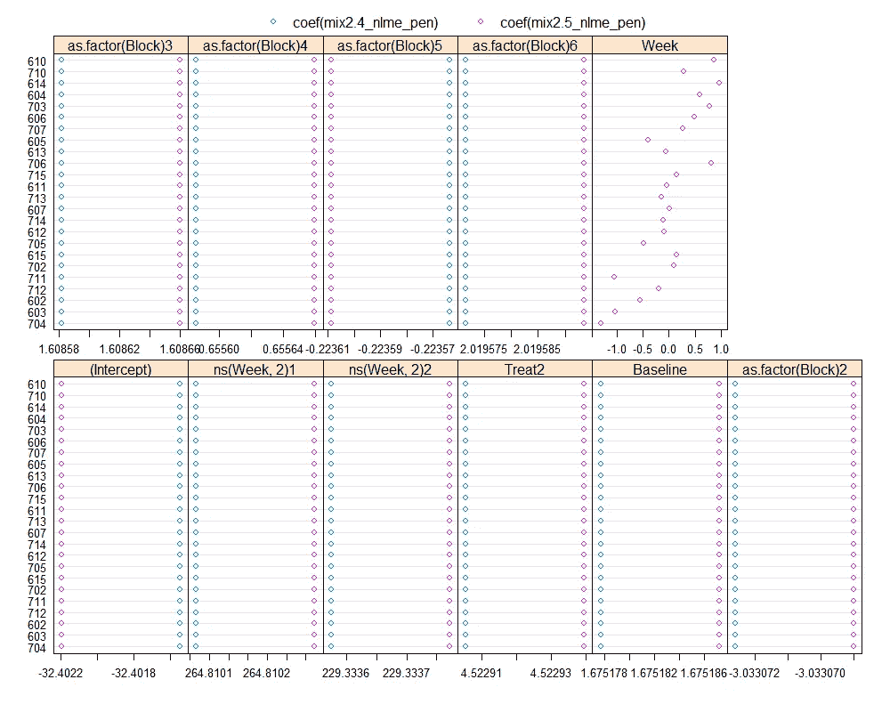

Well, what dom we have here?? I am not even sure HOW to interpret this.

```
VarCorr(mix2.2_nlme_pen)
VarCorr(mix2.3_nlme_pen)
VarCorr(mix2.4_nlme_pen)
```

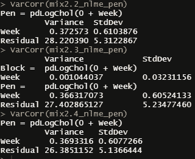

Covariance matrix on the error applied across different models

```
mix2.7_ranef<-ranef(mix2.7_nlme_pen,augFrame = T, level=1) # works for levels 1,2,3 (if in model present) but not 0
plot(mix2.7_ranef, grid=TRUE)
```

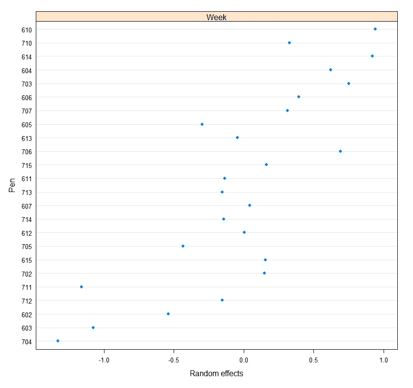

For sure, the random effect of Pen is warranted.

```
# Shows variance per Pen / Block
bwplot(Growth_all$Pen ~ resid(mix2.7_nlme_pen)) 
bwplot(Growth_all$Block ~ resid(mix2.7_nlme_pen))
```

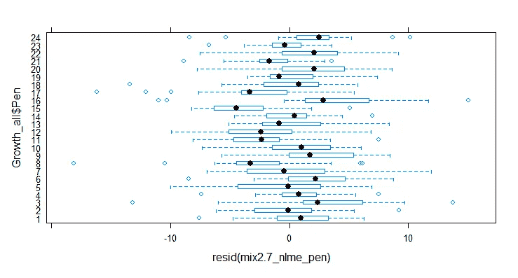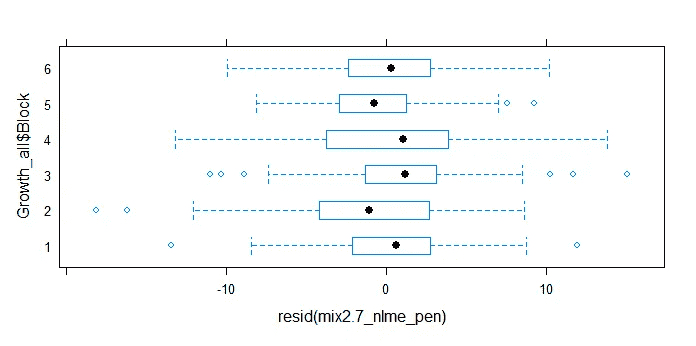

The models **mix2.7** seems to handle the data well across pens and blocks.

具体检查嵌套对于随机效应是否必要的一种方法是建立嵌套模型，并让 bootstrapping 模拟似然比测试。这里，我正在检查一个具有相同固定效果和不同随机效果的模型:

1.  *(0+周|块)*+*(0+周|笔:块)*
2.  *(0+周|笔:块)*
3.  *(0+周|块)*

如您所见，模型是嵌套的。

```
(nc <- detectCores())
cl <- makeCluster(rep("localhost", nc))
mA<-lmer(BW~ns(Week,3)+Treat+(0+Week|Block)+(0+Week|Pen:Block), data=Growth_all, REML=TRUE)
m.block<-update(mA,.~.-(0+Week|Pen:Block))
m.0<-update(mA,.~.,-(0+Week|Block))
anova(mA, m.block, m.0)
exactRLRT(m.block) 
```

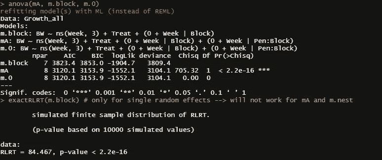

And sore sure, some are better than others. Here, the **mA** is better then **m.Block**, and **mA** equals **m.0**.

但这是一个非常适合的模型。那么，如果我坚持使用我的 **m.block** 模型，而是包含一个基线，会怎么样呢？是的，选择并不容易，对许多人来说，更容易理解一个包含基线协变量而不是复杂误差成分的模型。

```
# Random blocks or baseline covariate?
blockvar<-lmer(BW~ns(Week,3)+Treat+(0+Week|Pen:Block), data=Growth_all, REML=FALSE)
baselinecovar<-lmer(BW~ns(Week,3)+Treat+Baseline+(0+Week|Pen), data=Growth_all, REML=FALSE)
anova(blockvar, baselinecovar) # best to have a baseline covariate
plot(blockvar)
plot(baselinecovar)
VarCorr(baselinecovar)
VarCorr(blockvar)
```

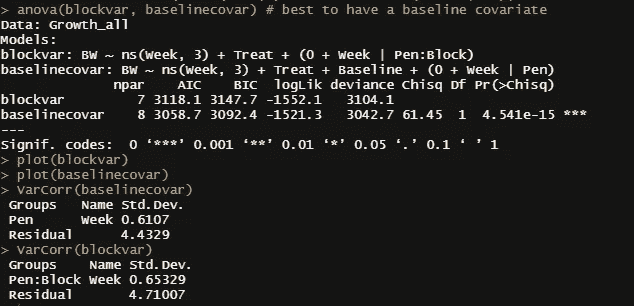

The baseline model performs better.

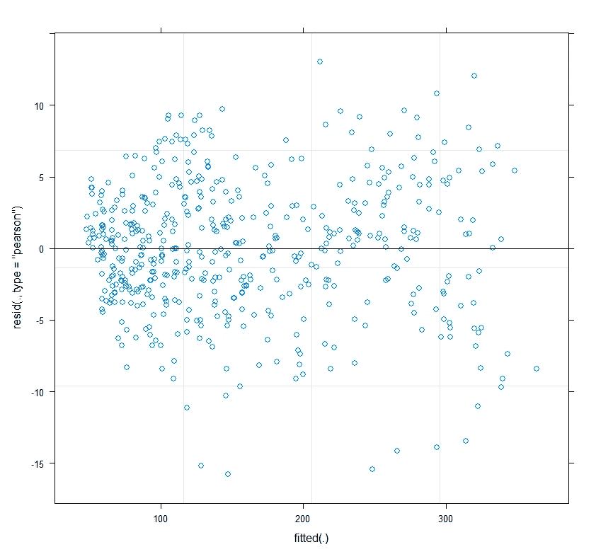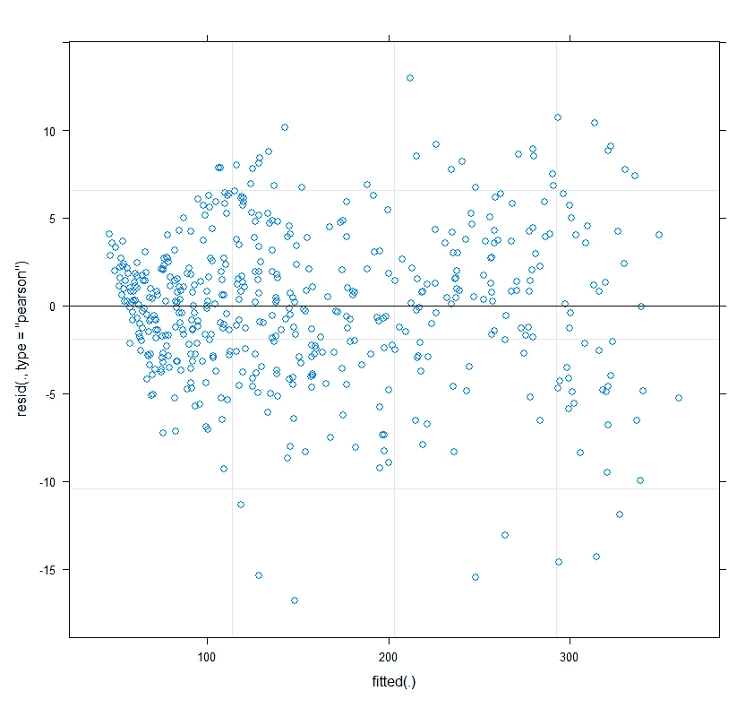

But the **blockvar** model has a much much better residual plot. The **baselinecovar** model has that weird beginning which happens if you squeeze your data to an artificial point via a baseline predictor.

最后，我相信我不得不选择基线模型，因为它更容易被接受，但我不能说当时的选择让我感到满意。让我们看看这些预测是否有意义。

```
## Cow specific predictions
newdat<-expand.grid(Pen=unique(Growth_all$Pen),
                      Block=unique(Growth_all$Block),
                      Week=as.numeric(1:35),
                      Baseline=unique(Growth_all$Baseline),
                    Treat=unique(Growth_all$Treat))
dim(newdat)
Pred<-predict(mix2.7_nlme_pen, newdata = newdat, level = 0:1 )
newdat$pred.fix<-Pred$predict.fixed
newdat$pred.pen<-Pred$predict.Pen
newdat$idtreat<-paste(newdat$Pen,newdat$Treat)## Plot
myx<-scale_x_continuous(breaks=seq(1,35,by=1))
myy<-scale_y_continuous(breaks= seq(0, 400, by = 25))
ggplot(newdat, aes(x=Week, colour=Treat))+
  myx+
  myy+
  labs(title = "Growth(BW) over 35 Weeks", y="BW", x="Time(Week)")+
  theme_bw()+
  stat_summary(aes(y=pred.pen, group=idtreat),fun.y=median, geom="line", lwd=0.4, alpha=0.4)+ 
  stat_summary(aes(y=pred.fix, group=Treat),fun.y=median, geom="line", lwd=1)+
  stat_summary(aes(y=pred.fix, group=Treat),fun.y=median, geom="point", lwd=2)
```

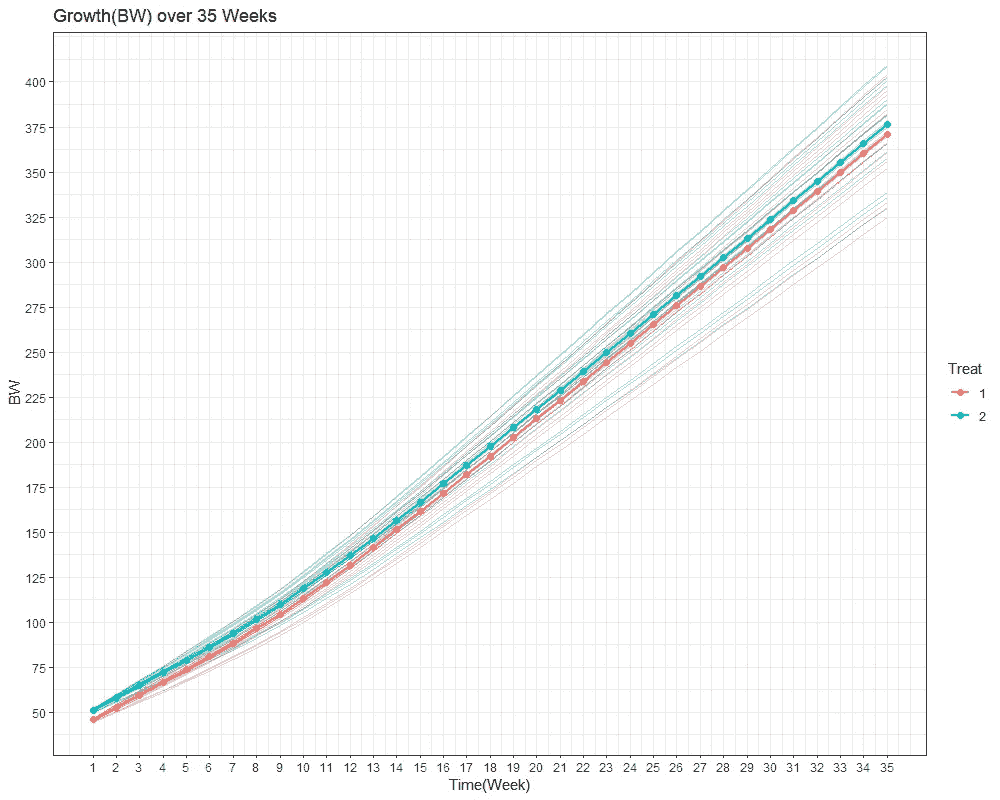

They do, but without a solid error component the end of the model is going to be bad.

现在，我已经说过，我对线性混合模型同时使用了 **lme** 和 **lme4** 包。 **lme** 包比较老，但是在通过方差-协方差矩阵模拟误差项的形式上有更多的功能。至少，有预功能的可能性。

所以，让我们在 **lme** 运行一个模型，有一个模拟误差，在 **lme4** 没有模拟误差。另一个不同之处是， **lme4** 模型有一个嵌套的随机效应，看看我能否弥补在误差项中对互相关建模的不足。

```
mix2.7_lme4_pen<-lme4::lmer(BW~ns(Week,3)+Treat+Baseline+(0+Week|Pen), data=Growth_all, REML=FALSE)
mix2.7_nlme_pen<-lme(BW~ns(Week,3)+Treat+Baseline, 
                     data=Growth_group_pen,
                     random=~0+Week,
                     correlation=corAR1(0.95, form=~Week),
                     method="ML", 
                     control=lmeControl(maxIter=10000, msMaxIter = 1000))
VarCorr(mix2.7_nlme_pen)
VarCorr(mix2.7_lme4_pen)
```

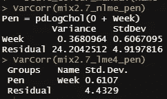

```
plot(mix2.7_nlme_pen)
plot(mix2.7_lme4_pen)
```

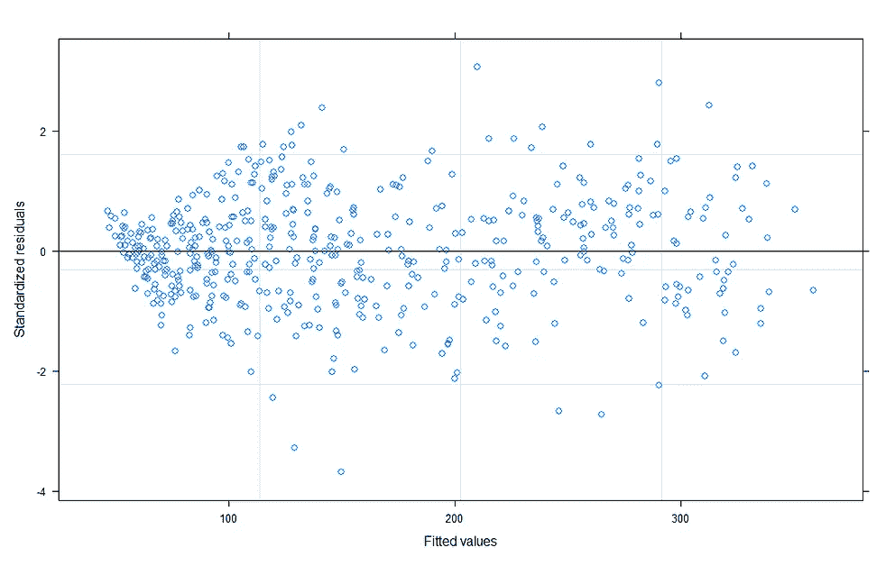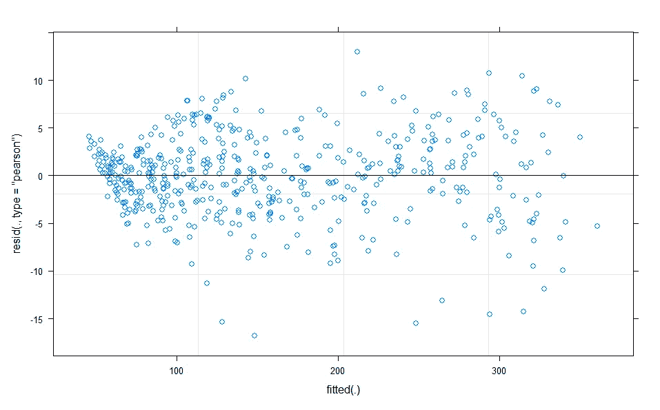

**lme** shows slightly better residuals

```
par(mfrow=c(2,2))
plot(acf(resid(mix2.7_nlme_pen)))
plot(acf(resid(mix2.7_lme4_pen)))
plot(pacf(resid(mix2.7_nlme_pen)))
plot(pacf(resid(mix2.7_lme4_pen)))
```

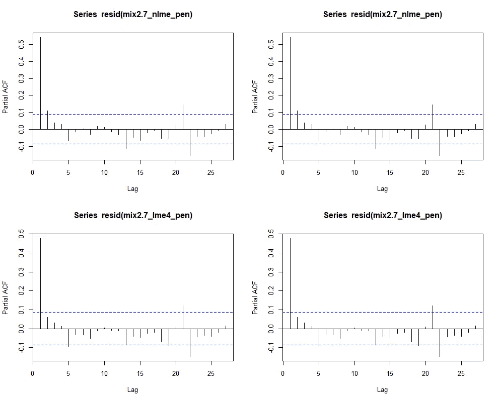

lme and lme4 show similar results, although I like the results of the lme4 better.

```
AIC(mix2.7_lme4_pen)
AIC(mix2.7_nlme_pen) 
```

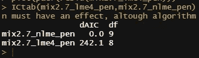

lme model is better, by far.

```
predlme4<-predict(mix2.7_nlme_pen, newdat=newdat)
ggplot(Growth_all, aes(x=Week, y=BW, colour=Treat))+
  theme_bw()+
  geom_point(col="grey80")+
  labs(title = "Growth(BW) over 35 Weeks", y="BW", x="Time(Week)")+
  stat_summary(dat=newdat, aes(y=pred.pen, group=idtreat),fun=median, geom="line", lwd=0.4, alpha=0.4)+
  stat_summary(dat=newdat, aes(y=pred.fix, group=Treat, colour="nlme"),fun=median, geom="line", lwd=1)+
  stat_summary(dat=newdat, aes(y=fitlme4, group=Treat, colour="lme4"),fun=median, geom="line", lwd=1)+
  scale_colour_manual(name="Method", values=c(nlme="blue", lme4="red"))
```

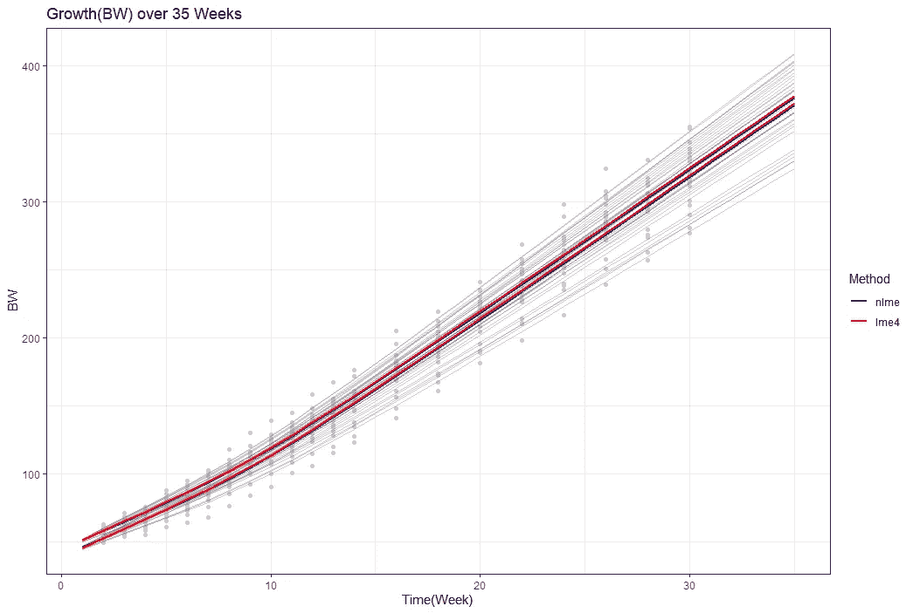

However, predictions on the fixed term look very much the same.

所以，这是一个反刍动物成长模型的帖子。希望你喜欢。如果你有问题，请告诉我！

[](/mlearning-ai/mlearning-ai-submission-suggestions-b51e2b130bfb) [## Mlearning.ai 提交建议

### 如何成为 Mlearning.ai 上的作家

medium.com](/mlearning-ai/mlearning-ai-submission-suggestions-b51e2b130bfb)