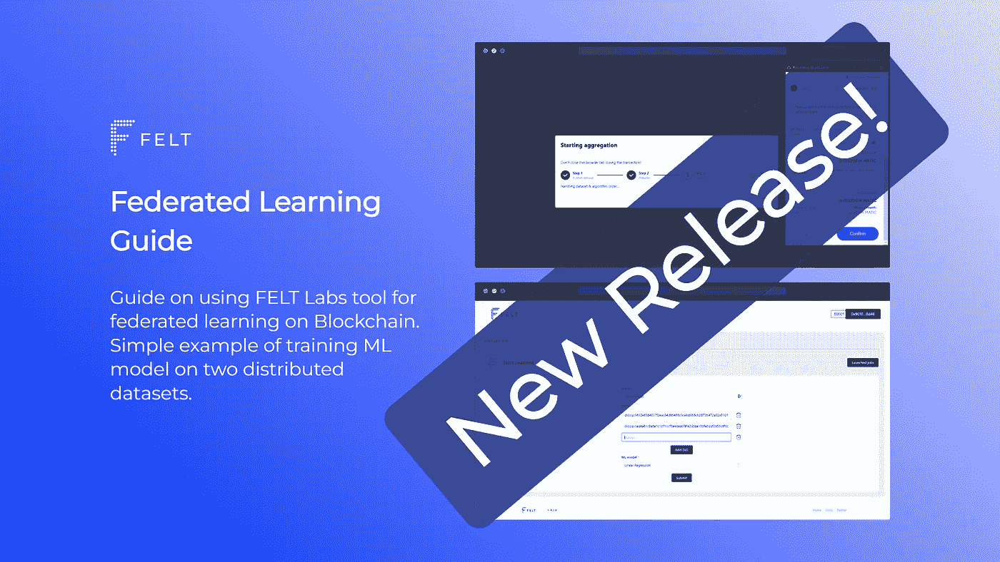
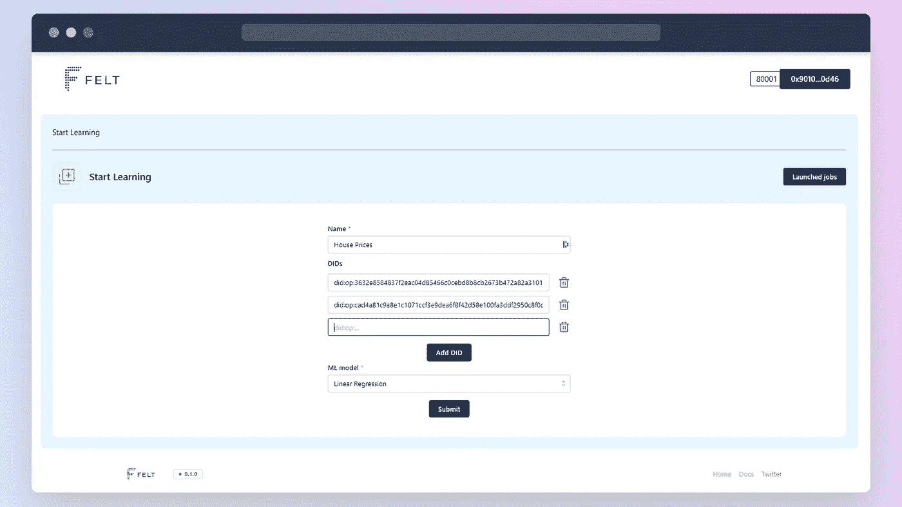
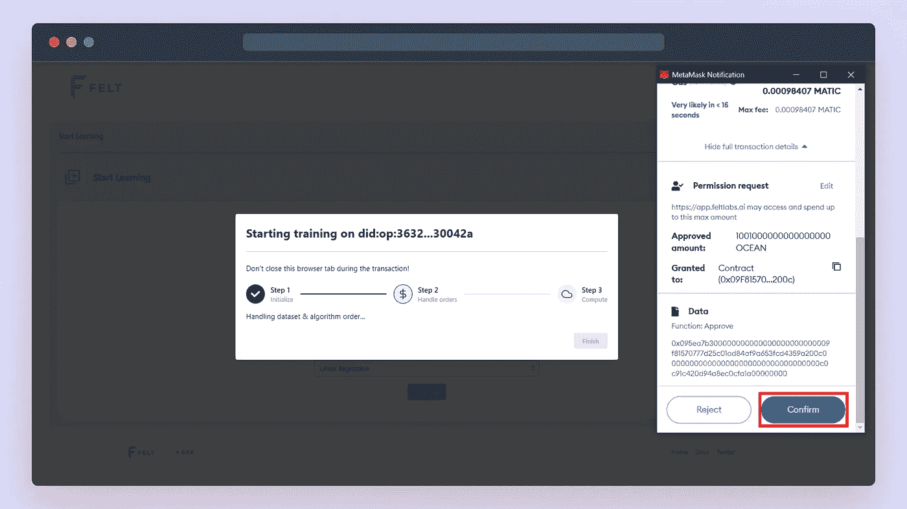
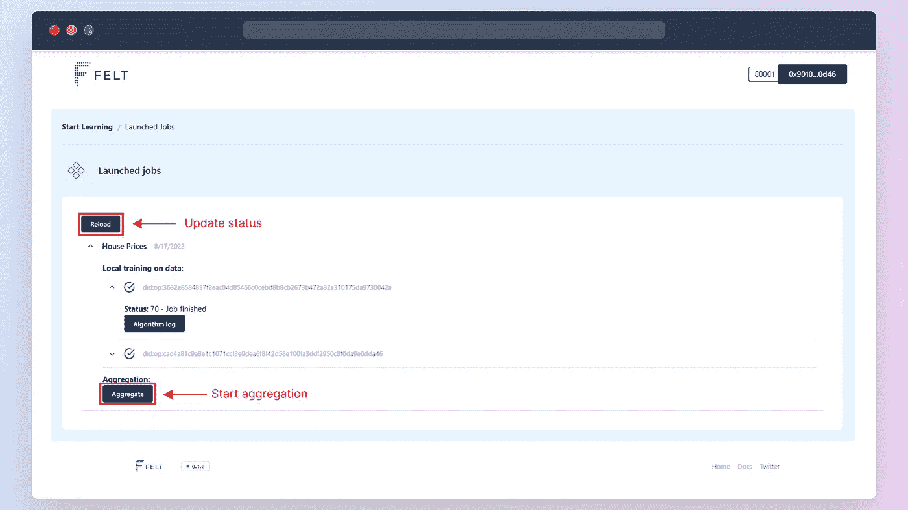
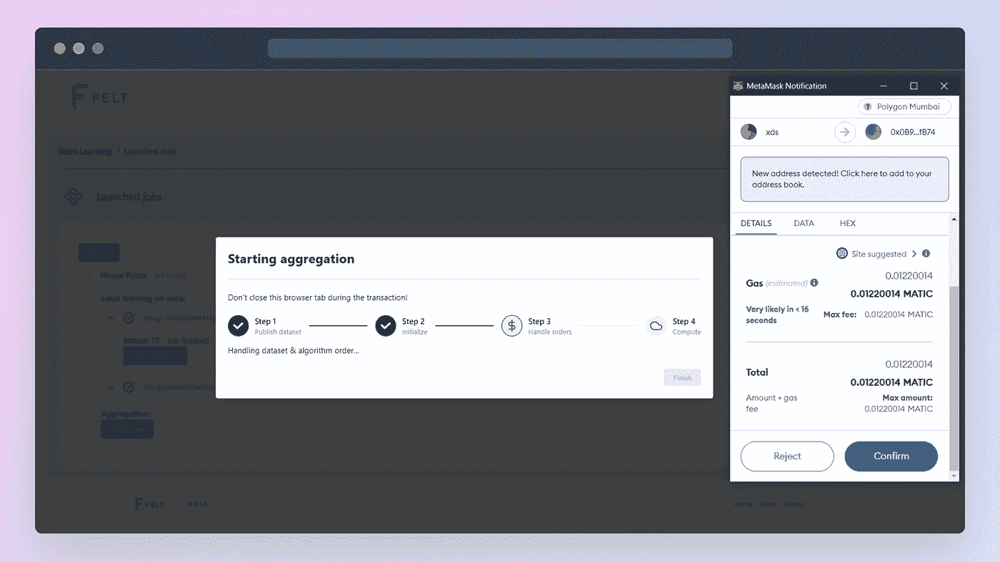

# 海洋协议区块链联合学习指南

> 原文：<https://medium.com/mlearning-ai/guide-to-federated-learning-on-blockchain-with-ocean-protocol-c25ab3ecaad0?source=collection_archive---------4----------------------->

## FELT Labs 的首次发布——联合学习平台



终于来了！今天我将展示第一版的 [FELT Labs](https://feltlabs.ai/) 工具，用于在[海洋协议](https://oceanprotocol.com/)上进行联合学习。这一次绝对比我们预期的要长。然而，这篇文章并不是关于我们必须克服的所有错误。这篇文章应该作为如何使用它的逐步指南。

# 联合学习

联合学习是一种针对分布在不同设备上的数据训练机器学习模型的技术——姑且称之为**数据提供者**。我们的方法将培训分为两个不同的阶段。

首先，每个提供者在其数据上训练一个本地模型。关键的事实是，每个本地模型都是完全基于单个数据提供者所拥有的数据。

在第二阶段，将这些局部模型放在一起，聚合过程创建最终模型(**全局模型**)。全局模型是所有局部模型的组合。因此，这个全球模型是基于来自所有数据提供者的所有数据。

这是一个非常简单的介绍，但应该足以介绍实用指南。更多信息可以阅读，比如[这篇文章](https://ai.googleblog.com/2017/04/federated-learning-collaborative.html)。

# 毛毡实验室指南

本指南与网络应用[https://app.feltlabs.ai/](https://app.feltlabs.ai/)的版本`0.1.0`兼容(你可以在网站页脚看到该版本)。目前，该应用程序与孟买和林克比测试网兼容。在本教程中，我们将使用孟买。

## 做好准备

首先，你必须确保你有一切准备使用毛毡。所需物品的简短清单:

*   **元掩码**接受交易时需要。你可以在这里得到它。
*   将多边形孟买添加到你的元蒙版中。只要按照这个指南去做[。](https://docs.polygon.technology/docs/develop/metamask/config-polygon-on-metamask/)
*   用于支付交易费用的自动令牌。使用[这个水龙头](https://faucet.polygon.technology/)免费获得。
*   **海洋代币**购买资产。[获得免费测试代币](https://faucet.mumbai.oceanprotocol.com/)。

此时，您应该在浏览器中安装了 MetaMask，并且您的钱包应该包含孟买网络上的 MATIC 和 Ocean 令牌。

# 1.关于海洋议定书的数据

数据是每个机器学习项目的关键部分。我们不能在没有实际数据的情况下开始创建模型。

为了演示联合学习，让我们想象两个城镇合作分析住房数据。数据可能包含敏感信息。因此，他们不能完全公开数据。每个城镇都在 Ocean 上发布其数据集，只允许对数据进行计算，而不允许直接访问。**我们将尝试根据房屋参数**(平方英尺的大小、卧室、浴室、材料等)来预测房价。).下面你可以看到我们数据的演示([原始数据文件](https://github.com/ywchiu/riii/blob/cba34bb9342cb0d283b531f5dc502fc15688078a/data/house-prices.csv))。

Example of house prices dataset. The target column we want to predict (prices) is the last. In data published on Ocean, we also need to remove the header row.

我们已经将 Ocean(使用 Mumbai chain)上发布的数据作为以下资产:

*   [did:op:3632 e 8584837 F2 EAC 04d 85466 c 0 cebd 8 b 8 CB 2673 b 472 a 82 a 310175 da 9730042 a](https://market.oceanprotocol.com/asset/did:op:3632e8584837f2eac04d85466c0cebd8b8cb2673b472a82a310175da9730042a)
*   [did:op:CAD 4a 81 c 9 A8 E1 c 1071 cf3 e 9 de a6 f 8 f 42d 58 e 100 fa 3d df 2950 c 8 f 0 da 9 E0 DD 46](https://market.oceanprotocol.com/asset/did:op:cad4a81c9a8e1c1071ccf3e9dea6f8f42d58e100fa3ddf2950c8f0da9e0dda46)

## 数据格式

要将 FELT 用于您自己的数据，您首先需要有正确数据格式的数据。目前，我们只支持 **CSV 格式**。遵循以下规则:

*   CSV 仅包含数字数据
*   最后一列是目标列
*   从数据中删除标题行
*   训练期间使用的所有数据集必须具有相同的列数

您可以查看本文中使用的这个文件`[house-prices-part1.csv](https://gist.github.com/Breta01/a8482d3cae0c257e9a7394ca72fdb281)`。有关在海洋市场上发布数据集的详细信息，请阅读:

[](https://docs.oceanprotocol.com/using-ocean-market/marketplace-publish-data-asset) [## 发布数据资产

### 使用海洋市场发布资产的教程

docs.oceanprotocol.com](https://docs.oceanprotocol.com/using-ocean-market/marketplace-publish-data-asset) 

**如果您正在使用您的数据，请不要忘记允许“本地训练—感觉”算法或所有已发布的算法。**

# 2.开始本地培训

当我们准备好数据后。该开始训练了！前往 [app.feltoken.ai](https://app.feltoken.ai/) 。开始之前，您需要连接元掩码帐户。所以点击右上角的**连接**按钮。确保在 MetaMask 中，您连接到正确的帐户和 Mumbai testnet。

然后你会看到一个简短的表格，你必须填写培训的名称(你可以选择任意一个)。然后你填写数据的 DIDs 对于我们的演示，您可以使用:

```
[did:op:3632e8584837f2eac04d85466c0cebd8b8cb2673b472a82a310175da9730042a](https://market.oceanprotocol.com/asset/did:op:3632e8584837f2eac04d85466c0cebd8b8cb2673b472a82a310175da9730042a)[did:op:cad4a81c9a8e1c1071ccf3e9dea6f8f42d58e100fa3ddf2950c8f0da9e0dda46](https://market.oceanprotocol.com/asset/did:op:cad4a81c9a8e1c1071ccf3e9dea6f8f42d58e100fa3ddf2950c8f0da9e0dda46)
```

最后，您将挑选`Linear Regression`作为模型进行训练。



Screenshot of how the form should look before you hit Submit button.

## 批准交易

一旦你点击**提交**按钮，你会看到一个进度条。您必须使用元掩码批准几个交易才能开始培训。这是您必须确认的所有交易的清单:

1.  批准购买数据集的 OCEAN token 费用
2.  购买数据集*(现在审批和购买是分开的交易)*
3.  批准 OCEAN token 花费以购买用于培训的 FELT 算法
4.  购买算法
5.  签署开始计算工作的请求(培训)

你必须为每个 DID 开始单独的训练；因此，您必须两次批准上述交易集。



Screenshot from starting training and approving transactions through MetaMask.

# 3.开始聚合

一旦您开始本地培训，您可以进入[已启动工作页面](https://app.feltlabs.ai/jobs)(您可以使用**已启动工作**按钮)。在这里，您可以监控计算作业的进度。您必须点击**重新加载**按钮以获得最新状态。一旦两个作业都完成，您就可以开始聚合(**聚合**按钮)。



Display of launched jobs; starting aggregation once local training is completed.

启动聚合后，会弹出进度条。您必须再次批准一些交易:

1.  签署 URL 以访问本地模型
2.  批准 OCEAN token 支付提供商费用
3.  计算作业的订单数据集
4.  批准 OCEAN token 消费以购买用于聚合的 FELT 算法
5.  购买算法
6.  签署开始计算作业的请求(聚合)



# 4.使用最终模型

您可以观察聚合进度。一旦完成，您将看到**下载最终模型**按钮。您将签署请求并下载最终模型(在我们的例子中是`final-model-House Prices.json`)。该文件不是标准的机器学习文件格式。您必须使用毛毡库来导入它。

首先，你必须使用 pip 安装 [FELT python 库](https://github.com/FELT-Labs/feltlabs.py)(它需要 **Python 3.9 或更新的**):

```
pip install feltlabs==0.2.6
```

然后，您可以使用`feltlabs.model.load_model(model_path)` 功能加载模型。该函数将模型文件的路径作为参数，并返回标准的 [scikit-learn 模型](https://scikit-learn.org/stable/modules/generated/sklearn.linear_model.LinearRegression.html)对象。您可以查看以下代码的示例用法:

就是这样。您刚刚在分布式数据集上训练了您的第一个模型！现在就靠你的想象力去寻找可以使用这项技术的项目了。

# 结论

我们很高兴达到这个重要的里程碑。第一个工作版本让我们走上了构建联合学习平台的正确道路。从现在开始，我们可以专注于迭代改进我们的工具。这包括添加更多的模型和自定义参数，加快过程，并减少所需的交易数量。

*如果你尝试跟随我们的指南，请在评论中或我们的 Twitter*[*@ FELT _ Labs*](https://twitter.com/FELT_labs)*上留下任何反馈。*

[](/mlearning-ai/mlearning-ai-submission-suggestions-b51e2b130bfb) [## Mlearning.ai 提交建议

### 如何成为 Mlearning.ai 上的作家

medium.com](/mlearning-ai/mlearning-ai-submission-suggestions-b51e2b130bfb)