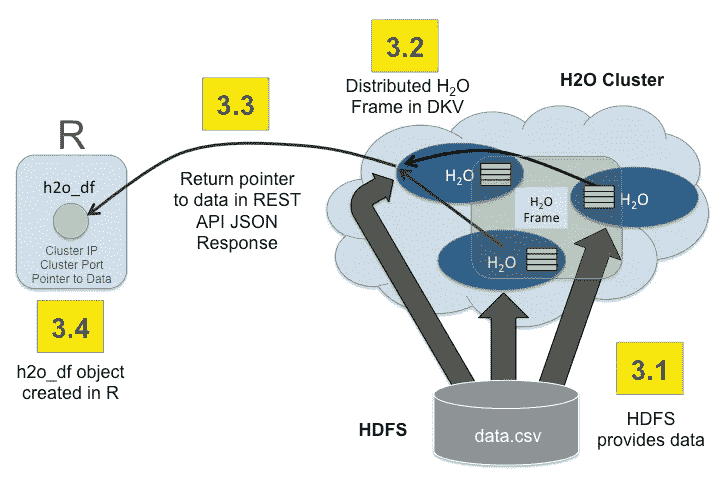
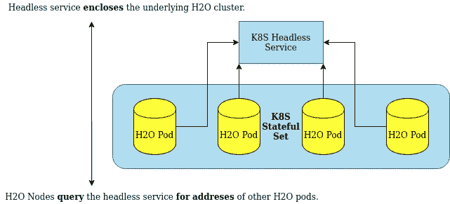

# Kubernetes 上的 H2O AI 集群

> 原文：<https://medium.com/mlearning-ai/h2o-ai-cluster-on-kubernetes-2e24bb9c717b?source=collection_archive---------9----------------------->


H2O 是一个开源的内存平台，用于分布式、可扩展的机器学习。非常适合在 Kubernetes 集群上部署，这是一种非常现代的部署方式，服务于&扩展应用。

本文解释了如何在 Kubernetes 上**创建 H2O 部署**。它还涵盖了选定的 H2O 内部机制，以便读者更好地理解 H2O 在 Kubernetes 集群上的行为。

# 使用的术语

# H2O

*   **H2O 节点:**内部运行 H2O 的 JVM 的一个实例。通常，每个逻辑机器有一个 H2O 实例。
*   **H2O 集群:** —多个 H2O 节点在一个公共计算上一起工作。计算平均分布在每个 H2O 节点上，通常使用 Map-Reduce。

# 库伯内特斯

*   请注意，Kubernetes 使用了与 H2O 领域相似的术语。以下所有描述均摘自 [Kubernetes concepts](https://kubernetes.io/docs/concepts/) 文档。
*   **Kubernetes 节点:**节点是 Kubernetes 中的工作机，以前称为 minion。根据群集的不同，节点可以是虚拟机或物理机。每个节点都包含运行 pod 所需的服务，并由主组件管理。
*   **Kubernetes 集群:**一组运行容器化应用的节点机器。

# H2O 在集群上的架构和行为

为了理解 H2O 分布式集群的行为和局限性，必须理解 H2O 设计的基础。

# H2O 有状态

一旦 H2O 节点启动，就会形成一个集群(H2O 集群，而不是 Kubernetes 节点集群)。当数据加载到 H2O 集群中时，压缩在内部应用，数据均匀分布在 H2O 节点上。



这种方法使 H2O 能够在大数据上扩展和执行机器学习。为了快速计算，数据被**保存在存储器**中。不仅是加载的数据，还有所有的中间计算。除非明确保存到永久存储器。这是 H2O 速度的关键。一旦数据被加载并跨 H2O 节点的集群分发，当前就不可能更改集群配置。禁止添加新节点、更改节点大小(内存、CPU ),因为群集会适应初始配置，包括数据分布模式和压缩模式。这种方法的最大优势是 H2O 的速度。

上面的信息暗示 H2O 集群是有状态的。如果一个 H2O 节点终止，群集会立即被识别为不健康，必须重新启动。

这意味着 H2O 节点**必须被 K8S 视为有状态节点**。在 Kubernetes 中，共享一个公共状态的一组 pod 被称为[有状态集](https://kubernetes.io/docs/concepts/workloads/controllers/statefulset/)。Kubernetes 状态集确保:

1.  H2O 节点被视为一个单元，可以一起正常启动和关闭。
2.  如果出现错误，K8S 运行状况检查(如果已定义)不会尝试重启单个 H2O 节点。
3.  一旦群集关闭，与 H2O 节点的状态集相关联的持久性存储和卷将不会被删除。

**要点提示:** H2O 是一个有状态的应用程序。H2O 节点一起产生，一起死亡。Kubernetes 无状态应用工具不适用于 H2O。数据库以非常相似的方式部署在 Kubernetes 集群上。

# H2O 节点相互可见性

为了使 H2O 集群化，它需要其他 H2O 节点的地址。在一个简单的本地网络上，内部试探法负责聚类。在 Kubernetes 集群上，情况变得更加困难，因为包含 H2O 的 pod 分布在 Kubernetes 节点上，默认情况下 IP 地址是按需分配的。一些用户利用这种可能性来创建和分发带有 H2O 节点地址的**平面文件**。这是**错误的**方式。在 Kubernetes 集群上，这是一个额外的、非常复杂且不必要的步骤。首先，必须分配和安装持久存储，这导致了资源和时间的浪费。然后，必须向 Kubernetes 集群查询所创建的 H2O pod 的 IP 地址。该平面文件随后被写入永久存储器，而 pod 内的 H2O Docker [容器](https://h2o.ai/wiki/containers/)等待文件出现以启动 H2O。一个非常复杂的过程。

H2O 现在**能够使用资源本地 Kubernetes — **环境变量和服务**自动**发现**与 H2O 在同一服务下的其他 pod。不需要容器黑客。**

根据 [Kubernetes 网络模型](https://kubernetes.io/docs/concepts/cluster-administration/networking/)，每个 Pod 都有自己的 IP 地址。此外，任何节点上的 pod 都可以与所有节点上的所有 pod 通信。因此，创建了一个`StatefulSet`H2O 节点，通过一个无头服务公开。之后，通过使用由无头服务创建的 DNS 记录来自动执行群集。无头服务的名称被传递给 H2O pod，然后通过定义`H2O_KUBERNETES_SERVICE_DNS`环境变量一路传递给 H2O Docker 容器。格式通常遵循`<service-name>.<project-name>.svc.cluster.local`模式。一旦这个环境变量出现，H2O 就认为它正在 Kubernetes 集群中运行，并在主 H2O 程序实际启动之前等待集群结束。都是自动完成的。



**关键要点:** H2O 能够使用 Kubernetes 自带的工具——服务和环境变量——在 Kubernetes 服务中实现集群化。不需要其他工具。

# 领导节点曝光

为了确保可再现性，所有请求都应发送到 H2O 领导节点。领导者节点选举在节点发现过程完成后进行。因此，在群集形成并且领导者节点已知之后，只有具有 H2O 领导者节点的 pod 应该是可用的。这也使得部署之上的服务只将所有请求路由到领导节点。为此，使用驻留在`/kubernetes/isLeaderNode`地址上的就绪探测器。一旦聚类完成，除了领导节点之外的所有节点将它们自己标记为未准备好，只留下领导节点暴露。

**要点提示:**为确保再现性，只应联系领导而不是。就绪探测确保只有领导者节点可通过相应的服务到达。

# 在 Kubernetes 集群中运行 H2O

为了在 Kubernetes 集群中生成 H2O 集群，必须满足以下要求:

1.  库伯内特星团。对于本土发展来说， [k3s](https://k3s.io/) 是很棒的选择。为了方便开始，RedHat 的 open shift[是一个很好的选择，他们有 30 天的免费试用期。](https://www.openshift.com/)
2.  H2O 在里面的码头工人图像。
3.  一个 Kubernetes 部署定义，包含一组状态良好的 H2O pods 和一个无头服务。

# 创建 Docker 图像

一个简单的 Docker 容器和启动时运行的 H2O 就足够了。最简单的创建方法如下图所示。

```
**FROM** ubuntu:latestARG H2O_VERSION**RUN** apt-get update \
	&& apt-get install default-jdk unzip wget -y**RUN** wget [http://h2o-release.s3.amazonaws.com/h2o/rel-zahradnik/1/h2o-](http://h2o-release.s3.amazonaws.com/h2o/rel-zahradnik/1/h2o-)${H2O_VERSION}.zip \
	&& unzip h2o-${H2O_VERSION}.zip**ENV** H2O_VERSION ${H2O_VERSION}
**CMD** java -jar h2o-${H2O_VERSION}/h2o.jar
```

要构建 Docker 映像，请使用`docker build . -t {image-name} --build-arg H2O_VERSION=3.30.0.1`。确保用有意义的名称替换`{image-name}`占位符。出于本文的目的，docker 图像将被命名为`h2o-k8s`，结果为`docker build . -t h2o-k8s --build-arg H2O_VERSION=3.30.0.1`

# 创建无头服务

部署在 Kubernetes 集群上的 H2O Pods 需要一个[无头服务](https://kubernetes.io/docs/concepts/services-networking/service/#headless-services)用于 H2O 节点发现。无头服务返回所有底层 pod 的一组地址，而不是对底层 H2O pod 的传入请求进行负载平衡。这使得 H2O 能够聚集起来。

```
apiVersion: v1
kind: Service
metadata:
  name: h2o-service
spec:
  type: ClusterIP
  clusterIP: None
  selector:
    app: h2o-k8s
  ports:
  - protocol: TCP
    port: 54321
```

`clusterIP: None`将服务定义为无头服务。`port: 54321`是默认的 H2O 端口。用户和客户端库使用此端口与 H2O 集群通信。

`app: h2o-k8s`设置对于**非常重要**，因为这是内部带有 H2O 吊舱的应用程序的名称。这个名字是任意选择的。请确保此设置对应于所选的 H2O 部署名称。

# 创建 H2O 部署

强烈建议在 Kubernetes 集群上将 H2O 作为有状态集运行。Kubernetes 假设集群中的所有 pod 都是有状态的，并且不会在出现故障时尝试重启单个 pod。一旦在 H2O 集群上触发作业，该集群将被锁定，并且无法添加其他节点。因此，如果需要的话，集群必须作为一个整体重启——这非常适合 StatefulSet。

```
apiVersion: apps/v1
kind: StatefulSet
metadata:
  name: h2o-stateful-set
  namespace: h2o-statefulset
spec:
  serviceName: h2o-service
  replicas: 3
  selector:
    matchLabels:
      app: h2o-k8s
  template:
    metadata:
      labels:
        app: h2o-k8s
    spec:
      terminationGracePeriodSeconds: 10
      containers:
        - name: h2o-k8s
          image: '<someDockerImageWithH2OInside>'
          resources:
            requests:
              memory: "4Gi"
          ports:
            - containerPort: 54321
              protocol: TCP
          readinessProbe:
            httpGet:
              path: /kubernetes/isLeaderNode
              port: 8081
            initialDelaySeconds: 5
            periodSeconds: 5
            failureThreshold: 1
          env:
          - name: H2O_KUBERNETES_SERVICE_DNS
            value: h2o-service.h2o-statefulset.svc.cluster.local
          - name: H2O_NODE_LOOKUP_TIMEOUT
            value: '180'
          - name: H2O_NODE_EXPECTED_COUNT
            value: '3'
          - name: H2O_KUBERNETES_API_PORT
            value: '8081'
```

除了标准化的 Kubernetes 设置，比如`replicas: 3`定义实例化 H2O 的 pod 数量，还有几个设置需要注意。

应用程序的名称`app: h2o-k8s`必须对应于上面定义的无头服务所期望的名称，以便 H2O 节点发现能够工作。H2O 在端口 54321 上通信，因此`containerPort: 54321`必须被暴露，以使客户端能够连接。

驻留在`/kubernetes/isLeaderNode`上的准备就绪探测器通过使除领导节点之外的所有节点不可用来确保一旦集群形成就只暴露领导节点。H2O Kubernetes API 的默认端口是 8080。在示例中，一个可选的环境变量将端口更改为`8081`。

**环境变量:**

1.  `H2O_KUBERNETES_SERVICE_DNS`–**【强制】**对集群工作至关重要。格式通常遵循`<service-name>.<project-name>.svc.cluster.local`模式。此设置通过 DNS 启用 H2O 节点发现。必须修改它以匹配所创建的无头服务的名称。此外，注意地址的其余部分，以匹配您的 Kubernetes 实现的细节。
2.  `H2O_NODE_LOOKUP_TIMEOUT`–**【可选】**节点查找约束。节点查找结束前的时间。
3.  `H2O_NODE_EXPECTED_COUNT`–**【可选】**节点查找约束。预计发现的 H2O 豆荚数量。
4.  `H2O_KUBERNETES_API_PORT`–**【可选】**用于 Kubernetes API 检查和探针监听的端口。默认为 8080。

如果没有指定任何可选的查找约束，将设置一个合理的默认节点查找超时，当前默认为 3 分钟。如果定义了任何查找约束条件，则无论哪个条件首先满足，H2O 节点查找都会终止。

# 暴露 H2O 星团

公开 H2O 集群是 Kubernetes 管理员的责任。默认情况下，可以创建一个[入口](https://kubernetes.io/docs/concepts/services-networking/ingress/)。不同的平台提供不同的功能，例如 OpenShift 提供[路线](https://docs.openshift.com/container-platform/4.3/networking/routes/route-configuration.html)。

# 把所有的放在一起

产生的 YAML 可以放入一个文件中，例如`h2o.yaml`。

```
apiVersion: apps/v1
kind: StatefulSet
metadata:
  name: h2o-stateful-set
  namespace: h2o-statefulset
spec:
  serviceName: h2o-service
  replicas: 3
  selector:
    matchLabels:
      app: h2o-k8s
  template:
    metadata:
      labels:
        app: h2o-k8s
    spec:
      terminationGracePeriodSeconds: 10
      containers:
        - name: h2o-k8s
          image: 'pscheidl/h2o-k8s'
          resources:
            requests:
              memory: "4Gi"
          ports:
            - containerPort: 54321
              protocol: TCP
          env:
          - name: H2O_KUBERNETES_SERVICE_DNS
            value: h2o-service.h2o-statefulset.svc.cluster.local
          - name: H2O_NODE_LOOKUP_TIMEOUT
            value: '180'
          - name: H2O_NODE_EXPECTED_COUNT
            value: '3'
---
apiVersion: v1
kind: Service
metadata:
  name: h2o-service
spec:
  type: ClusterIP
  clusterIP: None
  selector:
    app: h2o-k8s
  ports:
  - protocol: TCP
    port: 54321
```

使用`kubectl apply -f h2o.yaml`可以在本地应用结果，或者将结果复制到您喜欢的 Kubernetes 集群提供者的界面中。

[](/mlearning-ai/mlearning-ai-submission-suggestions-b51e2b130bfb) [## Mlearning.ai 提交建议

### 如何成为 Mlearning.ai 上的作家

medium.com](/mlearning-ai/mlearning-ai-submission-suggestions-b51e2b130bfb)