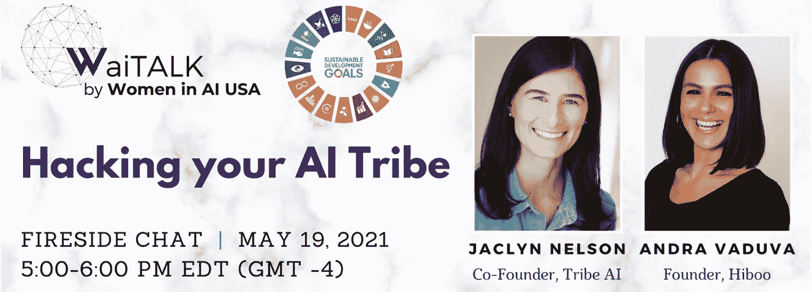

# 黑客人工智能:部落人工智能联合创始人朱慧珊·赖斯的 7 点见解

> 原文：<https://medium.com/mlearning-ai/hacking-ai-7-insights-from-tribe-ai-co-founder-jaclyn-rice-fc9bbd1f70fe?source=collection_archive---------1----------------------->

## 最近，我有一个很好的机会，与 Tribe AI 的联合创始人朱慧珊·赖斯·纳尔逊一起主持了一场活动，Tribe AI 是一个由顶级机器学习工程师和数据科学家组成的社区，他们与公司合作，构建有影响力的人工智能解决方案。

Photo by Women in AI

这是一个我非常关心的话题。随着员工和企业之间的社会契约不断变化，尤其是在这个令人眼花缭乱的疫情时代，我喜欢像 Tribe 这样的组织开始涌现。鉴于他们对社区、多样性和生活优化的关注，我觉得这是我们 5 月 19 日“黑客你的人工智能部落”活动的天作之合，这是我们最近黑客马拉松的一场比赛。(那天是[6 月 4 日–6 日！！看看这里！](https://www.womeninai.co/waiaccelerate))

不能说话吗？这是 TL。博士:[部落](https://www.tribe.ai/join)正在为人工智能人才打造一条新的道路，将在谷歌这样的大公司工作的薪酬和技术友谊与作为企业家的自主和自由结合起来(是啊是啊！！).如果你是一名 ML 工程师或数据科学家，你可以[申请加入](https://www.tribe.ai/apply)，在做有影响力的项目的同时，按照自己的时间表赚到$$$(看看你，未来的创始人)。

在创办 Tribe 之前，朱慧珊在谷歌的大部分职业生涯都在为企业公司工作，并孵化新产品。她也是 Alphabet 成长型股票公司 CapitalG 的早期员工，在那里，她为 Airbnb 等成长期科技公司提供咨询，帮助它们扩展技术基础设施、数据安全，以及利用机器学习实现增长。

她对人工智能推动积极变化的潜力充满热情，并且是许多女性领导的创业公司的积极投资者。我迫不及待地想和她坐下来，沉浸在这些及时而令人兴奋的话题中。

以下是朱慧珊从我们的讨论中得出的一些见解和我的后续想法:

> “人工智能仍然是这个新生的领域，因此，有一群不同的声音帮助塑造这个行业比以往任何时候都更重要。”——朱慧珊·赖斯·尼尔森，Tribe AI 联合创始人

我们的讨论真正强调了不同声音在人工智能中发挥作用的重要性。在这个行业还很新的时候，这将是塑造这个行业的关键。我认为我们仍然在弄清楚我们希望我们周围有多少人工智能，我们希望给它多少自主权，我们希望如何监管它，以及我们希望如何玩它。我们正在弄清楚谁真正从中受益，以及如何受益。因此，让不同的声音立即、显著地参与进来是当务之急。

> “在 Tribe，我们坚信，解决正确问题的正确人选能够对公司的发展轨迹产生巨大的影响。我们一次又一次地看到这种事情发生。”

现在人工智能的实现有如此大的潜力。既有令人兴奋的人工智能新应用，也有传统产业的更新和自动化。从消防和建筑到广告、医疗保健、教育、住房、汽车和约会，我们看到了方方面面的创新。对于那些以使命为导向的公司来说，这是一个黄金时代，它们都在努力利用数据做好事情。对于那些在人工智能和数据科学方面有天赋和技能的人来说，有太多的机会来实现这一切。

> “作为一名创始人，也是在我的职业生涯中与许多创始人合作过的人，我很高兴 Tribe 能够为我们社区中对创业充满好奇的人提供他们探索想法或创建自己的公司所需的灵活性和财务稳定性。”

看到别人的创业可能是一个强大的动力。人工智能中的女性现在正处于创业阶段，在我们的 WAI Accelerate 计划中，我们已经看到了让我们的演讲者分享她们的创业旅程的影响。

我喜欢 AI 部落正在为那些对创业充满好奇的 ML 专家创造一个家！同时也将他们与能够帮助他们识别人工智能领域需要解决的问题的组织联系起来。很高兴看到技术人才获得了这种灵活性，而不必做出职业牺牲。我认为听到朱慧珊的经历如何让她在谷歌生态系统之外冒险真的很有趣——我很高兴她冒险尝试了。

> “我在谷歌与处于后期阶段的风险投资公司合作，我看到他们整合人工智能有多难。我有过这样的想法，如果拥有从资金到人才等各种技术优势的公司都这么难，那么其他人都在做什么呢？我们希望帮助公司找到阻碍他们使用人工智能的因素，并向他们展示人工智能可以做什么。”

想跳进 ML 的公司很难启动飞轮。通常最大的障碍是缺乏可用的人才，尤其是当你需要全力以赴的时候。这是一场市场竞赛，招聘可能会极大地消耗时间和资源，尤其是当机器学习只关乎谁能最先到达时。我认为看到 Tribe 如何帮助公司达到那种运营速度真的很有趣，这对于他们自己来说是很难做到的。

> “如果过去十年都是关于向云的迁移，我真的认为下一个转变将是向人工智能的迁移。这也将改变我们的工作方式。现在大多数公司处理 ML 的方式感觉非常二元——要么你雇佣一个内部团队并花费数百万美元，要么你不做 ML。对于大多数公司来说，拥有内部团队没有意义，但这并不意味着你不能使用机器学习。”

我们正从人工智能作为一个理论领域转向人工智能实施的狂野西部。我听到很多人说“到这个十年结束时，每家公司都将是人工智能公司”，朱慧珊确实把这一点说得很清楚。正如基础设施不再是前提一样，公司拥有自己的 ML 团队也没有意义。当他们需要的是应用于正确问题的正确专业技能组合时，这是错误的投资。

> “在成为企业家之前，我希望有人告诉我什么？只有做适合市场的东西才是真正有趣的。你的大量时间将会打水漂，试图找出客户真正想要的是什么。”

我喜欢问创业者，他们希望在创业时有人告诉他们什么。作为一名产品经理，朱慧珊的回答确实打动了我。找到合适的市场有强大的点击因素。事情变得更容易，更自然，感觉更有指导意义。市场的无形之手要你带着人民想要的东西来。

> “对于初创公司来说，很容易将人工智能视为你的宣传资料中的一张幻灯片。但是我会挑战你去思考机器学习如何让你解决一个特定的问题。不要低估从你公司的早期就开始构建人工智能解决方案给你带来的相对于现任者的天然优势。”

考虑到我们加速器中的女性已经是人工智能领域女性的一部分，并且正在建立人工智能创业公司，这个建议感觉像是结束我们谈话的一个好地方。

既然我现在是 AI(和朱慧珊)fangirl 部落的一员，请以任何你觉得合适的方式联系这个社区。我在下面提供了一些有用的链接，敬请关注我们即将举办的 WaiTalk 活动。我们将让这列火车一直开到 8 月底，所以期待更多来自人工智能领域的了不起的企业家的演讲，直到我们完成 WaiAccelerate！

您可以帮助/参与的方式:

*   Tribe AI 正在招聘销售、合作伙伴和社区方面的核心团队——如果你有兴趣，请发送电子邮件至 hello@tribe.ai
*   人工智能部落总是希望遇到才华横溢的人工智能、人工智能和数据人才——申请加入他们在人工智能部落的[社区](https://www.tribe.ai/join)
*   你可以[注册](https://www.tribe.ai/)部落人工智能时事通讯，了解部落的所有事情和社区的见解
*   你可以在 [LinkedIn](https://www.linkedin.com/in/jaclyn-rice-nelson-473b1a8/) 或 [twitter](https://twitter.com/jacsrice?lang=en) (@jacsrice)找到朱慧珊