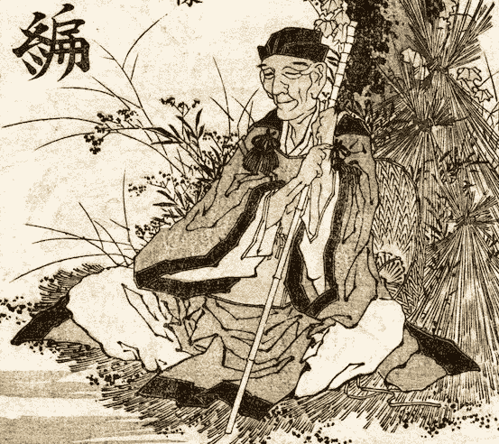

# 俳句诗

> 原文：<https://medium.com/mlearning-ai/haiku-7e0097abb308?source=collection_archive---------4----------------------->

## 艾将大师巴什与伟大的北斋、弘重、吉田和哈穗集合在一起

*Matsuo* Bashō*, painted by* Katsushika Hokusai (Public domain)

伟大的日本诗人松尾芭蕉(1644-1694)因其对“T2”俳句的发展和掌握而备受尊敬。

俳句通常由三个阶段组成，分别包含五个、七个和五个音节。它与禅宗有着深刻的联系，尤其是在…