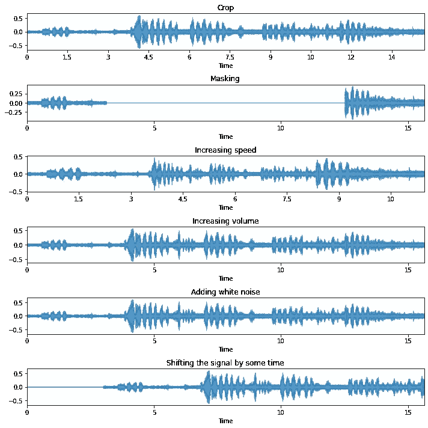
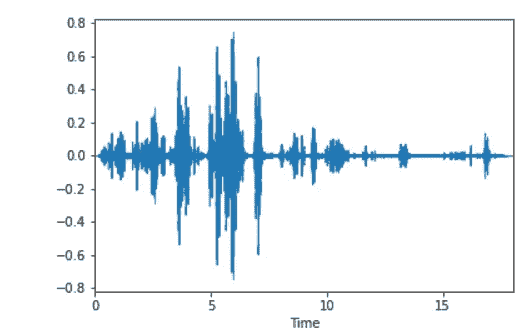
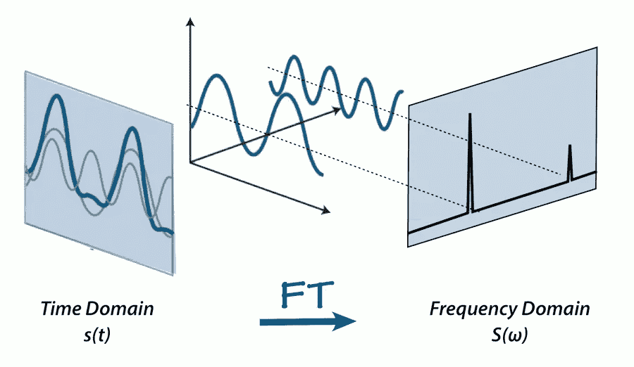
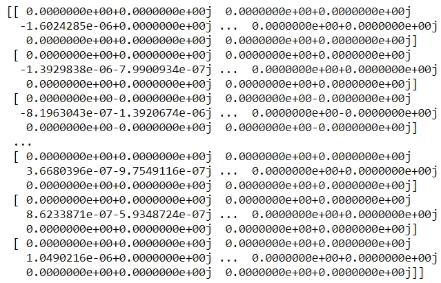
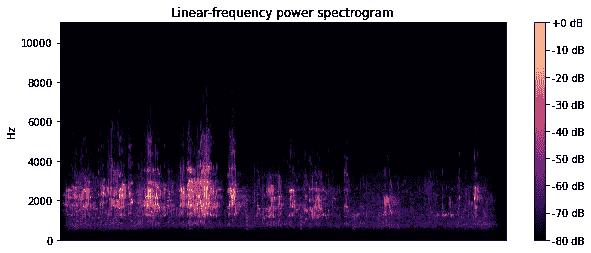
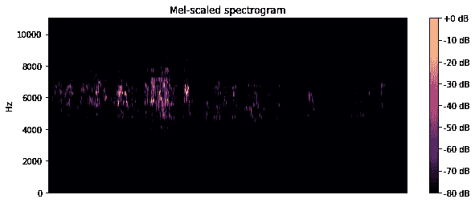
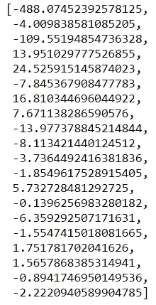

# 为机器学习处理音频数据

> 原文：<https://medium.com/mlearning-ai/handling-audio-data-for-machine-learning-7ba225f183cb?source=collection_archive---------2----------------------->


这篇文章的主要目的是阐明准备音频数据进行分析的过程以及与音频数据相关的复杂概念。

我发现在做一个关于鸟类声音识别的个人项目时，处理音频数据很乏味。让它变得如此困难的事实是，有许多与音频相关的概念，人们必须理解才能按照他们的要求自由地操纵它。最重要的是，与计算机视觉和自然语言处理相比，使用机器学习或音频识别的音频数据分析较少进行。

# 目录

1.  什么是音频数据？
2.  加载数据
3.  数据争论和扩充
4.  特征提取和可视化

# 什么是音频数据？

首先，音频数据是一种非结构化数据，需要花费大量精力来处理和准备分析。但是一旦它被转换成可管理的格式，它会提供大量有用的信息

## 常见术语的分类:

**音频**:以波的形式传播的振动

**采样**:将连续信号转换成数字信号

**样本**:通常表示某一时间点的振幅值

**采样率**:每秒记录的音频样本数(单位为赫兹)

**振幅**:声波的高度值

**频率/音高**:每秒产生的总波数

> 我们通常通过将声波转换成一系列数字样本来表示数字音频。

**时域**:在该域中，音频信号是振幅(y 轴)随时间(x 轴)变化的波。

**频域**:在该域中，音频信号被表示为一系列频率(x 轴)及其相关功率(y 轴)

## 常用的声音格式:

有三种最常用的数字音频格式:

*   **wav** (波形音频文件)格式
*   **mp3** (MPEG-1 音频层 3)格式
*   **WMA** (Windows Media 音频)格式

为了避免 mp3 音频压缩造成的信息丢失，我们更倾向于使用 wav 音频格式进行数据分析。

# 加载数据

我们先来听一个 Python 中的音频文件。

```
import IPython.display as ipdipd.Audio('D:/wavAudio/1.wav')
```


Audio Player — Image by Author

Librosa 库提供了加载和处理音频数据的实用工具。

```
import librosasignal, sample_rate = librosa.load('D:/wavAudio/1.wav',sr = None) 
# sr = None makes sure the native sample rate of audio is used.
```

Librosa 产生一个标准化的音频时间序列样本数组。

# 数据争论和扩充

*   音频中的无声部分给数据增加了不必要的噪音(哦，讽刺！).让我们移除它们。

```
def removeSilence(signal):
    return signal[librosa.effects.split(signal)[0][0] : librosa.effects.split(signal)[0][-1]]
```

*   对于每个超过 10 秒的音频片段，让我们将它们分成 5 秒的片段，以获得更多的训练实例。

```
from pydub import AudioSegmentdef create_chunks(audio,filename):
    if len(audio) < 10000:
        return "Audio too small"
    chunk_no = 0
    t1 = 0
    for step in range(0,len(audio),5000):
        t2 = step
        if step == 0:
            t1 = step
            continue
        curr_chunk = audio[t1:t2]
        chunk_no += 1
        curr_chunk.export(filename + '-' + str(chunk_no) + '.wav', format="wav")
        t1 ,t2 = t2, t1for wav in os.listdir('D:/wavAudio/'):
    audio = AudioSegment.from_wav('D:/wavAudio/' + wav)
    create_chunks(audio,wav[:-4])
```

> 在进行我的项目时，我面临着一个恼人但常见的困境，即没有足够的数据。与表格数据不同，处理非结构化数据的好处(可能是唯一的好处)是可以在不引入大量偏差的情况下扩充数据。

*   我已经列出了一些最常见的音频数据增强。我的首选是*响度*、*噪音、*和*偏移。*

```
import nlpaug.augmenter.audio as naasignal, sample_rate = librosa.load('D:/C Drive Documents/Bird_Sound_Recognition/Data for each bird/data/xeno-canto-dataset/AshyPrinia/' + 'DNPrinia570426.wav',sr = None)plt.figure(figsize = (10,10))plt.subplot(6,1,1)
plt.title("Crop")
librosa_display.waveplot(naa.CropAug(sampling_rate=sample_rate).augment(signal), sr=sample_rate, alpha=0.75)plt.subplot(6,1,2)
plt.title("Masking")
librosa_display.waveplot(naa.MaskAug(sampling_rate=sample_rate, mask_with_noise=False).augment(signal), sr=sample_rate, alpha=0.75)plt.subplot(6,1,3)
plt.title("Increasing speed")
librosa_display.waveplot(naa.SpeedAug().augment(signal), sr=sample_rate, alpha=0.75)plt.subplot(6,1,4)
plt.title("Increasing volume")
librosa_display.waveplot(naa.LoudnessAug().augment(signal), sr=sample_rate, alpha=0.75)plt.subplot(6,1,5)
plt.title("Adding white noise")
librosa_display.waveplot(naa.NoiseAug().augment(signal), sr=sample_rate, alpha=0.75)plt.subplot(6,1,6)
plt.title("Shifting the signal by some time")
librosa_display.waveplot(naa.ShiftAug(sampling_rate=sample_rate).augment(signal), sr=sample_rate, alpha=0.75)plt.tight_layout()
plt.show()
```



Different types of augmentation on audio — Image by Author

# 特征提取和可视化

## **普通波形图**

*   让我们首先想象一下最常见的振幅与时间关系曲线图

```
plt.figure(figsize = (10,15))
librosa.display.waveplot(signal,sr=sample_rate, max_points=50000.0, x_axis='time', offset=0.0, max_sr=1000)
plt.show()
```



Image by Author

这个情节没有给我们很多信息。让我们进一步处理音频。

## **傅立叶变换**

*   现在，让我们对音频信号进行傅立叶变换，以显示信号中的频率信息。

简单地说，傅立叶变换是音频信号从时域到频域的变换。



Image from [AAVOS](https://aavos.eu/glossary/fourier-transform/)

我们通常执行短时傅立叶变换，它对信号的每个小段/窗口执行变换，这对于捕捉信号的时变特性是有用的。

```
signal, sample_rate = librosa.load('D:/wavAudio/1.wav',sr = None)print(librosa.stft(signal))
```



## **谱图**

声谱图显示了一段时间内不同频率值的信号强度或响度(分贝)。

```
# Plot spectogram
plt.figure(figsize=(10, 4))
D = librosa.amplitude_to_db(np.abs(librosa.stft(signal)), ref=np.max)
# amplitude_to_db converts an amplitude spectrogram to dB-scaled spectrogram
librosa.display.specshow(D, y_axis='linear')
plt.colorbar(format='%+2.0f dB')
plt.title('Linear-frequency power spectrogram')
plt.show()
```



Image by Author

## **梅尔光谱图**

mel 谱图是转换为 mel 标度的谱图。

```
mel_scale_frequency = 2595 * log(1 + frequency/700)
```

*我开发的一个函数将音频信号和采样率作为输入，生成* mel-spectrogram *图像并存储在目标路径中。*

```
def mel_spectogram_generator(audio_name,signal,sample_rate,augmentation,target_path):
    S = librosa.feature.melspectrogram(y=signal,sr=sample_rate,
                                    n_fft=N_FFT,
                                    hop_length=HOP_SIZE, 
                                    n_mels=N_MELS, 
                                    htk=True, 
                                    fmin=FMIN, 
                                    fmax=sample_rate/2)plt.figure(figsize=(10, 4))
    librosa.display.specshow(librosa.power_to_db(S**2,ref=np.max), fmin=FMIN,y_axis='linear')
    plt.axis('off')
    plt.savefig(target_path + augmentation + audio_name[:-4] + '.png',bbox_inches='tight',transparent=True, pad_inches=0)
    plt.clf()
    plt.close("all")
    gc.collect()
```

*生成音频信号和增强音频信号的 mel 频谱图。*

```
# Parameters initialization
N_FFT = 1024         
HOP_SIZE = 1024       
N_MELS = 128            
WIN_SIZE = 1024      
WINDOW_TYPE = 'hann' 
FEATURE = 'mel'      
FMIN = 1400folder_path = 'D:/C Drive Documents/Bird_Sound_Recognition/Data for each bird/data/xeno-canto-dataset/White-throatedKingfisher/'for wav in os.listdir(folder_path):
    signal, sample_rate = librosa.load(folder_path + str(wav) ,sr = None)mel_spectogram_generator(wav,signal,sample_rate,'',folder_path)
    print(wav)
    mel_spectogram_generator(wav,naa.LoudnessAug().augment(signal),sample_rate,'Loud',folder_path)
    print('Loud' + wav)
    mel_spectogram_generator(wav,naa.NoiseAug().augment(signal),sample_rate,'Noise',folder_path)
    print('Noise' + wav)
    mel_spectogram_generator(wav,naa.ShiftAug(sampling_rate=sample_rate).augment(signal),sample_rate,'Shift',folder_path)
    print('Shift' + wav)
```

*让我们看看如何可视化单个音频信号的梅尔频谱图*

```
# Plot mel-spectrogram
N_FFT = 1024         
HOP_SIZE = 1024       
N_MELS = 128            
WIN_SIZE = 1024      
WINDOW_TYPE = 'hann' 
FEATURE = 'mel'      
FMIN = 0S = librosa.feature.melspectrogram(y=signal,sr=sample_rate,
                                    n_fft=N_FFT,
                                    hop_length=HOP_SIZE, 
                                    n_mels=N_MELS, 
                                    htk=True, 
                                    fmin=FMIN, 
                                    fmax=sample_rate/2)plt.figure(figsize=(10, 4))
librosa.display.specshow(librosa.power_to_db(S**2,ref=np.max), fmin=FMIN,y_axis='linear')
plt.colorbar(format='%+2.0f dB')
plt.title('Mel-scaled spectrogram')
plt.show()
```



Image by Author

> 在用于音频识别的卷积神经网络中，频谱图通常不用作输入图像。相反，我们使用 mel 光谱图，因为据说它在人类可以感知的频率范围内。

## 梅尔频率倒谱系数(MFCC)

> MFCC 作为一种音乐信息检索方法。信号的 mel 频率倒谱系数(MFCCs)是一小组特征(通常约 10–20)，它们简明地描述了频谱包络的整体形状。在 MIR 中，常用来形容音色。——[https://musicinformationretrieval.com/mfcc.html](https://musicinformationretrieval.com/mfcc.html)

```
def mfcc_features(signal,sample_rate):
    return np.mean(librosa.feature.mfcc(y=signal, sr=sample_rate, n_mfcc=20).T,axis=0).tolist()mfcc_features(signal,sample_rate)
```



MFCC Features — Image by Author

我们得到一组 20 个特征，它们封装了音频信号中的所有信息。太棒了。将这些输入特征(以及标签)输入任何专注于分类的机器学习模型，包括你自己的人工神经网络(如果你有足够的音频剪辑来利用这一点的话！).

> 免责声明:我没有音频信号处理方面的专业知识。

说到这里，我试图从我如何着手开发自己的音频识别项目([https://github.com/msvrk/Bird_Sound_Recognition](https://github.com/msvrk/Bird_Sound_Recognition))来解释所有的基本概念和方法。我唯一的目的是通过提供一个简单的指南来帮助任何不熟悉音频数据的人。

*最后，永远记住* …


Image from [Pinterest](https://www.pinterest.com/pin/616500636467787144/)