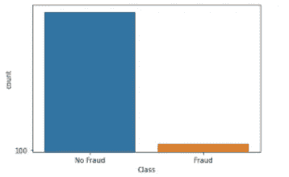
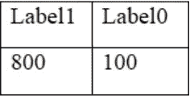
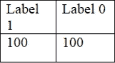
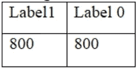

# 处理不平衡数据

> 原文：<https://medium.com/mlearning-ai/handling-imbalanced-data-c69c917378db?source=collection_archive---------5----------------------->

在分类问题中，我们可能经常会遇到数据集中的不平衡。这意味着我们的班级在结果的频率上有显著的差异。对于二元分类问题，这可能意味着有 10，000 个样本或行具有类标签 1，而只有 10 行具有标签 0。在信贷欺诈检测的情况下，有可能存在大量的非欺诈案件而缺乏欺诈案件。另一方面，常用的 iris 数据集是一个平衡数据集，因为它对所有三种花卉都有相同数量的样本。

Imbalanced data

## 但是这里面临的挑战是什么？

为了预测患者是否患有癌症、将电子邮件分类为垃圾邮件还是非垃圾邮件以及其他类似场景，我们通常必须更加关注少数类别，即患有癌症的患者或垃圾邮件。但在默认情况下，机器学习算法往往会偏向多数类，从而导致不正确的预测。他们忽视了少数群体，尽管这通常是重点群体，但他们的表现很差。在实现最大似然算法之前，我们必须平衡我们的数据。

处理不平衡数据的技术:

## 1.欠采样

这里，我们减少了多数类中的样本数量，使其与少数类样本的频率相匹配。假设我们有 1000 个样本和两个类，0 和 1。有 800 个标签为 1 的样本，只有 100 个标签为 0 的样本。这显示了明显的不平衡。基于这样的数据直接建立一个模型将会产生虚假的结果。解决这个问题的一个方法是欠采样。

A.随机欠采样-通过仅使用从我们的 1 类样本中随机选择的某些行来创建平衡，以使其与 0 类样本匹配或成比例。

这里，欠采样可以通过从第一类的 800 个样本中随机选取 100 个来完成。这给了我们总共 200 个矢量。

这个数据现在达到了理想的平衡，因为我们两个类的样本数量相等。通过使用这种方法，我们将得到正确的结果，但这是以丢失有价值的数据为代价的，这在大多数情况下是不可行的。

B.未遂欠采样-该技术考虑了多数类点相对于少数类的距离(使用欧几里德距离或其他类似的距离度量)。如果两个点(其中一个属于较大的类，另一个属于较小的类)彼此接近，则消除多数类数据点，以尝试使数据集平衡。

> 接近缺失欠采样-1:它考虑到少数类的三个最近实例的平均最小距离，以便消除多数类的数据点。
> 
> 接近缺失欠采样-2:它考虑多数类点到少数类的三个最远实例之间的平均最小距离。
> 
> 未遂欠采样-3:它为少数类中的每个实例选择固定数量的最接近的多数类实例。

C.Tomek 链接-考虑所有的 tomek 链接(属于不同类但彼此最近邻的点),并从中排除大多数类实例。

D.编辑过的最近邻(ENN)-那些其类别标签与其 k 个最近邻中的大多数不相同的多数类别样本被根除。它可以扩展到重复 ENN，其中 ENN 应用，直到所有这样的样本被删除。

## 2.过采样

这里我们保持多数类样本的数量不变，并增加属于少数类的样本的频率(这里为 800)。

A.随机过采样-这是通过随机复制样本来实现的。这给了我们

我们现在总共有 1600 个样品(其中 700 个是重复的)。这种技术经常使用，但是复制的样本不会给模型增加任何新的信息，并且会导致过度拟合。

B.SMOTE(合成少数过采样技术)- SMOTE 是一种过采样方法，使用 k 近邻(knn)算法。

> 1.选择 k(默认值=5)。
> 
> 2.随机选择少数类数据点并找到其 k 个最近邻，通常基于欧几里德距离。
> 
> 3.在最近邻和少数数据点之间创建一个向量。
> 
> 4.在这些线上的某处人工生成一个合成数据点。我们也可以在一个链接上有多个样本。
> 
> 5.重复这些步骤，直到我们得到相同数量的多数和少数类样本。

考虑来自少数类(x1，y1)的数据点及其最近的邻居之一为(x2，y2)。现在可以使用以下方法生成新点:

(x '，y')= (x1，y1) + rand(0，1)* ((x2，y2)-(x1，y1))

其中，(x’，y’)是合成生成的新数据点

(x1，y1)是我们选择的少数类数据点

rand(0，1)给出一个介于 0 到 1 之间的随机数，乘以最近邻和原始数据点之间的差值。

然而，SMOTE 有一些缺点，包括创建的数据点重叠。当我们的数据中存在异常观察值时，创建合成数据点可能会导致不同类别之间的重叠点。

C.这个问题可以通过使用边界 SMOTE 解决。与少数类相比，具有多数类的所有邻居或多数类的更多邻居的少数类的观察值分别被称为噪声点和边界点。边界线 smote 将忽略噪声点，并考虑边界点来生成数据。因此，它忽略了异常值，并防止数据点重叠。然而，缺点是该技术最终会忽略某些数据。

D.ADASYN(自适应合成采样)-它类似于 SMOTE 方法，但是它不是预测严格位于少数样本与其 k 个最近邻样本之间的线上的点，而是预测方差稍大的点，即它们有点分散。它不像 smote 那样关注边界，有助于克服前一种技术的问题。

ADASYN 方程:

1.计算多数阶级和少数阶级的比率。

d = mᵣ / mₓ

2.计算要创建的综合观测值的数量(多数类和少数类样本数量之间的差异)

G = (mₓ — mᵣ) × β

如果β = 1，则意味着数据集将完全平衡。

3.计算属于多数类的邻居与所选 k 值的比率。

**rᵢ=δᵢ/k**

4.将上一步的输出转换为概率密度分布。

**rₓ ← rᵢ / ∑ rᵢ**

5.对于每个单独的点，确定可以生成多少个点。

因此，如果一个点在多数类中具有更多数量的邻居，则该点将具有更高的 rᵢ，从而可以为其生成更多的合成点。