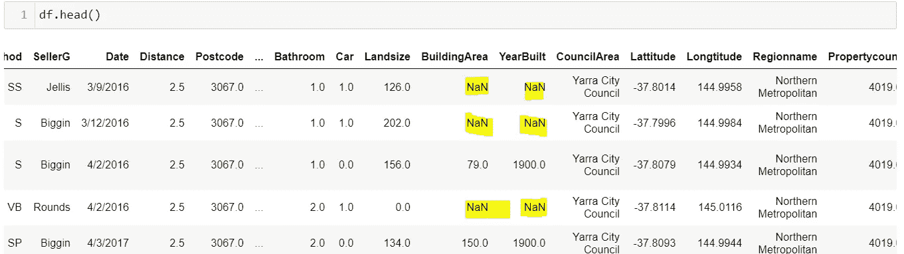
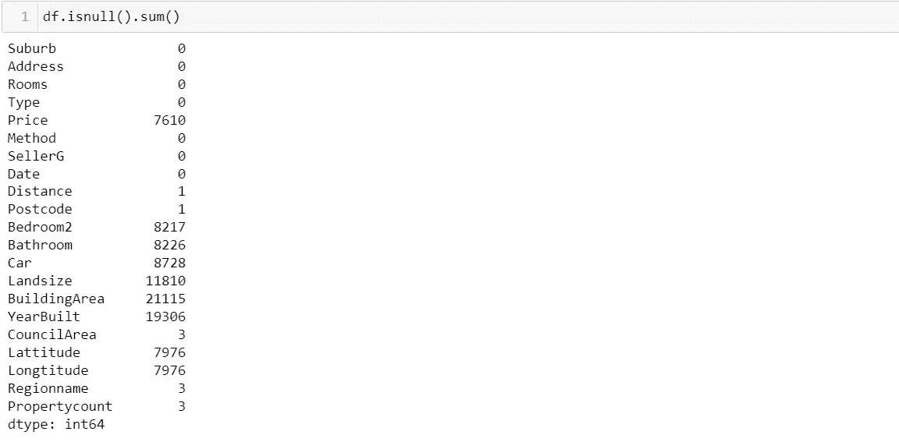
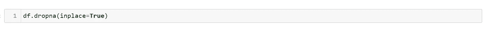
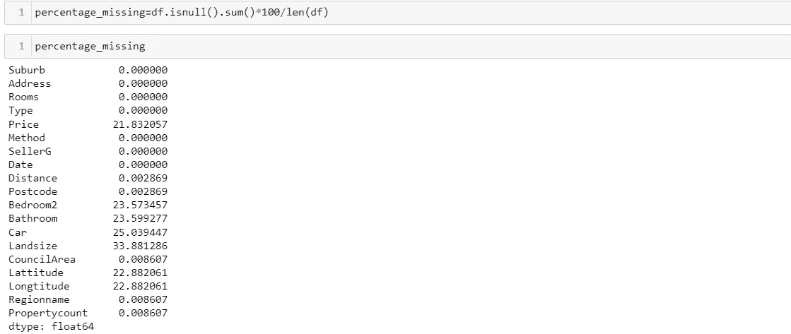
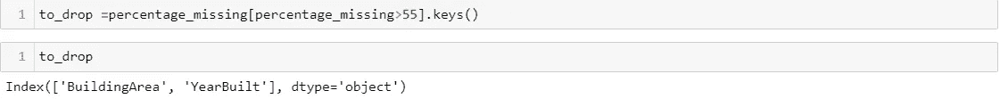
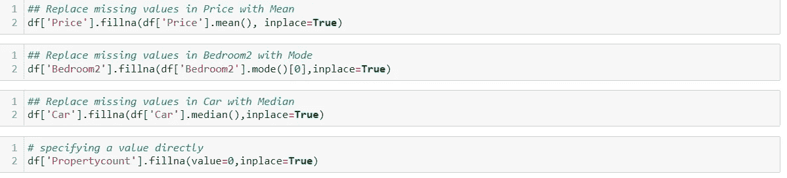
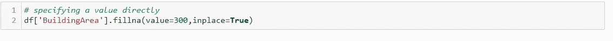
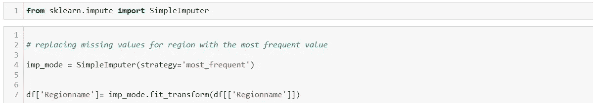
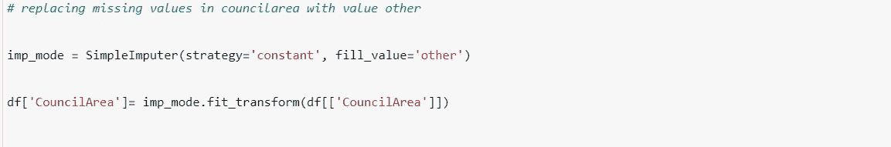
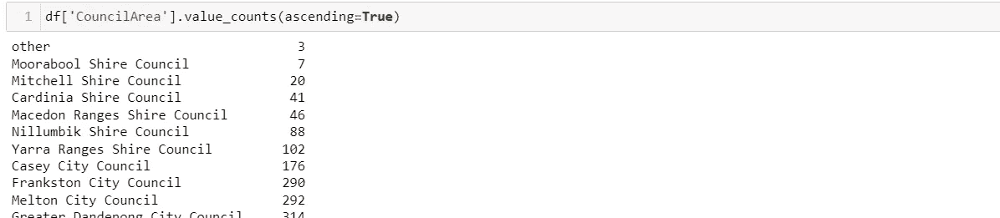

# 处理缺失值—数据科学

> 原文：<https://medium.com/mlearning-ai/handling-missing-values-data-science-7b8e302264ee?source=collection_archive---------1----------------------->

Photo by [Crissy Jarvis](https://unsplash.com/@crissyjarvis?utm_source=unsplash&utm_medium=referral&utm_content=creditCopyText) on [Unsplash](https://unsplash.com/s/photos/math?utm_source=unsplash&utm_medium=referral&utm_content=creditCopyText)

# 本文中使用的数据集和笔记本可以在这里找到:

完整笔记本链接:[处理缺失值](https://github.com/Jnjerry/ArticlesCode/blob/main/Handling%20Missing%20Values/Handling%20Missing%20Values.ipynb)

数据集链接:[墨尔本房屋数据集](https://github.com/Jnjerry/ArticlesCode/blob/main/Handling%20Missing%20Values/Melbourne_housing.csv)

# 介绍

一个完美的数据集通常是任何数据科学家或机器学习工程师的大赢家。不幸的是，通常情况下，用于解决不同数据科学用例的数据集会有缺失数据。缺失数据仅仅意味着数据集中的一些单元格是空的。

# 丢失数据的原因

*   数据不是有意填充的，尤其是当它是可选字段时。
*   数据被破坏。
*   人为错误。
*   如果是调查，参与者可能会中途退出调查。
*   如果数据是由计算机应用程序自动生成的，那么故障可能会导致数据丢失。记录日志的传感器出现故障。
*   故意删除数据的欺诈行为。

在分析数据集时，您需要戴上研究帽。这意味着，如果你有资格向数据保管人询问丢失数据的原因，那么就去做吧。如果没有，也没关系。不管您是否知道丢失数据的原因，您仍然需要识别您丢失的值并处理它们。

# **缺失值的问题**

大多数机器学习算法都无法处理不完整的数据。对于某些算法来说，这可能是好的，但在其他情况下，这可能会导致结果偏离真实结果。

# 处理缺失值

如何处理缺失值将取决于您的问题陈述和数据。有 3 种主要方法来处理缺失值。

1.  删除缺少值的列—如果有一列缺少 80%以上的值，那么最好删除该列。
2.  删除有缺失值的行—如果有一小部分行有缺失值，那么您可以删除这些行。假设您有 100 万条记录，其中只有 20 行有缺失值，那么您可以删除这些行，因为它们不会从您的数据中带走很多信息。
3.  输入缺失值—这通常是处理缺失值的首选方式，尤其是缺失值不超过 80%的情况下。估算意味着用有效值填充缺失值，例如用平均值、众数或中值替换缺失值。

# 处理熊猫中缺失的值

Pandas 在发现一个丢失的值时会写入值`NaN`(不是一个数字)。

# 检查缺失值

为了检查 Pandas 中缺失的值，我们使用 isnull 函数。结果是，布尔值真和假。我们将 isnull 函数与 sum 函数结合使用，以获得缺失值的计数，或者简单地说，在布尔结果为真的情况下。

# 处理缺失值备选方案

1.  **删除缺少值的行。**如果记录包含一些缺失值，我们可以删除所有缺失值的行。这种技术会导致信息丢失**，因此当丢失值的行数很多时，不应该使用这种技术。**

2.**删除缺少值的列**。如果我们的列中有非常多的缺失值(假设列中 80%的数据缺失)，那么我们可以删除这些列。为此，您可以首先获取列中缺失值的百分比。

有了上面的输出，您现在可以决定设置想要删除的缺失值的百分比阈值。对于这个场景，我将删除丢失值超过 55%的列。**(理想的数字是 80%)**

我们将使用 drop 函数从输出 Building Area 和 YearBuilt 中删除列。

3.**用平均值、众数或中值(数字数据)替换缺失值—** 该技术更适用于数字特征。然而，请注意，这种方法会增加方差和偏差误差。

我们使用 [Pandas](https://pandas.pydata.org/docs/reference/api/pandas.DataFrame.fillna.html) fillna 函数来做这件事。

您的业务规则也可以有指定的值来填充您缺少的值。您也可以直接指定值，例如，默认情况下，我将所有缺失值的 BuildingSize 替换为 size 100。

3.**用最频繁或常数值(分类数据)替换缺失值**

使用平均值、众数和中位数进行输入最适合数值。对于分类数据，我们可以使用最常见的值或常量值进行估算。

让我们通过指定**strategy = ' most _ frequency '**,使用 sklearn 估算包用最频繁的值替换分类数据

上面的代码将用最频繁出现的区域替换 Regionname。

让我们使用 sklearn 估算包，通过指定 **strategy='constant '来用一个常数值替换分类数据。**您还需要通过指定 fill_value 来包含哪个值将被填充。在我们的例子中，我们将使用名为“其他”的值来填充“委员会区域”列中缺少的值。当在上下文中为用例设置了业务规则时，也可以使用这种技术。

您现在可以看到，我们在“CouncilArea”列中添加了一个名为“other”的新类别。

4.**使用算法预测缺失值—** 如果要替换分类值，请使用分类算法。如果预测一个连续的数字，我们使用回归算法。这种方法也很好，因为它产生无偏估计。

# 本文中使用的数据集和笔记本可以在这里找到:

完整笔记本链接:[处理缺失值](https://github.com/Jnjerry/ArticlesCode/blob/main/Handling%20Missing%20Values/Handling%20Missing%20Values.ipynb)

数据集链接:[墨尔本房屋数据集](https://github.com/Jnjerry/ArticlesCode/blob/main/Handling%20Missing%20Values/Melbourne_housing.csv)

 [## Mlearning.ai 提交建议

### 如何成为 Mlearning.ai 上的作家

medium.com](/mlearning-ai/mlearning-ai-submission-suggestions-b51e2b130bfb)