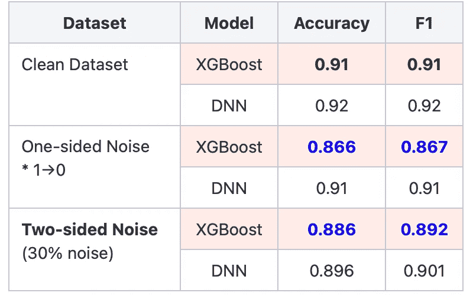
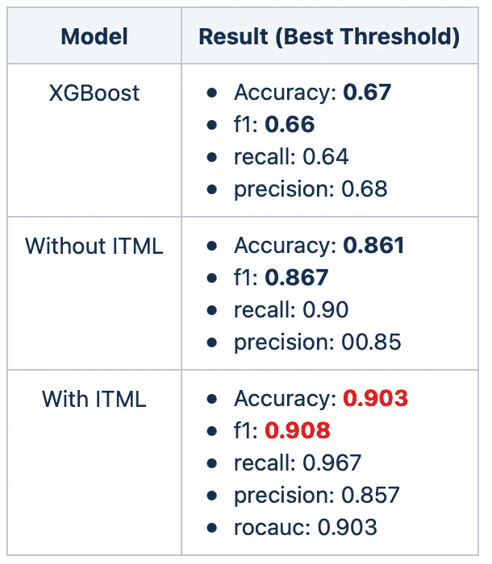

# 利用深度学习处理有噪声的标签数据

> 原文：<https://medium.com/mlearning-ai/handling-noisy-label-data-with-deep-learning-ff986deedc76?source=collection_archive---------1----------------------->

当你的数据集被粗略标记时，在这些数据上实际执行任何深度学习技术都不容易。结果不可信。然而，如果您非常确定您的大多数数据都被正确标记，但有些数据没有，那么您可以将数据输入到深度学习模型中，并使用噪声校正技术。因此，以下是处理高噪声标注数据集时可能需要参考的步骤:

## 1。 **使用深度学习模型而不是传统的 ML 模型**

从本质上讲，深度学习模型可以处理训练数据集中 10–20%的噪声。然而，传统的机器学习模型，如 XGBoost 或任何基于树的模型，在用嘈杂的训练数据集进行训练时，会很快崩溃。XGBoost 和 LGBM 等基于树的模型以其处理表格数据的强大性能而闻名。历史上，这些模型赢得了许多卡格尔比赛。然而，它们可能不太适合处理真实世界的噪声数据集。

下表显示了 XGBoost 在高噪声数据集上训练时的性能下降情况。



Table 1

通过将 20%的噪声注入到干净的数据集中来构成有噪声的数据组。来自阳性类别(1)的样本被故意更改为阴性类别(0)。因此，数据集现在是用单侧噪声合成生成的。双侧噪声数据集是通过在两个类上插入噪声而创建的。大约 15%的 0 类样品转化为 1 类样品，反之亦然。结果是数据集中 30%的噪声。非常有趣的是，XGBoost 在双侧噪声数据集上表现稍好，与单侧噪声数据集相比，双侧噪声数据集包含更多噪声。解释这种现象的假设是，单侧噪声仅将基于树的模型的决策边界移动到一侧，而双侧噪声数据集将在两侧移动边界，导致决策边界没有变化。从上表中可以看出，噪音对 DNN 的表现没有太大影响。然而，随着噪声被引入到训练数据集中，XGBoost 的性能迅速恶化。

## 2。为验证和测试集创建干净的数据集

只要有足够的数据集，并且噪声在数据集中的比例不是压倒性的，深度学习模型就可以很好地处理训练数据集中的噪声。然而，我们需要一个 100%干净的数据集来进行验证和测试，这样模型的性能就可以用一种值得信赖的方式来衡量。验证和测试集的大小不需要很大。它可能很小，但需要非常精确的标签。实际上，创建这样干净的数据集可能既困难又昂贵。如果我们对数据集无能为力，我们能做什么？谢天谢地，有办法处理这种情况。

## 3。发挥损失功能

当您能够以某种方式构建准确的验证和测试集时，您有多种选择。例如，您可以最小化一组与评估程序一致的无偏倚的干净验证示例的损失。“[学习重新加权稳健深度学习的示例](https://arxiv.org/pdf/1803.09050.pdf)”如果您能够构建一个没有噪声的验证数据集，那么这是一篇实现重新加权技术的出色论文。

处理复杂情况的一种方法是，利用一种称为[迭代调整损失最小化](http://proceedings.mlr.press/v97/shen19e/shen19e.pdf) ( **ITLM** )的技术，我们所拥有的只是一个粗略标记的数据集。ITLM 的美妙之处在于它不需要任何确定的干净数据。本文的思想是在训练的早期阶段，干净样本的学习曲线应该比坏样本的学习曲线好。微调损失意味着共同选择 *αn* 样本θ的子集，使得在子集和参数的所有选择中，该子集的损失最小。为了将损失降至最低，您可以在**之间交替进行:( a)选择电流损失最小的样本**和**;( b)在这些电流损失最小的样本上重新训练模型**。通过迭代执行微调损失，您可以在早期阶段过滤掉不良样本。您可以使用提前停止来更好地选择坏的样本，因为在以后的回合中，一切都会开始过度。

这是 ITLM 的张量流实现:

```
alpha = 0.95class CustomModel(keras.Model):
    def train_step(self, data):
        # Unpack the data. Its structure depends on your model and
        # on what you pass to `fit()`.
        x, y = data
        _len = y.shape[0]
        _alpha = alpha
        _idx = math.floor(_len*_alpha)# forward for get loss from every samples
        y_pred = self(x, training=False)  # Forward pass
        loss_ITLM = keras.losses.binary_crossentropy(y, y_pred)
        loss_ITLM_np = loss_ITLM.numpy()
        argsort = np.argsort(loss_ITLM_np) # get new training data
        x, y = tf.gather(x, argsort[:_idx]), tf.gather(y, argsort[:_idx]) with tf.GradientTape() as tape:
           y_pred = self(x, training=True)  # Forward pass
           # Compute the loss value
           # (the loss function is configured in `compile()`)
           loss = self.compiled_loss(y, y_pred, regularization_losses=self.losses) # Compute gradients
        trainable_vars = self.trainable_variables
        gradients = tape.gradient(loss, trainable_vars)
        # Update weights
        self.optimizer.apply_gradients(zip(gradients, trainable_vars))
        # Update metrics (includes the metric that tracks the loss)
        self.compiled_metrics.update_state(y, y_pred)
        # Return a dict mapping metric names to current value
        return {m.name: m.result() for m in self.metrics}
```

请注意，α是超参数，所用纸张是 0.95。

您可以构建自己的深度学习模型。我建立了四层 DNN 模型，在每个完全连接的层之间使用批处理规范化。

```
input_layer = Input(shape=(9,), name='input_layer')Dense_1 = Dense(8, activation = 'relu', kernel_initializer = HeNormal(seed=1))(input_layer)batch_norm = BatchNormalization(momentum = 0.9)(Dense_1)Dense_2 = Dense(5, activation = 'relu', kernel_initializer = HeNormal(seed=1))(batch_norm)batch_norm_2 = BatchNormalization(momentum = 0.9)(Dense_2)Dense_3 = Dense(4, activation = 'relu', kernel_initializer = GlorotUniform(seed=1))(batch_norm_2)batch_norm_3 = BatchNormalization(momentum = 0.99)(Dense_3)Dense_4 = Dense(2, activation = 'relu', kernel_initializer = HeNormal(seed=1))(batch_norm_3)batch_norm_4 = BatchNormalization(momentum = 0.9)(Dense_4)output_layer = Dense(1, activation='sigmoid', kernel_initializer = GlorotUniform(seed=1))(batch_norm_4)
```

最后，编译您配备 ITLM 的定制模型。在 TensorFlow 中，您可以通过将“*run _ 热切*”设置为 true 来调试您的模型。

```
model = CustomModel(input_layer, output_layer)model.compile(loss='binary_crossentropy', optimizer=Adam(learning_rate=0.001),  metrics=['acc', 'Recall', 'AUC'], run_eagerly=True)
```

下表总结了在单侧噪声数据集上训练和测试的结果(请注意，该数据集与表 1 不同)。



结果表明，利用 ITLM 提高了 DNN 模型的整体准确性和 F1 值！当面临粗标注数据集问题时，ITLM 等技术可以极大地帮助您的模型从嘈杂的数据集设置中学习。

*参考文献* 任，m，曾，w，杨，b，&乌尔塔松，R. (2018)。学习重新加权健壮深度学习的例子。 *ICML*

沈和桑哈维(2019)。通过迭代修整损失最小化用坏训练数据学习。 *ICML* 。

[](/mlearning-ai/mlearning-ai-submission-suggestions-b51e2b130bfb) [## Mlearning.ai 提交建议

### 如何成为 Mlearning.ai 上的作家

medium.com](/mlearning-ai/mlearning-ai-submission-suggestions-b51e2b130bfb)