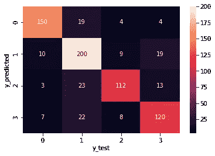
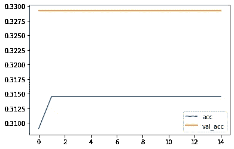
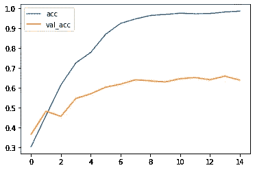

# 自然语言处理实践

> 原文：<https://medium.com/mlearning-ai/hands-on-nlp-natural-language-processing-8224385663a5?source=collection_archive---------2----------------------->

详细介绍单词包、TF_IDF、RNN、GRU 和 LSTM。


Photo by [Lazar Gugleta](https://unsplash.com/@lazargugleta?utm_source=medium&utm_medium=referral) on [Unsplash](https://unsplash.com?utm_source=medium&utm_medium=referral)

是啊！Alexa 是从 NLP 建模设计的。

但是，NLP 是如何工作的，它是如何被设计用于建模的？

在本文中，我将为 NLP 建模准备数据。此外，我会从理论和代码两方面详细解释一切。

# 什么是自然语言处理？

自然语言处理是用人类语言构建与机器交互的模型。这是语言学、计算机科学和人工智能的子领域。

NLP 只不过是设计通过人类命令进行交互的系统。由于命令只是文本格式，因此模型需要根据文本信息进行训练。为了做到这一点，NLP 只有很少的属性来使文本信息正确排序以用于建模。

一旦文本准备好了，我们就可以开始用一些技术来训练我们的模型，以便更好地预测 NLP 模型。像 RNN、GRU 和 LSTM 的技巧。此外，我还展示了一些其他技术，如单词袋、TF-IDF、Word2Vec 和 ML 算法。

# 建模文本准备中应遵循的步骤

1.  **标记化**

它被用来把文章分成句子和单词。我们可以利用标记化把文章分解成句子，句子分解成单词。

```
import nltk
from nltk.tokenize import sent_tokenize
from nltk.tokenize import word_tokenizetext = 'I like to watch cricket news. But, I love to watch movies than cricket. Can we go to library by tomorrow.'sentence = sent_tokenize(text)
sentenceOutput : 
['I like to watch cricket news.',
 'But, I love to watch movies than cricket.',
 'Can we go to library by tomorrow.']
```

## 2.堵塞物

它被用来切词。词干化只不过是缩短单词。

三种类型的词干:

*   **波特斯特默**

```
from nltk.tokenize import word_tokenize
from nltk.stem import PorterStemmertext='NLP is good and easy to learn with no efforts'words=word_tokenize(text)
wordsps = PorterStemmer()for words in words:
    print(ps.stem(words)) Output : 
words- ['NLP', 'is', 'good', 'and', 'easy', 'to', 'learn', 'with', 'no', 'efforts']nlp
is
good
and
easi
to
learn
with
no
effort
```

*   **兰卡斯特·斯坦默**

```
from nltk.stem import LancasterStemmer
lst=LancasterStemmer()words_to_stem=['call','calling','caller','called']
for words in words_to_stem:
    print(words+":"+lst.stem(words)) Output :
call:cal
calling:cal
caller:cal
called:cal
```

*   **雪球阻止器**

```
from nltk.stem import SnowballStemmer
sbs=SnowballStemmer(lang)words_to_stem=['call','calling','caller','called']for words in words_to_stem:
    print(words+":"+sbs.stem(words)) Output :
call:call
calling:call
caller:caller
called:call
```

## 3.词汇化

它类似于词干提取，但通过词汇化获得完整单词的含义。正如我们所见，上述代码的输出没有任何意义。因此，通过使用词汇化，我们可以从文本中获得有意义的完整单词。

```
from nltk.stem import WordNetLemmatizer
word_len=WordNetLemmatizer()words_to_stem=['call','calling','caller','called']for words in words_to_stem:
    print(words+":"+word_len.lemmatize(words)) Output :
call:call
calling:calling
caller:caller
called:called
```

## 4.停用词

停用词是在文本中最经常出现的词，但是对于构建 NLP 模型来说，这些词不是必需的。通过文本中的这些停用词，模型有时会因预测而产生噪音。所以我们可以用 NLP 中的语法删除这些单词。

```
import nltk
from nlkt.corpus import stopwords
stopwords.words('english')     ## We can use any specific languages
```

在上面的代码中，我用英语来处理英语语言。所以我们可以指定任何我们想要处理的语言。

## 5.位置标签

对于任何带有标签分配的语言，它都可以作为文本中句子的词性。和 POS 标签是不需要的。

```
sample='Have u find the person your searching for past one week'
sample_tokens=word_tokenize(sample)for words in sample_tokens:
    print(nltk.pos_tag([words])) Output :
[('Have', 'VB')]
[('u', 'NN')]
[('find', 'VB')]
[('the', 'DT')]
[('person', 'NN')]
[('your', 'PRP$')]
[('searching', 'VBG')]
[('for', 'IN')]
[('past', 'NN')]
[('one', 'CD')]
[('week', 'NN')]
```

## 6.频率分布和 n 元图

文本中单词的频率。换句话说，就是文本中重复出现的最常见的单词。n 元语法只不过是文本或语音中 n 个项目(符号、单词和字母)的连续序列。这些 n 元语法也被称为带状疱疹。

```
from nltk.corpus import gutenberg,webtext
from nltk.tokenize import word_tokenize
from nltk.corpus import stopwords
from nltk import ngrams
from nltk.probability import FreqDiststopwords=stopwords.words('english')
filtered_words=[w for w in webtext.words('firefox.txt') if w not in stopwords and len(w)>3]ngrams=ngrams(filtered_words,5)
fdist=FreqDist(ngrams)
fdist.most_common(20) Output :
[(('launching', 'browser', 'window', 'binding', 'browser'), 6),
 (('Error', 'launching', 'browser', 'window', 'binding'), 5),
 (('allow', 'sites', 'removed', 'cookies', 'future'), 2),
 (('sites', 'removed', 'cookies', 'future', 'cookies'), 2)]
```

完成文本准备。

嘿伙计！机器只能理解数字。那么，如何处理字符串呢？？

然后我们可以在以下工具的帮助下进行文本编码:

1.  单词包(计数矢量器)
2.  TF-IDF (Tfidf 矢量器)
3.  Word2Vec

**单词袋**是文本数据中特征提取的方法

**TF-IDF** 是一种统计方法，用于判断词在文档集合中的相关出现。TF-IDF 重视生僻字。

**Word2Vec** 是 NLP 中使用的最突出的技术，它有大量的文本数据，每个单词都用一个称为向量的数字来表示。Word2Vec 重视不同单词之间的语义信息&关系。也表示为维度向量。

**注**:单词包和 TF-IDF 方法并不存储语义信息。

最重要的是，这些技术用于机器学习问题。当谈到神经网络时，我们必须学习更多关于文本编码的知识。

现在，让我们看看代码

导入包并加载数据

```
import pandas as pd
import numpy as np
from matplotlib import pyplot as pltdf = pd.read_csv('emotion-labels-train.csv')
df.head()label={'joy':0,'fear':1,'anger':2,'sadness':3}df.label=[label[i] for i in df.label]
print(df.label) import nltk
import re
from nltk.corpus import stopwords
from nltk.stem import PorterStemmer
from nltk.stem.wordnet import WordNetLemmatizer
wl=WordNetLemmatizer()
ps=PorterStemmer()
corpus=[]for i in range(0,len(tweets)):
    process=re.sub('[^a-zA-Z]',' ',tweets['text'][i])
    process=process.lower()
    process=process.split()

    process=[wl.lemmatize(word) for word in process if word not in stopwords.words('english')]
    process=' '.join(process)
    corpus.append(process)
```

使用单词袋

```
# Bag of Words or Count Vectorizerfrom sklearn.feature_extraction.text import CountVectorizer
cv=CountVectorizer(max_features=3000,ngram_range=(1,3))
x=cv.fit_transform(corpus).toarray()
```



Source: “Image by author”

在 ML 中使用决策树，我得到了 80 %的准确率。

让我们用神经网络检查一下，试着用很少的技术建立一个模型。

因为，重要的是要提到文本准备在 ML 和神经网络模型中是相似的。唯一的区别是文本编码技术的用法。

简单来说，

> 对于 ML，使用单词包、TF-IDF、Word2Vec 等..
> 
> 对于神经网络，使用一个热编码、填充序列、字嵌入等..

我认为这消除了 NLP 建模中的所有疑问。

快乐的脸！！


Photo by [Ben White](https://unsplash.com/@benwhitephotography?utm_source=medium&utm_medium=referral) on [Unsplash](https://unsplash.com?utm_source=medium&utm_medium=referral)

**什么是 One hot 编码？**

它是给文本中的单词分配不同的数字

**什么是填充序列？**

使文档或文本数据中的所有句子长度相同。其中通过用零填充，句子将具有相同的长度。我们可以对零使用后置或前置填充。

**嵌入:**

它们以高维的形式工作，使得相关的单词成为一维向量。

```
Embedding(vocab_size, embedding_dim, input_length = max_length)
```

*   嵌入维数是单词编码中矢量表示的维数。

```
# Building Simple RNN modelfrom tensorflow.keras.models import Sequential
embedding_vector=40model=Sequential([
    Embedding(vocab_size,embedding_vector,input_length=sent_len),
    tf.keras.layers.SimpleRNN(64,activation='relu'),
    tf.keras.layers.Dropout(0.3),
    tf.keras.layers.Dense(128,activation='relu'),
    tf.keras.layers.Dropout(0.3),
    tf.keras.layers.Dense(64,activation='relu'),
    tf.keras.layers.Dropout(0.3),
    tf.keras.layers.Dense(4,activation='softmax')
])model.compile(loss='sparse_categorical_crossentropy',optimizer='adam',metrics=['accuracy'])
```



Source: “Image by author”

```
# let's try with LSTM's and Bidirectional RNNmodel=Sequential([
    Embedding(vocab_size,embedding_vector,input_length=sent_len),
    LSTM(512,return_sequences=True),
    LSTM(512,return_sequences=True),
    Bidirectional(LSTM(256,activation='tanh')),
    tf.keras.layers.Dropout(0.2),
    Dense(256,activation='relu'),
    tf.keras.layers.Dropout(0.3),
    Dense(128,activation='relu'),
    Dense(4,activation='softmax')
])model.compile(loss='sparse_categorical_crossentropy',optimizer='adam',metrics=['accuracy'])
```



Source: “Image by author”

作为，我只用了 10 个时代得到了 68%。尝试通过改变学习率和参数调整来增加周期，以获得更好的精度。

# **结论**

这里用一个结论指出了整个建模过程。

要记住的几点:

*   使用标记化、词干化、词条化和停用词为建模准备文本。
*   机器只能理解数字，所以我们使用
*   机器学习问题:单词包，TF-IDF，Word2Vec 等..
*   深度学习问题:一个热编码，填充序列，单词嵌入

```
from tensorflow.keras.preprocessing.text import Tokenizer
```

*   分词器有“num_words”来分词，通过它我们可以调用“fit_on_texts”来对句子进行分词。
*   “num_words”用于指定要分词的最大单词数，并选择最常见的“n”个单词。
*   使用“word_index ”,我们可以看到分配给文本的索引号
*   通过“文本到序列”的方法，我们可以将文本转换成序列，这在自然语言处理中是很重要的。
*   通过填充序列，序列可以被填充，其中所有文本可以被分配相同的长度给输入模型。

本文中使用的所有代码和数据集都可以从我的 [GitHub](https://github.com/Akshit9/Emotions_Classifier) 中获得。

感谢您的阅读和关注。

如果你喜欢我的文章，点击拍手图标…

保持联系:

[](https://www.linkedin.com/in/akshithkumar-05/) [## Akshith Kumar -技术作家-机器学习| LinkedIn

### 查看 Akshith Kumar 在世界上最大的职业社区 LinkedIn 上的个人资料。阿克什思有 5 份工作列在…

www.linkedin.com](https://www.linkedin.com/in/akshithkumar-05/)