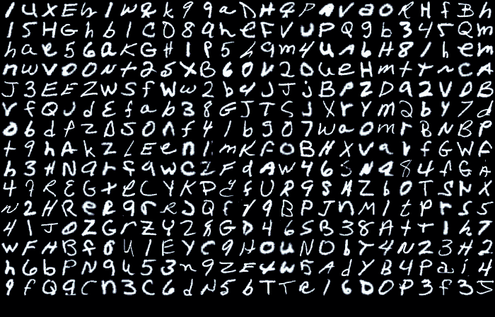
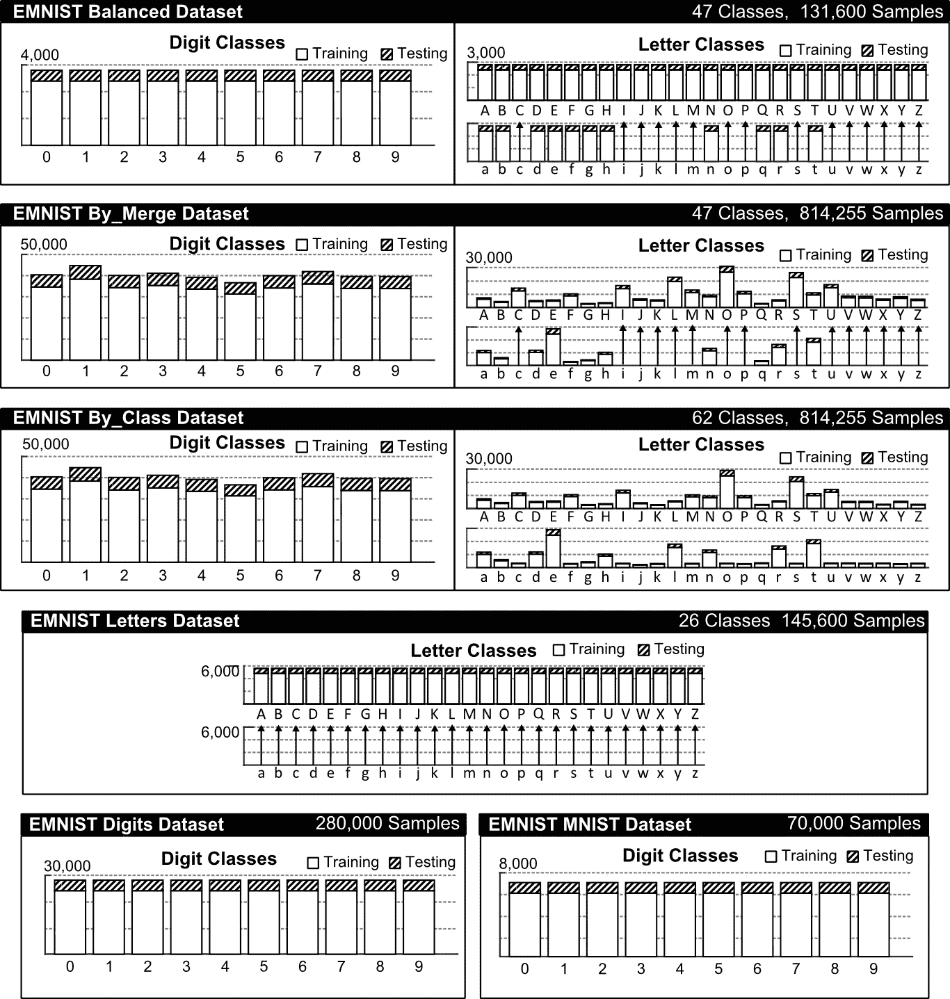
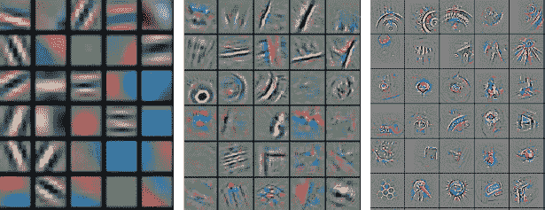
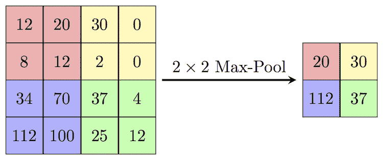
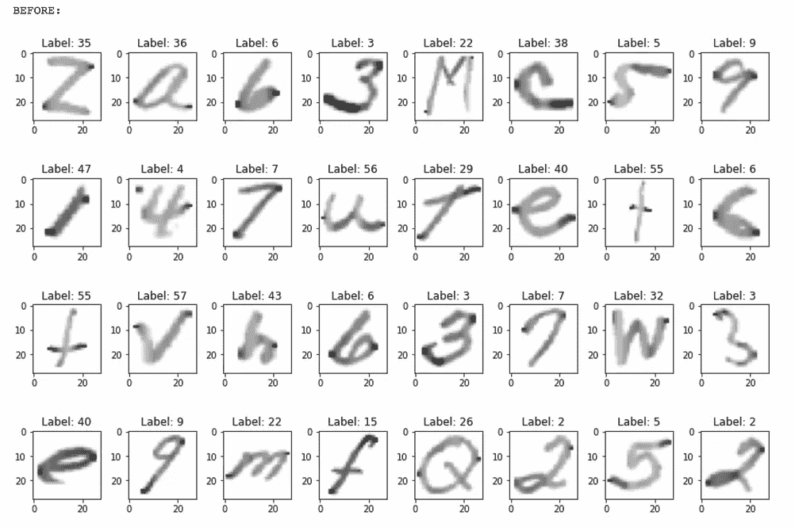
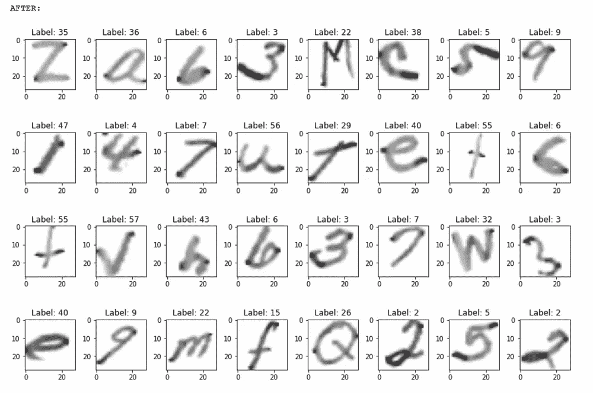
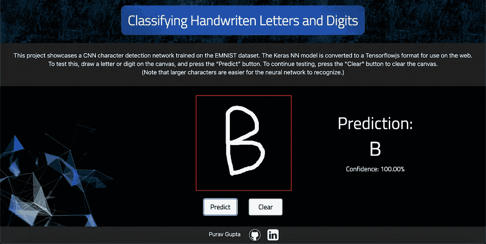

# 使用 EMNIST 的手写字符识别 Web 应用程序

> 原文：<https://medium.com/mlearning-ai/handwritten-character-recognition-web-app-with-emnist-9af77d895a52?source=collection_archive---------1----------------------->

早在古埃及人创造象形文字𐦚之前，人类就已经在实物上记录下他们的思想和想法。快进几千年，随着计算机和互联网的出现，几乎我们所做的一切都以某种方式利用了这台机器。然而，手写和做笔记还远未消亡，相反，它已经被**振兴了**。有一些软件，如谷歌镜头或苹果的 Live Text，可以识别手写文本，并允许用户将文本复制到数字记事本上。这些软件是 OCR 驱动的应用程序，采用人工智能进行准确快速的识别。

对于那些正在机器学习领域旅行的人来说，这是一个创建用于分类手写数字和字母的 web 应用程序的指南。幸运的是，我们已经为这个项目创建了一个标准化数据集，它被称为 EMNIST 数据集。



Visualization of the EMNIST Dataset

# EMNIST 数据集

扩展 MNIST 数据集或 [EMNIST 数据集](https://www.nist.gov/itl/products-and-services/emnist-dataset)是一组 28×28 像素格式的手写字母和数字。e MNIST 数据集源自 MNIST 数据集，该数据集被认为是机器学习基准的通用标准，它对 ML 模型提出了更大的挑战。该数据集中包括 62 个不同的类，由 26 + 26 个大小写字母以及 10 位数字组成。这个数据集易于获取和使用，允许我们创建一个体面的 ML 模型，同时花费最少的精力进行预处理和格式化。

首先，该数据集有 6 种不同的拆分形式:

*   **em NIST by class**:814255 个字符。62 不平衡类。
*   em NIST by merge:814255 个字符。47 不平衡类。
*   **EMNIST 平衡**:13.16 万字符。47 平衡班。
*   **EMNIST 字母**:14.56 万字符。26 平衡类。
*   **EMNIST 位数** : 28 万字符。10 个平衡类。
*   **EMNIST MNIST** : 7 万字。10 个平衡类。



每个分割都是为不同的目的和不同的模型创建的，但是我使用的是 **by_class 分割**。这包括数据集中的所有 62 个类-10 个数字+ 26 个小写字母+ 26 个大写字母，以及图像和数据的全部宽度，没有任何缩减。

# 卷积神经网络

对于这个项目，我使用了一个**卷积神经网络**，所以在进入代码之前，需要对 CNN 做一个简要的解释。

卷积神经网络，简称 CNN，是一种对计算机视觉极其有用的深度学习算法。CNN 可以比任何其他算法更好地“理解”复杂图像的复杂性。CNN 算法有两个主要部分:卷积和最大池。

## 回旋

卷积本质上是 CNN 模型*通过在图像上传递许多不同类型的过滤器来检测图像中的模式*。
这里有三个不同层次的过滤器通过图像的例子；它们变得越来越复杂，以检测图像中更复杂的图案。这些是过滤器的可视化表示，但在实际训练中，它们只是一个数字矩阵。



CNN Filters from 3 Different Layers

要问的主要问题是如何使用滤波器来卷积图像？所以，让我给你一个简短的解释…

假设我们有这个 5x 5 的图像，这里有一个 3x 3 的过滤器/内核矩阵:

```
1  0  1 
0  1  0 
1  0  1
```

然后在图像上扫描这个过滤器矩阵，计算图像的**过滤器大小的碎片**和**内核矩阵**的**点积**(上面的 gif 直观地表示了这个过程)。点积是两个矩阵的所有对应元素相加后的乘法。这个值存储在一个新的矩阵中，该矩阵表示卷积图像。
这个过程用几种不同的过滤器重复多次，以提取图像中的所有特征。

CNN 在他们的训练中不仅仅使用一个滤镜，事实上，对于一个 CNN 来说，为一个图像并行学习 32 到 512 个滤镜是很常见的。所有这些不同的过滤器提取不同的特征，允许 CNN 学习这些特征。

另一个强大的特性是能够将 CNN 层层叠加。这允许对图像进行更深层次的分解，并使模型能够在后续层中拾取更深和更复杂的图案。

## 最大池化

卷积图像或特征图是提取了特定特征的图像的表示。应用于图像的每个滤波器产生 1 个新的卷积图像，因此如果使用 32 个甚至 64 个滤波器，我们最终得到 32 倍的数据量。这是一个巨大的数量，因此为了降低计算能力和提高效率，卷积图像被汇总并减小尺寸。这个过程称为最大池化。



An example of Max Pooling which utilizes a 2 by 2 grid size as well as a stride of 2.

此外，最大池是另一种特征提取方法。通过总结图像中的区域，我们得到了图像中最清晰或最突出的特征。最大池非常有益，因为它还在原始图像中创建了[平移不变性](https://stats.stackexchange.com/questions/208936/what-is-translation-invariance-in-computer-vision-and-convolutional-neural-netwo)。max pooling 的所有好处导致了这种方法在大多数 CNN 模型中的突出使用。

为了执行最大池化，需要指定跨距和网格。网格是池的大小，跨距是网格在图像上滑动的像素数。

这是 CNN 建立的两个基本概念。现在，让我们转到实际的 EMNIST 分类器。

# 模型创建

在开始创建人工智能模型之前，所有的代码和文件都可以在我的 Github Repo 中找到:https://github.com/PuravG/EMNIST-Classifier！现在，继续创建模型。

所有人工智能模型，更确切地说是所有人工智能项目的第一步是**导入我们的库**。TensorFlow 是我们将要使用的框架，这是最流行的机器学习工具。

# 加载数据集和图像预处理

从 EMNIST 数据集，我加载了 **by_class split** 并预处理了数据。第一步是**归一化**数据，这将改变数据的像素范围。图像的像素值通常在 0 到 255 之间，但是我们需要将这些值标准化，使它们在 0 到 1 的范围内。这是机器学习中的一个很好的实践，它有许多好处，从提高效率到更好的模型性能。

这被称为**数据扩充**，其中我正在改变或扩充数据，以便为神经网络创建更多的*方差*。这允许*更好地概括数据*和*提高性能*。在我们最终的 web 应用程序中，用户将使用鼠标在画布上绘制字符，因此通过执行数据增强，模型将能够识别不完全居中或直的图像，而是弯曲或旋转的图像。

以下代码片段是数据扩充如何改变或修改影像数据集的图示示例。



Before and After Data Augmentation

# 模型架构和培训

机器学习模型具有执行计算的各种互连层。这是一个**卷积神经网络**，它有 **2 个卷积层**，每个卷积层后面跟着一个**最大池层**。卷积层之后是 **2 个完全连接的密集层**，具有 **256 个**然后是 **128 个神经元**。最后，该模型有一个具有 62 个节点的**输出层** **。最终层中的每个节点代表一类字符，并且模型将输出范围[0，1]中的 62 个不同值，代表图像属于该类的概率。**

编译模型，然后训练它 20 个纪元。

所以我们的**最终准确率是 86.75%！**对于这个数据集来说，这是一个不错的分数，显然你可能会问的问题是，其他 13.25%发生了什么？好吧，继续读下去，了解这个模型的缺点和可以做出的改进。

# 模型历史图表

这个图表看起来不错，随着时间的推移，稳步改善是巨大的。现在是将这些成果转化为有形产品的时候了。
第一种方法，是创建一个**本地笔记本**并从你自己的系统中预测图像(已经在你前面了🙂；我的预测笔记本是[这里](https://github.com/PuravG/EMNIST-Classifier/blob/main/EMNIST%20Predictions.ipynb)。然而，想象一下，每次需要预测图像时，都必须运行整个笔记本。它既不优雅也不友好。

介绍 web 应用程序…

# Web App！

想象一下，一个运行在你的浏览器上的应用程序可以被任何地方的任何人访问。这是一款网络应用，非常适合分享，对用户来说尤其直观。

创建此应用程序的第一步是为 web 准备模型。

## 将模型保存为 tfjs 格式

TensorFlow.js 是一个 Javascript 的机器学习库，专门用于将机器学习模型集成到网站上以及创建 web 应用程序。使用这个库，我们将把 TensorFlow Keras 模型转换成 TensorFlow.js 格式。

在您完成将您的模型保存为. tfjs 模型的训练后，添加此代码片段。

我们不会很快需要那个保存的文件，所以让我们把注意力转移到创建 web 应用程序上。

# 帆布

HTML 是网络最基本的组成部分，因为所有的网站都是使用 HTML 创建的。把 HTML 想象成一个网站的骨架——它创造了一个结构，把所有的东西连接在一起。使用 HTML，我们可以创建一个画布元素，允许用户直接在应用程序上绘制字符，这个元素将作为一个绘图空间，因此得名-画布。

创建这个画布非常简单，因为它只需要一行代码。

所以你已经成功地创建了一个画布！很简单，对吧？嗯，事情变得有点棘手了。

# 初始化画布

使用 HTML，我们创建了一个画布的骨架。仅使用 HTML 脚本的结果将是一个尺寸为 280×280 的基本方形框。画布上的绘制不是内置的，而是一个需要使用 Javascript 创建的函数。

第一步使用两个方法:getElementById 和 getContext。这是获取画布状态和属性的两个基本方法。

# 事件监听器

所以现在你已经准备好了画布，你需要使用它。使用它和访问画布的不同状态需要一个叫做事件监听器的东西。事件侦听器静静地坐在后台，不断更新对象的状态。

if(canvas)是一个检查画布何时初始化的条件。只有当画布准备好了，事件监听器才会被初始化。这些事件侦听器正在侦听用户可以执行的不同操作，一旦它们执行了这些操作，这些侦听器中的功能就会被执行。

# 获取光标的位置

要在画布上画一条线或任何形状，程序需要随时知道光标的准确位置。为此，我们可以创建一个字典来存储光标的位置，然后随着光标的移动不断更新它。

# 图画

绘画是所有先前功能的顶点；它调用并使用它们，最终的结果是能够在画布上画画！

开始绘画和停止绘画是在事件侦听器中调用的函数。继续讨论草图功能， *if(！paint) return* ，是一个检查，以确保 paint 标志为*真*，如果为*假*，该功能将停止，不返回任何内容。

这就是你所拥有的——在 web 应用程序中的画布上绘图的能力！现在我们可以画画了，让我们来看看这个 web 应用程序的主要目的，它是从用户绘制的图画中预测一个字符。

# 整合 CNN 模型

ML 工程师 80%的时间花在收集和处理数据上，而只有 20%的时间花在编写 AI 模型和创建预测上。因此，在完成了创建网站、画布和其他所有工作之后，我们现在处于最后一步——整合 CNN 模型。

还记得你留着以后用的 TensorFlow.js 模型吗，现在是时候拿出来了。

# 加载模型

第一个要求是将 TensorFlow.js 保存的模型上传到 Github 等服务器上。然后程序访问 Github 上的文件，并使用 async 函数加载它。

# 预处理

画在画布上的字符具有 280 乘 280 的尺寸。需要对该图像进行预处理，并将其转换为模型创建预测所需的格式。首先用 *tf.browser.fromPixels()* 方法创建一个张量，可以流入模型的第一个输入层。*TF . image . resizenearestneighborhood()*将图像的大小调整为(28，28)的新形状，这样图像就可以匹配原始模型的数据。 *tf.mean()* 将图像从具有 3 个颜色通道的彩色图像转换为黑白图像。 *tf.toFloat()* 函数将图像数组转换为 Float 类型。最后， *tensor.div()* 函数将数组除以最大 RGB 值 255，有效地将图像归一化。

# 预测和输出

剩下的就是为模型创建一个函数来预测图像。只有当点击预测按钮时，模型才会首先从画布中取出图像，对其进行预处理，然后在其上创建预测。
输出的是该类的字典和相应的预测。因此，要找到模型最有把握的预测，我们必须遍历字典，找到模型最有把握的类。

找到该类后，web 应用程序上的元素将更改为预测，并显示模型的置信度(百分比)。

# 最终想法+改进

因此，您最终创建了一个有效的、基本准确的手写字符分类器。在测试和使用这个 web 应用程序之后，应该会出现一个模式。这种型号不是最好的😅… *给这些角色分类不是最大的*。该模型的最终准确率仅为 87%，尽管这对于 ML 模型来说是不错的，但它无法与人类或最新的 OCR 软件相比。所以让我们来分解一下…

这个问题的根源其实来自于 ML 模型的学习方式。ML 模型通过识别数据中的模式并将这些模式与特定标签相关联来学习。在我们的例子中，CNN 提取图像的特征，这些特征就是模型所学习的。

例如，在字母“N”中，“N”有**两条平行线，后跟一条对角线。**这些是模型将选取的特征类型，但是字母“M”与该描述非常相似。如果你仔细想想，字母“M”只是两个“N”的融合。所以模型混淆了这两个字母，把它们混淆了。其他一些令人困惑的模式包括*N vs W vs M*； *1 和我*； *L 和 7*；还有很多其他的。因为所有这些字母都非常相似，所以模型通常会弄错这些图像。然而，像“B”或“X”这样的字母有着非常独特的模式，从而导致准确的预测。

那么笔迹检测软件是如何工作的呢？首先，他们在巨大的计算机上接受训练，因此他们可以有多达 15 层或更多的 CNN 层，以及数百个时期进行训练。其次，输入完整的句子或单词；单词在句子中的上下文对预测有很大帮助。

现在还不要感到沮丧，因为有一种方法可以解决这个问题。解决方法是**转移学习**！你可以利用和使用大公司或大学已经创建的训练有素的模型，并根据自己的情况进行调整。有一些模型是由各个大学的研究人员创建的，它们是开源的，供你免费使用！



A Snapshot of the Web App that I Made for this Classifier. [Link](https://puravg.github.io/EMNIST-Classifier/) to the Web App

唷！太多了，但最重要的是你终于坚持到了最后！这是一个漫长的，但非常富有成效的🍎一段充满挑战的旅程。我希望这篇指南能帮助你踏上机器学习的旅程。

这里是 [Github Repo](https://github.com/PuravG/EMNIST-Classifier) 的链接，你可以在这里找到这个项目的所有文件和代码。感谢您的阅读，祝您愉快！👋

# 让我们连接

我很乐意连接和谈论这个项目更多！在 [Linkedin](https://www.linkedin.com/in/puravgupta?lipi=urn%3Ali%3Apage%3Ad_flagship3_profile_view_base_contact_details%3BDku9koYQQbmKNjq6%2BGtTGw%3D%3D) 上给我发消息，或者在[guptapurav@gmail.com](mailto:guptapurav@gmail.com)给我发邮件！

[](/mlearning-ai/mlearning-ai-submission-suggestions-b51e2b130bfb) [## Mlearning.ai 提交建议

### 如何成为 Mlearning.ai 上的作家

medium.com](/mlearning-ai/mlearning-ai-submission-suggestions-b51e2b130bfb)