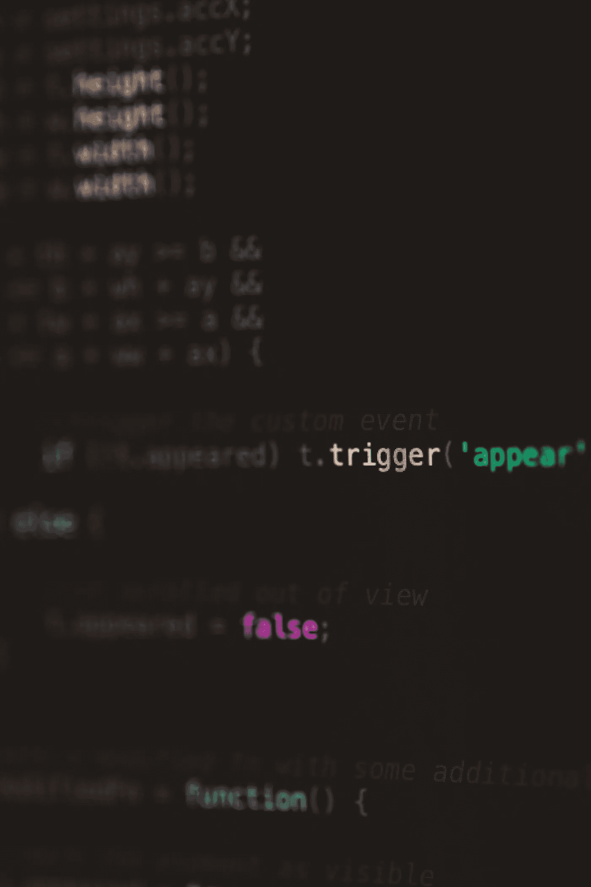

# 善用数据的力量

> 原文：<https://medium.com/mlearning-ai/harnessing-the-power-of-data-for-good-d508abf6c54d?source=collection_archive---------5----------------------->

## 用你的力量做好事

Photo by [Markus Spiske](https://unsplash.com/@markusspiske?utm_source=unsplash&utm_medium=referral&utm_content=creditCopyText) on [Unsplash](https://unsplash.com/s/photos/byte?utm_source=unsplash&utm_medium=referral&utm_content=creditCopyText)

## 数据作为弹药

数据是数字世界的弹药。

不幸的是，全球公民并不总是能够投票决定进入或离开这个数字世界——即使人们没有积极参与数字世界，他们也只是被动地参与其中。关于这个世界的数据，以及基于这些数据的算法，正在以被动参与者并不总是期望的方式塑造着我们的世界。我的目标是加入使这个竞技场变得公平的力量，并与针对他们的固有偏见作斗争。

> 你从新闻中获得的许多高级信息与其说是事实，不如说是游说团体对事实的描述。—凯茜·奥尼尔

## 我如何工作

我最近的项目专注于金融和计量经济学的应用，本质上是从市场中提取信号。我的最终目标是将 web 应用程序放在 Web3 上，并帮助实现去中心化金融和金融赋权的目标。在推进项目的过程中，我必须了解后端数据库的各个方面，如何存储、发送和交流数据，以及如何验证用户并访问 Web3 上的信号。我在这个项目上所做的事情与我的生活方式是一致的——我喜欢并且需要学习、成长和帮助他人实现更大的利益。

我是一个狂热的学习者和程序员。我在这个项目中所做的事情与我的生活方式是一致的——我喜欢学习、成长和帮助他人实现更大的利益。

## 志愿者和我

有几个非常有趣的组织吸引了我。 [DataKind](https://www.datakind.org) 就是其中之一。

目前， [DataKind](https://www.datakind.org) 正在寻找志愿数据科学家、机器学习爱好者、程序员、开发人员和项目经理，以虚拟方式参与各种 DataCorps 项目。如果您被选中，您需要能够为项目投入持续的时间，因为 DataCorps 项目通常持续 6-9 个月，每周投入 5-10 个小时。

我关心这一点，因为他们将致力于解决一些问题，如增加传统上被边缘化的人口的金融包容性，鼓励美国各地的毕业率，改善社区一级的社会服务，以及增强非正规工人的权能。