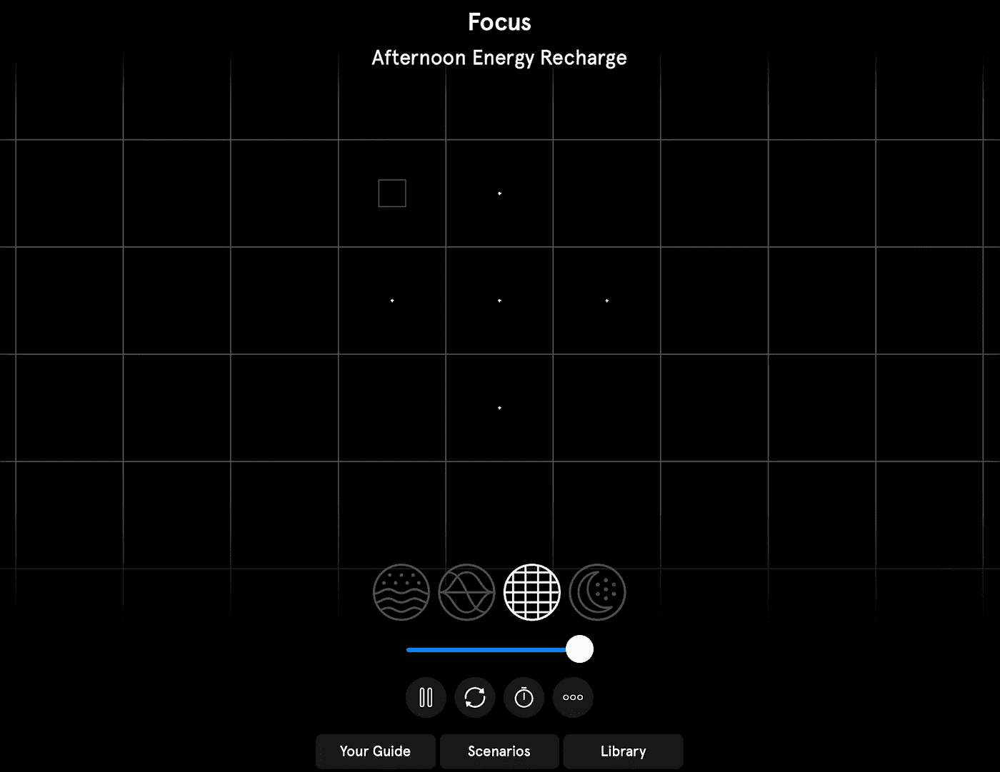

# 你找到保持专注和高效的最佳方式了吗？

> 原文：<https://medium.com/mlearning-ai/have-you-found-the-best-way-to-stay-focused-productive-yet-67796fda8e62?source=collection_archive---------7----------------------->

在研究有助于集中注意力的生产力工具和应用程序时，我偶然发现了 Endel。然后一切都变了。

我们 T2 有太多事情要做，这是事实。
我们经常被声音、手机和电脑的通知“叮”声和振动分散注意力，这些声音和振动竞相吸引我们的注意力。

当进入正题，让自己的思绪不再徘徊时，你会怎么做？打开 Spotify？去看[低保真女孩](https://www.youtube.com/watch?v=jfKfPfyJRdk)？收听广播电台？好——好。那就继续读吧。

# 所有的科学

## 声音及其效果

科学证明，音乐不仅影响我们的情绪，甚至影响我们的能力和耐力。我相信你听说过 [*莫扎特效应*](https://www.ncbi.nlm.nih.gov/pmc/articles/PMC1281386/) 。多年来进行的多项研究表明，一般来说，[音乐和声音对我们——人类—](https://academic.oup.com/jmt/article-abstract/38/4/254/894542)有着巨大的影响，甚至可以在紧张的情况下用作辅助治疗，如[病人手术](https://www.health.harvard.edu/newsletter_article/music-and-health)。科学并没有就此停止(谢天谢地，它从未停止)。

## 昼夜节律

我们的身体有一个生物钟。这个时钟有 24 小时的周期，在后台运行，同时负责我们的基本功能和过程。
这就是所谓的[昼夜节律](https://www.sleepfoundation.org/circadian-rhythm)。

其中一部分是睡眠-觉醒周期，它调节一种叫做褪黑激素的睡眠激素的分泌。我们身体的不同系统遵循与我们大脑中的主时钟同步的昼夜节律。
生物钟直接受到我们环境的影响，尤其是光线。这就是昼夜节律与昼夜周期相关的原因。

如果昼夜节律调整得当，它可以提供一个良好的睡眠，恢复你的能量，保持你的身心健康处于最佳状态！

# 用机器学习和人工智能融合一切。

两个来自柏林的家伙共同创立了 Endel。首席执行官 Oleg Stavitsky 和音响设计师 Dmitry Evgrafov 表示，公司“植根于科学”非常重要。这正是他们所做的。

Endel 成立于 2018 年，现在是一家 30 人的公司，专注于创造个人人工智能驱动的声音场景。
这些声音场景是基于你的位置、温度和天气条件(甚至是心率和运动强度，如果你碰巧是苹果手表的主人)，同时利用所有上述科学创造的。
所有这些有价值的数据都被输入 Endel 的声音引擎。
引擎利用[声音掩蔽技术](https://en.wikipedia.org/wiki/Sound_masking)，然后[生成最终的声景](https://www.amazon.science/latest-news/the-science-behind-endels-ai-powered-soundscapes?fbclid=IwAR2yMfT9089llBso_4s9GWvb1Q0b95NMg8SOJVlFlH6y0FjrGB7SvLjPpuo)，它是根据您的个人需求完美测量和定制的。

# 我的经历

多年来，我一直在不同的应用程序中尝试[白噪声](https://www.ncbi.nlm.nih.gov/pmc/articles/PMC1792397/?page=1)和相关的声音。虽然很有帮助，但他们缺乏感知我的心情和周围环境的能力。他们感到*静止了*。Endel 就像一个实体，能感觉到我周围的一切。它用定制的声音填充了我大脑的每一寸，当使用聚焦模式时，它实际上让我更有效率。

当我说我从未如此放松、专注和高效地使用一款使用声音实现这一目标的应用程序时，我是完全诚实的。
这一点，再加上我内置的智能照明系统——家庭助手(在以后的故事中会有更多介绍),真正改变了我的工作流程，我非常高兴！

我对团队在声音技术领域的发展和进步感到兴奋。

你以前用过相关的应用吗？我很乐意了解你的经历！

 [## Mlearning.ai 提交建议

### 如何成为 Mlearning.ai 上的作家

medium.com](/mlearning-ai/mlearning-ai-submission-suggestions-b51e2b130bfb)