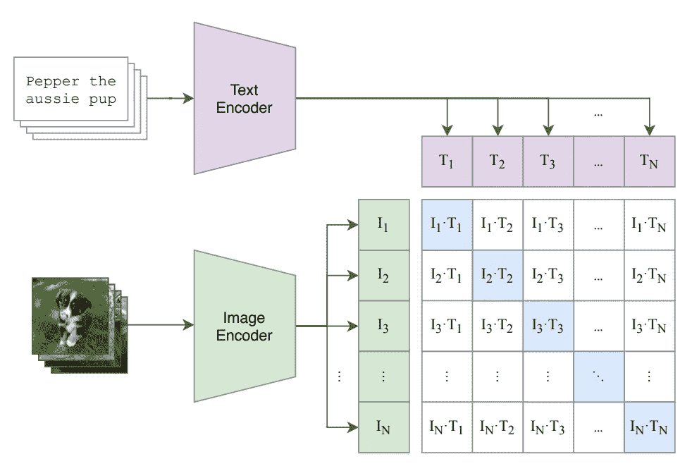
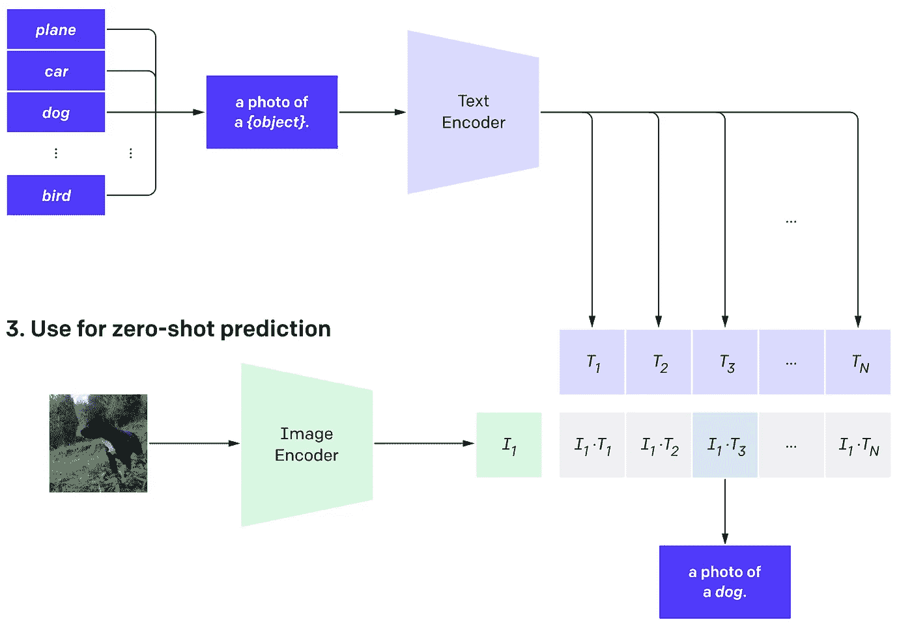

# 享受剪辑功能的乐趣—第一部分

> 原文：<https://medium.com/mlearning-ai/having-fun-with-clip-features-part-i-29dff92bbbcd?source=collection_archive---------2----------------------->

自从 [openAI](https://openai.com/blog/clip/) 发布连接图像和标题文本的剪辑模型以来，已经有一年多了。这个庞大的模型在 400 米(！)在网络上训练成对的图像和说明。在本帖中，我们将使用一些降维技术和[开源剪辑模型添加一些可视化和洞察力。](https://github.com/openai/CLIP)

## 我们将从剪辑的简短介绍开始:

我鼓励你阅读[的博客文章](https://openai.com/blog/clip/)，特别是关于 CLIP 以及它如何被训练/使用或者更好的——论文。简而言之，CLIP 旨在为图像和文本提示找到一个相互潜在的空间。这是通过获取带有匹配标题的成对图像，使它们通过一些编码器(分别是一个文本编码器和一个图像编码器)并鼓励它们的余弦相似性较高来完成的。他们还使用该批中的其他对作为反面例子，鼓励他们的余弦相似性较低。这导致在特定图像表示和其匹配文本之间具有深层联系的特征空间。我把这个过于简单化了——但这是它的要点。你可以看看这些真的很酷的帖子: [(1)](https://distill.pub/2021/multimodal-neurons/) ，[，](https://openai.com/blog/clip/)，[，](/@JettChenT/image-classification-with-openai-clip-3ab5f1c23e35)。事实证明，仅仅通过以这种方式对许多对进行训练，就给了我们一个非常大的特征空间。有多棒？基本上它非常擅长在下游任务的 **ALOT** 上**零射击**分类(它没有受过这方面的训练)。我们将在稍后的文章中深入探讨这个问题。



Taken from the [CLIP Blogpost.](https://openai.com/blog/clip/)

既然我们理解了这个模型的目的是什么，那么 CLIP 训练的特征实际上是什么样的呢？在第一篇博文中，我们将使用 UMAP(一种降维技术)来更好地理解这一点。大多数图形是交互式的——你可以玩它们/取消不同的标记/并得出你自己的一些结论！

# 让我们从 CIFAR10 嵌入空间开始

让我们从一个简单的例子开始剪辑的几个镜头的潜在空间。我们知道，CLIP 在许多数据集上的分类(零镜头)非常出色；包括 CIFAR10。让我们看看这个数据集的图像在特征空间中的表现。在整篇文章中，我将使用 [UMAP](https://umap-learn.readthedocs.io/en/latest/) 进行降维。下面我们有从 CIFAR10 采样的图像，这些图像经过了**夹子 ViT-B/32** 图像编码器。

**CIFAR10** feature space using the **ViT-B/32** Image Encoder. Green stars represent class text-embedding.

令人惊讶的是，尽管模型没有根据这些数据进行训练，但仍然可以看到非常清晰的聚类。您可以随意摆弄图表，看看模型哪里更混乱了。

绿色星星是关于什么的？为此，我们需要记住零射击分类是如何完成的。每个图像都通过图像编码器。对于数据集中的每个类(在我们的例子中——{飞机，汽车，狗..})我们将句子**“一张{class_name}的照片”**输入文本编码器。然后，我们将类别预测指定为与图像特征具有最接近相似性的类别。



Taken from the [CLIP Blogpost.](https://openai.com/blog/clip/)

那么现在关于绿色的星星。这些正是句子**“一张{class_name}的照片”**的潜在表征。我们能看到的东西很少:

1.  文本标签相对靠近类簇
2.  似乎对于某些类(例如“狗”类)来说，标签离实际的聚类很远。

## 通过及时的工程改进

有人可能会问，我们是否可以用几个句子而不是一个句子来描述每一个类，从而提高零射击能力？CLIP 的作者确实展示了一些精心制作的“提示工程”——试图捕捉整个类的特征。除了代表班级的**“{ class _ name }”**照片，他们还会查看

```
'a bad photo of a {}.',
'a photo of many {}.',
'a sculpture of a {}.',
'a photo of the hard to see {}.',
'a low resolution photo of the {}.',
'a rendering of a {}.',
'graffiti of a {}.',
'a bad photo of the {}.',
'a cropped photo of the {}.',
'a tattoo of a {}.',
...
```

每幅图像总共有 80 个提示。然后我们可以看看这些提示是如何映射到特征空间的。我们采用添加了模板的相同特征空间。每个带叉的青色圆圈代表不同的提示，颜色代表类别。**欢迎您将鼠标悬停在它们上面，查看不同的提示**。正方形表示该特定类别的模板平均特征的 UMAP 投影。

**CIFAR10** embedding space, including different templates used in the paper, for each class.

让我们试着理解一下这里发生了什么。以**卡车**级(黄色)为例:


Features of the ‘Truck’ class along with the different templates.

我们看到，基本上所有的模板都与来自同一类别的图像相对接近。因此，模板特征的平均值对于类特征是有意义的(尽管有点偏向边缘)。现在让我们看看**狗**类(深蓝)附近发生了什么


我们看到类的模板:**鸟，猫，飞机，**和**狗**都混在一起了！事实上，这些类别的平均特征看起来非常接近。当试图使用模板对上述类中的实例进行分类时，这可能会有问题。在这个特征空间里你还能找到哪些有问题的关系？

## **潜在空间中的其他概念**

CLIP 确实擅长于许多不同的下游任务(无需微调)。凭直觉思考特征空间，我们愿意相信**类狗**附近会有不同类型的狗，对于**船、【鹿】、**和所有其他类也是如此。让我们试着看看事实是否确实如此。

为此，我添加了一些关闭提示，以查看它们如何通过剪辑文本编码器进行映射。我使用以下提示:

```
**'a photo of a helicopter', 
'a photo of a minivan',
'a photo of a cruise',
'a photo of the titanic',
'a photo of a submarine',
'a photo of a pony',
'a photo of an aircraft carrier',**(notice this one is super-tricky) **'a photo of a toad'**
```

让我们看看他们在潜空间里是如何行动的。这些示例在下图中用灰色三角形**标记。将鼠标悬停在它们上面可以看到匹配的提示。**

Adding some custom prompts to see where they land in the embedding space.

好了，这很酷！所有的例子都被映射到“正确的”集群(至少在我看来是这样)。请注意，我选择了总体上看起来不错的集群，并考虑了匹配示例。这不是一个彻底的调查，我相信我们可以找到这样不顺利的例子。

# MNIST 特征空间

所以我们尝试了 CIFAR10，并得到了不错的结果。其他数据集呢？以下比较摘自该论文:


这是 CLIP 与监督训练的 ResNet50(即在下游任务中从头开始训练 ResNet50)相比的零射击性能。我们看到，对于更不像自然图片的数据集: **MNIST** (黑白数字)**patchcameleyon**(病理切片)等。—零镜头片段的表现比监督模型差得多。让我们来看看 **MNIST** 数据集的潜在特征是怎样的:

Latent space for the **MNIST** dataset.

我们首先看到的是——这个潜在空间是聚集在一起的！每个类都有一个单独的集群，而且它们是完全分开的！这就产生了一个问题:*为什么零拍剪辑在这个数据集上表现不太好？*我们来看看**的星星**(即班文—**‘一家三口的照片’**)。在 0、3、5 类上，类文本看起来相当不错——其他类呢？他们的标签不在附近！当然，分类会遇到一些麻烦。查看特征空间，如果我们能找到文本和正确聚类之间的一些更好的映射，我们将是黄金！

但是等等！我们有快速工程技巧。行得通吗？

答案是否定的。这是一个巨大的混乱——模板到处都是。我们看到，对于正常提示与类(0，3，5)匹配得很好的类，模板的平均值也非常准确。但是，在其他班级呢？相当凄凉。对我来说，这指出了一个事实，即 MNIST 类型的图像(黑白小图像)和它们的标题之间的配对与剪辑训练的配对非常不同。也许一些更聪明的提示工程可以以这种方式获得更好的结果。

# 通过图层裁剪要素

作为最后一个实验，我总是喜欢看中间层。这些特征是如何转变的，这让我很感兴趣。对于这一部分，我们将采用 **CIFAR100** 。我们知道 CLIP 的图像编码器具有良好的下游零拍性能。这意味着本质上，类被聚集在最后一层(正如我们之前看到的)。这种聚集是如何发生的？对于这种可视化，我从 CIFAR100 中随机选取 9 个类，并可视化它们在每个中间层中的 UMAP 维数减少。你可以播放视频，看看这里发生了什么。

对我来说，这非常类似于[这本](https://www.manning.com/books/deep-learning-with-python)书中提出的“球的展开原理”:

> “想象两张彩纸:一张红的，一张蓝的。把一个放在另一个上面。现在把它们揉成一个小球。那个皱巴巴的纸团就是你的输入数据，每一张纸就是一个分类问题中的一类数据。神经网络要做的是找出一种能使纸团不再卷曲的变换，从而使这两个类别再次清晰地分开”

在这个视频中，我们很好地展示了这种非皱缩现象。

# 结论

在这篇文章中，我们看到了一些我们可以通过可视化剪辑嵌入空间得到的见解。CLIP 是一个令人惊叹的模型，它对我来说是相当疯狂的，它对我来说是免费和公开的。我将上传以下部分，其中有更多类似于这里看到的见解。如果你喜欢这篇文章，我会感谢你的喜欢/分享。

[1]拉德福德，亚历克等人，“从自然语言监督中学习可转移的视觉模型。” *ICML* (2021)。

[2]弗朗索瓦·乔莱。“用 Python 深度学习。”(2017).

[3]麦金尼斯、利兰和约翰·希利。" UMAP:一致流形逼近和降维投影."*ArXiv*ABS/1802.03426(2018):n . PAG。

[4] Goh，Gabriel 等人，“人工神经网络中的多模态神经元”(2021).

[](/mlearning-ai/mlearning-ai-submission-suggestions-b51e2b130bfb) [## Mlearning.ai 提交建议

### 如何成为 Mlearning.ai 上的作家

medium.com](/mlearning-ai/mlearning-ai-submission-suggestions-b51e2b130bfb)