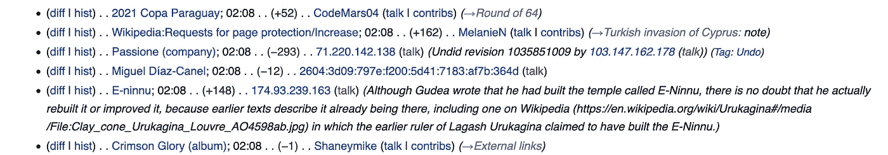
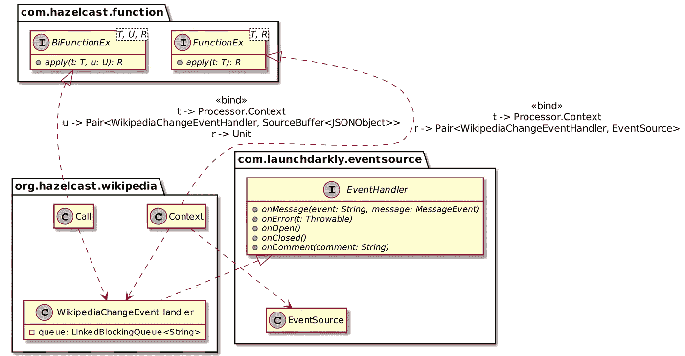
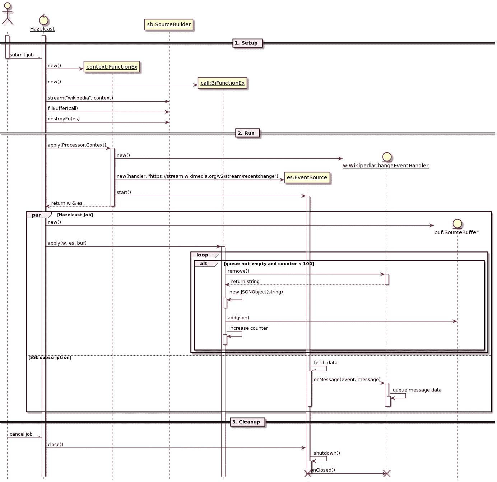
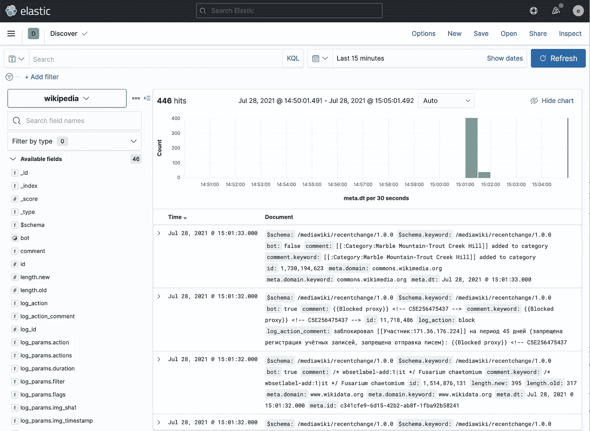
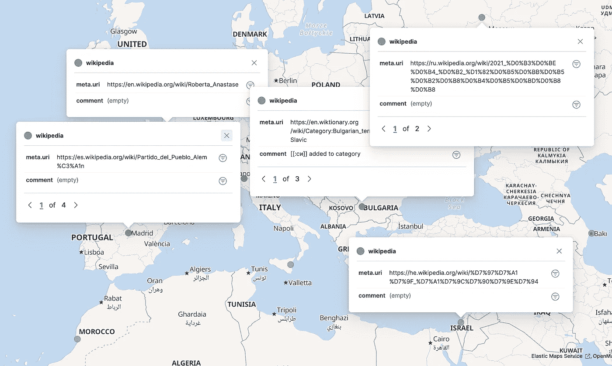
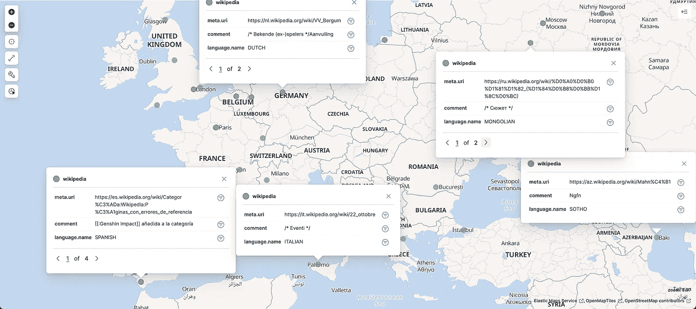

# Hazelcast + Kibana:探索和可视化数据的最佳伙伴

> 原文：<https://medium.com/mlearning-ai/hazelcast-kibana-best-buddies-for-exploring-and-visualizing-data-7e4577669c28?source=collection_archive---------1----------------------->


许多(如果不是全部的话)数据科学项目需要一些数据可视化前端来显示结果供人类分析。Python 似乎拥有最强大的库，但是如果您是 Java 开发人员(或者如果您精通另一种语言)，请不要失去希望。在这篇文章中，我将描述如何在不编写任何代码的情况下从这样的数据可视化前端中获益。

# 用例:维基百科的变化

我推断你已经很熟悉[维基百科](https://wikipedia.org/)。如果你不知道，维基百科是由社区管理的在线百科全书。用他们自己的话说:

> 维基百科是一个内容免费、多语言的在线百科全书，由志愿贡献者社区通过开放协作模式使用基于维基的编辑系统编写和维护。

以上实际上是维基百科上的[条目](https://en.wikipedia.org/wiki/Wikipedia)的摘录。很 meta。

这个想法是让任何人就任何主题写任何东西，让社区决定这个作品是否提高了知识体系。你可以把这个系统想象成一个世界范围的 Git 评论。

即使有了这些，通过发送大量的变更，也很容易超出社区的审查能力。为了防止这种滥用，潜在的贡献者需要首先创建一个帐户。但是，它增加了一层摩擦。如果我想通过修改一个打字错误、添加一张图片或任何其他微小的任务来做出贡献，创建我的帐户将比贡献更耗时。为了允许一次性贡献，维基百科允许匿名修改。然而，关于滥用，我们又回到了起点。为了掩盖这一点，维基百科会记录你的 IP 地址。IP 将出现在更改历史记录中，而不是帐户的名称。

现在，我的用例是关于可视化世界范围的匿名贡献。我先从维基百科上读取数据，通过认证账号过滤掉改动，推断改动的位置，推断改动的语言，然后在世界范围的地图上显示出来。从这一点来看，我会探索视觉上的变化，并说语言和位置以某种方式匹配。

我们将通过循序渐进的过程来实现这一目标。

# 等待世界改变

我们要做的第一步实际上是获取数据，*也就是*，将维基百科中的更改获取到我们的数据存储中。这非常简单，因为维基百科本身在一个专门的最近变化页面上提供了它的变化。如果你按下“实时更新”按钮，你可以看到列表是实时更新的(或非常接近)。下面是写这篇文章时的变化截图:



现在是时候创建一个数据管道来获取 Hazelcast 中的数据了。注意，如果您想继续学习，[这个项目在 GitHub](https://github.com/hazelcast-demos/wikipedia-changes) 上很容易找到。

维基百科通过[服务器发送的事件](https://fr.wikipedia.org/wiki/Server-sent_events)提供变化。简而言之，使用 SSE，您向端点注册一个客户机，每次有新数据进来时，您都会得到通知，并可以相应地采取行动。在 JVM 上，有几个 SSE 兼容的客户端可用，包括 Spring WebClient。相反，我选择使用 [OkHttp EventSource](https://github.com/launchdarkly/okhttp-eventsource) ，因为它是轻量级的——它只依赖于 OkHttp，并且它的用法相对简单。

以下是 POM 的摘录:

```
<dependency>
    <groupId>com.hazelcast</groupId>
    <artifactId>hazelcast</artifactId>
    <version>${hazelcast.version}</version>
</dependency>
<dependency>
    <groupId>com.launchdarkly</groupId>
    <artifactId>okhttp-eventsource</artifactId>
    <version>2.3.2</version>
</dependency>
```

# 获取数据

Hazelcast 数据管道通过定期轮询数据源来工作。对于 HTTP 端点，这很简单，但是对于 SSE，SSE 不那么依赖订阅。因此，我们需要实现一个定制的`Source`并围绕一个内部队列来设计它，以便在更改到达时存储它们，而轮询将使它们出列并进一步发送到管道中。

我们围绕以下组件设计代码:



*   `Context`管理订阅。它创建一个新的`WikipediaChangeEventHandler`实例，并将其注册为 SSE 流的观察者。
*   `WikipediaChangeEventHandler`是认购部分。每次发生更改时，它都会得到通知，并在其内部队列中对更改负载进行排队。
*   Hazelcast 引擎定期调用`Call`。当发生这种情况时，它从`WikipediaChangeEventHandler`中取出项目，将普通字符串转换为`JSONObject`，并将后者放入数据管道缓冲区。

从动态角度来看，系统可以建模为:



运行代码输出如下所示:

```
{"server_script_path":"/w","server_name":"en.wikipedia.org","$schema":"/mediawiki/recentchange/1.0.0","bot":false,"wiki":"enwiki","type":"categorize","title":"Category:Biography articles without listas parameter","meta":{"dt":"2021-07-28T04:07:40Z","partition":0,"offset":363427323,"stream":"mediawiki.recentchange","domain":"en.wikipedia.org","topic":"codfw.mediawiki.recentchange","id":"01592c7a-03f1-46cd-9472-3bbe63aff0ec","uri":"https://en.wikipedia.org/wiki/Category:Biography_articles_without_listas_parameter","request_id":"b49c3b98-2064-44da-aab4-ab7b3bf65bdd"},"namespace":14,"comment":"[[:Talk:Jeff S. Klotz]] removed from category","id":1406951122,"server_url":"https://en.wikipedia.org","user":"Lepricavark","parsedcomment":"<a href=\"/wiki/Talk:Jeff_S._Klotz\" title=\"Talk:Jeff S. Klotz\">Talk:Jeff S. Klotz<\/a> removed from category","timestamp":1627445260}
{"server_script_path":"/w","server_name":"commons.wikimedia.org","$schema":"/mediawiki/recentchange/1.0.0","bot":true,"wiki":"commonswiki","type":"categorize","title":"Category:Flickr images reviewed by FlickreviewR 2","meta":{"dt":"2021-07-28T04:07:42Z","partition":0,"offset":363427324,"stream":"mediawiki.recentchange","domain":"commons.wikimedia.org","topic":"codfw.mediawiki.recentchange","id":"68f3a372-112d-4dae-af8f-25d88984f1d8","uri":"https://commons.wikimedia.org/wiki/Category:Flickr_images_reviewed_by_FlickreviewR_2","request_id":"1a132610-85e0-4954-9329-9e44691970aa"},"namespace":14,"comment":"[[:File:Red squirrel (51205279267).jpg]] added to category","id":1729953358,"server_url":"https://commons.wikimedia.org","user":"FlickreviewR 2","parsedcomment":"<a href=\"/wiki/File:Red_squirrel_(51205279267).jpg\" title=\"File:Red squirrel (51205279267).jpg\">File:Red squirrel (51205279267).jpg<\/a> added to category","timestamp":1627445262}
{"server_script_path":"/w","server_name":"commons.wikimedia.org","$schema":"/mediawiki/recentchange/1.0.0","bot":true,"wiki":"commonswiki","type":"categorize","title":"Category:Flickr review needed","meta":{"dt":"2021-07-28T04:07:42Z","partition":0,"offset":363427325,"stream":"mediawiki.recentchange","domain":"commons.wikimedia.org","topic":"codfw.mediawiki.recentchange","id":"b4563ed9-a6f2-40de-9e71-c053f5352846","uri":"https://commons.wikimedia.org/wiki/Category:Flickr_review_needed","request_id":"1a132610-85e0-4954-9329-9e44691970aa"},"namespace":14,"comment":"[[:File:Red squirrel (51205279267).jpg]] removed from category","id":1729953359,"server_url":"https://commons.wikimedia.org","user":"FlickreviewR 2","parsedcomment":"<a href=\"/wiki/File:Red_squirrel_(51205279267).jpg\" title=\"File:Red squirrel (51205279267).jpg\">File:Red squirrel (51205279267).jpg<\/a> removed from category","timestamp":1627445262}
{"server_script_path":"/w","server_name":"www.wikidata.org","$schema":"/mediawiki/recentchange/1.0.0","minor":false,"bot":true,"wiki":"wikidatawiki","length":{"new":31968,"old":31909},"type":"edit","title":"Q40652","revision":{"new":1468164253,"old":1446892882},"patrolled":true,"meta":{"dt":"2021-07-28T04:07:43Z","partition":0,"offset":363427326,"stream":"mediawiki.recentchange","domain":"www.wikidata.org","topic":"codfw.mediawiki.recentchange","id":"70784dde-0360-4292-9f62-81323ced9aa7","uri":"https://www.wikidata.org/wiki/Q40652","request_id":"f9686303-ffed-4c62-8532-bf870288ff55"},"namespace":0,"comment":"/* wbsetaliases-add:1|zh */ 蒂托, [[User:Cewbot#Import labels/aliases|import label/alias]] from [[zh:巴西國家足球隊]], [[zh:何塞·保罗·贝塞拉·马希尔·儒尼奥尔]], [[zh:2018 年國際足協世界盃參賽球員名單]], [[zh:埃德爾·米利唐]], [[zh:加布里埃爾·馬丁內利]], [[zh:2019 年南美超级德比杯]], [[zh:2019 年美洲杯决赛]], [[zh:2019 年美洲杯参赛名单]], [[zh:2021 年美洲杯 B 组]], [[zh:2021 年美洲國家盃決賽]]","id":1514670479,"server_url":"https://www.wikidata.org","user":"Cewbot","parsedcomment":"\u200e<span dir=\"auto\"><span class=\"autocomment\">Added Chinese alias: <\/span><\/span> 蒂托, <a href=\"/wiki/User:Cewbot#Import_labels/aliases\" title=\"User:Cewbot\">import label/alias<\/a> from <a href=\"https://zh.wikipedia.org/wiki/%E5%B7%B4%E8%A5%BF%E5%9C%8B%E5%AE%B6%E8%B6%B3%E7%90%83%E9%9A%8A\" class=\"extiw\" title=\"zh:巴西國家足球隊\">zh:巴西國家足球隊<\/a>, <a href=\"https://zh.wikipedia.org/wiki/%E4%BD%95%E5%A1%9E%C2%B7%E4%BF%9D%E7%BD%97%C2%B7%E8%B4%9D%E5%A1%9E%E6%8B%89%C2%B7%E9%A9%AC%E5%B8%8C%E5%B0%94%C2%B7%E5%84%92%E5%B0%BC%E5%A5%A5%E5%B0%94\" class=\"extiw\" title=\"zh:何塞·保罗·贝塞拉·马希尔·儒尼奥尔\">zh:何塞·保罗·贝塞拉·马希尔·儒尼奥尔<\/a>, <a href=\"https://zh.wikipedia.org/wiki/2018%E5%B9%B4%E5%9C%8B%E9%9A%9B%E8%B6%B3%E5%8D%94%E4%B8%96%E7%95%8C%E7%9B%83%E5%8F%83%E8%B3%BD%E7%90%83%E5%93%A1%E5%90%8D%E5%96%AE\" class=\"extiw\" title=\"zh:2018 年國際足協世界盃參賽球員名單\">zh:2018 年國際足協世界盃參賽球員名單<\/a>, <a href=\"https://zh.wikipedia.org/wiki/%E5%9F%83%E5%BE%B7%E7%88%BE%C2%B7%E7%B1%B3%E5%88%A9%E5%94%90\" class=\"extiw\" title=\"zh:埃德爾·米利唐\">zh:埃德爾·米利唐<\/a>, <a href=\"https://zh.wikipedia.org/wiki/%E5%8A%A0%E5%B8%83%E9%87%8C%E5%9F%83%E7%88%BE%C2%B7%E9%A6%AC%E4%B8%81%E5%85%A7%E5%88%A9\" class=\"extiw\" title=\"zh:加布里埃爾·馬丁內利\">zh:加布里埃爾·馬丁內利<\/a>, <a href=\"https://zh.wikipedia.org/wiki/2019%E5%B9%B4%E5%8D%97%E7%BE%8E%E8%B6%85%E7%BA%A7%E5%BE%B7%E6%AF%94%E6%9D%AF\" class=\"extiw\" title=\"zh:2019 年南美超级德比杯\">zh:2019 年南美超级德比杯<\/a>, <a href=\"https://zh.wikipedia.org/wiki/2019%E5%B9%B4%E7%BE%8E%E6%B4%B2%E6%9D%AF%E5%86%B3%E8%B5%9B\" class=\"extiw\" title=\"zh:2019 年美洲杯决赛\">zh:2019 年美洲杯决赛<\/a>, <a href=\"https://zh.wikipedia.org/wiki/2019%E5%B9%B4%E7%BE%8E%E6%B4%B2%E6%9D%AF%E5%8F%82%E8%B5%9B%E5%90%8D%E5%8D%95\" class=\"extiw\" title=\"zh:2019 年美洲杯参赛名单\">zh:2019 年美洲杯参赛名单<\/a>, <a href=\"https://zh.wikipedia.org/wiki/2021%E5%B9%B4%E7%BE%8E%E6%B4%B2%E6%9D%AFB%E7%BB%84\" class=\"extiw\" title=\"zh:2021 年美洲杯 B 组\">zh:2021 年美洲杯 B 组<\/a>, <a href=\"https://zh.wikipedia.org/wiki/2021%E5%B9%B4%E7%BE%8E%E6%B4%B2%E5%9C%8B%E5%AE%B6%E7%9B%83%E6%B1%BA%E8%B3%BD\" class=\"extiw\" title=\"zh:2021 年美洲國家盃決賽\">zh:2021 年美洲國家盃決賽<\/a>","timestamp":1627445263}
{"server_script_path":"/w","server_name":"www.wikidata.org","$schema":"/mediawiki/recentchange/1.0.0","minor":false,"bot":true,"wiki":"wikidatawiki","length":{"new":239,"old":161},"type":"edit","title":"Q107674623","revision":{"new":1468164250,"old":1468164243},"patrolled":true,"meta":{"dt":"2021-07-28T04:07:43Z","partition":0,"offset":363427327,"stream":"mediawiki.recentchange","domain":"www.wikidata.org","topic":"codfw.mediawiki.recentchange","id":"40260137-ee52-4a67-b024-22d3cf86907a","uri":"https://www.wikidata.org/wiki/Q107674623","request_id":"db6e073a-19f6-4658-9425-7992b34b4208"},"namespace":0,"comment":"/* wbsetlabel-add:1|de */ Favolaschia filopes","id":1514670480,"server_url":"https://www.wikidata.org","user":"SuccuBot","parsedcomment":"\u200e<span dir=\"auto\"><span class=\"autocomment\">Bezeichnung für [de] hinzugefügt: <\/span><\/span> Favolaschia filopes","timestamp":1627445263}
{"server_script_path":"/w","server_name":"ko.wikipedia.org","$schema":"/mediawiki/recentchange/1.0.0","minor":true,"bot":true,"wiki":"kowiki","length":{"new":1158,"old":1161},"type":"edit","title":"이시다테 야스키","revision":{"new":29895993,"old":26098259},"meta":{"dt":"2021-07-28T04:07:43Z","partition":0,"offset":363427328,"stream":"mediawiki.recentchange","domain":"ko.wikipedia.org","topic":"codfw.mediawiki.recentchange","id":"c23bdb77-e88c-48d3-9d24-3c4dd8ef1dbf","uri":"https://ko.wikipedia.org/wiki/%EC%9D%B4%EC%8B%9C%EB%8B%A4%ED%85%8C_%EC%95%BC%EC%8A%A4%ED%82%A4","request_id":"0010e77b-fbcd-4de8-a5ad-4616adbbd6d4"},"namespace":0,"comment":"봇: 분류 이름 변경 (분류:1984년 태어남 → [[분류:1984년 출생]])","id":56333828,"server_url":"https://ko.wikipedia.org","user":"TedBot","parsedcomment":"봇: 분류 이름 변경 (분류:1984년 태어남 → <a href=\"/wiki/%EB%B6%84%EB%A5%98:1984%EB%85%84_%EC%B6%9C%EC%83%9D\" title=\"분류:1984년 출생\">분류:1984년 출생<\/a>)","timestamp":1627445263}
{"server_script_path":"/w","server_name":"commons.wikimedia.org","$schema":"/mediawiki/recentchange/1.0.0","minor":false,"bot":true,"wiki":"commonswiki","length":{"new":3864,"old":527},"type":"edit","title":"File:Albizia kalkora 06.jpg","revision":{"new":577195372,"old":577193453},"patrolled":true,"meta":{"dt":"2021-07-28T04:07:44Z","partition":0,"offset":363427329,"stream":"mediawiki.recentchange","domain":"commons.wikimedia.org","topic":"codfw.mediawiki.recentchange","id":"1a7fcb55-dec7-4303-b757-19f6a6a4dcdd","uri":"https://commons.wikimedia.org/wiki/File:Albizia_kalkora_06.jpg","request_id":"7f841b4a-ac70-4c2b-a148-bc07696ccf7a"},"namespace":6,"comment":"/* wbeditentity-update:0| */ Adding structured data: date, camera, author, copyright & source","id":1729953360,"server_url":"https://commons.wikimedia.org","user":"BotMultichillT","parsedcomment":"\u200e<span dir=\"auto\"><span class=\"autocomment\">Changed an entity: <\/span><\/span> Adding structured data: date, camera, author, copyright &amp; source","timestamp":1627445264}
{"server_script_path":"/w","server_name":"id.wikipedia.org","$schema":"/mediawiki/recentchange/1.0.0","minor":true,"bot":true,"wiki":"idwiki","length":{"new":977,"old":962},"type":"edit","title":"Euporus linearis","revision":{"new":18801346,"old":16068468},"patrolled":true,"meta":{"dt":"2021-07-28T04:07:43Z","partition":0,"offset":363427330,"stream":"mediawiki.recentchange","domain":"id.wikipedia.org","topic":"codfw.mediawiki.recentchange","id":"6c3882f9-9fd0-4f43-ab69-e538762c7981","uri":"https://id.wikipedia.org/wiki/Euporus_linearis","request_id":"dea59b42-7c97-4cbc-9384-5d8836a981ec"},"namespace":0,"comment":"[[Wikipedia:Bot|Bot]]: fixed → [[Kategori:Taxonbar tanpa parameter from|taxonbar tanpa parameter from]]","id":42309169,"server_url":"https://id.wikipedia.org","user":"HsfBot","parsedcomment":"<a href=\"/wiki/Wikipedia:Bot\" title=\"Wikipedia:Bot\">Bot<\/a>: fixed → <a href=\"/wiki/Kategori:Taxonbar_tanpa_parameter_from\" title=\"Kategori:Taxonbar tanpa parameter from\">taxonbar tanpa parameter from<\/a>","timestamp":1627445263}
{"server_script_path":"/w","server_name":"www.wikidata.org","$schema":"/mediawiki/recentchange/1.0.0","minor":false,"bot":false,"wiki":"wikidatawiki","length":{"new":25025,"old":24908},"type":"edit","title":"Q80075231","revision":{"new":1468164255,"old":1467697536},"patrolled":true,"meta":{"dt":"2021-07-28T04:07:44Z","partition":0,"offset":363427331,"stream":"mediawiki.recentchange","domain":"www.wikidata.org","topic":"codfw.mediawiki.recentchange","id":"720f6507-1ea1-4665-b1b9-1665c97450a9","uri":"https://www.wikidata.org/wiki/Q80075231","request_id":"43b7d511-007f-4005-a562-5002c7e0aff4"},"namespace":0,"comment":"/* wbsetdescription-add:1|dv */ އަކުއިލާ ނަކަތުގައިވާ ތަރިއެއް, [[:toollabs:quickstatements/#/batch/60416|batch #60416]]","id":1514670481,"server_url":"https://www.wikidata.org","user":"EN-Jungwon","parsedcomment":"\u200e<span dir=\"auto\"><span class=\"autocomment\">Added [dv] description: <\/span><\/span> އަކުއިލާ ނަކަތުގައިވާ ތަރިއެއް, <a href=\"https://iw.toolforge.org/quickstatements/#.2Fbatch.2F60416\" class=\"extiw\" title=\"toollabs:quickstatements/\">batch #60416<\/a>","timestamp":1627445264}
{"server_script_path":"/w","server_name":"www.wikidata.org","$schema":"/mediawiki/recentchange/1.0.0","minor":false,"bot":false,"wiki":"wikidatawiki","length":{"new":5312,"old":4884},"type":"edit","title":"Q85766437","revision":{"new":1468164246,"old":1342535335},"patrolled":true,"meta":{"dt":"2021-07-28T04:07:42Z","partition":0,"offset":363427332,"stream":"mediawiki.recentchange","domain":"www.wikidata.org","topic":"codfw.mediawiki.recentchange","id":"ad173600-09b7-4ccd-9490-4a60f6a432ea","uri":"https://www.wikidata.org/wiki/Q85766437","request_id":"1228a17e-2baa-46cc-a3bc-2049a62982c9"},"namespace":0,"comment":"/* wbcreateclaim-create:1| */ [[Property:P7937]]: [[Q7366]], [[:toollabs:quickstatements/#/batch/60404|batch #60404]]","id":1514670483,"server_url":"https://www.wikidata.org","user":"Moebeus","parsedcomment":"\u200e<span dir=\"auto\"><span class=\"autocomment\">Created claim: <\/span><\/span> <a href=\"/wiki/Property:P7937\" title=\"Property:P7937\">Property:P7937<\/a>: <a href=\"/wiki/Q7366\" title=\"Q7366\">Q7366<\/a>, <a href=\"https://iw.toolforge.org/quickstatements/#.2Fbatch.2F60404\" class=\"extiw\" title=\"toollabs:quickstatements/\">batch #60404<\/a>","timestamp":1627445262}
{"server_script_path":"/w","server_name":"www.wikidata.org","$schema":"/mediawiki/recentchange/1.0.0","minor":false,"bot":false,"wiki":"wikidatawiki","length":{"new":5134,"old":5126},"type":"edit","title":"Q12444793","revision":{"new":1468164254,"old":1413396080},"patrolled":false,"meta":{"dt":"2021-07-28T04:07:43Z","partition":0,"offset":363427333,"stream":"mediawiki.recentchange","domain":"www.wikidata.org","topic":"codfw.mediawiki.recentchange","id":"c01d52c5-c476-4554-814d-513342e04686","uri":"https://www.wikidata.org/wiki/Q12444793","request_id":"6d0a32b9-1234-4c8e-a02a-d92608f06d33"},"namespace":0,"comment":"/* wbsetdescription-set:1|hi */ भारत के उत्तराखण्ड राज्य का एक गाँव bikash","id":1514670482,"server_url":"https://www.wikidata.org","user":"2409:4061:219C:613E:DFD9:6BD4:F234:E7E0","parsedcomment":"\u200e<span dir=\"auto\"><span class=\"autocomment\">बदला [hi] विवरण: <\/span><\/span> भारत के उत्तराखण्ड राज्य का एक गाँव bikash","timestamp":1627445263}
{"server_script_path":"/w","server_name":"www.wikidata.org","$schema":"/mediawiki/recentchange/1.0.0","minor":false,"bot":false,"wiki":"wikidatawiki","length":{"new":22936,"old":22819},"type":"edit","title":"Q80075234","revision":{"new":1468164258,"old":1467697544},"patrolled":true,"meta":{"dt":"2021-07-28T04:07:44Z","partition":0,"offset":363427334,"stream":"mediawiki.recentchange","domain":"www.wikidata.org","topic":"codfw.mediawiki.recentchange","id":"7016afae-6691-4dca-bfaf-a5a3363edf31","uri":"https://www.wikidata.org/wiki/Q80075234","request_id":"aa4f6828-149d-4feb-a3cf-cd39902773fe"},"namespace":0,"comment":"/* wbsetdescription-add:1|dv */ އަކުއިލާ ނަކަތުގައިވާ ތަރިއެއް, [[:toollabs:quickstatements/#/batch/60416|batch #60416]]","id":1514670484,"server_url":"https://www.wikidata.org","user":"EN-Jungwon","parsedcomment":"\u200e<span dir=\"auto\"><span class=\"autocomment\">Added [dv] description: <\/span><\/span> އަކުއިލާ ނަކަތުގައިވާ ތަރިއެއް, <a href=\"https://iw.toolforge.org/quickstatements/#.2Fbatch.2F60416\" class=\"extiw\" title=\"toollabs:quickstatements/\">batch #60416<\/a>","timestamp":1627445264}
{"server_script_path":"/w","server_name":"de.wikipedia.org","$schema":"/mediawiki/recentchange/1.0.0","minor":false,"bot":true,"wiki":"dewiki","length":{"new":17069,"old":17075},"type":"edit","title":"Liste der Biografien/Caro","revision":{"new":214271460,"old":213857611},"meta":{"dt":"2021-07-28T04:07:43Z","partition":0,"offset":363427335,"stream":"mediawiki.recentchange","domain":"de.wikipedia.org","topic":"codfw.mediawiki.recentchange","id":"6618b0ab-eadf-405a-a474-ec2ad9fef8bb","uri":"https://de.wikipedia.org/wiki/Liste_der_Biografien/Caro","request_id":"23181b86-03de-4153-ad99-e7e20e611ed6"},"namespace":0,"comment":"Bot: Automatische Aktualisierung, siehe [[Benutzer:APPERbot/LdB]]","id":309672385,"server_url":"https://de.wikipedia.org","user":"APPERbot","parsedcomment":"Bot: Automatische Aktualisierung, siehe <a href=\"/wiki/Benutzer:APPERbot/LdB\" title=\"Benutzer:APPERbot/LdB\">Benutzer:APPERbot/LdB<\/a>","timestamp":1627445263}
```

这是最后一个条目，但为了更好地理解进行了格式化:

```
{
  "$schema": "/mediawiki/recentchange/1.0.0",
  "bot": true,
  "comment": "Bot: Automatische Aktualisierung, siehe [[Benutzer:APPERbot/LdB]]",
  "id": 309672385,
  "length": {
    "new": 17069,
    "old": 17075
  },
  "meta": {
    "domain": "de.wikipedia.org",
    "dt": "2021-07-28T04:07:43Z",
    "id": "6618b0ab-eadf-405a-a474-ec2ad9fef8bb",
    "offset": 363427335,
    "partition": 0,
    "request_id": "23181b86-03de-4153-ad99-e7e20e611ed6",
    "stream": "mediawiki.recentchange",
    "topic": "codfw.mediawiki.recentchange",
    "uri": "https://de.wikipedia.org/wiki/Liste_der_Biografien/Caro"
  },
  "minor": false,
  "namespace": 0,
  "parsedcomment": "Bot: Automatische Aktualisierung, siehe Benutzer:APPERbot/LdB",
  "revision": {
    "new": 214271460,
    "old": 213857611
  },
  "server_name": "de.wikipedia.org",
  "server_script_path": "/w",
  "server_url": "https://de.wikipedia.org",
  "timestamp": 1627445263,
  "title": "Liste der Biografien/Caro",
  "type": "edit",
  "user": "APPERbot",
  "wiki": "dewiki"
}
```

# 数据可视化的基巴纳

正如我在介绍中提到的，我们有一个不需要编写代码的神奇的数据可视化工具，这个工具就是 Kibana。基巴纳是所谓的麋鹿群的一部分:

*   Elasticsearch 提供存储和索引部分
*   最后，Kibana 提供了仪表盘和小部件来浏览和可视化存储在 Elasticsearch 中的数据


我们将写入一个 Elasticsearch 实例，而不是写入标准输出。为此，我们需要创建`Sink`。虽然您可以直接使用 Elasticsearch API，但 Hazelcast 提供了一个扩展来简化您的工作。只需将`com.hazelcast.jet:hazelcast-jet-elasticsearch-7` JAR 添加到类路径中，就可以编写如下代码:

```
private val clientBuilder = {
  val env = System.getenv()
  val user = env.getOrDefault("ELASTICSEARCH_USERNAME", "elastic")   // 1
  val password = env.getOrDefault("ELASTICSEARCH_PASSWORD", "changeme") // 1
  val host = env.getOrDefault("ELASTICSEARCH_HOST", "localhost")        // 1
  val port = env.getOrDefault("ELASTICSEARCH_PORT", "9200").toInt()     // 1
  ElasticClients.client(user, password, host, port)                     // 2
}val elasticsearch = ElasticSinks.elastic(clientBuilder) {
  IndexRequest("wikipedia").source(it.toString(), XContentType.JSON)    // 3
}
```

1.  提供一些参数化以允许在不同的环境中运行
2.  连接到已配置的 Elasticsearch 实例
3.  有效地将数据发送到 ES。在幕后，Hazelcast 将批量处理这些请求。

现在，管道可以改进了:

```
val pipeline = Pipeline.create().apply {
  readFrom(wikipedia)
    .withTimestamps({ it.getLong("timestamp") }, 100)
    .writeTo(elasticsearch)
}
Hazelcast.bootstrappedInstance().jet.newJob(pipeline)
```

锦上添花的是，通过良好的命名，Hazelcast API 允许不是开发人员的人遵循逻辑。

运行上面的管道，我们已经可以在 Kibana 中看到结果。如果您没有可用的实例，GitHub 库会提供一个`docker-compose.yml`文件。你只需要用`docker compose up`启动基础设施。

1.  使用您最喜欢的浏览器导航到 [http://localhost:5601](http://localhost:5601)
2.  使用登录名`elastic`和密码`changeme`进行验证
3.  单击“创建索引模式”按钮
4.  输入`wikipedia`作为索引名称
5.  点击“下一步”按钮
6.  选择字段为`meta.dt`为时间字段
7.  点击“创建索引模式”按钮完成
8.  在左侧菜单中，选择分析→发现

您应该会看到类似这样的内容:



在这个视图中，您可以看到所有摄取的文档。要进一步探索，您可以选择您想要查看的字段(在右侧)并根据其结构过滤掉文档(在上面的搜索栏中)。

# 管理“错误”数据

如果您尝试用这一步的代码执行作业，您可能会注意到，一段时间后，Elasticsearch 停止接收数据。查看 Hazelcast 日志，您可能会注意到类似的堆栈跟踪:

```
15:02:34.898 [ WARN] [c.h.j.i.e.TaskletExecutionService] [192.168.1.62]:5701 [dev] [5.0-BETA-1] Exception in ProcessorTasklet{068f-8bfa-4080-0001/elasticSink#0}
com.hazelcast.jet.JetException: failure in bulk execution:
[0]: index [wikipedia], type [_doc], id [PD017XoBfeUJ26i8qT-H], message [ElasticsearchException[Elasticsearch exception [type=mapper_parsing_exception, reason=object mapping for [log_params] tried to parse field [null] as object, but found a concrete value]]]
  at com.hazelcast.jet.elastic.ElasticSinkBuilder$BulkContext.lambda$flush$0(ElasticSinkBuilder.java:248)
  at com.hazelcast.jet.elastic.impl.RetryUtils.withRetry(RetryUtils.java:57)
  at com.hazelcast.jet.elastic.ElasticSinkBuilder$BulkContext.flush(ElasticSinkBuilder.java:244)
  at com.hazelcast.function.ConsumerEx.accept(ConsumerEx.java:47)
  at com.hazelcast.jet.impl.connector.WriteBufferedP.process(WriteBufferedP.java:73)
  at com.hazelcast.jet.impl.processor.ProcessorWrapper.process(ProcessorWrapper.java:97)
  at com.hazelcast.jet.impl.pipeline.FunctionAdapter$AdaptingProcessor.process(FunctionAdapter.java:226)
  at com.hazelcast.jet.impl.execution.ProcessorTasklet.lambda$processInbox$2f647568$2(ProcessorTasklet.java:439)
  at com.hazelcast.jet.function.RunnableEx.run(RunnableEx.java:31)
  at com.hazelcast.jet.impl.util.Util.doWithClassLoader(Util.java:498)
  at com.hazelcast.jet.impl.execution.ProcessorTasklet.processInbox(ProcessorTasklet.java:439)
  at com.hazelcast.jet.impl.execution.ProcessorTasklet.stateMachineStep(ProcessorTasklet.java:305)
  at com.hazelcast.jet.impl.execution.ProcessorTasklet.stateMachineStep(ProcessorTasklet.java:300)
  at com.hazelcast.jet.impl.execution.ProcessorTasklet.stateMachineStep(ProcessorTasklet.java:281)
  at com.hazelcast.jet.impl.execution.ProcessorTasklet.call(ProcessorTasklet.java:255)
  at com.hazelcast.jet.impl.execution.TaskletExecutionService$BlockingWorker.run(TaskletExecutionService.java:298)
  at java.base/java.util.concurrent.Executors$RunnableAdapter.call(Executors.java:515)
  at java.base/java.util.concurrent.FutureTask.run(FutureTask.java:264)
  at java.base/java.util.concurrent.ThreadPoolExecutor.runWorker(ThreadPoolExecutor.java:1128)
  at java.base/java.util.concurrent.ThreadPoolExecutor$Worker.run(ThreadPoolExecutor.java:628)
  at java.base/java.lang.Thread.run(Thread.java:829)
```

这是因为 Elasticsearch 的工作方式。由于我们没有提供任何显式的索引模式，Elasticsearch 从它收到的第一个数据负载中为我们推断出一个。在这种情况下，`log_params`属性主要具有以下结构:

```
"log_params": {
  "userid": 108038
}
```

因此，Elasticsearch 将它识别为一个带有`userid`属性的 JSON 对象。然而，有时，流包含`"log_params":[]`，它是 JSON 数组。Elasticsearch 无法在这两者之间进行调和，并抛出上述异常。

要解决这个问题，我们可以过滤掉这样的数据，或者将空数组属性转换为空对象属性。因为我们希望保留尽可能多的数据，所以让我们选择第二个选项。到目前为止，我们还不知道我们是否需要为另一个领域这样做，所以让它通用化可能是个好主意:

```
class MakeFieldObjectIfArray(private val fieldName: String) : FunctionEx<JSONObject, JSONObject> { // 1
  override fun applyEx(json: JSONObject) = json.apply {         // 2
    if (json.has(fieldName) && json.get(fieldName) is JSONArray)  // 3
      put(fieldName, JSONObject())                               // 4
  }
}val pipeline = Pipeline.create().apply {
  readFrom(wikipedia)
    .withTimestamps({ it.getLong("timestamp") }, 100)
    .map(MakeFieldObjectIfArray("log_params"))                  // 5
    .writeTo(elasticsearch)
}
```

1.  定义一个将`JSONObject`作为参数并返回`JSONObject`的`FunctionEx`
2.  应用以下更改，返回相同的`JSONObject`
3.  如果对象具有特定字段，并且该字段是一个`JSONArray`
4.  然后用空的`JSONObject`替换数组
5.  使用之前定义的`FunctionEx`映射管道中的每个项目

重新运行管道现在没有任何故障！

# 使其更具可读性和“可操作性”

因为管道是稳定的，所以是时候进行重构以构建坚实的基础了。重构沿着两条轴线进行:

*   代码可读性，面向开发人员
*   “可操作性”，面向运营

在开发人员方面，我们可以通过利用 Hazelcast 的 API 来改善体验。`GeneralStage`提供了常用的管道原语:`map()`、`flatMap()`、`filter()`以及一些更特殊的管道原语。然而，在这个粒度级别，我们更愿意关注*什么*而不是*如何*。为此，`StreamStage`还提供了一个`apply()`函数，将一个`StreamStage`转换成另一个`StreamStage`。让我们使用它:

```
class MakeFieldObjectIfArray(private val fieldName: String) : FunctionEx<StreamStage<JSONObject>, StreamStage<JSONObject>> {
  override fun applyEx(stage: StreamStage<JSONObject>) = stage .map { json ->
    json.apply {
      if (json.has(fieldName) && json.get(fieldName) is JSONArray)
        put(fieldName, JSONObject())
    }
  }
}
```

要使用它:

```
val pipeline = Pipeline.create().apply {
  readFrom(wikipedia)
    .withTimestamps({ it.getLong("timestamp") }, 100)
    .apply(MakeFieldObjectIfArray("log_params"))       // 1
    .writeTo(elasticsearch)
}
```

1.  专注于什么

接下来就是提高“可操作性”了。检查发生了什么的唯一方法是检查 Elasticsearch。如果中间发生了什么事情(如上)，很难准确指出问题是什么。因此，我们应该添加日志记录:

```
val pipeline = Pipeline.create().apply {
  readFrom(wikipedia)
    .withTimestamps({ it.getLong("timestamp") }, 100)
    .apply(MakeFieldObjectIfArray("log_params"))
    .peek()                                           // 1
    .writeTo(elasticsearch)
}
```

1.  我们将每个项目记录到标准输出中

对于大量的数据，这可能是太多的噪音。一个样本就足够了:

```
fun sampleEvery(frequency: Int) = PredicateEx {
  Random.nextInt(frequency) == 0                      // 1
}val toStringFn = FunctionEx<Any?, String> {
  it?.toString()                                      // 2
}
```

1.  如果`0`和`frequency`之间的随机值为`0`，则返回`true`
2.  零安全`toString()`

我们现在可以很好地利用这段代码了:

```
val pipeline = Pipeline.create().apply {
  readFrom(wikipedia)
    .withTimestamps({ it.getLong("timestamp") }, 100)
    .apply(MakeFieldObjectIfArray("log_params"))
    .peek(sampleEvery(50), toStringFn)                // 1
    .writeTo(elasticsearch)
}
```

1.  平均每 50 个**抽样一件**

此外，Hazelcast 提供了一个 API 来命名每个管道步骤。

```
class MakeFieldObjectIfArray(private val fieldName: String) : FunctionEx<StreamStage, StreamStage> {
  override fun applyEx(stage: StreamStage) = stage
    .setName("remove-log-params-if-array")            // 1
    .map { json ->
      json.apply {
        if (json.has(fieldName) && json.get(fieldName) is JSONArray)
          put(fieldName, JSONObject())
      }
    }
}
```

这样，启动管道会输出以下 DAG 日志:

```
digraph DAG {
  "replace-log-params-if-array" [localParallelism=1];
  "replace-log-params-if-array-add-timestamps" [localParallelism=1];
  "map" [localParallelism=16];
  "elasticSink" [localParallelism=2];
  "replace-log-params-if-array" -> "replace-log-params-if-array-add-timestamps" [label="isolated", queueSize=1024];
  "replace-log-params-if-array-add-timestamps" -> "map" [queueSize=1024];
  "map" -> "elasticSink" [queueSize=1024];
}
```

# 地理定位数据

查看现有数据，我们可以注意到两种类型的贡献:

1.  认证用户的贡献，*，例如*，`GeographBot`
2.  匿名投稿，*例如，* `84.243.214.62`针对 IP v4，`240D:2:A605:7600:A1DF:B7CA:5AF8:D971`针对 IP v6

使用前者没有简单的地理定位方法，但是可以利用后者的库和在线 API。在这篇文章中，我选择使用 [MaxMind GeoIP 数据库](https://www.maxmind.com/en/solutions/geoip2-enterprise-product-suite/anonymous-ip-database)。它提供了一个本地文件和一个库来利用它。

让我们添加必要的依赖项:

```
<dependency>
    <groupId>commons-validator</groupId>
    <artifactId>commons-validator</artifactId>
    <version>1.7</version>
</dependency>
<dependency>
    <groupId>com.maxmind.geoip2</groupId>
    <artifactId>geoip2</artifactId>
    <version>2.15.0</version>
</dependency>
```

然后，我们可以在处理管道中添加一个额外的步骤来检查用户是否是 IP，如果是，则添加信息:

```
val enrichWithLocation = { stage: StreamStage<JSONObject> ->
  stage.setName("enrich-with-location")                         // 1
    .mapUsingService(ServiceFactories.sharedService(databaseReaderSupplier)) { reader: DatabaseReader, json: JSONObject ->
       json.apply {
         if (!json.optBoolean("bot") && json.has("user")) {    // 2
           val user = json.getString("user")
           if (InetAddressValidator.getInstance().isValid(user)) {  // 3
             reader.tryCity(InetAddress.getByName(user))       // 4
                   .ifPresent { json.withLocationFrom(it) }    // 5
           }
         }
      }
    }
}val pipeline = Pipeline.create().apply {
  readFrom(wikipedia)
    .withTimestamps({ it.getLong("timestamp") }, 100)
    .apply(MakeFieldObjectIfArray("log_params"))
    .apply(enrichWithLocation)                                  // 6
    .peek(sampleEvery(50), toStringFn)
    .writeTo(elasticsearch)
}
```

1.  设置描述性名称
2.  如果 bot 属性为假并且用户属性存在
3.  验证用户是 IP、v4 还是 v6
4.  地理定位 IP
5.  将数据添加到 JSON 中
6.  将步骤添加到管道中

# 我们的第一次数据可视化

有了地理定位数据，我们希望在世界地图上显示变化。好消息是，Kibana 提供了这样一个开箱即用的小部件。

1.  转到分析|地图
2.  点击添加层按钮
3.  选择文档
4.  对于索引，选择`wikipedia`

不幸的是，Kibana 抱怨索引不包含任何地理空间字段！

事实上，虽然我们对数据进行了格式化，以创建一个具有纬度和经度的数据字段，但 Elasticsearch 并不将其识别为地理点类型。我们需要明确地映射它。更糟糕的是，我们不能改变现有字段的类型。因此，我们需要停止管道，删除当前索引，并丢失所有数据。

1.  转到管理|堆栈管理
2.  选择数据|索引管理
3.  检查`wikipedia`
4.  单击管理索引按钮
5.  选择删除索引
6.  确认删除

我们现在准备绘制场地地图。

1.  转到管理|堆栈管理
2.  选择数据|索引管理
3.  单击索引模板选项卡(第三个)
4.  点击创建模板按钮
5.  给它起一个相关的名字，*，例如*，`geo-locate`
6.  设置与`wikipedia`、*匹配的索引模式，例如*、`wikipedia`
7.  单击“下一步”保留默认设置，直到到达第 4 步—映射
8.  添加一个名为`location.coordinates`的新字段，类型为 Geo-point
9.  再次点击下一步，直到最后一步。预览选项卡应该显示以下 JSON:

```
{
  "template": {
    "settings": {},
    "mappings": {
      "properties": {
        "location": {
          "properties": {
            "coordinates": {
              "type": "geo_point"
            }
          }
        }
      }
    },
    "aliases": {}
  }
}
```

点击创建模板按钮

在`wikipedia`索引中，Elasticsearch 会将名为`location`的字段内名为`coordinates`的每个字段映射到一个地理点。因此，我们需要稍微修改一下映射代码。

让我们创建这样一个专用的映射函数:

```
private fun JSONObject.withLocationFrom(response: CityResponse) {
    val country = JSONObject()
        .put("iso", response.country.isoCode)
        .put("name", response.country.name)
    val coordinates = JSONArray()
        .put(response.location.longitude)
        .put(response.location.latitude)
    val location = JSONObject()
        .put("country", country)
        .put("coordinates", coordinates)
        .put("city", response.city.name)
        .put("timezone", response.location.timeZone)
        .put("accuracy-radius", response.location.accuracyRadius)
    put("location", location)
}
```

我们现在可以在管道中使用它:

```
reader.tryCity(InetAddress.getByName(user))
    .ifPresent { json.withLocationFrom(it) }
```

让我们再次启动管道。现在，我们可以尝试重复这些步骤来创建地图。这一次，它将我们映射的字段识别为地理点，并让我们更进一步。

点击右下角的添加图层按钮。你已经可以欣赏地图上显示的一些数据点了。

# 探索数据

数据点很优秀，但还不够。假设我们想通过条目的位置来理解它们。为此，我们需要添加字段，*，即*、`meta.uri`和`comment`。不要忘记命名层，并保存它。现在可以点击数据点来显示相关数据:



维基百科是全世界数百万用户的信息来源。因为贡献可以是匿名的(记住那些是地理定位的)，恶意用户可以更新一篇文章，而不是为了社区的利益，而是为了进一步的地缘政治议程。我们可以询问数据，文章-语言-位置三元组是否看起来没问题，是否会引发一些危险信号。我们已经有了通过`meta.uri`和位置的文章，我们需要添加语言。

# 添加派生数据

获得该语言有两个主要选项:

1.  从服务器的 URL，例如，it.wikipedia.org 意味着意大利语，而 fr.wikipedia.org 意味着法语
2.  来自注释(如果它不为空)

出于教育目的，我决定选择第二种。每个事件已经包含一个`comment`字段。这里有一个例子:

*   Anagrames [[esgota]]，[[esgota]]，més canvis cosmètics
*   "已添加位置模板"
*   “[[:傑克·威爾許]]已添加至分类，[[Special:WhatLinksHere/傑克·威爾許|此页面包含在其他页面之内]]”
*   "/* wbset description-add:1 | ru */провинцияалжира"
*   "/* Treindiensten */"
*   “יצירת דף עם התוכן \”אסף \”בובי\” מרוז, יליד חיפה, הינו מוזיקאי, מתופף, חבר בלהקות אבטיפוס, קילר ואיפה הילד == הרכבים == === קילר הלוהטת === בשנת 1980 — שימש מתופף של הלהקה קילר הלוהטת. === אבטיפוס === הלהקה הוקמה ב[[קריות]] באמצע [[שנות השמונים]] ועברה גלגולי הרכב שונים. בגלגולה הראשון בשנת…\”
*   " { {坦姆·khảo|2}} →{ {坦姆·khảo|30em}} "
*   "摩尔说他不是货车."
*   “[[:Конуклар (Джиде)]] категори чу тоьхна”
*   等等。

语言学家可以推断该领域的语言。还可以在管道中使用自动化流程。JVM 生态系统中有几个 NLP 库，但是我把目光放在了专注于语言识别的 [Lingua](https://github.com/pemistahl/lingua) 上。

我们需要创建一个额外的阶段转换函数:

```
val languageDetectorSupplier = { _: ProcessorSupplier.Context ->
    LanguageDetectorBuilder
        .fromAllSpokenLanguages()
        .build()
}                                                               // 1val enrichWithLanguage = { stage: StreamStage<JSONObject> ->
    stage.setName("enrich-with-language")
        .mapUsingService(ServiceFactories.sharedService(languageDetectorSupplier)) { detector: LanguageDetector, json: JSONObject ->
            json.apply {
                val comment = json.optString("comment")
                if (comment.isNotEmpty()) {
                    val language = detector.detectLanguageOf(comment)                              // 2
                    if (language != Language.UNKNOWN) {
                        json.put(
                            "language", JSONObject()            // 3
                                .put("code2", language.isoCode639_1)
                                .put("code3", language.isoCode639_3)
                                .put("name", language.name)
                        )
                    }
                }
            }
        }
}
```

1.  创建提供语言检测器的函数
2.  神奇就发生在这里
3.  将语言相关的数据添加到 JSON 中

我们现在可以在管道中使用新定义的函数:

```
val pipeline = Pipeline.create().apply {
        readFrom(wikipedia)
            .withTimestamps({ it.getLong("timestamp") }, 100)
            .apply(MakeFieldObjectIfArray("log_params"))
            .apply(enrichWithLocation)
            .apply(enrichWithLanguage)
            .peek(sampleEvery(50), toStringFn)
            .writeTo(elasticsearch)
    }
```

在 Kibana 地图上，您现在可以添加任何与语言相关的字段，例如,`language.name`,以便与其余数据点一起显示。然而，它们中的一些有一个空的`comment`字段，所以语言没有显示。一种选择是相应地更新数据管道，但是也可以在 Kibana 接口上过滤掉不需要的数据点。总的来说，就是这样:无论如何都要推送数据，把他们想要显示的数据留给最终用户。

在地图上，转到过滤部分，添加一个 KQL 过滤器，过滤掉没有值的数据点:`language.name : *`。结果如下所示:



# 提炼数据

它已经更好了，尽管我们可以注意到一些差异:

*   “Ngfn”不是如此，但更像是有人没有找到一个好的评论
*   “сюжет”可以是[保加利亚语、哈萨克语或俄语](https://en.wiktionary.org/wiki/%D1%81%D1%8E%D0%B6%D0%B5%D1%82)，绝对不是蒙古语

尽管 Lingua 有很好的结果，但它也容易出错。幸运的是，Lingua 可以从一个文本片段和一个语言地图中返回一种语言，并给出可信度等级。第一种语言的置信度为 1.0；其他的可信度在 0.0 到 1.0 之间。

例如，注释“Nufüs”返回以下映射:

*   1.0:土耳其语
*   0.762256422055537:德语
*   0.6951232183399704:阿塞拜疆
*   0.667947340824422:爱沙尼亚语
*   0.5291088632328994:匈牙利语
*   0.3674326772623783:加泰罗尼亚语

因此，第二语言的置信度等级越接近 1，第一语言的置信度就越低。为了反映这一点，我们可以将 1.0 和第二语言的信心评级之间的差异添加到数据点中。上述代码更新为:

```
val languagesWithConfidence = detector.computeLanguageConfidenceValues(comment)               // 1
if (languagesWithConfidence.isNotEmpty()) {
    val mostLikelyLanguage = languagesWithConfidence.firstKey()
    val secondMostLikelyConfidence = languagesWithConfidence.filterNot { it.key == mostLikelyLanguage }.maxBy { it.value }?.value ?: 0.0 // 2
    json.put(
        "language", JSONObject()
            .put("code2", mostLikelyLanguage.isoCode639_1)
            .put("code3", mostLikelyLanguage.isoCode639_3)
            .put("name", mostLikelyLanguage.name)
            .put("confidence", 1.0 - secondMostLikelyConfidence) // 3
    )
}
```

1.  获取语言的排序图
2.  获取第二种语言的可信度，如果地图只有一个元素，则为 0
3.  将置信度添加到数据点

请注意，根据管道的第一个数据点，您可能会以 int、*即*、0 或 1 类型的`language.confidence`字段结束。如果发生这种情况，您需要删除索引并创建一个带有`Double`类型的索引模板，就像我们在上面对 Geo-point 所做的那样。

此时，您可以显示语言可信度，并更新过滤器以过滤掉可信度低的数据点，*，例如*、`language.name : * and language.confidence > 0.2`。结果如下:


# 结论

在本文中，我们描述了如何借助 Hazelcast 平台的流水线部分和 Kibana 的可视化部分来可视化和探索数据集。后者不需要任何前端编码技能——或者任何编码技能。现在开始研究您的数据集，您不需要成为 Pythonista 或图形库专家:成为 JVM 的开发人员就足够了。

现在就开始探索吧！

这篇博文的源代码在 [GitHub](https://github.com/hazelcast-demos/wikipedia-changes) 上。