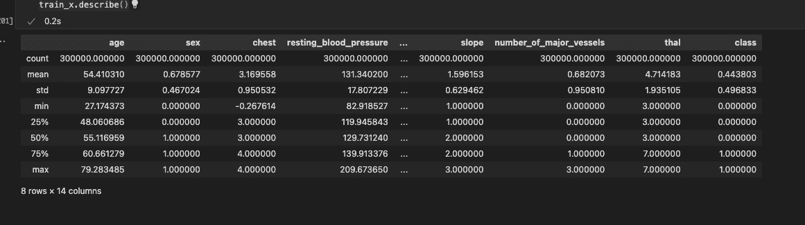
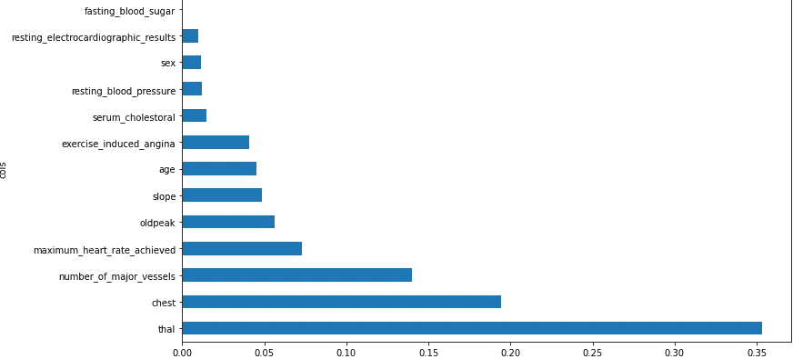

# 使用 fastai 和 sklearn 进行心脏病检测

> 原文：<https://medium.com/mlearning-ai/heart-disease-detection-using-fastai-and-sklearn-a27df70ed19f?source=collection_archive---------3----------------------->

自从我开始我的人工智能硕士课程以来，我一直在寻找一个框架，它将帮助我更多地使用我的软件开发技能，设计可用于生产的系统，并将一些重复的日常 ML 代码包装在一个刚刚工作的框架周围。Fastai 是一个只用几行代码就能构建多层神经网络的工具，它以 Pytorch 为主干，有能力做到这一点。

2015 年，创造一个可以识别鸟类的计算机系统的想法被认为是如此具有挑战性，以至于它成为了这个 XKCD 笑话的基础:


使用 fastai，只需写几行代码就可以建立一个卷积神经网络，能够以超过 95%的准确率识别鸟类。

在本文中，我们将探讨如何使用决策树、随机森林、梯度 Bossting 和神经网络来构建心脏病检测系统。我们将在使用 fastai 完成一些日常任务时完成所有这些工作，如数据清理、特征工程、数据可视化和模型评估。jupyter 笔记本和数据集可以在这个资源库中找到:[nandangrover/心脏病分类器](https://github.com/nandangrover/heart-disease-classifier)。

# 描述数据集

**图 2.2.2** 简要概述了所提供的数据集。存在的特征总数是 13(我们在相同的数据帧中添加了一个类用于预处理)。在训练中存在 30，000 个例子，在测试数据集中存在 30，000 个例子。在浏览数据集之后，我们可以看到数据是干净的，没有丢失值。如**图 2.2.4** 所示，对数据集应用了特征工程。探索性数据分析表明 **thal** 对预测影响最大，而**静息血压**对心脏病预测影响最小。下面的**图 2.2.1** 中列出了每个特性的总体影响。


Figure 2.2.1



Figure 2.2.2

# 构建模型

顾名思义，决策树集成依赖于决策树。决策树会询问一系列关于数据的二进制(即是或否)问题。每问完一个问题，树中该部分的数据被分为“是”和“否”两个分支，如图**图 2.2.3** 。在一个或多个问题之后，或者可以基于所有先前的答案进行预测，或者需要另一个问题。就处理时间和可伸缩性而言，它们比神经网络更好地进行分类，正如我们将在下面看到的。

```
test_x = pd.read_csv('data/x_test.csv', low_memory=False)
test_y = pd.read_csv('data/y_test.csv', low_memory=False)
```

我们首先使用熊猫导入数据，如上图所示**。**

为了可视化决策树模型，我们首先构建一个 max_lead_nodes 设置为 10 的模型。

```
model = DecisionTreeClassifier(max_leaf_nodes=10)
model.fit(xs, y);
```


**Figure 2.2.3**

当所有数据都在一个组中时，顶部节点表示任何拆分完成之前的初始模型。这是最简单的可能模型。它是询问零个问题的结果，并且将始终预测整个数据集的平均值。

```
model_decision = DecisionTreeClassifier(min_samples_leaf=25)
model_decision.fit(xs, y)
cross_val_score(model_decision, valid_xs, valid_y, cv=10)
```

Sklearn 的默认设置允许它继续拆分节点，直到每个叶节点中只有一个项目。因此，我们将 min_sample_leaf 设置更改为 25，这样我们的模型就不会过拟合。在没有指定 min_sample_leaf 的情况下，也测量了准确度，仅为 86%。

```
array([0.86806667, 0.86516667, 0.8636    , 0.8647    , 0.86746667, 0.8649    , 0.86413333, 0.86556667, 0.86706667, 0.86486667])
```

将 min_sample_leaf 设置为 25 后，10 个时期的交叉验证准确度如下所示。

```
array([0.88946667, 0.88743333, 0.8857    , 0.89053333, 0.88933333, 0.8873    , 0.8874    , 0.88836667, 0.88936667, 0.88643333])
```

我们看到决策树的平均准确率约为 89%。在下一节中，我们将看到移除低重要性变量是否对准确度有任何影响

# 去除低重要性变量的决策树的精度

我们想知道一个模型是如何产生预测的，除了仅仅知道它可以准确地做到这一点。这通过特征显著性来揭示。通过查看特征重要性属性，我们可以直接获得它们。

```
def rf_feat_importance(model, df):
   return pd.DataFrame({'cols':df.columns, 'imp':model.feature_importances_}
                      ).sort_values('imp', ascending=False)
```

通过消除低值的因素，似乎合理的是，我们可能只使用一部分列，但仍能获得良好的结果。因此我们删除了所有重要性小于 0.005 的特征(**图 2.2.4** )。



Figure 2.2.4

我们观察到，在去除不重要的特征后，准确度保持不变。

```
array([0.88943333, 0.88733333, 0.88553333, 0.89046667, 0.88896667, 0.8874    , 0.88736667, 0.88873333, 0.88933333, 0.88643333])
```

# 模型评估

我们可以想象数据是如何从第一列 thal，然后是前四页的胸部分割出来的。我们可以看到决策树算法已经成功地使用 thal 值分成了两个不同值的组。这可以通过使用特伦斯·帕尔强大的[dtrewiz](https://explained.ai/decision-tree-viz/)库来实现(图 2.2.5)。


**Figure 2.2.5**

# 随机森林、梯度增强和神经网络

我们已经建立了一个使用决策树集成的分类器，即使用随机森林算法和梯度推进。还构建了一个神经网络，以比较实现决策树所需的准确性、可伸缩性、时间和工作量。

## 随机森林

下面的函数规范指定了我们需要的估计数、为每棵树的训练采样的最大行数，以及在每个拆分点采样的最大列数(其中 0.5 表示“取总列数的一半”)。我们用于决策树的相同最小样本叶参数也可以用于定义何时停止分裂树节点，从而限制树的深度。最后，我们指示 Sklearn 通过传递 n 个 jobs=-1 来同时创建树。结果达到的最终准确度为 90%。

```
def rf(xs, y, n_estimators=200, max_samples=200_000,
      max_features=0.5, min_samples_leaf=10, **kwargs):
   return RandomForestClassifier(n_jobs=-1, n_estimators=n_estimators,
       max_samples=max_samples, max_features=max_features,
       min_samples_leaf=min_samples_leaf, oob_score=True).fit(xs, y)
```

## 梯度推进

我们使用了 histgradientsboostingclassifier，它具有对缺失值(nan)的本地支持。在训练期间，基于潜在的增益，树生长器在每个分裂点学习具有缺失值的样本应该去往左边还是右边的孩子。当预测时，具有缺失值的样本因此被分配给左边或右边的孩子。如果在训练期间对于给定的特征没有遇到缺失值，那么具有缺失值的样本被映射到具有最多样本的子代。结果达到的最终准确度是 90%

```
model_gradient = HistGradientBoostingClassifier().fit(xs_imp, y)
```

## 神经网络

通过超过 60，000 个实例和 5 个时期，该网络被引入超过 300，000 个实例。对于神经网络来说，这是一个可以学习的大量数据。神经网络的精度是 0.55，低于决策树，因为硬件资源有限(有限我指的是 80GB 的 ram 和来自 Google collab 的 TPU)。神经网络也比决策树慢。我们使用了快速人工智能的表格学习器来建立神经网络。默认情况下，它使用 2 层，第一层有 200 次激活，第二层有 100 次激活。我们决定使用默认值，因为我们正在比较神经网络和决策树，并没有积极地尝试提高准确性。结果达到的最终准确度为 55.75%，可以通过调整学习速率(使用 fastai 的 lr_find()方法)和为更多时期训练模型来提高该准确度。

```
df = TabularPandas(combined_data, procs_nn, list(to_keep), [], y_names='class', splits=splits)
dataLaoders = df.dataloaders(64)

learn = tabular_learner(dataLaoders)if os.path.exists('data/models/nn'):
 learn.load('data/models/nn.pkl')
else:
 learn.fit_one_cycle(5, 1e-2)
```

# 参考

*   代码库:[nandangrover/心脏病检测](https://github.com/nandangrover/heart-disease-classifier)
*   快速 AI 课程: [https://course.fast.ai](https://course.fast.ai/)
*   昆兰，J. R. (1986)。决策树归纳。在*机器学习*(第一卷)。
*   张，林，齐，等(1993)。决策网络的计算理论。在*国际近似推理杂志*(第 11 卷)。

[](/mlearning-ai/mlearning-ai-submission-suggestions-b51e2b130bfb) [## Mlearning.ai 提交建议

### 如何成为 Mlearning.ai 上的作家

medium.com](/mlearning-ai/mlearning-ai-submission-suggestions-b51e2b130bfb)