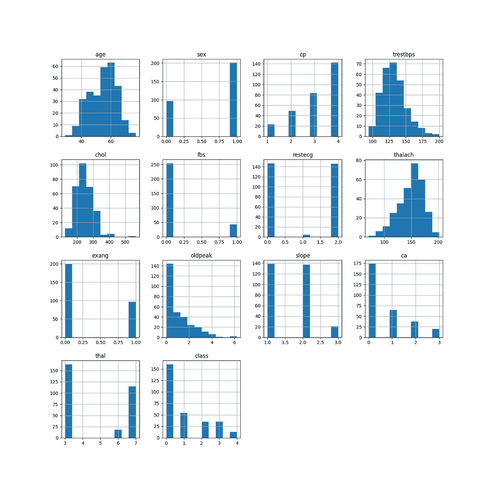
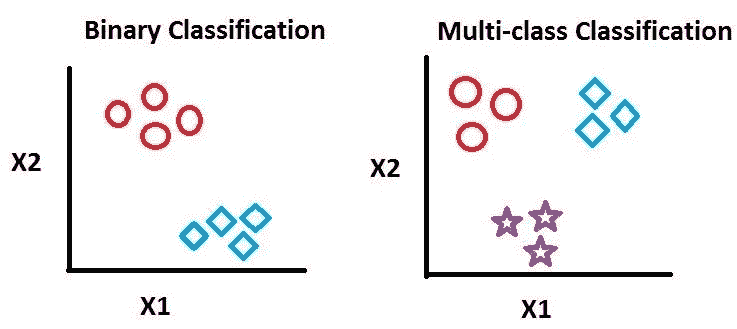
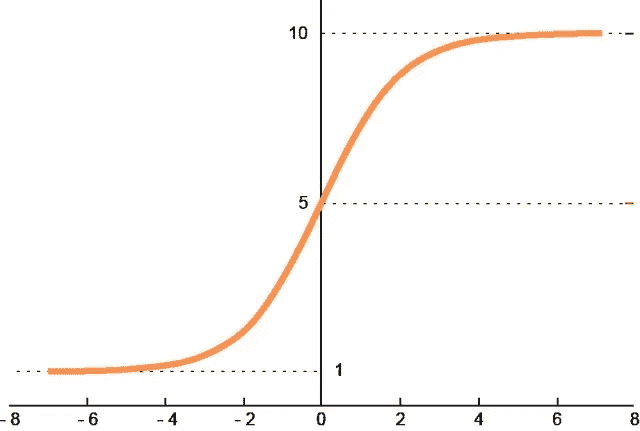
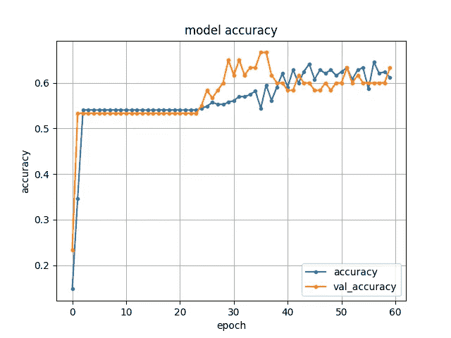
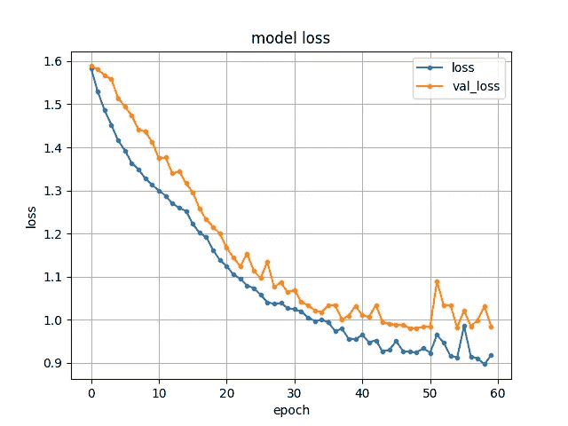
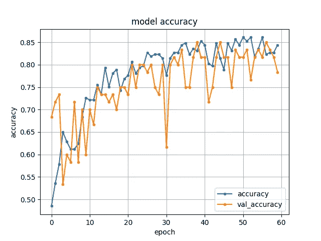
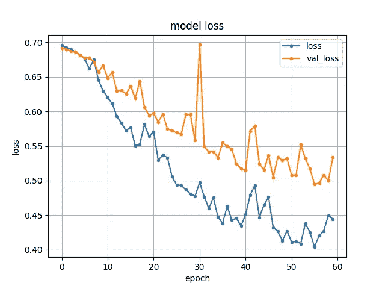

# 用 Python 从头开始预测心脏病——多类和二元分类

> 原文：<https://medium.com/mlearning-ai/heart-disease-prediction-with-python-from-scratch-multiclass-and-binary-classification-a01c55f1faaa?source=collection_archive---------0----------------------->

# 介绍

心脏病是西方国家的一个主要问题。根据美国政府统计，每 36 秒就有一人死于心脏病[1]。这是由许多问题和许多因素如胆固醇、血糖水平等造成的。影响我们的健康。我不会详细说明心脏病是如何引起的，但是，我的目标是根据主要的 13 个属性来预测心脏病。

有许多机器学习算法来执行这一分析，但我将使用卷积神经网络来完成这一分析。然而，CNN 最有可能用于图像和视频处理应用，但让我们来试试它的表现。

以下数据集取自 UCI 机器学习知识库。我将在克利夫兰数据集上做预测。下面提供了相同内容的链接:

https://archive.ics.uci.edu/ml/datasets/heart+disease[UCI 链接](https://archive.ics.uci.edu/ml/datasets/heart+disease)

# 分析数据集

## 输入属性:

1.
(年龄)2。
(性)3。
(CP)4。
(trest bps)5。
(CHOL)6。(fbs)
7。(restecg)
8。
(thal ach)9。【例】10。
11。
(斜坡)12。
13。(thal)

## 输出属性:

**类**:该属性包含 5 个变量 0，1，2，3，4，其中 0 为无心脏病，4 为非常关键阶段。

所以从输出属性可以看出，这是一个多类分类问题。然而，我将展示如何将这转换成一个二元分类问题，我将比较两种分类的结果。

Data Analysis on all 14 attributes

# 多类与二元分类

Binary vs Multi-Class. Image Source: [2]

**二进制分类**顾名思义，我们只有两个类，机器理解为 0 和 1。

大多数人试图最小化二进制分类问题主要有两个原因。

1.  二进制分类问题更加灵活和简单，因为我们只需要从 2 个类中获取信息。
2.  不需要一次性编码，因此避免混淆的机会更少。

另一方面，**多级分类**有两个以上的级。在我们的数据集上，有 5 个类，所以这是一个明显的多类分类问题。由于以下原因，多级分类更加复杂。

1.  因为它们应该是一次性编码的，并且用于模型预测，我们需要解码它来绘制我们的度量。
2.  此外，假设模型的训练过程中存在不规则性，由于有多个类，因此需要更多的时间投入来调试预处理部分。

# **多级分类:**

我们有 4 节课，我希望在 CovNet 中进行培训。让我们从这个开始:

Multi-Class Classification.py

在上面的程序中，我取了 1 个有 10 个神经元的输入层，2 个分别有 8 个和 4 个神经元的隐藏层，1 个全连接的激活输出层。对于多类分类，我们总是利用 softmax 激活功能。对于每个预测，softmax 激活函数总是将概率加到 1。它从 1 到 10 不等。

Softmax Activation Function. Image Source: [3]

Model Accuracy — Multi-Class Classification

经过 60 个周期后，我得到了 63 %的测试准确率。

Model Loss — Multi-Class Classification

**我们可以看到测试损失接近 1。**

# 二元分类:

我将把我的程序转换成二进制分类，这样标签大于 0 的类列将有心脏病。

1 —会有心脏病。

0 —没有心脏病。

Binary Classification.py

正如你在上面的程序中看到的，我已经使用了 sigmoid 激活函数。乙状结肠从 0 到 1 不等。所以，我设置了一个阈值，如果它大于 0.5，那么这个人将会有心脏病，否则这个人将不会有心脏病。

Sigmoid Activation Function. Image Source: [4]

Model Accuracy — Binary Classification

**在这里，我得到了大约 78 %的测试准确率。**

Model loss — Binary Classification

**在这里，我得到了大约 57%的测试损失。**

# 结果

我们可以清楚地看到，二元分类优于多类分类的原因是，如果有两个以上的类，神经网络将难以识别这些类。并非每个问题都是如此。同样，这取决于许多因素，如不同的数据集、其预处理部分及其特征。

1.  测试**多级分类**的分类准确率为:63 %
2.  测试**二元分类**的分类准确率为:78 %

在 Github 上关注我:[https://github.com/durveshshah](https://github.com/durveshshah)

如果你喜欢我的文章，请点击下面的链接给我买杯咖啡，这样我就可以写更多的科技文章，支持科技社区。

[***https://www.buymeacoffee.com/durveshshaK***](https://www.buymeacoffee.com/durveshshaK)

# 参考

[1]《心脏病事实| CDC . gov》.*美国疾病控制与预防中心*，2022 年 2 月 7 日，[www.cdc.gov/heartdisease/facts.htm.](http://www.cdc.gov/heartdisease/facts.htm.)

[2] Vijayakumari 和 E. Emerson Nithiyaraj。"基于 FPGA 的支持向量机实时分类."

[3] Es-Sabery，Fatima 等，“使用并行模糊深度学习分类器的句子级分类。” *IEEE 访问*9(2021):17943–17985。

[4]维基百科贡献者。“乙状结肠功能。”*维基百科*，2022 年 4 月 4 日，en.wikipedia.org/wiki/Sigmoid_function.

 [## Mlearning.ai 提交建议

### 如何成为 Mlearning.ai 上的作家

medium.com](/mlearning-ai/mlearning-ai-submission-suggestions-b51e2b130bfb)