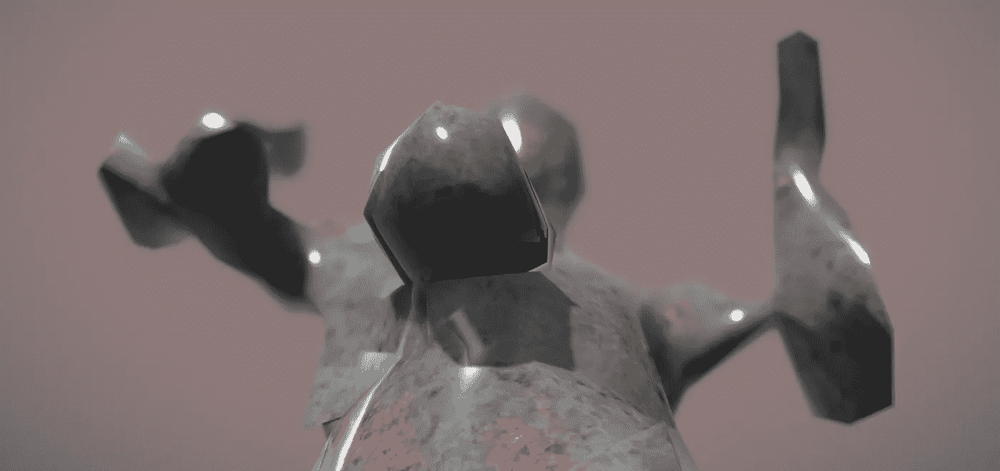

# 心在上面

> 原文：<https://medium.com/mlearning-ai/heart-on-top-6dcd17f8224f?source=collection_archive---------5----------------------->

## 由 MLearning.ai 生成的数据缺陷

by [DATAculptor](http://linktr.ee/datasculptor)

我们如何判断什么是好的，什么是坏的？在动物世界里，这很容易。如果你饿了，就吃；如果你有性欲，就去做爱；如果你的领土或你的家庭受到威胁，为之而战。但是人类不再是那样了。人类达成了一个社会契约，并决定“我们想要这个。”良好的行为被社会定义为做别人认可的事情——