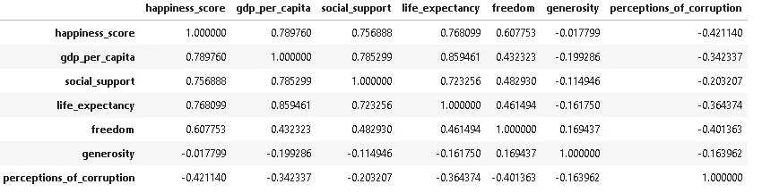
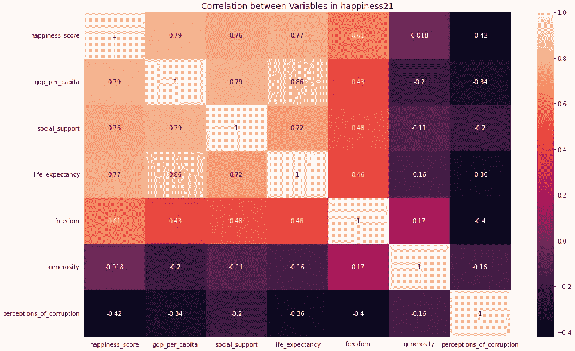
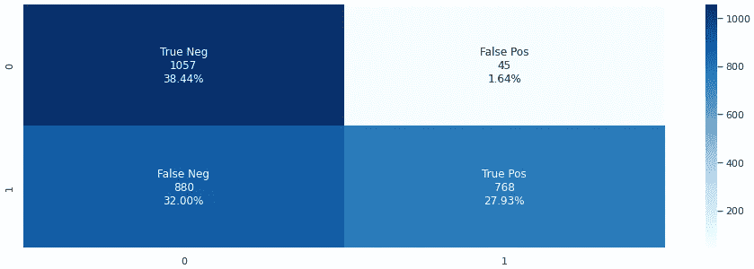
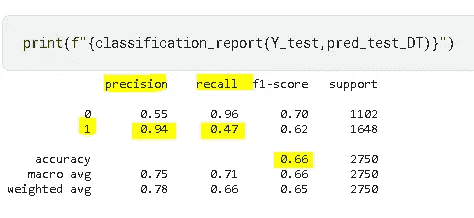

# 关联矩阵和混淆矩阵的热图|关于机器学习的额外提示

> 原文：<https://medium.com/mlearning-ai/heatmap-for-correlation-matrix-confusion-matrix-extra-tips-on-machine-learning-b0377cee31c2?source=collection_archive---------3----------------------->

我们经常在解释性数据分析(EDA)中计算**相关系数**来检查数值变量相互关联的程度。


Source: [Pexels@Pixabay](https://www.pexels.com/photo/bonfire-wallpaper-266388/)

如果一个变量增加，另一个也增加，那么这两个变量被称为**正相关**。相反，如果一个变量的高值与另一个变量的低值一致，那么它们就是**负相关**。

*   corr= +1 表示完全正相关
*   corr =–1 表示完全负相关
*   corr = 0 表示无相关性

数据科学家通常使用 [Pearson 的相关系数](https://en.wikipedia.org/wiki/Pearson_correlation_coefficient)，或其针对 EDA 的稳健替代方案，尽管也有其他类型的相关系数(例如 [Spearman 的 rho](https://en.wikipedia.org/wiki/Spearman%27s_rank_correlation_coefficient) 或 [Kendall 的 tau](https://en.wikipedia.org/wiki/Kendall_rank_correlation_coefficient) )，它们基于数据的等级，对异常值稳健，并且可以处理某些类型的非线性。这是因为这些基于排名的估计大多是针对较小的数据集和某些假设检验。

假设我有一个名为“快乐 21”的数据框架，我可以简单地使用下面几行代码来计算变量之间的相关性。

```
import numpy as np
import pandas as pd# calculate correlation
happiness21[np.array(happiness21.columns)].corr()
# cols = ['happiness_score', 'gdp_per_capita','social_support', 'life_expectancy', 'freedom', 'generosity','perceptions_of_corruption']
# happiness21[cols].corr()
```



```
import seaborn as sns# create heatmap for the calculated correlation
plt.figure(figsize=(16,10))
sns.heatmap(happiness21[np.array(happiness21.columns)].corr(),annot=True, fmt='.2g')
plt.title('Correlation between Variables in happiness21', fontsize=14)
```



此外，当我们对分类数据执行监督机器学习(分类)时，我们经常使用一个**混淆矩阵**来获得不同类别的准确和不准确预测的计数。

混淆矩阵可以是二元分类器(可能是两个以上类别的情况)。假设我正在创建一个预测模型来决定产品是否会准时到达。“1”表示产品延迟到达，“0”表示产品准时到达。测试数据由总共 2，750 条记录组成。实际上，有 1648 种产品按时到达，1102 种产品迟到。然而，分类器预测“0”1937 次，预测“1”813 次。

1.  True positive:产品到达较晚，分类器预测为“1”。*TP/总记录数= 768/2750 = 0.2793*
2.  假阳性(I 型错误):产品准时到达；然而，它被预测为“1”。*FP/总记录数= 45/2750 = 0.0164*
3.  真否定 **:** 产品准时到达，预测为“0”。*TN/总记录数= 1057/2750 = 0.3844*
4.  假阴性(第二类错误):产品到达较晚；但预测为“0”。*FN/总记录数= 880/2750 = 0.3200*

```
import numpy as np
import pandas as pd
import seaborn as sns*# confusion matrix* 
group_names = ['True Pos', 'False Pos', 'False Neg', 'True Neg']
test_cnf_matrix = confusion_matrix(Y_test,pred_test_DT)
test_counts = ["**{0:0.0f}**".format(value) for value **in** test_cnf_matrix.flatten()]
test_percentage = ["**{0:.2%}**".format(value) for value **in** test_cnf_matrix .flatten()/np.sum(test_cnf_matrix)]
test_labels = [f"**{**v1**}\n{**v2**}\n{**v3**}**" for v1, v2, v3 **in** zip(group_names,test_counts,test_percentage)]
test_labels = np.asarray(test_labels).reshape(2,2)
plt.figure(figsize = (16,5))
sns.heatmap(test_cnf_matrix, annot=test_labels, fmt='', cmap='Blues');
```



另一方面，我们可以从混淆矩阵本身计算出以下 5 个特征，其中部分特征可以从 scikit-learn 的`classification_report`中得到验证，如下图所示。



1.  **准确率**:案例分类正确的比例。 *(TP+TN)/总记录数=(1057+768)/2750 = 0.66*
2.  **精度**:预测的 1 实际上是 1 的比例。*TP/(TP+FP)= 768/(768+45)= 0.94*
3.  **回忆**(又称**灵敏度**):正确分类的 1 的比例。*TP/(TP+FN)= 768/(768+880)= 0.47*
4.  **特异性**:正确分类的 0 的比例。*TN/(TN+FN)= 1057/(1057+880)= 0.54*
5.  **患病率:**1s 实际发生的比例。(TP+FN) */总记录=(768+880)/2750 = 0.5992*

[](/mlearning-ai/mlearning-ai-submission-suggestions-b51e2b130bfb) [## Mlearning.ai 提交建议

### 如何成为 Mlearning.ai 上的作家

medium.com](/mlearning-ai/mlearning-ai-submission-suggestions-b51e2b130bfb) 

[**成为作家**](/mlearning-ai/mlearning-ai-submission-suggestions-b51e2b130bfb)