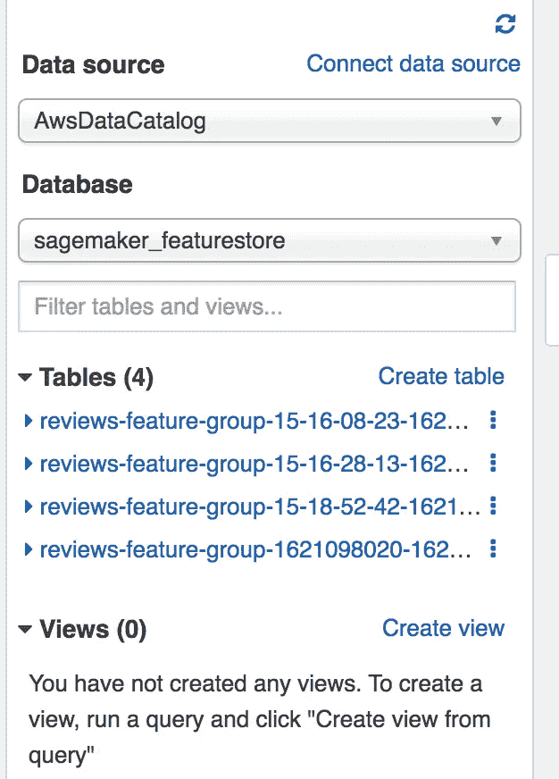
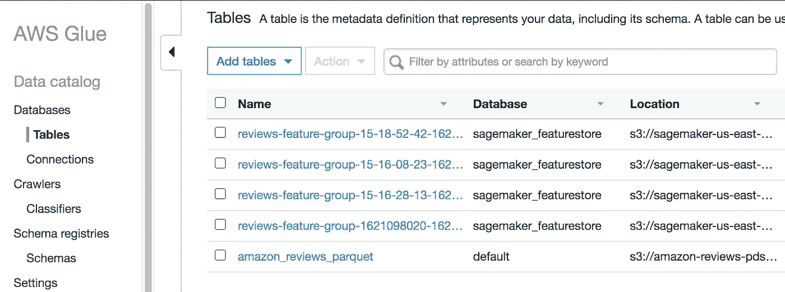
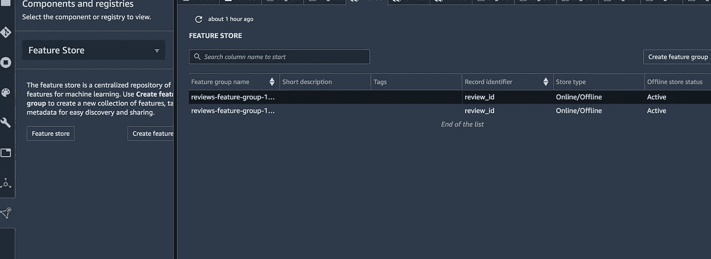
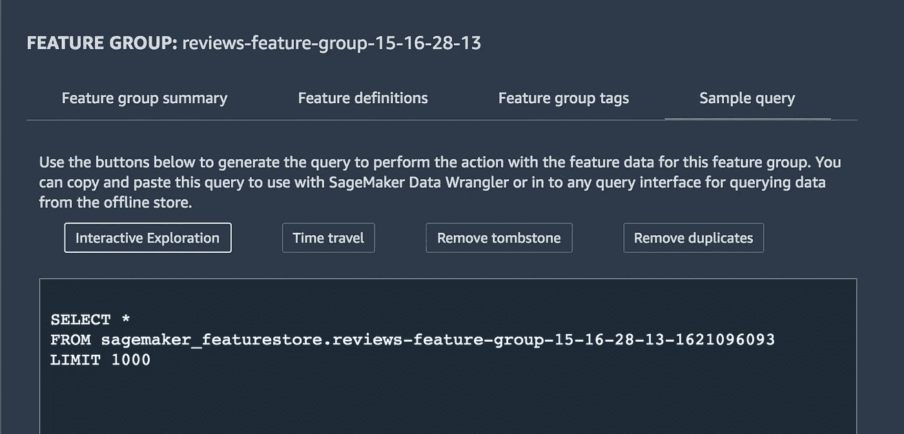
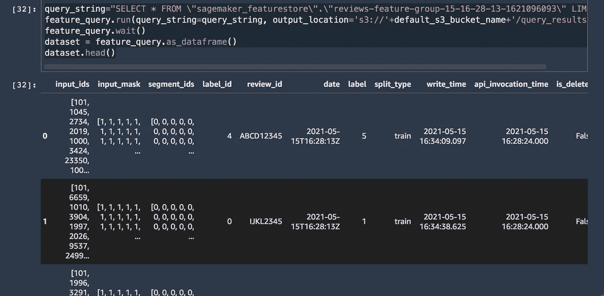
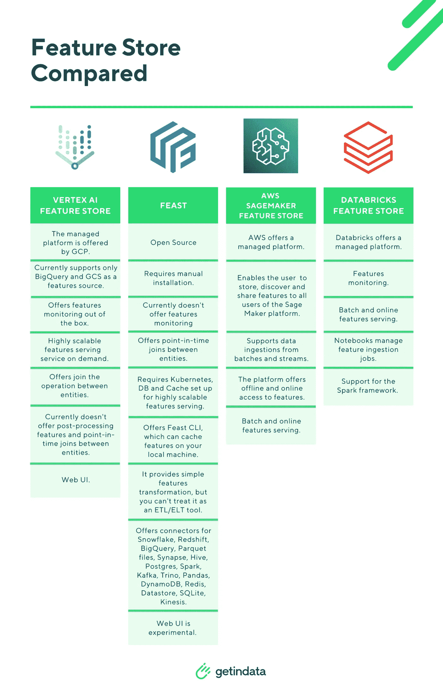

# 欢迎来到亚马逊 SageMaker 特色店

> 原文：<https://medium.com/mlearning-ai/hello-world-to-amazon-sagemaker-feature-store-d3868db5f227?source=collection_archive---------5----------------------->

亚马逊 SageMaker 功能商店在 re:Invent 2020 中宣布。但是什么是特征存储呢？以下是关于功能商店的文章。

[](https://aws.amazon.com/about-aws/whats-new/2020/12/introducing-amazon-sagemaker-feature-store/) [## 介绍亚马逊 SageMaker 功能商店-一个完全托管的存储库，用于存储、发现、共享…

### 发表于:在机器学习中，特征是 ML 模型赖以做出准确预测的数据信号。在…期间

aws.amazon.com](https://aws.amazon.com/about-aws/whats-new/2020/12/introducing-amazon-sagemaker-feature-store/) [](https://towardsdatascience.com/feature-store-as-a-foundation-for-machine-learning-d010fc6eb2f3) [## 作为机器学习基础的特征存储

### 了解如何为机器学习构建一个集中的、可扩展的特征库，以推动大规模创新

towardsdatascience.com](https://towardsdatascience.com/feature-store-as-a-foundation-for-machine-learning-d010fc6eb2f3) [](https://aws.amazon.com/blogs/machine-learning/understanding-the-key-capabilities-of-amazon-sagemaker-feature-store/) [## 了解 Amazon SageMaker 功能商店| Amazon Web Services 的主要功能

### 机器学习(ML)的一个具有挑战性的部分是特征工程，将数据转换成…

aws.amazon.com](https://aws.amazon.com/blogs/machine-learning/understanding-the-key-capabilities-of-amazon-sagemaker-feature-store/) [](https://towardsdatascience.com/ingesting-historical-feature-data-into-sagemaker-feature-store-5618e41a11e6) [## 将历史要素数据纳入 SageMaker 要素库

### 如何通过直接写入 S3 来回填 SageMaker 离线功能库

towardsdatascience.com](https://towardsdatascience.com/ingesting-historical-feature-data-into-sagemaker-feature-store-5618e41a11e6) [](https://towardsdatascience.com/q-a-for-ingesting-historical-data-into-sagemaker-feature-store-239e918ec594) [## 将历史数据纳入 SageMaker 特征库的问答

towardsdatascience.com](https://towardsdatascience.com/q-a-for-ingesting-historical-data-into-sagemaker-feature-store-239e918ec594)  [## 介绍亚马逊 SageMaker 功能商店— AWS re:Invent 2020

### 在这个视频中，我给你一个亚马逊 SageMaker 功能商店的快速浏览，一个存储你的机器的新功能…

julsimon.medium.com](https://julsimon.medium.com/introducing-amazon-sagemaker-feature-store-aws-re-invent-2020-ed9ec4769244) 

我使用的主要代码如下(感谢[克里斯·弗雷格利](https://medium.com/u/353ee16d2e35?source=post_page-----d3868db5f227--------------------------------)和[安特吉·巴斯](https://medium.com/u/50d070ecb8f5?source=post_page-----d3868db5f227--------------------------------))。

[](https://github.com/data-science-on-aws/workshop/blob/master/00_quickstart/05_BERT_Feature_Engineering.ipynb) [## aws 上的数据科学/研讨会

### 人工智能和机器学习与 Kubeflow、亚马逊 EKS 和 SageMaker-data-science-on-AWS/workshop

github.com](https://github.com/data-science-on-aws/workshop/blob/master/00_quickstart/05_BERT_Feature_Engineering.ipynb) 

和他们优秀的社区

[](https://www.datascienceonaws.com) [## 自动气象站上的数据科学

### 与 BERT、TensorFlow 和 Amazon SageMaker 一起构建端到端的管道在这个演讲中，我将构建一个端到端的…

www.datascienceonaws.com](https://www.datascienceonaws.com) 

使用要素存储的通常工作流程是:

1.  特征工程:生成特征->定义特征存储组->将特征吸收到特征存储组中
2.  训练:发现可用功能->加载功能->用功能训练模型

特征库的一个重要特征是可重用性(它可以与其他人共享，您可以通过时间旅行到以前的特征以获得模型再现性)。

目前 SageMaker 功能库的工作方式是创建相关的 Athena 表、AWS Glue 目录，底层功能数据存储在 S3。您可以从 Athena 加载回特性(是的，您仍然知道特性的底层存储的底层细节，我希望将来可以抽象出来:一个读写接口。)

[](https://www.logicalclocks.com/blog/feature-store-the-missing-data-layer-in-ml-pipelines) [## 特征存储-逻辑时钟

### TLDR；要素存储是一个中央保管库，用于存储已记录、管理和访问控制的要素。在这篇博客中…

www.logicalclocks.com](https://www.logicalclocks.com/blog/feature-store-the-missing-data-layer-in-ml-pipelines) 

以下是 Athena 和 Glue 中的布局:



上面的笔记本向您展示了如何创建功能存储组、创建功能定义以及将功能纳入功能组。现在假设另一个用户想要使用这些特性。他需要从 Athena(这是一个在 S3 查询数据的无服务器查询服务)读取它。下面，我们利用笔记本中创建的 feature_group 变量来查找存储我们的特征的底层 Athena 表的信息:

```
feature_query = feature_group.athena_query()
feature_query
```

feature_query 是 Athena query(catalog = ' AWS datacatalog '，database = ' sage maker _ featurestore '，table _ name = ' reviews-feature-group-15–18–52–42–1621104762 '，sage maker _ session =<sagemaker.session.session object="" at="">，_ current _ query _ execution _ id = None，_result_bucket=None，_result_file_prefix=None)</sagemaker.session.session>

类型为 sage maker . feature _ store . feature _ group。雅典娜教堂

要在仍有 feature_group 变量的情况下加载获取的特性，可以从 Sagemaker studio 查看特性存储和 Athena 查询



```
query_string="SELECT * FROM \"sagemaker_featurestore\".\"reviews-feature-group-15-16-28-13-1621096093\" LIMIT 1000"
feature_query.run(query_string=query_string, output_location='s3://'+bucket+'/query_results/')
feature_query.wait()
dataset = feature_query.as_dataframe()
dataset.head()
```

输出



也可以用 PyAthena 查询

```
import boto3
import sagemakersess = sagemaker.Session()
bucket = sess.default_bucket()
role = sagemaker.get_execution_role()
region = boto3.Session().region_namefrom pyathena import connect
import pandas as pds3_staging_dir = "s3://{}/athena/query-cache".format(bucket)
database_name = "AwsDataCatalog"
conn = connect(region_name=region, s3_staging_dir=s3_staging_dir)query_string="SELECT * FROM \"sagemaker_featurestore\".\"reviews-feature-group-15-16-28-13-1621096093\" LIMIT 1000"
df = pd.read_sql(query_string, conn)
df.head()
```

Feature store 还处于萌芽状态(以及整个生产机器学习行业)，它能成为集中式的特征管理中心吗？

[](https://docs.featurestore.org) [## ML 的特征存储

### “特征存储”是数据架构中的一个新兴概念，它是由采用 ML…

docs.featurestore.org](https://docs.featurestore.org) [](/getindata-blog/feature-store-comparison-4-feature-stores-explained-and-compared-1e2142ce6b9e) [## 功能存储比较:4 个功能存储—解释和比较

### 在这篇博文中，我们将简单明了地展示 4 个流行功能商店的区别:顶点 AI…

medium.com](/getindata-blog/feature-store-comparison-4-feature-stores-explained-and-compared-1e2142ce6b9e) 