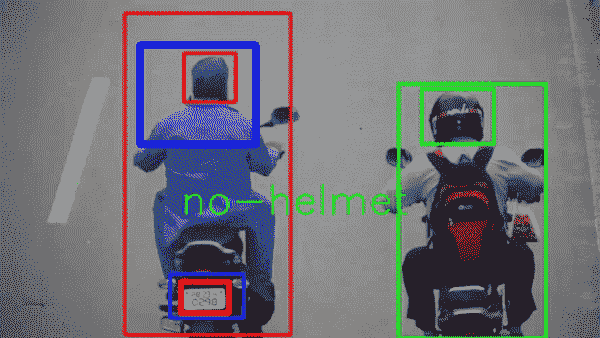
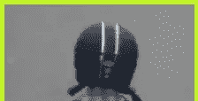
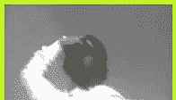

# 使用 YOLOv3 检测和识别头盔和车牌——简单易行——有趣的项目

> 原文：<https://medium.com/mlearning-ai/helmet-and-number-plate-detection-and-recognition-using-yolov3-interesting-project-2f38b2d5f830?source=collection_archive---------0----------------------->

因此，在这篇博客中，我们将看到如何使用 [YOLOv3](https://pjreddie.com/darknet/yolo/) 和其他一些计算机视觉技术，在 Python 中实现头盔和车牌的检测和识别。**这是一个非常先进的项目，你可以用它来完成大学的小项目和大项目**。所以不浪费任何时间。

我们在头盔和车牌检测和识别背后的主要动机是首先检测某人是否戴着头盔，如果他戴着，没有问题，但如果没有，检测他的车牌，并向他发送电子邮件。

**点击此处阅读全文及源代码—**[https://machine learning projects . net/helmet-and-number-plate-detection-and-recognition/](https://machinelearningprojects.net/helmet-and-number-plate-detection-and-recognition/)



# 让我们开始吧…

## 头盔和号牌检测和识别代码…

```
import cv2
import numpy as np
import random
import os
from PIL import Image
import time
import imutils
from tensorflow.keras.models import load_model

os.environ['TF_FORCE_GPU_ALLOW_GROWTH'] = 'true'

net = cv2.dnn.readNet("yolov3-custom_7000.weights", "yolov3-custom.cfg")
net.setPreferableBackend(cv2.dnn.DNN_BACKEND_CUDA)
net.setPreferableTarget(cv2.dnn.DNN_TARGET_CUDA)

model = load_model('helmet-nonhelmet_cnn.h5')
print('model loaded!!!')

cap = cv2.VideoCapture('testing videos/test2.mp4')
COLORS = [(0,255,0),(0,0,255)]

fourcc = cv2.VideoWriter_fourcc(*"XVID")
writer = cv2.VideoWriter('output.avi', fourcc, 5,(888,500))
writer = VideoWriter('output.avi',(frame.shape[1], frame.shape[0]))
writer.open()

def helmet_or_nohelmet(helmet_roi):
    try:
        helmet_roi = cv2.resize(helmet_roi, (224, 224))
        helmet_roi = np.array(helmet_roi,dtype='float32')
        helmet_roi = helmet_roi.reshape(1, 224, 224, 3)
        helmet_roi = helmet_roi/255.0
        return int(model.predict(helmet_roi)[0][0])
    except:
            pass

layer_names = net.getLayerNames()
output_layers = [layer_names[i[0] - 1] for i in net.getUnconnectedOutLayers()]

ret = True

while ret:

    ret, img = cap.read()
    img = imutils.resize(img,height=500)
    # img = cv2.imread('test.png')
    height, width = img.shape[:2]

    blob = cv2.dnn.blobFromImage(img, 0.00392, (416, 416), (0, 0, 0), True, crop=False)

    net.setInput(blob)
    outs = net.forward(output_layers)

    confidences = []
    boxes = []
    classIds = []

    for out in outs:
        for detection in out:
            scores = detection[5:]
            class_id = np.argmax(scores)
            confidence = scores[class_id]
            if confidence > 0.3:
                center_x = int(detection[0] * width)
                center_y = int(detection[1] * height)

                w = int(detection[2] * width)
                h = int(detection[3] * height)
                x = int(center_x - w / 2)
                y = int(center_y - h / 2)

                boxes.append([x, y, w, h])
                confidences.append(float(confidence))
                classIds.append(class_id)

    indexes = cv2.dnn.NMSBoxes(boxes, confidences, 0.5, 0.4)

    for i in range(len(boxes)):
        if i in indexes:
            x,y,w,h = boxes[i]
            color = [int(c) for c in COLORS[classIds[i]]]
            # green --> bike
            # red --> number plate
            if classIds[i]==0: #bike
                helmet_roi = img[max(0,y):max(0,y)+max(0,h)//4,max(0,x):max(0,x)+max(0,w)]
            else: #number plate
                x_h = x-60
                y_h = y-350
                w_h = w+100
                h_h = h+100
                cv2.rectangle(img, (x, y), (x + w, y + h), color, 7)
                # h_r = img[max(0,(y-330)):max(0,(y-330 + h+100)) , max(0,(x-80)):max(0,(x-80 + w+130))]
                if y_h>0 and x_h>0:
                    h_r = img[y_h:y_h+h_h , x_h:x_h +w_h]
                    c = helmet_or_nohelmet(h_r)
                    cv2.putText(img,['helmet','no-helmet'][c],(x,y-100),cv2.FONT_HERSHEY_SIMPLEX,2,(0,255,0),2)                
                    cv2.rectangle(img, (x_h, y_h), (x_h + w_h, y_h + h_h),(255,0,0), 10)

    writer.write(img)
    cv2.imshow("Image", img)

    if cv2.waitKey(1) == 27:
        break

writer.release()
cap.release()
cv2.waitKey(0)
cv2.destroyAllWindows()
```

*   第 1–8 行—导入所需的库。
*   第 10 行—允许 TensorFlow 使用 GPU。
*   第 12 行—从 yolo 文件中读取网络权重。这些“yolo.weights”是我们训练用来检测自行车和车牌的文件。
*   第 13–14 行—如果您想使用 GPU，请将后端和目标设置为 CUDA。
*   第 17–18 行—加载我们训练的用于检测头盔的 CNN 模型。



*   第 20 行— [VideoCapture](https://docs.opencv.org/3.4/d8/dfe/classcv_1_1VideoCapture.html) 对象从视频提要中读取帧。
*   第 21 行——我们稍后将使用的颜色数组。
*   第 23–27 行——这个编写器将帮助我们使用 [cv2 将输出帧写入视频文件。VideoWriter()](https://docs.opencv.org/3.4/dd/d9e/classcv_1_1VideoWriter.html) 。
*   第 29–37 行—该函数将提供一幅图像，模型将预测图像中是否有头盔。
*   第 39–40 行-获取输出图层，以便在后续步骤中从中获取输出。
*   第 46–49 行—从视频文件中读取帧，调整它们的大小并获得它们的高度和宽度。
*   第 51 行——使用[cv2 . dnn . blobfromimage()](https://docs.opencv.org/4.5.0/d6/d0f/group__dnn.html)从图像中创建一个斑点，并使用该斑点作为我们网络的输入。
*   第 53 行——将这个 blob 设置为我们网络的输入。
*   第 54 行——让这个 blob 流过网络并获得输出。
*   第 60–76 行—获取网络输出。
*   第 78 行—获取由于非最大抑制而不考虑的框的索引。
*   第 80–99 行——在自行车周围画一个绿色方框，在车牌周围画一个红色方框。检测是否有头盔并打印出来。
*   第 102–103 行—将输出图像写成视频。
*   第 105–106 行—如果有人按 ESC 键，则破解密码。

## 最终结果…


如果有任何关于头盔和车牌检测和识别的疑问，请通过电子邮件或 LinkedIn 联系我。

***探索更多机器学习、深度学习、计算机视觉、NLP、Flask 项目访问我的博客—*** [***机器学习项目***](https://machinelearningprojects.net/)

**如需进一步的代码解释和源代码，请访问此处** —

[](https://machinelearningprojects.net/helmet-and-number-plate-detection-and-recognition/) [## 使用 YOLOv3 的头盔和车牌检测和识别-简单方法- 2021 -机器学习…

### 因此，在这个博客中，我们将看到我们如何用 Python 实现头盔和车牌的检测和识别…

machinelearningprojects.net](https://machinelearningprojects.net/helmet-and-number-plate-detection-and-recognition/) 

*这就是我写给这个博客的全部内容，感谢你的阅读，我希望你在阅读完这篇文章后，能有所收获，直到下一次👋…*

***阅读我之前的帖子:***[***health cure—一个一体化的医疗解决方案—医疗项目— 7 种疾病检测***](https://machinelearningprojects.net/healthcure-medical-project/)

[](/mlearning-ai/mlearning-ai-submission-suggestions-b51e2b130bfb) [## Mlearning.ai 提交建议

### 如何成为 Mlearning.ai 上的作家

medium.com](/mlearning-ai/mlearning-ai-submission-suggestions-b51e2b130bfb)