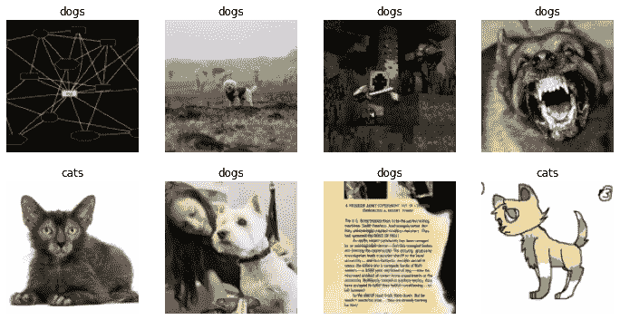
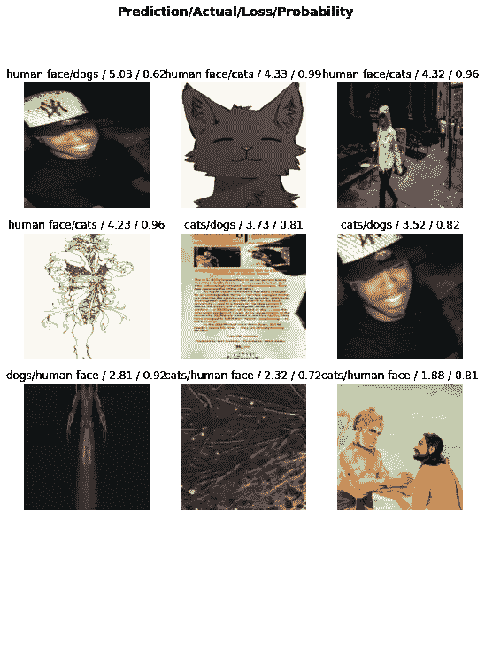
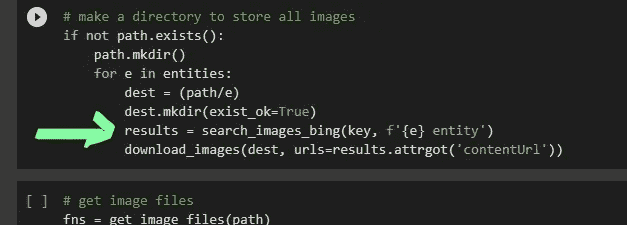
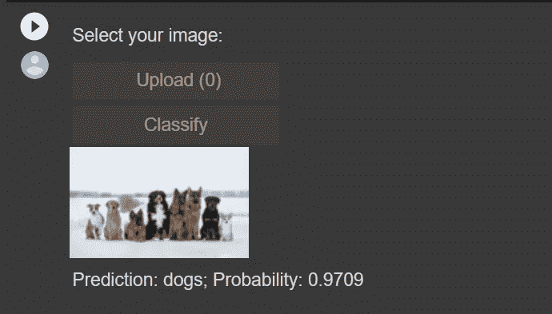

# 救命啊！这个数据有误导性。

> 原文：<https://medium.com/mlearning-ai/help-this-data-is-misleading-4c421e9df7fa?source=collection_archive---------5----------------------->

我很害怕。“我的模型会这样运行吗？我对自己说:“如果我要发行电影，那就太危险了。我刚刚开始应用到目前为止我通过深度学习学到的概念，我决定建立一个非常简单的分类器——它可以区分猫、狗和人脸。我构建模型后得到的结果(预测)真的很吓人——一开始。

在彻底梳理之后，我看了看我正在遵循的教程，我很快得出一个结论，我的数据从一开始就在误导我。我下载并错误地标注了数据。

Photo by [Matthew Henry](https://unsplash.com/@matthewhenry?utm_source=medium&utm_medium=referral) on [Unsplash](https://unsplash.com?utm_source=medium&utm_medium=referral)

# **什么是数据？**

数据，你可能已经听过无数次了，是原始信息，需要处理并转化为有用和有意义的信息。当你试图建立你的人工智能模型时，这种说法变得更加明显。好吧，在谷歌上搜索了一下，哪些数据可以被定义为事实、概念或指令的形式化表示，这些数据应该适合人类或电子机器进行交流、解释或处理 *[* [*来源*](https://www.tutorialspoint.com/computer_fundamentals/computer_data.htm)*】*。有道理吗？

好吧，让我们回到我们的故事。我做的一些数据标记是错误的(如下图所示)，如果你不在你的数据集中解决这个问题，事情会很快失控。对我来说，因为我很兴奋，我不顾一切地继续下去，没有解决它。

Example of improper labelling

经过一些微调和建模过程，我得到了一些非常令人震惊的结果:

False predictions

看着左上角，我给那张人脸贴上了“狗”的标签。

发生了什么事？嗯，简单来说，我没有得到正确的数据。当试图建立适当的人工智能模型时，获得**质量和正确的**数据怎么强调都不为过。正如您在下面看到的，我在这里失败了，因为我基本上用一个模糊的搜索词搜索了我的数据集，并且未能验证下载和标记的数据(我通过将一轮搜索的结果存储在一个目录中来标记数据)，并希望它会没事。其实我搜索‘狗实体’、‘猫实体’、‘人实体’，就是为了得到我的数据。

Search function image: The function from the Fastai API

所以在意识到我的错误后，我试图清理数据，但 OMG 这是一个非常累人的过程。也许有更好的方法，我只是使用了我在教程中看到的可以帮助我清理数据的方法，但仍然没有帮助。我的数据是错误的。我从中学到了什么？建立人工智能模型时高质量数据的重要性。

# 数据清理

**那么获得干净数据的重要性是什么呢？**

在我开始之前，我只想说获取脏数据是一种常态，这就是为什么有技术来清理您的数据。我只是看到了一个例子，如果你给你的模型输入错误的数据，可能会发生什么。事情会出错。我可以向你保证。我没有给你提供不准确的信息，而是在这个[网站](https://analyticsindiamag.com/understanding-the-importance-of-data-cleaning-and-normalization/)上找到了一个很好的清理数据的理由。

数据清理在帮助**找到可靠答案的分析过程中扮演着重要角色**。通过数据清理提高数据质量可以消除代价高昂的处理错误和不正确的发票等问题。数据清理是确定和纠正错误数据的过程，或者说该过程是寻找一种方法来最大限度地提高数据集的准确性，而不必篡改可用的数据。如果有什么重要的事情你应该牢记在心，那就是干净的数据会给你更好的机会做出**明智的决定。**此外，请记住，对于大型数据集， **100** %的整洁度几乎是不可能实现的(不要太自责)。要了解更多关于数据清理的信息，你可以访问这篇伟大的文章。

# 最后的想法

如果你一直密切关注我的故事，你会知道我坚持清理我的数据，即使我的数据集很小。我很兴奋，并急于让我的模型预测一组新的数据，所以我没有做大量的数据清理。我试着在一个新的数据上测试它(如下图),令人惊讶的是，它在这里做得相当好，即使数据清理很少。

Model prediction after just little data cleaning

当我听到或读到深度学习工程师说他们 90%的时间花在数据准备和功能工程上时，我现在可以理解了。当试图建立好的人工智能模型时，时间应该花在高质量的数据准备上。构建人工智能系统时需要一种以数据为中心的方法，在以数据为中心的方法中，质量数据是基石。

所以，这就是，我的数据集误导了我，是我造成的。它给了我一个很好的教训，我希望你在这里学到了一些东西。当在互联网上搜索数据集时，你认为什么是好的方法？

 [## Mlearning.ai 提交建议

### 如何成为 Mlearning.ai 上的作家

medium.com](/mlearning-ai/mlearning-ai-submission-suggestions-b51e2b130bfb)