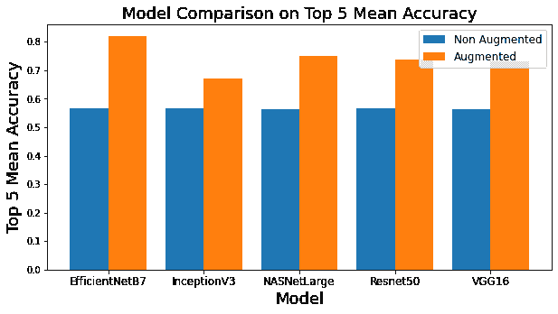
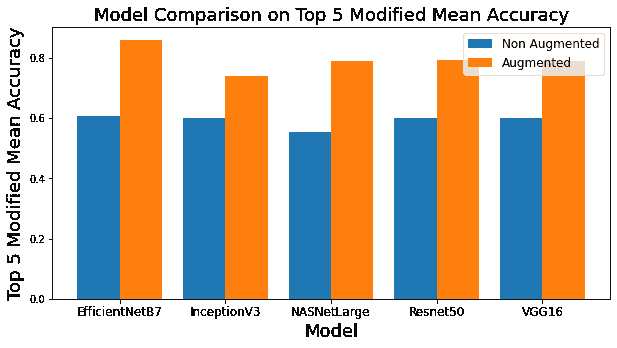
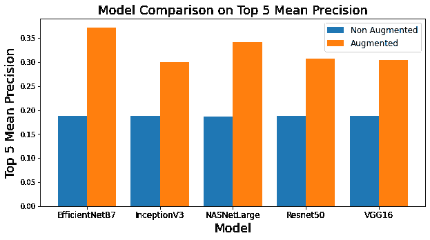
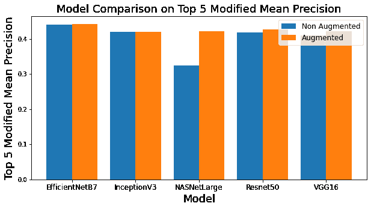
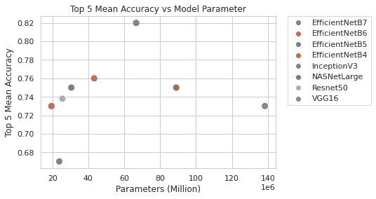
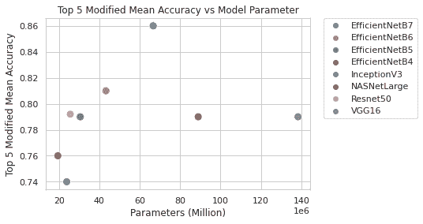
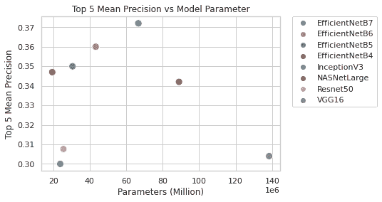
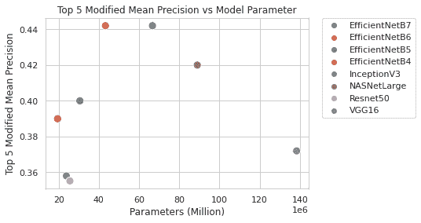

# 帮助机器可视化我们的世界

> 原文：<https://medium.com/mlearning-ai/helping-machines-visualize-our-world-f1c489bb2da9?source=collection_archive---------4----------------------->

## 作为特征提取器的无头卷积神经网络


Photo by [Bud Helisson](https://unsplash.com/@budhelisson?utm_source=medium&utm_medium=referral) on [Unsplash](https://unsplash.com?utm_source=medium&utm_medium=referral)

帮助机器理解数字图像的内容允许各种应用，例如图像分割、对象检测、面部识别、边缘检测、模式检测、图像分类、特征匹配等等！在这篇文章中，我们将重点讨论特征匹配，即从一幅图像中学习特征，并将其与其他图像进行匹配以进行图像检索！注意，下面的代码也可以在这个[链接中找到。](https://github.com/koohaoming/SnapItFindIt/blob/main/CNN_Keras_Feature_Extractor.ipynb)

这是一系列由 4 名新加坡国立大学硕士研究生(理学硕士。工业 4.0 中)谁在拿 ISY5004 智能传感系统。以下是我们将要分享的内容的快照:

*   [网络报废、使用 CNN 的特征提取和图像搜索。](/@jensen_wong/snap-it-find-it-your-shopping-companion-bot-8101494545a8)
*   [使用 YOLOv3 进行物体检测。](/@renxiang91/object-detection-using-yolov3-51baa2bbac94)
*   [使用 Detectron2 进行目标检测和背景去除。](https://jzys-low.medium.com/object-detection-and-background-removal-with-detectron2-2242a863cc51)
*   [使用各种 CNN 模型的进一步改进](https://haomingkoo.medium.com/helping-machines-visualize-our-world-f1c489bb2da9)(你现在在这里！)
*   [电报机器人和云端托管。](https://jensen-wong.medium.com/a-telegram-bot-with-the-power-of-computer-vision-f415fd2efae8)

# 迁移学习

预训练的卷积神经网络(CNN)模型是计算机视觉任务的良好起点，因为开发神经网络模型需要大量的时间和资源。使用迁移学习，模型可以重新用于第二个任务。在这个项目中，迁移学习被用于特征提取。该模型的顶层通常涉及汇集到用于分类的 1D 向量中，并且该模型的剩余部分用于使用从 Imagenet 训练的权重作为起点的特征提取。该图像通过一系列权重以给出特征向量，该特征向量可用于与另一图像的距离匹配。较短的距离意味着更接近的匹配。

## 预处理

让我们加载您首选的数据集，并获取图像的路径。用于此简短记录的数据集具有以下结构:

```
hipvan_image/
    beds/
    decor/
    kids/
    ....ikea_image/
    Acuoustic panels & acoustic arts/
    Baby product/
    Children/
    ....
```

因此，下面的代码被用来遍历文件夹以创建一个 file_paths 列表。

## 分割训练集/测试集

在这里，我们将为性能评估准备我们的训练/测试集，这将用于选择我们的图像检索使用的理想模型

*   删除少于 5 个对象的类，因为它们会在稍后拆分数据集时造成一些麻烦。
*   将数据分成 80/20 训练/测试

## Keras 特征提取器

现在我们已经准备好了所有的数据，让我们开始有趣的部分。运行下面的代码将请求一个 user_input，您可以调用它来生成一个 headless 模型。我们所说的无头是指神经网络的末端没有分类器。因此，我们将有一个特征向量，可用于图像检索情况下的匹配。

继续输入你看到的模型。比如 xception，vgg16，inceptionv3，efficientnetb7。有关更多可用型号，请参考以下链接，了解它们在 imagenet 上的性能。[https://keras.io/api/applications/](https://keras.io/api/applications/)

需要注意的是，参数越多的模型运行越慢。

## 特征提取函数

随着模型摘要的显示，这意味着您已经成功地加载了模型！为了提取每幅图像的特征向量，我们将遍历之前生成的 path_list。上述无头模型的 conv 特征在 2D。

## 执行特征提取

前面定义的函数将被调用，每个图像的特征向量将被存储在 numpy 数组中，我们可以保存它以备将来使用！

# 绩效指标

对五个流行的模型 EfficientNetB7、InceptionV3、NASNetLarge、Resnet50 和 VGG16 进行了三次运行，以获得评估指标的平均值。为了挑选用例的最佳模型，有必要使用良好建立的评估度量和修改的度量来处理多标签方法。选择的指标是准确度、精确度和参数。宏软 F1 和宏 F1 也进行了评估，但由于多类问题而被放弃，将在本节稍后讨论。

## 定义绩效矩阵

这些将在随后的部分中进一步阐述

## 生成性能指标

下面的代码字符串将执行先前定义的性能指标，以确定模型的准确性/精确度。

## 准确(性)

准确性是指在所有预测中，具有正确匹配标签的图像数量。由于多标签挑战，我们选择了前 5 名的准确度。

前 5 名准确度是目标类落入前 5 名预测类的频率的度量。在图像分类问题中，它是 softmax 分布的前 5 个值。对于用例，这是一种使标签在与被查找的单个目标标签的距离最短的前 5 个图像内匹配的度量。

前 5 名准确度=正确的单一类别预测数/预测数

在本文中，使用了 Top 5 准确性的稍微修改的版本，其中预测的标签与目标对象多标签相匹配。

修改后的前 5 名准确度=多类别的正确预测数/预测总数

图像增强总体上提高了准确性，因为观察到错误分类的项目主要来自具有较小数据集的标签。该团队试图加入权重来平衡标签，但没有提高模型的性能。基于如图 1 所示和表 4 中汇编的前 5 个平均准确度和修正准确度，发现 EfficientNetB7 在该度量中表现优于其他模型，表明该模型最有可能在前 5 个最接近的匹配中返回准确的标签。NASNetLarge 和 ResNet50 是仅次于它们的最佳型号，彼此具有可比性。



图 1:前 5 名平均准确度和前 5 名修正平均准确度的条形图

## 精确

精度也称为正预测值，是检索实例中相关实例的比例。这对于用户接收相关搜索结果很重要。该团队建议使用与目标单个标签最接近的前 5 个匹配标签的精度，以及稍微修改的版本，以使前 5 个最接近的匹配标签与目标的多标签匹配。

前 5 个精度= 5 个搜索中的真阳性单个标签/(真阳性+假阳性)

前 5 个修改精度=多标签中的真阳性/(真阳性+假阳性)在 5 个搜索中

如图 2 的条形图所示，EfficientNetB7 在精度性能指标方面名列前茅，ResNet50 和 NASNetLarge 紧随其后。



图 2:前 5 位平均精度和前 5 位修正平均精度的条形图

## 因素

需要使用更少的每秒浮点运算(FLOPS)来允许接近实时的推断。这是为了实现更快的搜索和更少的计算成本。因此，图 3 分享了几个散点图，这些散点图是根据前面提到的模型参数的准确度和精确度绘制的。最理想的模型落在散点图的左上方。该团队选择了 EfficientNetB7 作为模型，它具有中等数量的参数，同时实现了高准确度和精确度。在我们的一组实验中，性能最差的模型是 VGG16，它的准确度和精度较低，但需要大量的参数。



图 3:前 1/5 平均准确度/精度与参数的散点图

该团队尝试执行的最后一个指标是宏观 F1 得分，这是精确度和召回率之间的调和平均值，其中每个标签都计算平均值，并对所有标签进行平均。p 和 r 分别是精度和召回率。这些值存储在表 6 中，似乎已经饱和。放下超过 5 个标签的对象会恶化宏 F1 值。最初的意图是在对权重进行微调之前获得足够高的宏观 F1 分数。值得注意的是，该团队也尝试过执行加权类，但没有提高宏观 F1 分数的性能。因此，团队根据准确度、精确度和参数确定了 CNN 特征提取。

# 结论

在这次分享中，我们介绍了如何使用 Keras 应用程序中可用的 CNN 模型提取特征。同样，在 EfficientNetB7 很好地转移到 scraped 数据集并在准确性、精确度和效率方面优于各种 CNN 模型的情况下，模型的性能将在后面的实验结果中讨论。因此，选择 EfficientNetB7 作为用于特征提取的 CNN，与几个流行的模型相比，它产生了更多的相关匹配。

现在，有了我们手头的正确模型，让我们看看如何将它集成到您自己的 Telegram bot 中，并在云上托管它。继续第 5 部分！

[](https://jensen-wong.medium.com/a-telegram-bot-with-the-power-of-computer-vision-f415fd2efae8) [## 具有计算机视觉能力的电报机器人

### Snap-it Find-it:您的购物伴侣机器人

jensen-wong.medium.com](https://jensen-wong.medium.com/a-telegram-bot-with-the-power-of-computer-vision-f415fd2efae8) 

## 内容页面

*   [网页废弃、使用 CNN 的特征提取和图像搜索](/@jensen_wong/snap-it-find-it-your-shopping-companion-bot-8101494545a8)
*   [使用 YOLOv3 进行物体检测](/@renxiang91/object-detection-using-yolov3-51baa2bbac94)
*   [使用探测器 2 进行物体探测和背景去除](https://jzys-low.medium.com/object-detection-and-background-removal-with-detectron2-2242a863cc51)
*   [使用各种 CNN 模型的进一步改进](https://haomingkoo.medium.com/helping-machines-visualize-our-world-f1c489bb2da9)(你现在在这里！)
*   [电报机器人和云端托管](https://jensen-wong.medium.com/a-telegram-bot-with-the-power-of-computer-vision-f415fd2efae8)