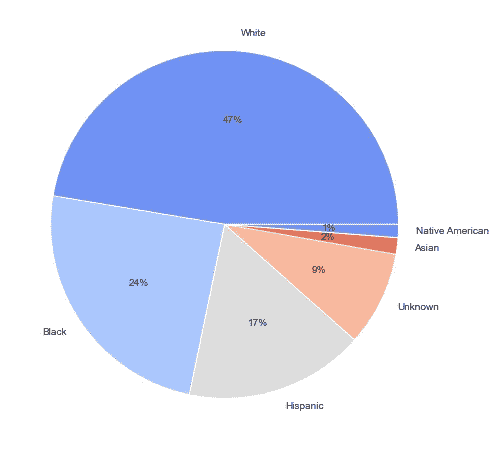
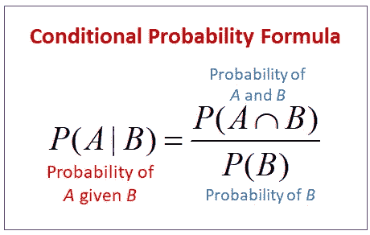
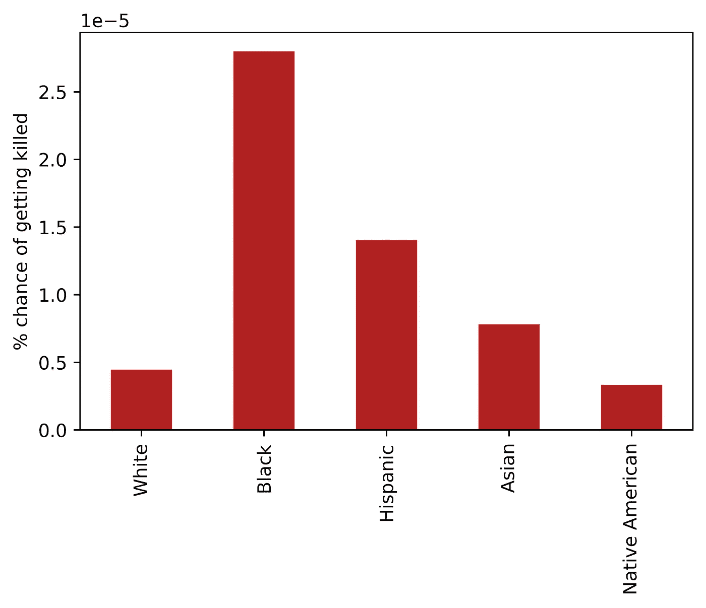
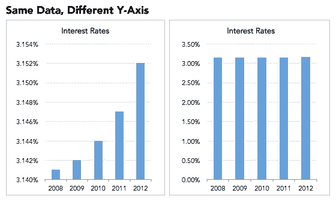
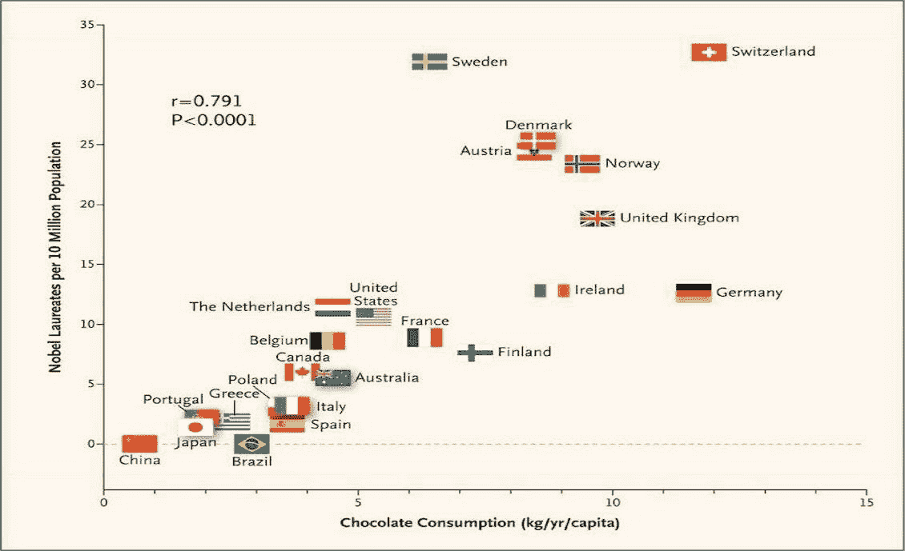

# 以下是媒体如何让数据说谎(以及如何识别)

> 原文：<https://medium.com/mlearning-ai/heres-how-media-make-data-lie-and-how-to-spot-it-ea620ed7520d?source=collection_archive---------5----------------------->

[By Lukas on Pexels](https://www.pexels.com/fr-fr/photo/document-sur-le-dessus-de-la-papeterie-669619/)

> 你可以让数据说任何你想让它说的话。

你可能已经听过这个短语了。你自己可能也用过。但这真的是我们能达成一致的事情吗？

大多数时候(不是说“总是”)，答案是否定的。数据是中性的，总是在给定的时刻显示真相，因此理论上不可能从中撒谎。但在这种情况下，我们如何解释所有不同的做法，让我们给观众花哨的数字？

问题本身不在于数据，而在于我们解读数据的方式。但是为了使它更清楚，在给你一般的提示之前，我将带你看一些例子。

# 一个研究案例:美国致命的警察枪击事件

*本例将使用* [*关于美国警察枪击事件的免费数据集*](https://www.kaggle.com/kwullum/fatal-police-shootings-in-the-us) *和* [*我的数据分析项目*](https://github.com/Brice-Vergnou/police-fatalities) *了解一下。*

**让数据撒谎**

让我们想象一下，我要求你根据不同的比赛制作一张死亡人数的图表。很自然，我们会用死亡人数占总死亡人数的比例来制作一个图表(在这个例子中是一个饼图)。你会得到这样的结果:

Image by author

然后我们会告诉每个人，事实上一半的警察受害者是白人。似乎有点不对劲吧？这些数字是真实的，我没有从数据库中添加或删除任何记录，所以它必须从我们的阴谋…但如何？

在宣布结果之前，我们应该问问自己我们在看什么。我们的目标是看看种族是否是一个重要因素，而这里我们想知道受害者的分布情况。白人在这个情节中占据了巨大的位置，只是因为白人的份额更重要，所以这个情节不能解决我们的问题。

我们需要根据你的种族来看你成为警察枪击受害者的几率有多大，听起来条件概率会很有用。

**解决问题**

你可能还记得高中时的条件概率。这是一种在已知一个事件已经发生的情况下，表达另一个事件发生的概率的方法。

From [onlinemathlearning](https://www.onlinemathlearning.com/conditional-probability.html)

在这里，我们将寻找 X 种族，死于警察的几率是多少。这样，人口比例就不重要了。然而，我们不能使用上面的公式，因为我们没有正确的数字。但是我们还有另一种可能性:我们可以看看某个种族的死亡人数与这个种族的人口数之比。

首先，我们创建一个临时数据集，并记录当时(2016 年)的美国人口

然后我们计算每个种族的人口

我们得到了每个种族的条件概率

并绘制图表！

给出这个情节:

Image by author

现在你知道什么是真相了。用同样的数据，你从显示一半的受害者是白人到显示你作为一个黑人死亡的可能性是 5 倍，所有这些都是用同样的数据。我们只是改变了看待问题的方式。

# 一般心态

所以…我们已经看到了一个从你的数据中给出“假”结果的具体例子，但是如果在野外发现一些呢？

一般来说，问问自己这些人试图给你什么样的见解，以及这种见解是否相关。下面列举几个制造“假数据”的主要方法:

*   **有偏抽样**:被调查的人根据一个标准在人群中形成一个特定的群体(例如，只问来自较低阶层的人他们的工作和随之而来的认可是否令他们满意)
*   **选择平均值而不是中位数**:平均值可能是显示趋势的一个很好的工具，但是当你的数据中有异常值时，数字就不应该是这样了(例如，x 国的平均工资总是高于中位数，因为百万富翁和亿万富翁使平均值暴涨)
*   **累计数字**:统计一个地区某个东西的总和，而不是拿一个比率来和其他地区比较(比如 2018 年，中国最重要的 GDP 有 250 亿。但是当你看人均 GDP 时，中国只有 79e，人均 14000 美元。这是因为中国是人口最多的国家，使得累计数字更有优势)。
*   一个制作拙劣的可视化:调整 y 轴来夸大或贬低数据。例如，请看这张图表:

[Source](https://heap.io/blog/how-to-lie-with-data-visualization)

*   **不相关特征的相关性**:几年前，我的经济学老师向我们展示了一个图表，这个图表“证明”了不同国家的巧克力食用量和诺贝尔奖数量之间的相关性，得出的结论是巧克力使人变得聪明:

Took from [Twitter](https://twitter.com/bencenanay/status/1185813120574513154?lang=hu), can’t find the original paper

这张图表的问题在于它隐藏了第三个特征，那就是财富。诺贝尔奖获得者来自教育，教育来自财富，巧克力消费也是如此。注意这种有第三个特征或者情节中的特征不相关的情况。

感谢你阅读我的文章，我希望我能给你一些直觉，让你明白如何发现数据分析的弊端，以及如何避免同样的事情发生。

如果你喜欢我的内容，请考虑在 Medium 或 [Twitter](https://twitter.com/Brice__fr) :)上关注我

快乐学习

 [## Mlearning.ai 提交建议

### 如何成为 Mlearning.ai 上的作家

medium.com](/mlearning-ai/mlearning-ai-submission-suggestions-b51e2b130bfb)