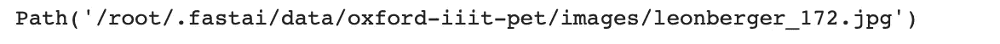
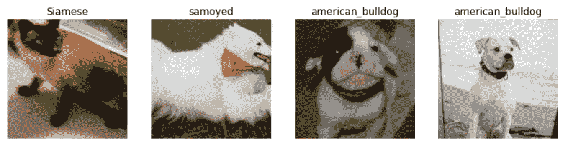
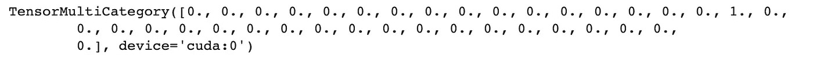
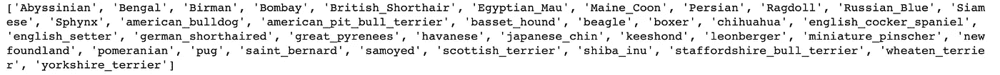
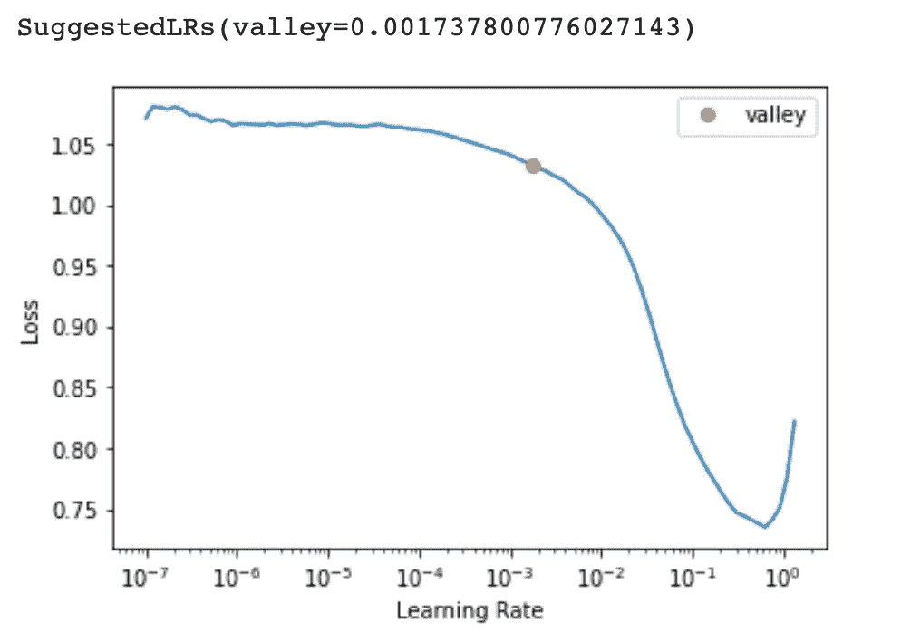
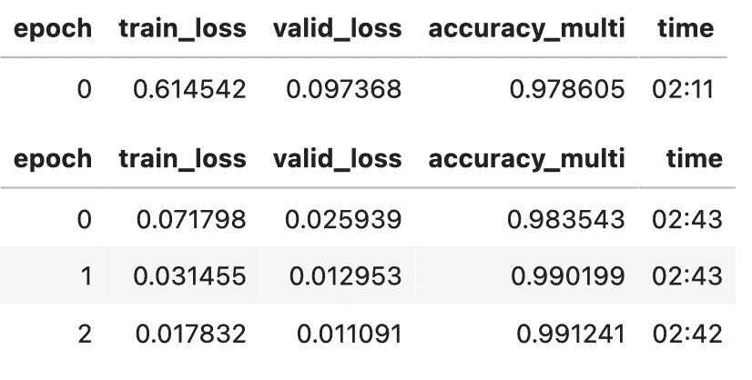
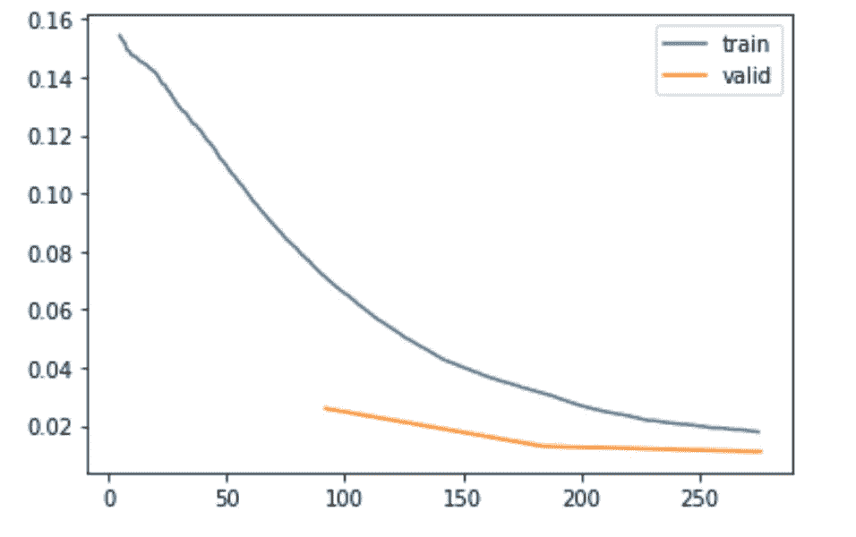
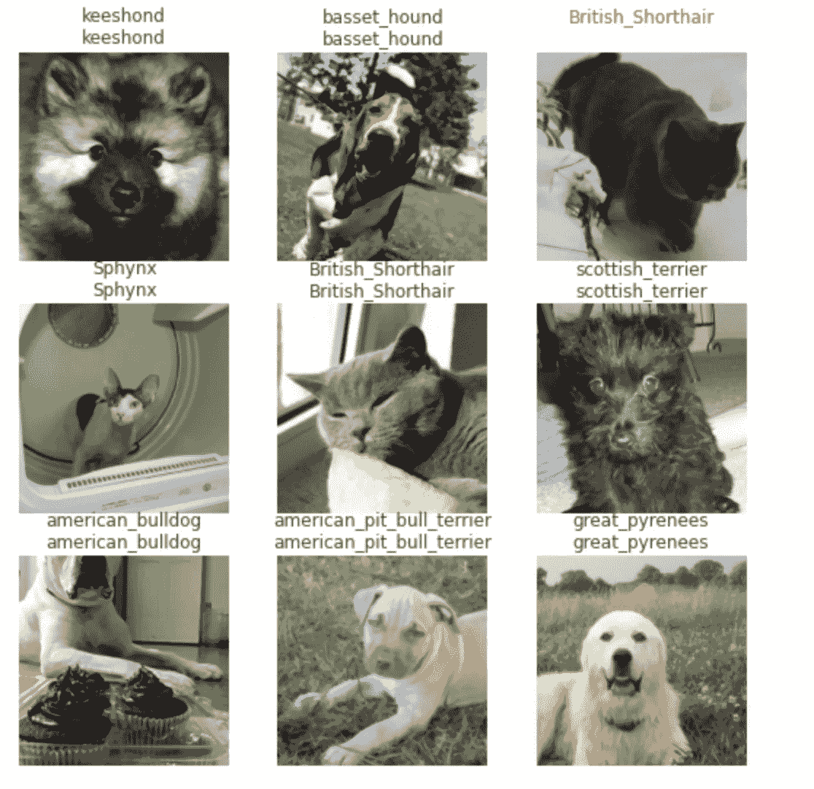
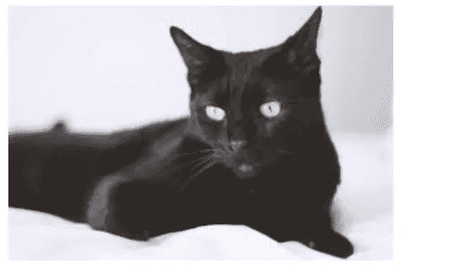
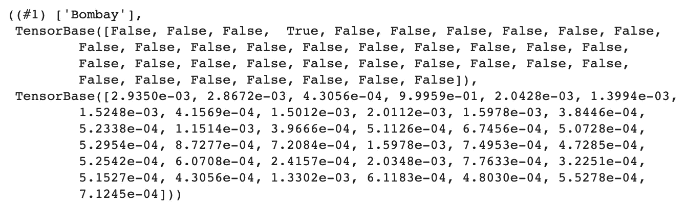

# 利用 fastai 训练未知标签检测分类器

> 原文：<https://medium.com/mlearning-ai/heres-how-you-should-train-an-intelligent-classifier-model-be705c001fb2?source=collection_archive---------2----------------------->

## 未知标签检测:检测域外数据，即只对图像进行分类。

Photo by [Sean Pollock](https://unsplash.com/@seanpollock?utm_source=unsplash&utm_medium=referral&utm_content=creditCopyText) on [Unsplash](https://unsplash.com/s/photos/work?utm_source=unsplash&utm_medium=referral&utm_content=creditCopyText)

# 动机

我在以前的博客文章中讨论了我们如何使用多标签分类方法训练域外输入检测图像分类器。在这篇博文中，让我们讨论如何训练一个常规的多类分类器，但使它更加智能，即赋予它检测未知数据的能力。我们正在使用 fast.ai 库来创建和训练模型。

# 浏览数据集

让我们通过使用 PETs 数据集来解决这个问题。这个数据集有 37 类不同的宠物品种，每类有近 200 张图片。关于这个数据集的更多细节可以在[这里](https://www.robots.ox.ac.uk/~vgg/data/pets/)找到。

让我们从安装和导入所需的库开始。

现在让我们下载宠物数据集，

Output

既然我们已经下载了数据集，让我们构建一个数据块对象和数据加载器。

# 准备好数据

DataBlock 是一个高级 API，用于轻松构建和加载数据，即创建可直接用于建模的数据加载器。这使得数据加载更加容易，也更加可定制。现在，让我们根据数据集创建一个数据块对象。

现在，既然数据块对象已经准备好了，让我们更详细地看看它在做什么，

*   **blocks:** 该参数定义了我们提供给模型的数据的输入和目标类型。在上面的代码中， **ImageBlock** 将输入类型表示为图像， **MultiCategoryBlock** 将输出类型表示为一个热编码数组，而用于图像分类的传统 **CategoryBlock** 使用目标的顺序编码。
*   **get_items:** 该参数定义如何获取输入。我们使用 fastai 的 util 函数 **get_image_files** ，该函数将文件夹 **的**路径作为参数，并返回给定路径中所有图像的路径。由于我们已经将输入块定义为 ImageBlock，datablock 将能够将图像路径转换为 PIL 图像。****
*   **get_y:** 该参数定义了如何获取目标。我们已经看到了我们下载的图像路径的例子。每个图像文件名都有一个模式，即`‘breed_name’_XXX.jpg where X=0–9`。为了获得品种名称，我们可以使用 **regex** 从路径字符串中提取它，并将其转换为一个列表。我们正在使用 fastai 的**管道** API 来创建一个函数管道。
*   **拆分器:**该参数定义了如何进行列车验证拆分。我们使用 **RandomSplitter** 到对数据集执行随机分割，其中 20%用于验证(默认)。我们将随机种子设置为 42，以确保每次运行都获得相同的验证集。
*   **item_tfms:** 该参数定义应用于每个项目的转换。我们使用 **Resize** 转换，将每张图片的大小调整为 460。
*   **batch_tfms:** 该参数定义应用于每批数据的转换。由于这是应用于批量数据，操作运行在 GPU(如果可用)上，以使其更快。在上面的代码中，我们使用了 fastai 的**aug _ transforms**增强函数，它应用了基本的数据增强，如翻转、改变对比度、亮度、调整大小等。

当给定**尺寸**和**最小比例**参数时， **aug_transform** 函数通过在每个时期保留至少一些最小量的图像数据，将图像随机裁剪为给定尺寸，这由**最小比例**参数指定。

加载数据加载器时，该数据块对象接受包含图像/数据的目录的路径作为参数。现在让我们创建数据加载器并显示一些图像样本，

Output

让我们看看一些目标，

Output

我们可以看到目标是一个一键编码的数组，总共有 37 个类。通过`dls.vocab`可以查看所有标签。

List of all the 37 classes

现在让我们使用一个预先训练好的模型，并用我们的数据对它进行微调。

# 模特培训

让我们使用 **resnet50** 预训练模型创建一个学习者对象。因为我们使用多标签分类方法来检测未知标签，所以我们也需要改变损失函数。所以我们应该使用默认阈值的`binary cross-entropy`损失函数或者 fastai 的`BCEWithLogitsLossFlat()`损失函数。我们应该使用具有较高阈值的 **accuracy_multi** 作为度量，以确保只选择具有最高概率的标签。

为了减少模型大小和训练时间，我们使用半精度训练方法，将模型中的所有权重转换为 16 位浮点数。为了实现这一点，使用了`to_fp16()`。

现在让我们看看代码，

Output- Learning rate finder

既然我们已经找到了要使用的最佳学习速率，那么让我们针对 3 个时期对模型进行微调。

Output-Model training

我们可以看到，在 3 个时期的训练中，我们的模型达到了 99%的准确率…这是一个非常令人印象深刻的结果，这要归功于预训练的 resnet50 模型。我们再来看看损失图，

Output-Loss Plot

好的，我们可以看到训练和验证损失已经逐渐减少，模型没有过度拟合。

现在让我们继续进行模型推断，在这里我们可以测试未知标签检测的作用…

# 推理

在推断之前，我们先把我们的`BCEWithLogitsLossFlat()`损失函数的阈值更新为 0.95。因为我们使用的损失函数具有 **sigmoid** 激活，所以我们应该增加阈值，以便能够检测模型高度确信的标签。

现在让我们检查一些结果，

Output: Inference Results

从上面的结果可以看出，我们的模型在验证集上表现不错。

现在让我们手动进行模型推断，即从互联网上下载一些图像，并检查结果是否匹配...

为了测试这种情况，我从 google images 下载了一张“Bombay cat”的图片到笔记本位置，并创建了一个 PIL 图片对象，

Output: Bombay Cat Image.

现在让我们来预测我们的模型会预测什么，

Output for prediction

这么...我们的模型正确地预测了这个类是“Bombay”。我们也可以看到这个类的概率是 0.99…这是相当高的。

现在，让我们试着找到一些域外数据的预测。我已经从谷歌图片下载了一张埃菲尔铁塔的图片，并用它来预测…

Output: Eiffle Tower Image

现在，如果我们试图找到这个图像的预测，我们的模型应该为所有类返回负数。让我们找到预测并检查…

Output: Prediction for tower image

太好了！！我们可以看到，我们的模型能够理解这个图像不属于它被训练的任何狗或猫品种，即 37 种宠物，并为所有可用的类别返回 **False** 。

# 结论

所以从上面的结果可以看出，使用多标签分类技术来训练一个多类分类模型是训练一个智能图像分类器的最好方法。

谢谢你

## 来源:

1.  *fastai 和 PyTorch 的程序员深度学习，*Howard 的书& Gugger。
2.  [*与 fastai 一起走*](http://walkwithfastai.com)

## 你可以在 LinkedIn [这里](https://www.linkedin.com/in/narasimhakarthik/)和我联系。笔记本的 GitHub 链接可以在[这里](https://github.com/JNK234/100-days-of-deep-learning/blob/main/Day%205/Detecting_Unknown_labels.ipynb)访问。

 [## Mlearning.ai 提交建议

### 如何成为 Mlearning.ai 上的作家

medium.com](/mlearning-ai/mlearning-ai-submission-suggestions-b51e2b130bfb)