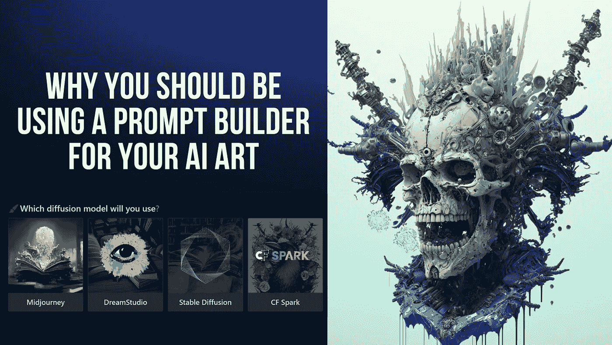

# 这就是为什么你应该使用 PromptoMania 来创建更多史诗般的人工智能图像

> 原文：<https://medium.com/mlearning-ai/heres-why-you-should-be-using-promptomania-to-create-more-epic-ai-images-7197fad5bef3?source=collection_archive---------1----------------------->

Image from MidJourney Community and PromptMania. Edited in Canva by [Jim Clyde Monge](https://medium.com/u/819323b399ac?source=post_page-----7197fad5bef3--------------------------------)

现在，人工智能提示工程的格局已经支离破碎，MidJourney、Dall-E2 和 Stable Diffusion 等艺术公司都有自己独特的方式来制作图像提示。

[PromptoMania](https://promptomania.com/) 试图通过让用户使用单一工具为多个 AI 扩散模型做出图像提示来修复碎片化问题。