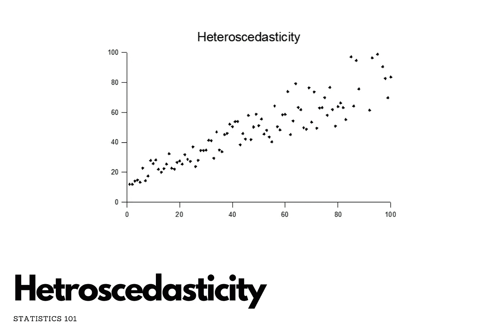
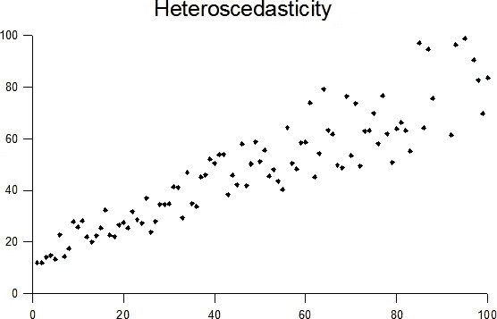

# 异质统计

> 原文：<https://medium.com/mlearning-ai/hetroscedasticity-c54c884510c6?source=collection_archive---------9----------------------->

[Source](https://keepingupwithdatascience.files.wordpress.com/2022/01/knn-1.png)

在本帖中，我想谈谈**异方差**。我可以理解，你们中的一些人可能很难发音(至少我是这样)。无论如何，我们更感兴趣的是它的意思和它的应用，而不是它的发音。

因此，**异方差**意味着**随机扰动的可变性在向量**上是不同的。这是一个复杂的定义。让我从回归的角度解释一下，**它指的是测量值的误差方差不一致的情况**。

我们借助一个例子来理解一下。让我们以**收入对比**餐饮支出为例。随着一个人收入的增加，食物消费的可变性也会增加。一个较穷的人会通过总是吃便宜的食物来花费相当固定的数量；一个较富裕的人可能偶尔会买便宜的食物，有时会吃昂贵的饭菜。那些收入较高的人在食物消费上表现出更大的可变性。下图展示了**异方差**的概念。

[Source](https://upload.wikimedia.org/wikipedia/commons/a/a5/Heteroscedasticity.png)

许多统计技术，如**回归**、**方差分析**等。假设**残差**的行为相同。违反这些假设会导致统计推断不准确。一种这样的回归技术叫做**线性回归**，它也*假设因变量和自变量*之间存在线性关系。要了解更多关于**线性回归**的信息，请访问 [**这里**](https://keepingupwithdatascience.wordpress.com/2022/01/23/linear-regression-in-machine-learning-from-scratch/) 。

 [## Mlearning.ai 提交建议

### 如何成为 Mlearning.ai 上的作家

medium.com](/mlearning-ai/mlearning-ai-submission-suggestions-b51e2b130bfb)