# 启发式搜索:A*搜索

> 原文：<https://medium.com/mlearning-ai/heuristic-search-a-search-1e3e41d1802?source=collection_archive---------0----------------------->

在不知情的搜索中，我们不会朝目标前进。换句话说，我们不会问“达到目标的成本是多少？”。

为了猜测从搜索中的一个状态到达目标的成本，我们需要一个**启发式函数 h(n)**，它是特定于领域的。这样，搜索将比盲目搜索更加智能。

# A*搜索

我们考虑启发式函数和到达目标的估计，而不是到达节点的真实成本函数。因此，A*搜索被定义为实际成本和启发式函数的总和。该算法考虑了到达一个节点的成本和从该节点到达目标的成本估计。

该搜索基于以下公式

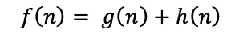

在哪里，

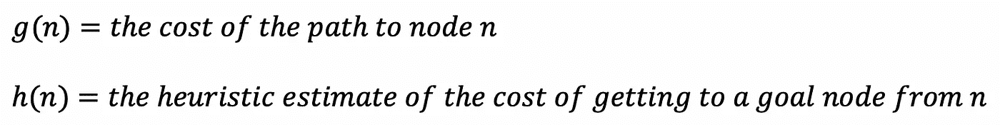

我们使用 f(n)作为优先级队列中节点的优先级，frontier。

# 例子

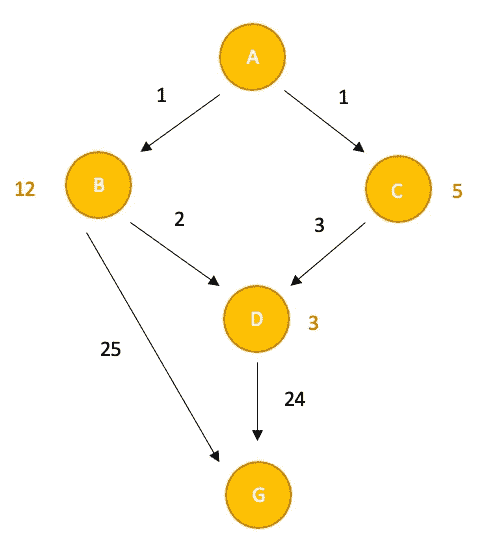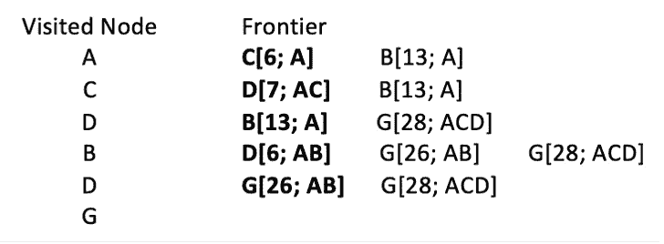

```
 ***We always pick the lowest f(n) from the frontier***
```

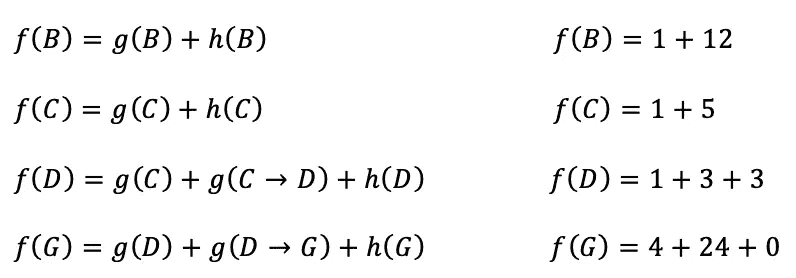

现在，让我们考虑一下启发函数的估计有多好。

好的启发式函数提供最优性，这意味着没有高估。如果存在对启发式函数的过高估计，那么我们可能会在更晚的时间探索搜索空间。因为我们总是从前沿选取最低的 f(n)值。在这种情况下，A*搜索无法找到最佳路径。与此相反，如果存在对启发式函数的低估，则搜索空间有机会被早期探索。

# 容许性

一个可接受的启发永远不会高估真正的成本。因为它小于或等于真实成本，所以 A*搜索保证找到最优解。

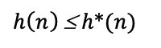

# 检查可接受性

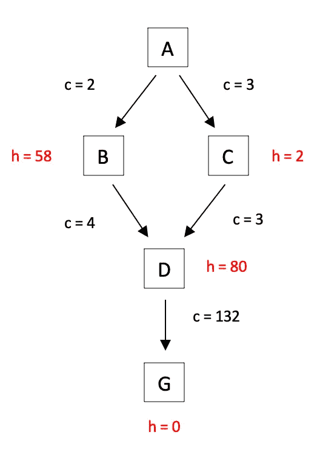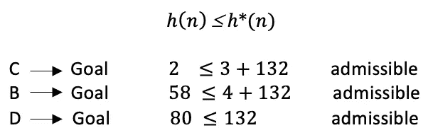

每个方程必须满足它的条件，才能有一个可接受的启发。如果其中一个是不可接受的，那么我们说它不是一个可接受的启发。

让我们考虑这样一个问题“如果搜索不止一次访问这些州会怎么样？”

# 单调性

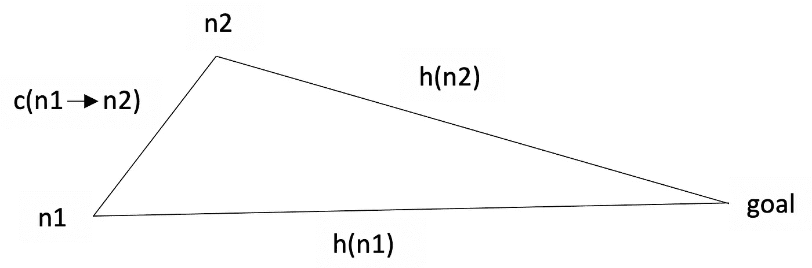

单调试探法具有针对所有节点 n1 和 n2 的条件

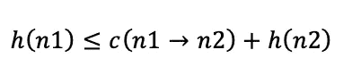

如果一个启发式函数是一致的，A*搜索就不会被分散注意力。因此，单调性保证了一个状态被探索一次。

此外，f(n)值沿任何路径都不会减少。

作为单调性的结果，

> **用一个单调的试探法，A*第一次扩展一个州，它就找到了到那个州的最小成本路径。**

# 检查单调性

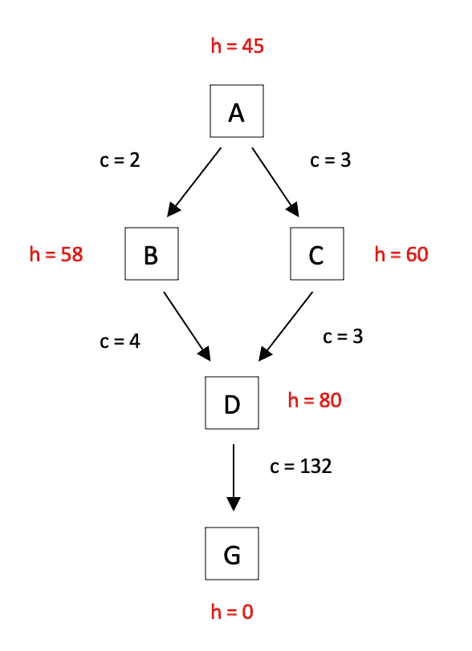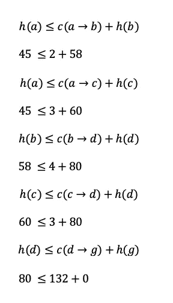

如果其中一个方程不满足，那么启发式算法就不是单调的。

# *搜索的属性

随着 f 值的增加，A*搜索会扩展节点。

搜索完毕**。**

A*搜索是**最优的，如果启发式搜索是可接受的，则为**。

A*搜索具有指数级**时间复杂度**。

A*搜索将所有节点保存在内存中。

理想的启发式函数接近于成本函数。

```
 ***If h(n)=0, the search will be the Uniform Cost Search***
```

# 迭代深化 A* (IDA*)

当扩展指数数量的节点时，A*搜索可能会遇到一些空间问题。为了解决空间问题，我们可以使用迭代深化 A*搜索。迭代深化也是如此。在这种情况下，“截止值”是 f 值，IDA*在每次迭代时增加截止值。就空间而言，IDA*比 A*更有效。而且，IDA*是完全最优的。

# 履行

这是一个 GitHub 存储库，其中包括用 Python 实现的 A*搜索和统一成本搜索算法。在这个项目中，我尝试用这些搜索算法来解决 Bloxorz 游戏。

[](https://github.com/ecealptekin/Solving-Bloxorz-using-UCS-and-A-Search) [## ecealptekin/Solving-Bloxorz-using-UCS-and-A-Search

### 通过在 GitHub 上创建帐户，为 ecealptekin/Solving-Bloxorz-using-UCS-and-A-Search 开发做出贡献。

github.com](https://github.com/ecealptekin/Solving-Bloxorz-using-UCS-and-A-Search) 

你可以在这里玩游戏来了解一下。

[](https://www.coolmathgames.com/0-bloxorz) [## Bloxorz

### 1)游戏的目的是在每个阶段结束时让积木落入方孔中。有 33 个阶段…

www.coolmathgames.com](https://www.coolmathgames.com/0-bloxorz) 

我将这个难题建模为一个搜索问题:指定状态、后继状态函数、初始状态、目标状态和步骤成本。之后，我用 Python 实现了一个统一成本搜索算法和一个 A*搜索算法，其中包含一个启发式函数来解决这个难题。

根据我的实现，我创建了 Bloxorz 游戏的五个示例阶段，并将它们用作输入。最后，我比较了均匀代价搜索和 A*搜索算法在这些样本难题上的性能。此外，表格显示了两种算法的时间和内存消耗。

# 参考

[https://web . cs . hacettepe . edu . tr/~ pinar/courses/bbm 405/lessons/informed _ search . pdf](https://web.cs.hacettepe.edu.tr/~pinar/courses/BBM405/lectures/informed_search.pdf)