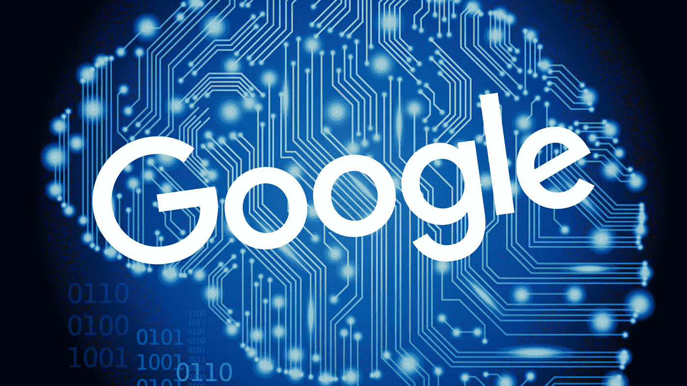
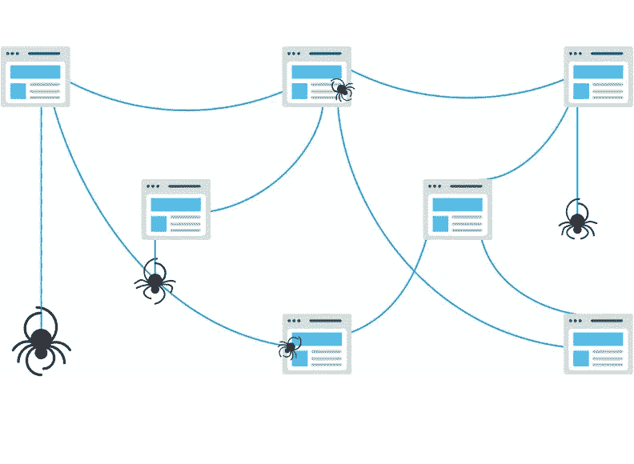
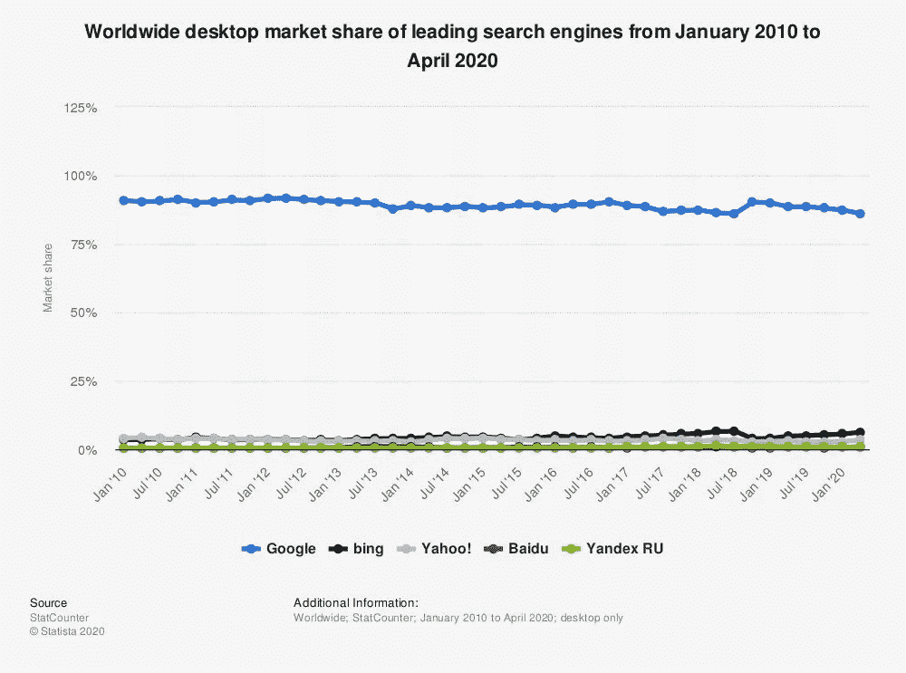
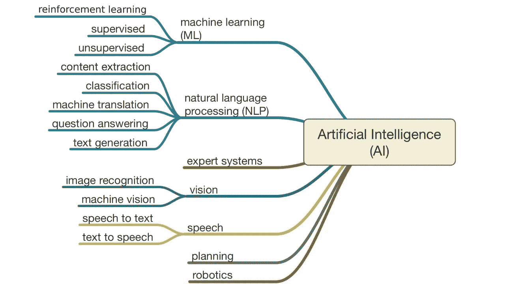
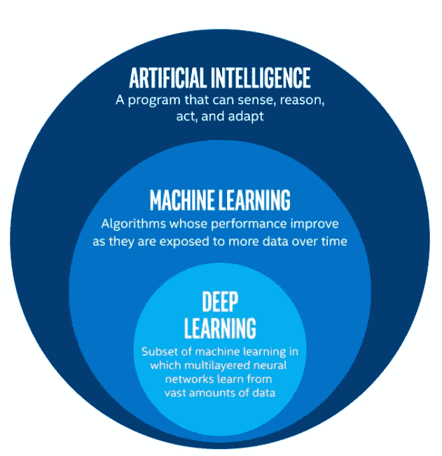
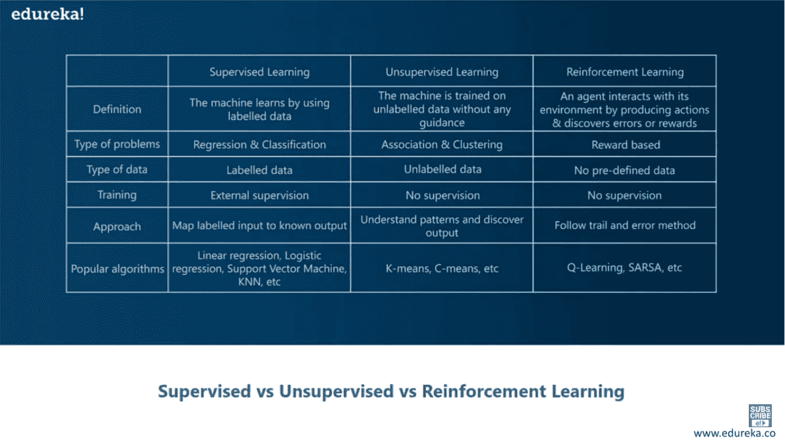
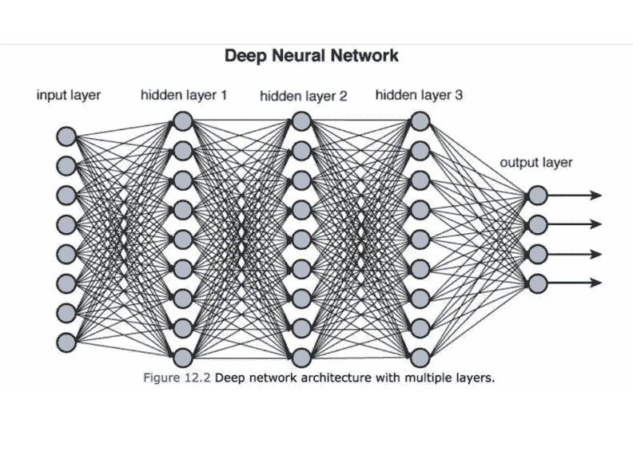

# 嘿谷歌，你怎么这么聪明？

> 原文：<https://medium.com/mlearning-ai/hey-google-how-are-you-so-intelligent-20a6ed63acb?source=collection_archive---------2----------------------->

想象一下，如果谷歌宕机一整天会发生什么？！

混乱会蹂躏街道，人们会变得疯狂(谁知道会发生什么🤷‍♂️).然而，从来没有发生过这样的事情。

这证明了谷歌搜索引擎确实无处不在。它是如此普遍和广泛使用，以至于一个动词就是由它衍生出来的。没有人说，“让我们微软 it”或“只是苹果 it”，但每个人都使用这个短语，“让我们谷歌 it”。

人类社会已经开始依赖很多东西，比如汽车、药物、互联网、技术等等。然而，我们必须在社会中达到某个点，在这个点上，人们不理解他们周围看到的 90%的事情。

大多数人不知道互联网是如何工作的，也不知道电话这样的小设备怎么会有这么大的威力。像汽车、电脑和搜索引擎这样的日常用品是如此复杂，以至于几乎不可能学会所有的东西。

尽管如此，如果你是那些勇敢无畏、追求知识的人之一，那么你来对地方了。🚀

# 谷歌的搜索引擎

互联网是一个非常大的地方，人们可能会迷失其中。在互联网上 120 万兆兆字节的数据中，你怎么能找到一篇有用的文章来帮助你呢？！幸运的是，搜索引擎是存在的。

搜索引擎为我们搜索互联网，根据命令，它们显示所有被认为相关的网页的位置或 URL。当你点击一个页面的链接，你将被带到你想访问的网站。

让我们暂时后退一步。

搜索引擎毕竟只是算法，旨在根据您的搜索定位最相关的页面。然而，如果每次搜索时，引擎都必须处理 120 万兆兆字节的数据，它可能会烧坏系统。

发明搜索引擎的工程师们发现了这一点，他们创造了大量的快捷方式，使得查找物品变得非常容易和高效。

# **互联网上的蜘蛛？！**

现在，明确一下，蜘蛛不能神奇地跳进互联网或四处爬行。蜘蛛不是机器，也不是超自然生物。然而，有一样东西符合这个要求；介绍网络爬虫。

Web Crawlers crawling the Internet. [Source](https://moz.imgix.net/learn/guides/Moz-BGSEO-Ch2-04-1.svg?auto=format&ch=Width&fit=max&q=50&s=76c3c0d3708c9899c1b739a83fc89fa6)

早在 90 年代，当互联网刚刚起步时，麻省理工学院的工程师开发了第一个网络爬虫来测量网站的增长。不久之后，这些网络爬虫就承担了在互联网上搜索新网页和网站的重要任务。

这些爬虫只是搜索引擎创造整个搜索体验的第一步。简而言之，它们是由各种算法和代码组成的软件包。这些爬虫被给予一个 URL 列表来访问并存储到它们的索引中。之后，他们出去获取他们访问过的页面的副本，并将其发送回搜索引擎。

就是这样！你的蜘蛛朋友在把网站的拷贝发送回搜索引擎后就完成了他们的工作。

# **搜索引擎处理**

搜索引擎处理并存储从网络爬虫的索引中找到的所有信息。所有这些数据都存储在数据库中，然后这些数据被认为足够好，可以提供给搜索者。

在这个过程中，搜索引擎遍历网站上的所有内容，并在其数据库中为该网站创建一个标签。这个标签包括网站的关键词和主题。

[Source](https://backlinko.com/improve-your-seo)

# **判断网站**

在这一阶段，所有来自网站的数据都已收集并储存在数据库中。然后，搜索引擎搜索他们的索引，寻找高度相关的内容，然后对这些内容进行排序，以期解决搜索者的查询。

你可以把这些网站看作是竞争者，他们在竞争排名的靠前。做出决定的法官是搜索引擎，他们遵循的标准是试图解决搜索者的查询。

# **人工智能&谷歌**

谷歌在搜索引擎市场上完全占据主导地位。大约 90%的搜索是通过谷歌进行的，另外 10%是其他搜索引擎的总和。

尽管这家公司完全控制了这个市场，但他们需要不断改进产品以保持竞争优势。因此，作为一家大型科技公司，谷歌自然会转向最新的科技创新。

2016 年，谷歌正式宣布推出其搜索算法的最新改进。 **RankBrain** 不是你的常规软件更新，而是一种机器学习算法，能够理解每个搜索查询背后的意图和动机，然后相应地改变网站的排名。当谷歌遇到从未见过的查询时，这尤其有用。

# **机器学习**

如上所述，RankBrain 是一种能够理解意图和动机的机器学习算法。然而，机器学习到底是什么？

机器学习是人工智能的一个子集。人工智能是一个更广泛的类别，包括所有不同的子集，如机器学习，计算机视觉，自然语言处理等等。

**ML 的主要目标是从以前的经验中学习，而不必手动编程。**

Subsets of Artificial Intelligence and Machine Learning.

在机器学习中，主要有三个子集:监督学习、无监督学习和强化学习。每个子集都有自己的优点和缺点，并用于创建各种解决方案。

让我们快速浏览一下 3 种不同的机器学习模型。

# **监督学习**

如上所述，ML 的主要目标是从以前的经验中学习，以创建不同的模式或解决问题。机器学习的不同方式创造了不同类型的 ML。

监督学习使用**标记的数据**来教导或训练机器。在这种方法中，机器将标记的输入映射到已知的输出，这样它就可以找到模式。当我们想要创建一个线性回归或者将未标记的输入分类时，可以使用这种技术。

# **无监督学习**

你可能已经从标题中猜到了，但是无监督学习是监督学习的反义词。在这种技术中，机器没有任何标签，这迫使机器自己在数据中寻找模式。

这用于数据的聚类和关联。

# **钢筋倾斜**

这种方法不同于前两种方法，有几个原因。首先，这个方法涉及到一个**代理**、**环境**和一个**奖励函数。**

形象化这种方法的最好方式是想象一个婴儿。婴儿出生时什么都不知道；随着它的成长，它必须学习一切。所以，当婴儿做了一件好事，比如吃完了他们的食物或者没有弄得一团糟，他们的父母会奖励他们一个新玩具。久而久之，宝宝就明白了做好事和获得奖励之间的关系。最后，当婴儿长大一点时，他们已经学会如何获得奖励，所以他们会一直努力表现好来获得奖励。

这正是机器如何利用强化学习的。一个代理被放在一个环境中，通过观察它得到的回报来学习做最好的动作。

# **深度学习**

所以，是时候揭晓了。谷歌的 RankBrain 是一个**无监督的深度学习模型**。它是无人监管的，因为 RankBrain 试图通过使用某些关键字来找出搜索查询背后的意图。RankBrain 不是仅仅在网上搜索某个字符串，而是查看搜索中的关键词，然后尝试从概念上理解用户搜索背后的意图。

所以，RankBrain 是一个无监督的深度学习模型。我们讨论了无监督的含义，但什么是深度学习？🤔

从深度学习开始，我们需要先了解什么是神经网络。

机器学习使用所谓的**神经网络**。因为这个系统被认为是模仿大脑的，所以他们不得不保留“神经网络”这个名字。就像大脑一样，神经网络有许多相互连接的节点或“神经元”。这些节点是为了模仿大脑中的神经元而创建的。

所有深度学习算法都使用神经网络。没有神经网络，深度学习就不起作用。

[Source](https://www.google.com/url?sa=i&url=https%3A%2F%2Ftowardsdatascience.com%2Ftraining-deep-neural-networks-9fdb1964b964&psig=AOvVaw2Wm2EM-jPUgOkYsgmpHUzH&ust=1609515967608000&source=images&cd=vfe&ved=0CAIQjRxqFwoTCLjznrPI-O0CFQAAAAAdAAAAABAD)

所以从上面可以看到，深度神经网络有一个输入层，多个隐藏层和一个输出层。所有这些相互连接的神经元执行功能，并向网络中的所有其他神经元传输数据。

**输入层**是给出输入的神经网络的第一层。输入层执行计算，然后将输出传输到后续层。

要将神经网络归类为深度神经网络，必须有 2 个或更多的**隐藏层**。这些层被称为隐藏是因为一个非常具体的原因——它们对于外部系统是不可见的，并且它们对于神经网络是“私有的”。当输入层将其结果输出到隐藏层时，隐藏层中的神经元执行某些功能，然后计算输出。

神经网络中的隐藏层数越多，计算输出所需的时间就越长，网络可以解决的问题也越复杂。

最后，我们来到**输出层**。神经网络必须有一个输出层，因为它负责产生最终结果。这一层的神经元接收前一层的输出，然后执行最终的计算，产生结果。

# **总结**

该说的都说了，该做的都做了，我们又回到了 RankBrain。RankBrain 真正革新了谷歌搜索引擎，改变了我们网上冲浪的方式。它可以分析和连接众多变量，以“理解”超出人类分析师所能理解的内容。它还从数据中“学习”,然后自行改善用户体验，无需人工干预。

让我们以 RankBrain 如何理解搜索的实际意义为例。比方说，你搜索“多伦多安大略比萨”，你很可能会找到比萨店和其他提供比萨的餐馆。类似地，如果你搜索“安大略省多伦多供应比萨饼的餐馆”，你很可能会得到相同的网站列表。在这种情况下，RankBrain 理解这句话中的主要关键字是 pizza，Ontario，Toronto。其余的单词都是修饰语，没那么重要。

RankBrain 的另一个关键特性是它能够随着时间的推移**学习**和**改变**。RankBrain 使用一些关键因素来了解用户的满意度，即:点击率、跳出率和在一个网页上花费的时间。随着时间的推移，它会根据用户与网页的交互方式，对特定查询的特定网页进行降级或升级。

这就是我们 ***如何看待*** RankBrain 函数(谷歌一直对 RankBrain 的确切运作方式保密🤐)如果你想更深入地了解 RankBrain 实际上是如何检测事物的，那么你可以访问以下网站:

[**https://www . search engine journal . com/Google-algorithm-history/rank brain/# close**](https://www.searchenginejournal.com/google-algorithm-history/rankbrain/#close)

[**https://www . lilo . co . uk/blog/in-depth-guide-Google-rank brain-algorithm/**](https://www.lilo.co.uk/blog/in-depth-guide-google-rankbrain-algorithm/)

[**https://blog.hubspot.com/marketing/rankbrain-guide**](https://blog.hubspot.com/marketing/rankbrain-guide)

# **TL；博士**

*   搜索过程的第一步是搜索引擎发送其网络爬虫来搜寻新网页，然后将它们存储在索引中。
*   该过程的第二步是搜索引擎处理网页，然后创建标签。
*   第三步，也是最后一步，是引擎按照与用户最相关的顺序排列网站。
*   2016 年，谷歌宣布发布机器学习软件——rank brain。
*   ML 的主要目标是从以前的经验中学习，而不必手动编程。
*   监督学习使用带标签的数据来教授或训练机器。
*   在无监督学习中，机器没有被赋予任何标签，这迫使机器自己在数据中寻找模式。
*   强化学习包括一个代理，它被放在一个环境中，通过观察它得到的回报来学习做最好的动作。
*   深度神经网络有 3 层——输入层、隐藏层和输出层。
*   它们极其复杂，并且随着时间的推移不断改进。

# **我们来连线**

如果你有任何问题或者想谈论这个话题，请联系我们。我很乐意与你联系，你可以在这里订阅我的每月简讯。

通过 [Linkedln](https://www.linkedin.com/in/puravgupta?lipi=urn%3Ali%3Apage%3Ad_flagship3_profile_view_base_contact_details%3BDku9koYQQbmKNjq6%2BGtTGw%3D%3D) 与我联系，或者通过【guptapurav@gmail.com 给我发电子邮件