# 含噪声应用的层次聚类和基于密度的空间聚类(DBSCAN)

> 原文：<https://medium.com/mlearning-ai/hierarchical-clustering-and-density-based-spatial-clustering-of-applications-with-noise-dbscan-b8d903095532?source=collection_archive---------1----------------------->


**简介**

分层聚类是另一种无监督的机器学习算法，用于将未标记的数据集分组到一个聚类中，也称为分层聚类分析或 HCA。

在该算法中，我们以树的形式开发聚类的层次结构，并且这种树形结构被称为树状图。有时，K-means 聚类和层次聚类的结果可能看起来很相似，但它们都有所不同，这取决于它们的工作方式。因为不需要像在 K-Means 算法中那样预先确定聚类的数量。

分层聚类技术有两种方法:

*   **凝聚**:凝聚是一种自下而上的方法，算法从将所有数据点作为单个聚类开始，并将其合并，直到剩下一个聚类。
*   **除法**:除法算法与凝聚算法相反，因为它是自顶向下的方法。

**凝聚层次聚类**

凝聚层次聚类算法是 HCA 的一个流行的例子。为了将数据集分组到聚类中，它遵循自底向上的方法。这意味着，该算法在开始时将每个数据集视为单个聚类，然后开始将最近的一对聚类组合在一起。这样做，直到所有聚类合并成包含所有数据集的单个聚类。

这种聚类层次以树状图的形式表示。

**凝聚式层次聚类如何工作？**

步骤 1:将每个数据点创建为单个集群。假设有 N 个数据点，那么聚类数也将是 N。

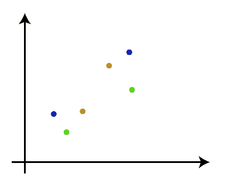

步骤 2:取两个最接近的数据点或聚类，并将它们合并成一个聚类。因此，现在将有 N-1 个集群。

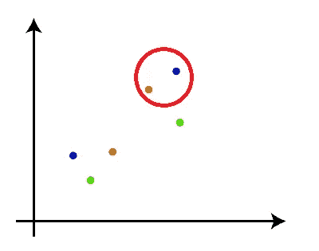

第三步:同样，取两个最接近的聚类，将它们合并在一起，形成一个聚类。将会有 N-2 个集群。

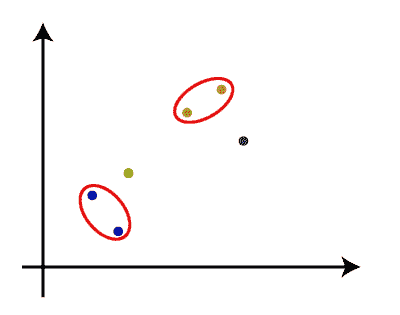

步骤 4:重复步骤 3，直到只剩下一个集群。因此，我们将得到以下集群。考虑下面的图片:

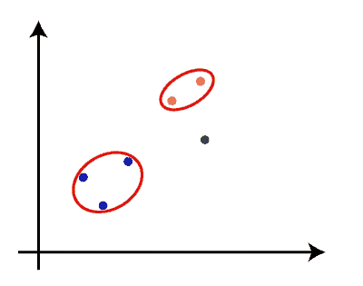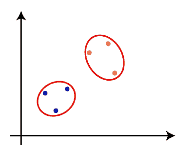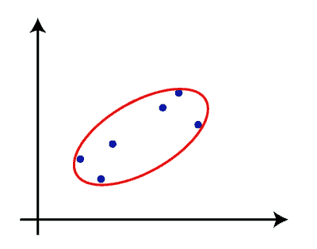

第 5 步:一旦所有的集群被组合成一个大的集群，开发树状图来根据问题划分集群。

**测量两个集群之间的距离**

正如我们已经看到的，两个聚类之间的最近距离对于分层聚类是至关重要的。计算两个聚类之间的距离有多种方法，这些方法决定了聚类的规则。这些措施被称为联系方法。下面给出了一些流行的连接方法:

**单连锁:**是聚类最近点之间的最短距离。考虑下图:

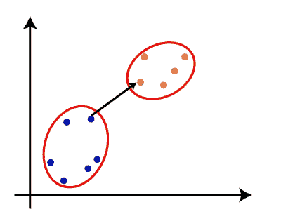

**完全连锁:**是两个不同集群的两点之间的最远距离。这是一种流行的连锁方法，因为它比单连锁形成更紧密的簇。

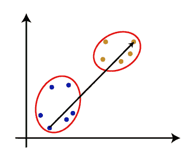

**平均连锁:**是将每对数据集之间的距离相加，然后除以数据集总数，计算两个聚类之间的平均距离的连锁方法。也是最受欢迎的联动方式之一。

**质心连接:**这是一种连接方法，在该方法中，计算簇的质心之间的距离。考虑下图:

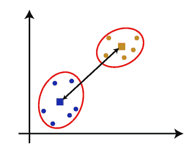

**层次聚类中树状图的绘制**

树状图是一种树状结构，主要用于将 HC 算法执行的每个步骤存储为内存。在树状图中，Y 轴显示数据点之间的欧几里得距离，x 轴显示给定数据集的所有数据点。

可以使用下图解释树状图的工作原理:

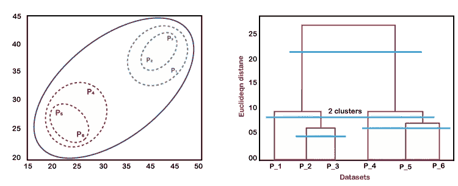

在上图中，左边部分显示了如何在聚集聚类中创建聚类，右边部分显示了相应的树状图。

*   正如我们上面所讨论的，首先，数据点 P2 和 P3 组合在一起并形成一个集群，相应地创建了一个树形图，它用一个矩形连接 P2 和 P3。高度是根据数据点之间的欧几里德距离决定的。
*   在下一步中，P5 和 P6 形成一个聚类，并创建相应的树状图。这比以前的更高，因为五常和 P6 之间的欧几里得距离比 P2 和 P3 之间的距离稍大一些。
*   同样，创建了两个新的系统树图，将 P1、P2 和 P3 组合在一个系统树图中，将 P4、P5 和 P6 组合在另一个系统树图中。
*   最后，创建最终的树状图，将所有的数据点组合在一起。

让我们开始在 Google collab 中使用 python 实现。

**导入库**

```
**import** pandas **as** pd
**import** numpy **as** np
**from** google.colab **import** files
uploaded = files.upload()
```

**加载数据集**

```
import io
train_data = pd.read_csv(io.StringIO(uploaded['Mall_Customers.csv'].decode('utf-8')))
```

显示数据集中的前 5 条记录

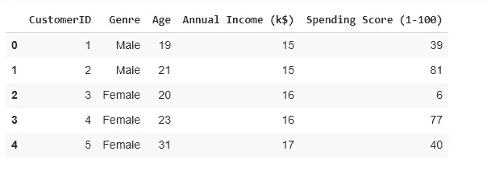

**确定 X 值**

计算年收入和支出分数。

```
**X**= train_data.iloc[:,3:].values
**X**
```

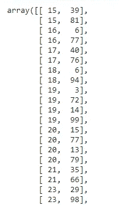

**使用树状图寻找最佳聚类数**

现在，我们将使用我们的模型的树状图来找到最佳的聚类数。为此，我们将使用 scipy 库，因为它提供了一个函数，可以直接返回我们代码的树状图。

```
**from** matplotlib **import** pyplot **as** mtp
**import** scipy.cluster.hierarchy **as** shc  
dendro = shc.dendrogram(shc.linkage(X, method="ward"))  
mtp.title("Dendrogram Plot")  
mtp.ylabel("Euclidean Distances")  
mtp.xlabel("Customers")  
mtp.show()
```

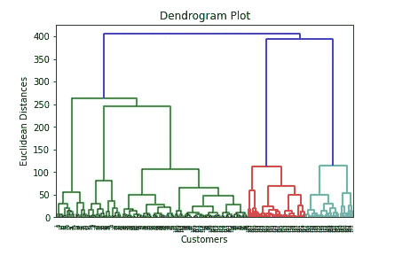

使用这个树状图，我们现在将为我们的模型确定最佳的集群数量。为此，我们将找到不切断任何水平杆的最大垂直距离。因此，分类的最佳数量将是 5，我们将在下一步中使用相同的方法来训练模型。

**应用层次聚类模型**

```
**from** sklearn.cluster **import** AgglomerativeClustering  
hc= AgglomerativeClustering(n_clusters=5, affinity='euclidean', linkage='ward')  
y_pred= hc.fit_predict(X)  
y_pred
```

聚类采用以下参数，

*   n_clusters=5:它定义了集群的数量，我们在这里取 5 是因为它是最优的集群数量。
*   affinity='euclidean ':这是一个用于计算关联的度量。
*   linkage='ward ':它定义了链接标准，这里我们使用了“ward”链接。这种方法是我们已经用来创建树状图的流行的链接方法。它减少了每个集群中的差异。

**可视化**

```
**mtp**.scatter(X[y_pred == 0, 0], X[y_pred == 0, 1], s = 100, c = 'blue', label = 'Cluster 1')  
**mtp**.scatter(X[y_pred == 1, 0], X[y_pred == 1, 1], s = 100, c = 'green', label = 'Cluster 2')  
**mtp**.scatter(X[y_pred == 2, 0], X[y_pred == 2, 1], s = 100, c = 'red', label = 'Cluster 3')  
**mtp**.scatter(X[y_pred == 3, 0], X[y_pred == 3, 1], s = 100, c = 'cyan', label = 'Cluster 4')  
**mtp**.scatter(X[y_pred == 4, 0], X[y_pred == 4, 1], s = 100, c = 'magenta', label = 'Cluster 5')  
**mtp**.title('Clusters of customers')  
**mtp**.xlabel('Annual Income (k$)')  
**mtp**.ylabel('Spending Score (1-100)')  
**mtp**.legend()  
**mtp**.show()
```

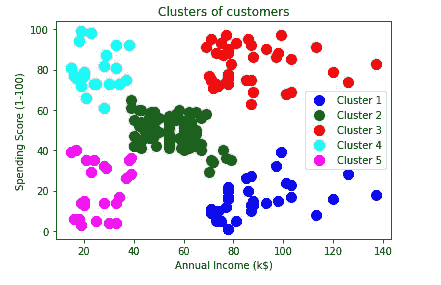

**DBSCAN 集群**

基本上，所有聚类方法都使用相同的方法，即首先我们计算相似性，然后我们使用它将数据点聚类成组或批次。在这里，我们将重点介绍基于密度的应用空间聚类与噪声(DBSCAN)聚类方法。

基于密度的聚类指的是无监督学习方法，其基于数据空间中的聚类是具有高点密度的连续区域，通过具有低点密度的连续区域与其他此类聚类分离的思想，来识别数据中的独特组/聚类。

含噪声应用的基于密度的空间聚类(DBSCAN)是基于密度的聚类的基本算法。它可以从包含噪声和离群点的大量数据中发现不同形状和大小的簇。

**算法参数**

DBSCAN 算法使用两个参数:

*   minPts:一个区域被认为密集时聚集在一起的最小点数(阈值)。
*   eps (ε):一种距离度量，用于定位任意点邻域中的点。

如果我们探索称为密度可达性和密度连通性的两个概念，就可以理解这些参数。

**可达性**根据密度建立了一个点，如果该点位于另一个点的特定距离(eps)内，则该点可以从另一个点到达。

**另一方面，连通性**涉及基于传递性的链接方法，以确定点是否位于特定的簇中。例如，如果 p- > r- > s- > t- > q，则 p 点和 q 点可以连接，其中 a- > b 表示 b 在 a 的邻域中。

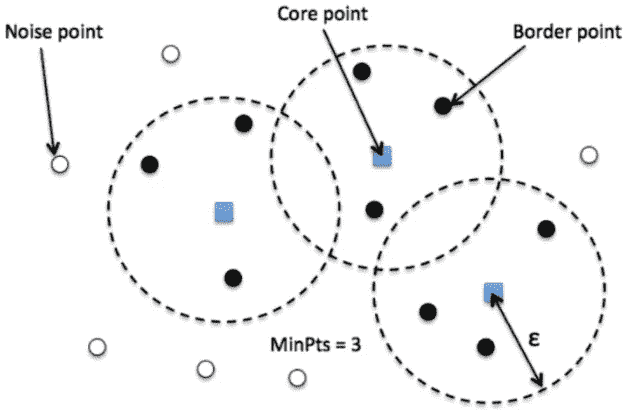

DBSCAN 聚类完成后有三种类型的点:

*   核心——这是一个距离自身 n 以内至少有 m 个点的点。
*   边界-这是一个在距离 n 处至少有一个核心点的点。
*   噪音——这是一个既不是核心也不是边界的点。并且它在距离自身 n 的范围内具有少于 m 个点。

**它是如何工作的？**

*   选择任意一个数据点 p 作为你的第一个点。
*   将 p 标记为已访问。
*   提取其邻域中存在的所有点(从该点到 eps 的距离)，并将其称为集合 nb
*   如果 nb >= minPts，则
    a .将 p 视为一个新群的第一个点
    b .将 eps 距离内的所有点(nb 的成员)视为该群中的其他点。对 nb 中的所有点重复步骤 b
*   否则将 p 标记为噪声
*   重复步骤 1-5，直到整个数据集被标记，即聚类完成。

在执行算法之后，我们应该理想地将数据集分成多个聚类，并且将一些点标记为不属于任何聚类的噪声。

**例子**

这些观点可以用形象化来更好地解释。

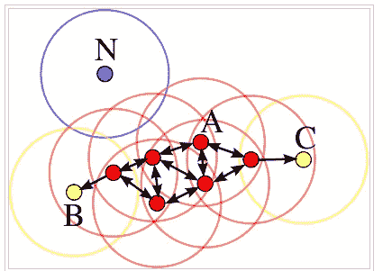

在这种情况下，minPts 是 4。红色点是核心点，因为在其周围区域内至少有 4 个 eps 半径的点。该区域在图中用圆圈表示。黄色点是边界点，因为它们可以从核心点到达，并且在其邻域内的点少于 4 个。可到达意味着在核心点的周围区域。点 B 和 C 在其邻域(即半径为 eps 的周围区域)内有两个点(包括点本身)。最后，N 是一个离群值，因为它不是一个核心点，不能从核心点到达。

**用 Python 实现**

导入库

```
**Copy****import** numpy **as** np
**import** matplotlib.pyplot **as** plt
**from** sklearn **import** metrics
**from** sklearn.datasets **import** make_blobs
**from** sklearn.preprocessing **import** StandardScaler
**from** sklearn.cluster **import** DBSCAN
```

**应用 DBSCAN 算法**

```
**Copy****X**, y = make_blobs(n_samples=500,n_features=2,
**centers**=4, cluster_std=1,
**center_box**=(-10.0, 10.0),
**shuffle**=True, random_state=1)
**X** = StandardScaler().fit_transform(X)
**y_pred** = DBSCAN(eps=0.3, min_samples=30).fit_predict(X)
**plt**.scatter(X[:,0], X[:,1], c=y_pred)
**print**('Number of clusters: {}'.format(len(set(y_pred[np.where(y_pred != -1)]))))
**print**('Homogeneity: {}'.format(metrics.homogeneity_score(y, y_pred)))
```

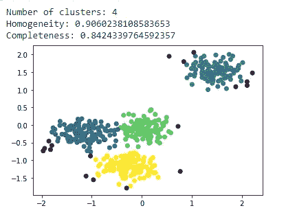

显然，如预期的那样检测到 4 个簇。根据 DBSCAN 模型，黑点是异常值或噪声。由于被分析的数据集是由我们生成的，并且我们知道关于它的基本事实，我们可以使用类似于**同质性**分数(检查每个聚类是否只有一个类的成员)和**完整性**分数(检查一个类的所有成员是否都被分配到同一个聚类)的度量。

希望您对层次聚类和 DBSCAN 有更好的了解。

感谢您的阅读，希望您喜欢！

参考

[数据库扫描](https://www.youtube.com/watch?v=C3r7tGRe2eI)