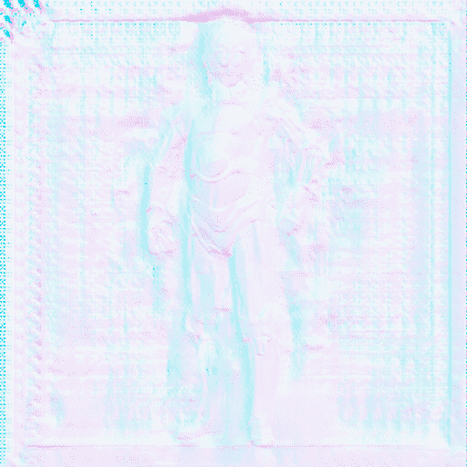

# 人类 bulla

> 原文：<https://medium.com/mlearning-ai/homo-bulla-1b627e932492?source=collection_archive---------2----------------------->

## 这一生是珍贵的，因为死后会发生什么

[https://www.hicetnunc.xyz/objkt/26183](https://www.hicetnunc.xyz/objkt/26183)

这句话是一个比喻:意思是一个人“homo”可能看起来非常坚实和充实，但我们的生活像泡沫一样转瞬即逝“bulla”，短暂而又完全脆弱
泡沫的图像在瓦尼塔斯大量使用，这是一种象征性的艺术作品，尤其与 17 世纪的荷兰静物画有关，也是…