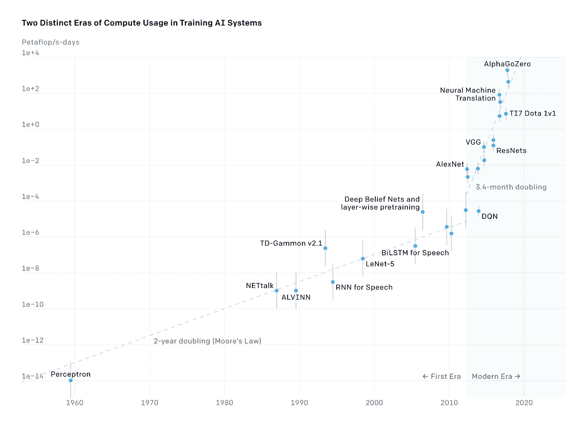
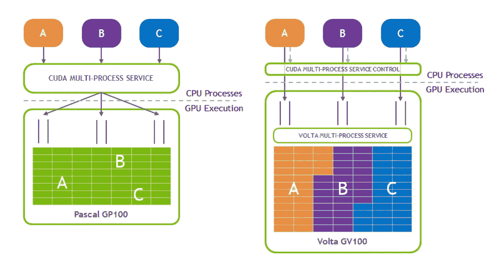
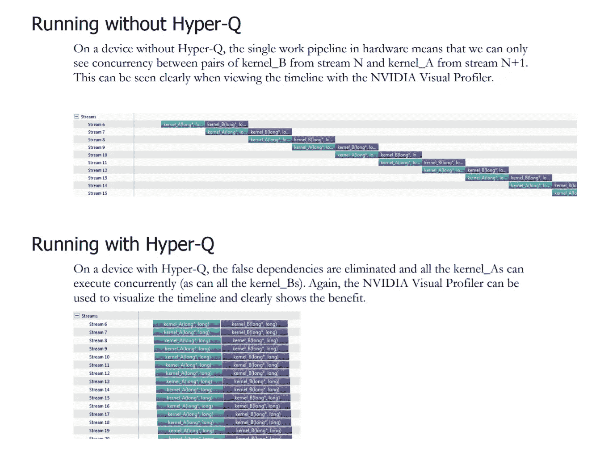
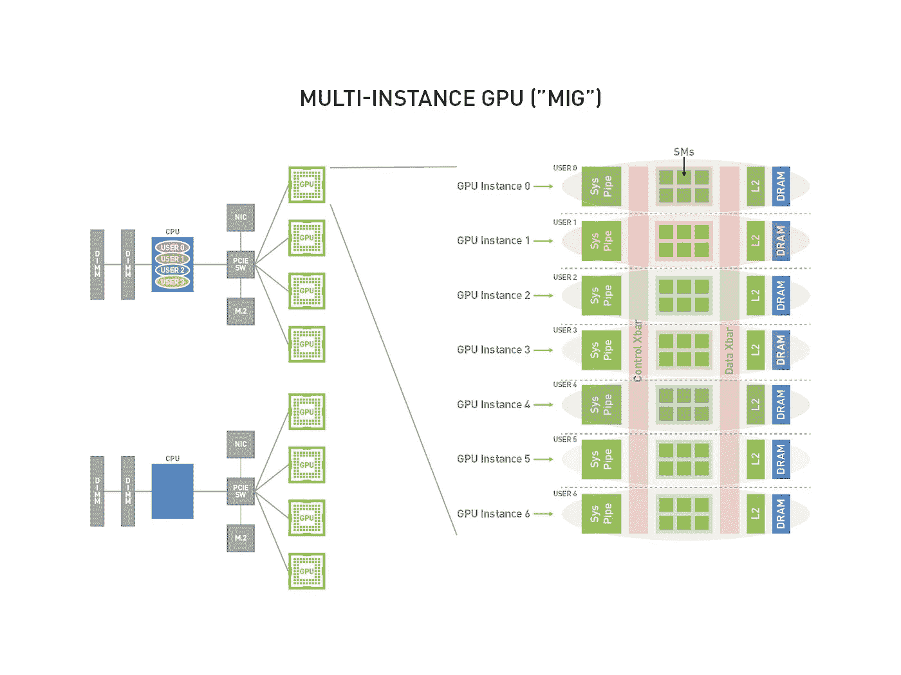
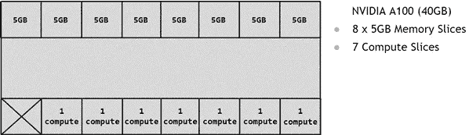
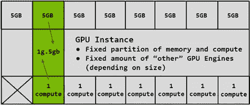
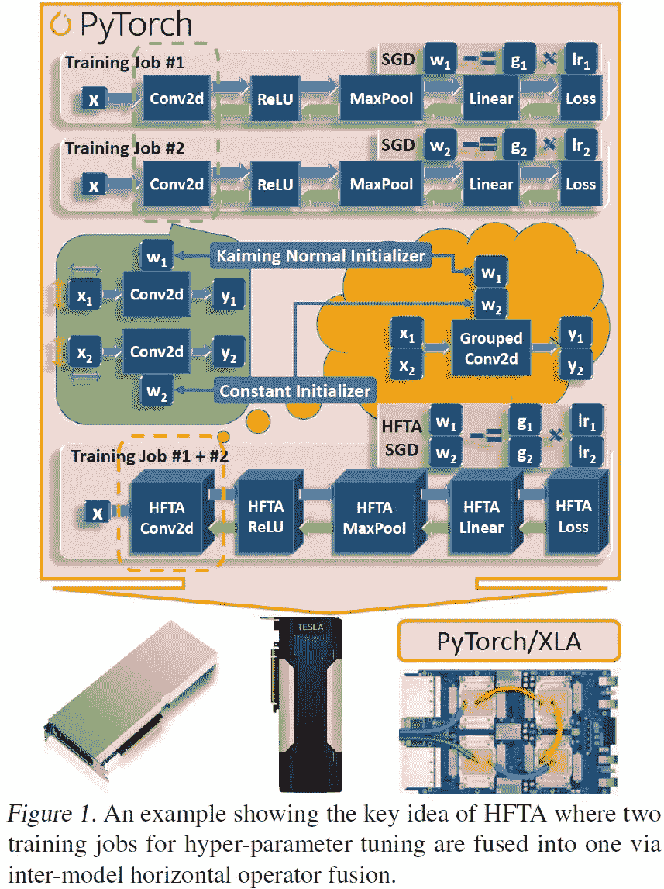
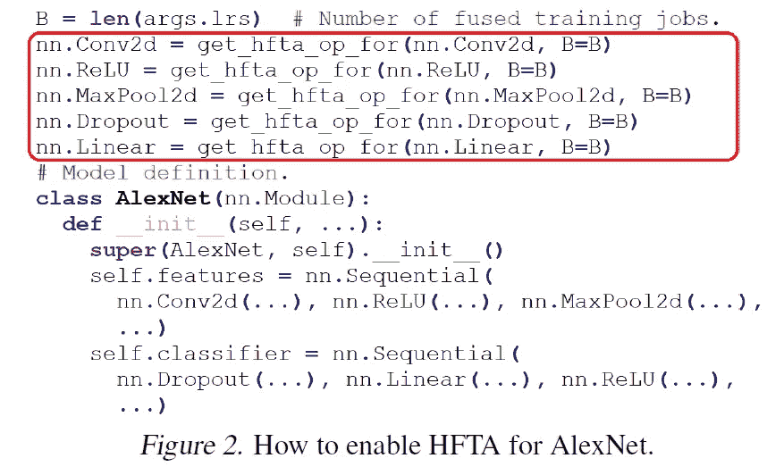
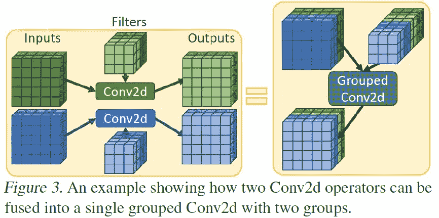

# “水平融合训练阵列(HFTA):训练新型深度学习模型的有效硬件利用挤压器”摘要

> 原文：<https://medium.com/mlearning-ai/horizontally-fused-training-array-hfta-an-effective-hardware-utilization-squeezer-for-training-773f16ec8e06?source=collection_archive---------2----------------------->

**注 1** : SOTA 代表 **S** 泰特- **O** f- **T** 何- **A** rt

**注 2** :本文是在提高硬件利用率的算法层面。关于模型融合算法的更多信息，应该阅读论文的附录。这个总结只是给出了背景扎实的思路。

# 介绍

深度学习( **DL** )已经无处不在。近年来，新车型的培训成本增长惊人。HFTA 的作者分析了典型的 DL 培训工作所实现的硬件效率。他们的研究表明，当重复启动时，单加速器([单 GPU](https://docs.fast.ai/dev/gpu.html) )训练作业可以支配集群范围内的资源消耗(**集群范围内总 GPU 时数**的 46.2%)。重复启动的目的通常是为了调整超参数。然而，这种优势导致了严重的硬件利用不足。他们的研究揭示:(1)这些模型通常具有相同形状的相同类型的算子，(2)这种算子的模型间水平融合在数学上等价于其他已经很好优化的算子。因此，他们提出了 HFTA，这是一个新的 DL 框架扩展库，它将来自不同重复工作的模型水平融合到操作员，然后在一个共享的加速器上同时训练它们，以提高硬件利用率。在最新的加速器(GPU 和 TPUs)上对六个 DL 模型训练的评估表明了该机制的高效性。结果显示，与在单独的加速器上运行每个作业的标准实践相比，培训吞吐量提高了 15.1 倍。

# 背景和动机

## 趋势

值得一提的是，训练 DL 模型的计算量每 **3.4** 个月翻一番，超过了摩尔定律 [ref](https://openai.com/blog/ai-and-compute/) 。

[[ref](https://openai.com/blog/ai-and-compute/)]

## 神经(模型)架构搜索(NAS)

神经网络发展的一个重要方面是它们由超参数组成的结构。目前采用的架构是由人类专家通过反复试验的方法手工开发的。这种方法既耗时又容易出错。正因为如此，人们对自动化的欧洲建筑研究方法越来越感兴趣。这篇[调查论文](https://jmlr.org/papers/v20/18-598.html)概述了该研究领域的现有工作。

## 收敛稳定性测试

这种方法用不同的随机种子对同一个模型进行多次训练，以验证最终的精度结果。

## 提高 DL 培训工作的硬件利用率并不容易！

这一挑战是两个原因造成的。首先，DL 研究人员和实践者缺乏系统和架构专业知识来优化他们的培训工作量。他们唯一天真的选择是增加小批量生产。然而，大的小批量可能会导致一些问题，例如增加达到精度的时间( **TTA** ) [ **2** ]，GANs 中的训练不稳定性[ **3，4** ]，推广差距[ **5** ]，由于小批量缩放限制而导致的收益递减[ **6** ]。第二，加速器向更高的计算能力发展，具有更专业的计算单元和更大的内存容量和带宽。

## 硬件共享

适用于 DL 培训工作的基于硬件的共享解决方案有[**M**ulti-**P**process**S**service(**MPS**)](https://docs.nvidia.com/deploy/pdf/CUDA_Multi_Process_Service_Overview.pdf)和**M**ulti-**I**instance**G**PU(**MIG**)。

多进程服务( **MPS** ): MPS 允许来自不同进程的 CUDA 内核通过一个叫做 [Hyper-Q](https://developer.download.nvidia.com/compute/DevZone/C/html_x64/6_Advanced/simpleHyperQ/doc/HyperQ.pdf) 的硬件特性在同一个 GPU 上并行运行。

MPS

Nvidia Hyper-Q Technology

M**M**ulti-**I**instance**G**PU(**MIG**):这种能力在最新的 A100 GPUs 上可用，它们被包装在 DGX A100 机器中出售。它是由 8 个 A100、一对 64 核 AMD 服务器芯片、1TB RAM 和 15TB NVME 存储组成的机器。MIG 功能将单个 GPU 划分为多个(最多 7 个实例)独立的 GPU 实例(GIs ),其中每个作业在单个 GIs 上运行。

HFTA 的作者提到了 MPS 和 MIG 机制的以下缺点:

1.  MPS 和 MIG 都在来自不同训练作业的内核之间复制运行时开销，包括内核启动[ [**7**](http://www.istc-cc.cmu.edu/publications/papers/2013/dlustig_HPCA13.pdf) ]、 [GEMM](https://docs.nvidia.com/deeplearning/performance/dl-performance-matrix-multiplication/index.html) 设置和拆卸，以及[内存格式转换](https://docs.nvidia.com/deeplearning/performance/dl-performance-convolutional/index.html)
2.  MPS 和 MIG 都需要将训练作业作为单独的进程运行，这导致 DL 框架堆栈保留的 GPU 内存开销加倍，并导致[更高的整体 GPU 内存占用量](https://github.com/pytorch/pytorch/issues/20532)。
3.  MIG 的划分粒度对于许多训练工作负载来说可能太粗，即使使用 MIG 的最细粒度。

Nvidia A100 (40GB) GPU 由 8 个 5GB 内存片和 7 个计算片(或 7 个 SMs)组成。

以下示例显示了如何将 5GB 内存片与 1 个计算片相结合来创建 1g.5gb GPU 实例(GI)。

# 提议的机制:HFTA

研究人员[1]根据他们的关键观察，提出 HTFA 解决利用不足的挑战。

(1)当重复启动时，跨这些作业使用的模型通常具有相同形状的相同类型的运算符。

(2)水平融合具有相同形状的相同类型的运算符通常会产生其他数学上等价的运算符，这些运算符已经存在于许多 SOTA DL 模型中，因此已经在不同加速器上的大多数 DL 框架栈中进行了优化。

下图显示了 HFTA 的基本概念。两个模型中的第一个算子都是形状相同的 Conv2d 许多 Conv2d 运算符的水平融合在数学上等同于一个分组 Conv2d，该分组 conv 2d 已经在 ResNeXt [ [**8**](https://arxiv.org/pdf/1611.05431.pdf) ]和 MobileNets [ [**9**](https://arxiv.org/pdf/1704.04861.pdf) ]模型中使用，并由 Nvidia GPUs 上的 [cuDNN](https://docs.nvidia.com/deeplearning/cudnn/developer-guide/index.html#grouped-convolutions) 和 [TPUs 上的](https://cloud.google.com/tpu)[ref](https://cloud.google.com/tpu/docs/system-architecture-tpu-vm)支持。

[**1**]

如上所述，许多培训滚刀可以融合成一个单一的工作。它不需要从头实现任何新的特定于设备的操作符，这既耗时又容易出错。此外，这种方法可以推广到 DL 框架已经支持的任何硬件后端。注意水平融合可以应用于单加速器和分布式训练。然而，对于 DL 研究人员和实践者来说，从零开始手动实现现有的训练工作负载到融合的工作负载是具有挑战性的。因此，作者开发了一个新的 DL 框架库 HTFA。他们选择 PyTorch 是因为它的用户友好性和在 ML 社区中的受欢迎程度。只需修改几行代码，就可以使用开发的工具。下图显示了如何为 AlexNet 启用 HFTA。模型定义保持不变，只有几行额外的代码来更新 PyTorch 的操作符类。

[**1**]

下图通过连接(1)沿通道维度的输入和(2)沿输出通道维度的权重(过滤器)和偏差，举例说明了卷积运算符的融合等效于其分组卷积对应项。

[**1**]

# 结论

在这项工作中，作者从 GPU 集群使用分析中了解到，重复的单加速器训练作业(通常用于超参数调优)主导了集群范围的硬件资源使用，可能会严重利用不足。他们观察这些工作的具体特征，这些特征使得模型间的水平融合成为可能。因此，他们提出了 HFTA 库，该库通过在同一加速器上同时训练多个模型，将模型水平融合到操作员，从而显著提高硬件利用率。在六个极具影响力的 DL 模型上，HFTA 实现了比在单独的加速器上运行每个作业高 15.13 倍的训练吞吐量，这是超参数调优框架采用的常见做法。

# 参考

【 **1** 】王，尚等.**水平融合训练阵列:训练新型深度学习模型的有效硬件利用挤压器***机器学习与系统学报* 3 ( **2021** )。

【**2**】a . koli ousis，P. Watcharapichat，M. Weidlich，L. Mai，P. Costa，en P. Pietzuch，“**Crossbow:Scaling Deep Learning with Small Batch size on Multi-GPU Servers**”， *Proc .VLDB 捐赠。*，第 12 卷，第 11 期，bll 1399–1412，2019 年 7 月**。**

**【**3**a . Brock，J. Donahue，en K. Simonyan，**高保真自然图像合成的大规模 GAN 训练**， *CoRR* ，第 abs/1809.11096 卷， **2018** 。**

**[ **4** ]关于 GANs 的公开问题，访问日期:2021 年 11 月 26 日，[https://distill.pub/2019/gan-open-problems/](https://distill.pub/2019/gan-open-problems/)。**

**[**5**n . s . Keskar，D. Mudigere，J. Nocedal，M. Smelyanskiy，en P. T. P. Tang，**关于深度学习的大批量训练:泛化差距与尖锐极小值**， *CoRR* ，第 abs/1609.04836 卷， **2016** 。**

**【**6**】c . j . shall UE，J. Lee，J. M. Antognini，J. Sohl-Dickstein，R. Frostig，en G. E. Dahl，《测量数据并行性对神经网络训练的影响》， *CoRR* ，第 abs/1811.03600 卷， **2018** 。**

**[ **7** ] D. Lustig 和 M. Martonosi，“**通过细粒度 CPU-GPU 同步减少 GPU 卸载延迟”，**“*2013 年 IEEE 第 19 届高性能计算机架构国际研讨会(****【HPCA****)*， **2013 年**，第 354–365 页，DOI: 10.1109**

**【**8**s .谢，R. B. Girshick，P. Dollár，Z. Tu，en K. He，**深度神经网络的聚合残差变换**， *CoRR* ，vol abs/1611.05431， **2016** 。**

**【**9**a . g . Howard*等人*、 **MobileNets:用于移动视觉应用的高效卷积神经网络**、 *CoRR* 、vol abs/1704.04861、 **2017** 。**

** [## Mlearning.ai 提交建议

### 如何成为 Mlearning.ai 上的作家

medium.com](/mlearning-ai/mlearning-ai-submission-suggestions-b51e2b130bfb)**